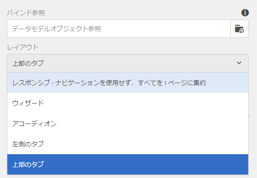
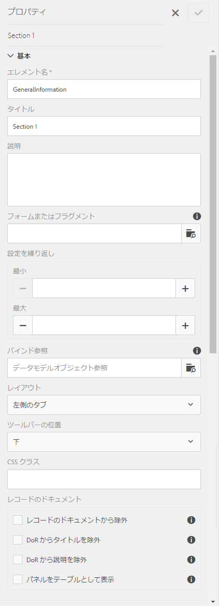
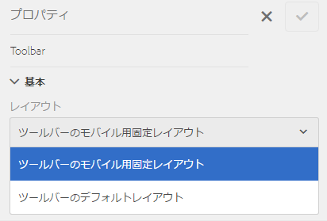

# アダプティブフォームのレイアウトの機能{#layout-capabilities-of-adaptive-forms}

Adobe Experience Manager（AEM）では、簡単に使用できるアダプティブフォームを作成でき、エンドユーザーに動的なエクスペリエンスを提供します。フォームのレイアウトは、アダプティブフォームでの各項目やコンポーネントの表示方法をコントロールします。

## 必要な知識 {#prerequisite-knowledge}

アダプティブフォームの各種レイアウト機能を学習する前に、次の記事を参照してアダプティブフォームの詳細を理解してください。

[AEM Forms の概要](../../forms/using/introduction-aem-forms.md)

[フォーム作成の概要](../../forms/using/introduction-forms-authoring.md)

## レイアウトのタイプ {#types-of-layouts}

アダプティブフォームは次のタイプのレイアウトを提供します。

**パネルレイアウト** ：パネル内の項目やコンポーネントをデバイス上で表示する方法をコントロールします。

**モバイルレイアウト** ：モバイルデバイス上のフォームのナビゲーションを制御します。 デバイスの幅が 768 ピクセル以上の場合、レイアウトはモバイルと判断され、モバイルデバイス向けに最適化されます。

**ツールバーレイアウト** ：フォーム内のツールバーまたはパネルツールバーのアクションボタンの配置をコントロールします。

これらのすべてのパネルレイアウトは次の場所で定義されます。

`/libs/fd/af/layouts`。

>[!NOTE]
>
>アダプティブフォームのレイアウトを変更する場合、AEM でオーサリングモードを使用してください。


## パネルレイアウト {#panel-layout}

フォーム作成者は、ルートパネルを含めたアダプティブフォームの各パネルにレイアウトを関連付けることができます。

The Panel layouts are available at `/libs/fd/af/layouts/panel` location.



アダプティブフォームのパネルレイアウトのリスト

### レスポンシブ - ナビゲーションなしですべて 1 ページに {#responsive-everything-on-one-page-without-navigation-br}

このパネルレイアウトを使用すると、特別なナビゲーションなしでレイアウトをデバイスの画面サイズに合うように調整するレスポンシブレイアウトを作成できます。

Using this layout, you can place multiple **[!UICONTROL Panel adaptive form]** components one after another inside the panel.


レスポンシブレイアウトを使用したフォームの小画面での表示例


レスポンシブレイアウトを使用したフォームの大画面での表示例

### ウィザード - 複数の手順を 1 つずつ表示するフォーム {#wizard-a-multi-step-form-showing-one-step-at-a-time}

フォーム上にガイド付きのナビゲーションを用意したい場合、このパネルレイアウトを使用してください。例えば、ユーザーを1ステップずつガイドしながらフォーム内の必須の情報を取得したい場合に、このレイアウトを使用します。

Use the `Panel adaptive form` component to provide step-by-step navigation inside a panel. このレイアウトを使用すると、現在の手順を完了しない限りユーザーは次の手順に進めません。

```javascript
window.guideBridge.validate([], this.panel.navigationContext.currentItem.somExpression)
```



複数手順フォームのウィザードレイアウトでのステップ完了の式


ウィザードを使用したフォーム

### アコーディオンデザインのレイアウト {#layout-for-accordion-design}

Using this layout, you can place the `Panel adaptive form` component in a panel with accordion style navigation. また、このレイアウトを使用すると、繰り返し可能なパネルを作成できます。繰り返し可能なパネルを使用すれば、必要に応じて動的にパネルを追加したり削除することができます。パネルの繰り返しの最小回数と最大回数を定義できます。 また、パネル内の項目に入力される情報に応じて動的にパネルのタイトルを決定することができます。

最小化したパネルのタイトルにエンドユーザーが提供した値を表示するために、サマリ式を使用することができます。


アコーディオンレイアウトを使用して作成された繰り返し可能なパネル

### タブ付きレイアウト - タブを左側に表示 {#tabbed-layout-tabs-appear-on-the-left}

Using this layout, you can place the `Panel adaptive form` component in a panel with tab navigation. タブはパネルコンテンツの左側に配置されます。


パネルの左側にタブ表示

### タブ付きレイアウト - タブを上に表示 {#tabbed-layout-tabs-appear-on-the-top}

Using this layout, you can place the `Panel adaptive form` Component in a panel with tab navigation. タブはパネルコンテンツの上に配置されます。


タブをパネルの上に表示

## モバイルレイアウト {#mobile-layouts}

モバイルレイアウトはモバイルデバイスの比較的小さい画面で、わかりやすいナビゲーションをできるようにします。モバイルレイアウトでは、フォームのナビゲーションにタブ付きスタイルまたはウィザードスタイルを使用します。モバイルレイアウトを適用するとフォーム全体を単一のレイアウトで表示します。

このレイアウトでは、ナビゲーションバーとナビゲーションメニューを使用してナビゲーションをコントロールします。The navigation bar shows **&lt;** and **>** icon to indicate **next** and **previous** navigation steps in the form.

The Mobile Layouts are available at `/libs/fd/af/layouts/mobile/` location. アダプティブフォームでは、デフォルトで次のモバイルレイアウトを使用できます。


アダプティブフォームのモバイルレイアウトのリスト

When using a mobile layout, the form menu, to access various form panels, is available by tapping  icon.

### フォームのヘッダー部分にパネルタイトルを表示するレイアウト {#layout-with-panel-titles-in-the-form-header}

レイアウトの名称の通り、このレイアウトはナビゲーションメニューおよびナビゲーションバーと併せてパネルのタイトルを表示します。また、このレイアウトではナビゲーションに「進む」アイコンと「戻る」アイコンを使用します。


フォームのヘッダー部分にパネルタイトルを表示するモバイルレイアウト

### フォームのヘッダー部分にパネルタイトルを表示しないレイアウト {#layout-without-panel-titles-in-the-form-header}

レイアウトの名称の通り、このレイアウトはナビゲーションメニューおよびナビゲーションバーのみ表示し、パネルのタイトルは表示しません。また、このレイアウトではナビゲーションに「進む」アイコンと「戻る」アイコンを使用します。


フォームのヘッダー部分にパネルタイトルを表示しないモバイルレイアウト

## ツールバーレイアウト {#toolbar-layouts}

ツールバーレイアウトは、アダプティブフォームに追加するアクションボタンの位置と表示をコントロールします。 このレイアウトはフォームレベルまたは各パネルレベルで追加できます。



アダプティブフォームのツールバーレイアウトのリスト

Toolbar layouts are available at `/libs/fd/af/layouts/toolbar` location. アダプティブフォームには、デフォルトで次のツールバーレイアウトが用意されています。

### ツールバーのデフォルトレイアウト {#default-layout-for-toolbar}

アダプティブフォームでアクションボタンを追加したときに、デフォルトレイアウトとしてこのレイアウトが選択されます。このレイアウトを選択すると、デスクトップおよびモバイルの両デバイスで同一のレイアウトを表示します。

また、このレイアウトで設定されたアクションボタンを含むツールバーを複数追加することができます。アクションボタンはフォームのコントロールに関連付けられます。ツールバーはパネルの前または後に設定できます。


ツールバーのデフォルト表示

### ツールバーをモバイルに最適化したレイアウト {#mobile-fixed-layout-for-toolbar}

このレイアウトを選択すると、デスクトップデバイスとモバイルデバイスで異なるレイアウトが表示されます。

デスクトップレイアウトでは、特定のラベルを使用してアクションボタンを追加できます。このレイアウトで設定できるツールバーは 1 つのみです。このレイアウトでツールバーを 1 つ以上設定した場合、モバイルデバイス上でツールバーが重なり、表示されるのはそのうち 1 つのみです。例えば、ツールバーを表示できるのはフォームの下部、上部、またはパネルの前か後のどれか 1 つに限られます。

モバイルレイアウトでは、アイコンを使用してアクションボタンを追加します。


ツールバーをモバイルに最適化したレイアウト

