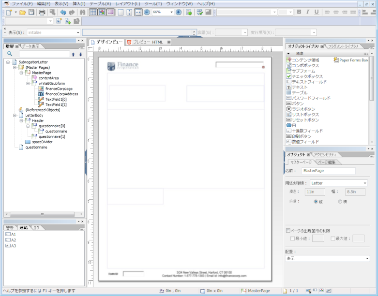

# レイアウトデザイン{#layout-design}

XFA フォームテンプレートまたは XDP は、以下の項目のテンプレートです。

* [レター](/help/forms/using/create-letter.md)
* [インタラクティブ通信](/help/forms/using/interactive-communications-overview.md)の[印刷チャネル](/help/forms/using/web-channel-print-channel.md#printchannel)

* レイアウトフラグメント

XDP は Adobe Forms Designer でデザインできます。この記事では、フォームフィールドやターゲット領域を使用する場所、レイアウトフラグメントをいつ使用するかなど、効果的な通信/インタラクティブ通信を作成するためのXDPのデザイン方法について詳しく説明します。

## レターまたはインタラクティブ通信の印刷チャネル用のレイアウトを作成する {#creating-a-layout-for-letters-or-for-interactive-communications-print-channel}

レイアウトを使用して、レターまたはインタラクティブ通信の印刷チャネルの外観を定義します。レイアウトには、「アドレス」や「参照番号」などの一般的なフォームフィールドを含めることができます。また、ターゲット領域を示す空のサブフォームも含めます。Form Designer で作成したレイアウトは、アプリケーションによって AEM サーバーにアップロードされます。通信テンプレートまたはインタラクティブ通信の印刷チャネルを作成する際に、AEM サーバーでそのレイアウトを選択することができます。

レターのレイアウトまたはインタラクティブ通信の印刷チャネルのレイアウトを作成するには、以下の手順を実行します。

1. レイアウトを分析し、ページ全体で繰り返されているコンテンツを特定します。通常はページのヘッダーやフッターがこのカテゴリに当てはまります。このコンテンツは、レイアウトのマスターページに配置されます。残りのコンテンツは、レイアウトのボディページに配置されます。ポリシージャケットでは、ロゴおよび会社の住所もマスターページのヘッダーおよびフッターに追加できます例えば、キャンセル通知に同じレイアウトが使用されます。
1. ボディページのデザインでは、ページのコンテンツをセクション分けします。各セクションはレイアウト自体に埋め込むサブフォームや、フラグメントレイアウトとしてデザインできます。セクションに表が含まれる場合、セクションをレイアウトフラグメントとして設計します。
1. レイアウトは次のようにデザインできます。

   1. 各セクションを、そのセクションのすべての要素を含む個別のサブフォームとして作成します。
   1. 各セクションのサブフォームを、同一の親サブフォームの子とします。親サブフォームのレイアウトをフローに設定し、前のセクションでサイズの大きいデータがマージされた場合は、セクションを下に移動できるようにします。
   1. 「主要住所」セクションは、他のレイアウトでも再利用できます。このセクションは、フラグメントレイアウトとして作成します。
   1. 「関連情報」セクションは、2 つの要素のみが上下に配置されていて、サイズの大きいデータを含むことがあるので、フローレイアウトとしてデザインします。
   1. その他のセクションは、要素が特定の場所にあるので、位置固定レイアウトとしてデザインします。
   1. セクションの要素が特定の位置にあり、これらの要素が大量のデータを含む場合は、セクションをサブフォームに分割します。分割したサブフォームを配置し、意図どおりに動作するようにします。
   1. 「主要住所」セクションに、プレースホルダーターゲット領域を追加します。このプレースホルダーは、レターまたはインタラクティブ通信の設計時に、「主要住所」フラグメントに連結されます。
   1. レイアウトを AEM Forms サーバーにアップロードします（レイアウトを使用するフラグメントがある場合は、そのフラグメントもアップロードします）。

### XDPテンプレートでのサブフォームの使用 {#usesubformxdp}

インタラクティブコミュニケーションの作成に必要なレイアウトを分析したら、Formsデザイナを使用してXDPテンプレート内にサブフォームを作成できます。 XDPテンプレートで使用される空のサブフォームコンポーネントは、Interactive Communicationの印刷チャネルにターゲット領域を表示する結果になります。

>[!NOTE]
>
>XDPテンプレートのサブフォームコンポーネントにコンテンツを追加する代わりに、Interactive Communicationの印刷チャネルに追加コンテンツを追加する。 ターゲット追加フラグメント、グラフ、画像 、レイアウトフラグメントを使用して、印刷チャネルのドキュメント領域にコンテンツを送信します。

XDPテンプレートでサブフォームを使用するには、次の手順を実行します。

1. Open the Forms Designer, select **File** > **New** > **Use a blank form**, tap **Next**, and then tap **Finish** to open the form for template creation.

   「**オブジェクトライブラリ**」および「**オブジェクト**」オプションが **Window** メニューから選択されていることを確認します。

1. **サブフォーム**&#x200B;コンポーネントを&#x200B;**オブジェクトライブラリ**&#x200B;からフォームにドラッグアンドドロップします。

   

1. 右側のペインの「**オブジェクト**」ウィンドウのサブフォームを表示するには、「サブフォーム」を選択します。
1. Select the **Subform** tab and select **Flowed** from the **Content** drop-down list. 長さを調整するには、サブフォームの左のエンドポイントをドラッグします。

   

1. In the **Binding** tab:

   1. 「 **名前** 」フィールドにサブフォームの名前を指定します。
   1. 「**データ連結**」ドロップダウンリストから「**データ連結なし**」を選択します。

1. 同様に、左側のペインからルートサブフォームを選択します。

   

1. Select the **Subform** tab and select **Flowed** from the **Content** drop-down list. 「**連結**」タブで、次の手順を実行します。

   1. 「 **名前** 」フィールドにサブフォームの名前を指定します。
   1. 「**データ連結**」ドロップダウンリストから「**データ連結なし**」を選択します。

   手順2 ～ 5を繰り返して、XDPテンプレートにサブフォームをさらに追加します。 イン追加タラクティブコミュニケーションの作成時に限り  、テキスト、ドキュメントフラグメント、画像、グラフはターゲット領域に対して作成されます。

1. ローカルのファイルシステムにファイルを保存するには、「**ファイル**／**名前を付けて保存**」を選択して、次の手順を実行します。

   1. ファイルを保存する場所に移動し、XDPテンプレートの名前を指定します。
   1. 「**ファイルの種類**」ドロップダウンリストから&#x200B;**.xdp** を選択します。

   1. 「**保存**」をタップします。

### XDPテンプレートでの画像フィールドコンポーネントの使用 {#use-image-field-component-in-an-xdp-template}

XDPテンプレートの画像フィールドまたはサブフォームコンポーネントを使用し、インタラクティブ通信の作成時に画像を追加します。

>[!NOTE]
>
>画像を、XDPテンプレートの画像フィールドまたはサブフォームコンポーネントに追加追加する代わりに、Interactive Communicationの印刷チャネルに追加する画像。 詳しくは、「対話型通信にコンテンツを [追加する](../../forms/using/create-interactive-communication.md#step2)」を参照してください。

XDPテンプレートで画像フィールドコンポーネントを使用するには、次の手順を実行します。

1. Drag-and-drop the **Image Field** component from the **Object Library** to the form.
1. 右側のペインの「**オブジェクト**」ウィンドウのサブフォームを表示するには、「サブフォーム」を選択します。
1. In the **Binding** tab:

   1. 「 **名前** 」フィールドに画像フィールドの名前を指定します。
   1. 「**データ連結**」ドロップダウンリストから「**データ連結なし**」を選択します。

### レイアウトフラグメント用に XDP テンプレートを作成する {#xdplayoutfragments}

Formsデザイナーの表コンポーネントを使用してレイアウトフラグメントを作成し、それを使用して表を作成します。また、インタラクティブコミュニケーションの印刷チャネルを作成する際にも同様です。 レイアウトフラグメントを使用してテーブルを作成すると、印刷チャネルを使用してWebチャネルーを自動生成した場合に、テーブルのコンテンツの構造が維持されます。

>[!NOTE]
>
>テーブルのセルにテキストを入力するか、インタラクティブコミュニケーションの作成時にのみフォームデータモデルのオブジェクト [との連結を](create-interactive-communication.md#step2) 作成します。

次の手順を実行して、Formsデザイナを使用してXDPテンプレートの表コンポーネントを使用します。

1. Drag-and-drop the **Table** component from the **Object Library** to the form.
1. In the **Insert Table** dialog:

   1. テーブルの行数と列数を指定します。
   1. 「テーブルにヘッダー行を **含む** 」チェックボックスを選択して、テーブルヘッダーの行を含めます。
   1. 「**OK**」をタップします。

1. テーブル名の横の左ペインで **+** をタップし、ヘッダーおよび他の行に含まれるセル名を右クリックし、「オブジェクト名の **変更** 」を選択してテーブルセルの名前を変更します。
1. デ **ザイン表示のテーブルヘッダーテキストフィールドをクリックし** 、名前を変更します。
1. 「 **テキストフィールド** 」コンポーネントを **オブジェクトライブラリから** デザイン表示の各表のセルにドラッグ&amp;ドロップします ****。 対話型通信を作成する際に、テーブルのセルとフォームデータモデルのオブジェクトを連結するには、次の手順を実行します。

   

1. Select the name of the row from the left pane and select **Object** > **Binding** > **Repeat Row for Each Data Item**. コレクション型のフォームデータモデルオブジェクトを持つこの行のテーブルセル間に連結が作成された場合、データベースで使用可能な各データアイテムに対して、テーブル行が自動的に繰り返されます。

   テーブルのセルにテキストを入力するか、インタラクティブコミュニケーションの作成時にのみフォームデータモデルのオブジェクト [との連結を](create-interactive-communication.md#step2) 作成します。

1. ローカルのファイルシステムにファイルを保存するには、「**ファイル**／**名前を付けて保存**」を選択して、次の手順を実行します。

   1. ファイルを保存する場所に移動し、XDPテンプレートの名前を指定します。
   1. 「**ファイルの種類**」ドロップダウンリストから&#x200B;**.xdp** を選択します。

   1. 「**保存**」をタップします。

### AEM Forms サーバーに XDP テンプレートをアップロードする {#uploadxdptemplate}

Forms Designer を使用して XDP テンプレートの作成が終わったら、AEM Forms サーバーにアップロードする必要があります。これにより、作成されたテンプレートは、インタラクティブ通信を作成する際に使用できるようになります。

1. **フォーム**／**フォームとドキュメント**&#x200B;を選択します。
1. **作成**／**ファイルのアップロード**&#x200B;の順にタップします。
1. ローカルファイルシステム上のXDPテンプレートの場所に移動し、「 **開く** 」をタップしてXDPテンプレートをAEM Formsサーバーに読み込みます。

## スキーマの使用 {#using-schema}

レイアウトまたはレイアウトフラグメント内でスキーマを使用できますが、必ず使用しなければならないわけではありません。スキーマを使用する場合は、以下の点に注意してください。

1. レターまたはインタラクティブ通信内で使用されるレイアウトとすべてのフラグメントレイアウトでは、そのレターまたはインタラクティブ通信と同じスキーマが使用されます。
1. データの入力が必要なフィールドはすべて、スキーマに連結されます。

## 関連付け可能なフィールドの作成 {#creating-relatable-fields}

デフォルトで、すべてのフィールドは他の多様なデータソースと関連付け可能と見なされています。レイアウトに、データソースと関連付け可能ではないフィールドが含まれる場合は、そのフィールドに「_int」（internal）というサフィックスの名前を付けます（例えば、pageCount_int）。

関連付け可能なフィールドには、次の要件があります。

* がXFA &lt;field>または&lt;exclGroup>である
* XFA 連結参照を持っている
* &lt;exclGroup> の場合、少なくとも 1 つの子ラジオボタンフィールドが必要（それ以外の場合、値の型は決定できません）

関連付け可能なフィールドには、次の要件があります。

* 名前がある

次の条件の関連付け可能なフィールドは禁止されています。

* 名前に「_int」サフィックスが含まれる
* 連結が「なし」に設定されている
* &lt;exclGroup>要素の子である

関連付け可能なフィールドが上記の条件を満たす限り、レイアウトの任意の位置、任意の深さの入れ子に配置できます。マスターページ内で関連付け可能なフィールドを使用できます。

レイアウトの設定で、フィールドはターゲット領域のサブフォームよりも柔軟に使用できますが、単一の値の型に関連付けられています。フィールドのサイズを大きくしたり、幅と高さを固定したりできます。解決されたモジュールまたはルールの結果は、フィールドにプッシュされます。

## サブフォームとテキストフィールドを使用するタイミングの判断 {#deciding-when-to-use-subforms-and-text-nbsp-fields}

トップダウンの縦型フローレイアウトの複数モジュールコンテンツ（複数の段落や画像）をキャプチャする場合、サブフォームを使用します。このレイアウトは、コンテンツに合わせてサブフォームの高さが増加することに対処する必要があります。サブフォームまたはターゲットに関連付けられるコンテンツが、レイアウトでサブフォーム用に予約したスペースを超えないと確信できない場合、フローされるサブフォームコンテナ内の子としてサブフォームを作成します。このプロセスによって、サブフォームの下のレイアウトオブジェクトは、サブフォームの成長に合わせて下方にフローします。

モジュールデータまたはデータディクショナリ要素データをレイアウトのスキーマにキャプチャする場合や、モジュールコンテンツをマスターページに表示する場合、フィールドを使用します。マスターページのコンテンツはボディページのコンテンツと共にフローできないので、画像フィールドは必ずヘッダーロゴとして使用します。次の表に、レイアウトにサブフォームとフィールドのどちらを使用するかについて、その他の条件を示しています。

<table>
 <tbody>
  <tr>
   <td>
<strong>サブフォームを使用する場合</strong>
 </td>
   <td>
<strong>テキストフィールドを使用する場合</strong>
 </td>
  </tr>
  <tr>
   <td>
姓と名など、複数の要素の組み合わせが含まれます。
 </td>
   <td>
ポリシー番号など、単一の要素が含まれます。
 </td>
  </tr>
  <tr>
   <td>
複数の段落が含まれます。
 </td>
   <td>
テキストを折り返し、両端揃えします。
 </td>
  </tr>
  <tr>
   <td>
繰り返し、オプションおよび条件付きのデータグループはサブフォームに連結され、スクリプトを使用して同じ結果を達成する場合に発生する可能性がある設計エラーのリスクが軽減されます。
 </td>
   <td>
会社のロゴや住所などの要素が、レターまたはインタラクティブ通信のすべてのページに表示されます。この場合、それらの要素のフォームフィールドを作成し、マスターページに配置します。フィールドの連結を「データ連結なし」に設定すると、レターエディターまたはインタラクティブ通信エディターで、関連付け可能なフィールドが表示されなくなります。このようなフィールドに何らかのタイプのコンテンツを関連付ける場合、フィールドには連結が必要です。
 
会社の住所が複数行にわたる場合、テキストフィールドの「複数行」オプションを使用して、レイアウト上に住所を示します。
 
テキストフィールドのデータタイプがプレーンテキストに設定されている場合、リッチテキストバージョンではなくプレーンテキストバージョンのモジュール出力が使用されます（すべてのフォーマットが破棄されます）。書式設定を維持するには、テキストフィールドのデータタイプをリッチテキストに設定します。
 </td>
  </tr>
  <tr>
   <td>
テキストをフローします。
 </td>
   <td>
マスターページでテキストフィールドと画像フィールドが使用されます。マスターページはターゲット領域としてサブフォームを使用できません。
 </td>
  </tr>
  <tr>
   <td>
サブフォームがデータ要素に連結されずに、オブジェクトがグループ化および編成されます。
 </td>
   <td>
 
 </td>
  </tr>
  <tr>
   <td>
サブフォーム内にテキストフィールドがあります。サブフォームのサイズが大きくなります。レイアウトの下方にある他のオブジェクトは上書きされません。
 </td>
   <td>
後処理時にフィールドのデータにアクセスしやすくする必要があります。
 </td>
  </tr>
 </tbody>
</table>

## 繰り返し要素の設定 {#setting-up-repetitive-elements}

会社のロゴや住所などの要素が、レターまたはインタラクティブ通信のすべてのページに表示されている場合は、それらの要素用のフォームフィールドを作成してマスターページ上に配置します。これらのフィールドには名前（フィールド名）の連結を使用します。

## Specify the server render format {#specify-the-server-nbsp-render-format}

ダイナミック XML フォームに対して、レイアウトのサーバーレンダリング形式を使用する必要があります。この形式を使用しないと、このレイアウトをベースとするレターやインタラクティブ通信が正しくレンダリングされません。デフォルトで、ADEP Designer のサーバーレンダリング形式はダイナミック XML フォームに設定されています。正しい形式を使用していることを確認するには、次の手順を実行します。

* Designer で、**ファイル**／**フォームのプロパティ**／**デフォルト**&#x200B;をクリックし、「PDF 描画形式」設定を「ダイナミック XML フォーム」に設定します。

