# ドキュメントフラグメント{#document-fragments}

## ドキュメントフラグメント {#document-fragments-1}

ドキュメントフラグメントは再利用可能な通信のパーツ／コンポーネントで、これらを使用してレター／通信を構成できます。ドキュメントフラグメントは、次のいずれかの種類になります。

* **テキスト**：テキストアセットは、1 つまたは複数の段落で構成される 1 つのコンテンツです。段落は静的または動的にすることができます。
* **リスト**：リストは、テキスト、リスト、条件、画像を含む、一連のドキュメントフラグメントです。リスト要素の順番は固定または編集可能にできます。レターを作成する際は、リスト要素の一部またはすべてを使用して、再利用可能な要素のパターンを複製することができます。
* **条件**：条件を使用すると、提示されたデータに基づいて通信の作成時に含めるコンテンツを定義できます。制御変数を使用して条件を記述します。制御変数にはデータディクショナリ要素またはプレースホルダーがあります。
* **レイアウトフラグメント**：レイアウトフラグメントは、1 つ以上のレター内で使用できるレイアウトです。繰り返し可能なパターン（特に動的テーブル）を作成するには、レイアウトフラグメントを使用します。レイアウトには、「アドレス」や「参照番号」などの一般的なフォームフィールドを含めることができます。また、ターゲット領域を示す空のサブフォームを含めることもできます。レイアウト（XDP）は Designer で作成され、その後 AEM Forms にアップロードされます。

## テキスト {#text}

テキストアセットは、1 つまたは複数の段落で構成される 1 つのコンテンツです。段落は静的または動的にすることができます。動的段落にはデータ要素への参照が含まれます。データ要素の値は実行時に設定されます。例えば、レターのあいさつ文に含める顧客名を動的データ要素にし、実行時に値が設定されるようにできます。この値を変更すると、同じレターテンプレートを使用して異なる顧客向けにレターを生成できます。

Correspondence Management Solution は、動的データアイテム（可変データ）に対して 2 種類の要素をサポートしています。

* **データディクショナリ要素**：これらの要素はデータディクショナリに連結され、指定されたデータソースから値が取得されます。データディクショナリ変数は、保護するかどうかを指定できます。通信の作成時に、保護されていないデータディクショナリ変数のデフォルト値は変更できますが、保護されている変数は変更できません。
* **プレースホルダー**：バックエンドデータソースに連結されない変数です。ユーザーは通信の作成時に値を入力する必要があります。プレースホルダーはデフォルトで保護されていません。

>[!NOTE]
>
>Correspondence Management テンプレートはプレースホルダーの作成時に一意の名前を作成するように求めません。テキストと条件など、2 つのプレースホルダーを作成して同じ名前にし、両方ともレターテンプレートで使用すると、最後に挿入したプレースホルダーの値が両方のプレースホルダーに使用されます。2 つのプレースホルダーの名前が同じ場合、タイプが比較されます。タイプが異なる場合、タイプは文字列になります。ただし、モジュール内では同じ名前を持つプレースホルダーを複数作成することはできません。

### テキストの作成 {#create-text}

1. 「**フォーム**／**ドキュメントフラグメント**」を選択します。
1. 作成/テ **キスト****をタップするか、テキストアセットを選択し、「編集」をタ** ップします ****。
1. テキストの次の情報を指定します。

   * **タイトル：（オプション）** 、テキストアセットのタイトルを入力します。 タイトルは一意である必要はなく、特殊文字や英語以外の文字を含めることもできます。テキストは、そのタイトル（利用可能な場合）によって、サムネールやアセットのプロパティとして参照されます。
   * **名前：**&#x200B;テキストアセットの一意の名前。状態にかかわらず、複数のアセット（テキスト、条件、リスト）の名前を同じにすることはできません。「名前」フィールドでは、英数字およびハイフンのみ使用できます。「名前」フィールドは、タイトルフィールドに基づいて自動的に入力されます。「タイトル」フィールドに入力した特殊文字、スペース、数字および英数字以外の文字は、ハイフンに置き換えられます。 「タイトル」フィールドの値は「名前」フィールドに自動的にコピーされますが、値を編集することもできます。
   * **説明**：アセットの説明を入力します。
   * **データディクショナリ**：（オプション）マッピングが行われるデータディクショナリを選択します。この属性を使用して、テキストアセットでデータディクショナリ要素への参照を追加できます。
   * **タグ**：（オプション）テキストフィールドにカスタムタグの値を入力し、Enter キーを押します。タグのテキストフィールドの下にカスタムタグが表示されます。このテキストを保存すると、新しく追加したタグも作成されます。

1. 「**次へ**」をタップします。Correspondence Managementにエディターページが表示され、テキストの段落やデータ要素をテキストに追加できます。

   ブラウザーのデフォルトのスペルチェッカーにより、テキストエディターのスペルチェックが行われます。スペルチェックや文法チェックを管理するにはブラウザーのスペルチェッカーの設定を編集するか、スペルチェックや文法チェックのためのブラウザーのプラグインまたはアドオンをインストールします。

   また、テキストエディターの様々なキーボードショートカットを使用して、テキストの管理、編集、書式設定を行うこともできます。 For more information on [Text Editor](/help/forms/using/keyboard-shortcuts.md#p-formatting-p) keyboard shortcuts in Correspondence Management Keyboard Shortcuts.

1. テキストエディターが開きます。テキストを入力します。ページの最上部にあるツールバーを使用して、テキストの書式設定や、条件、リンク、改ページの挿入を行います。

   [ 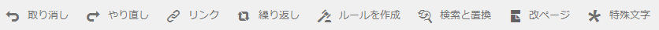

   * **リンク**：テキストにハイパーリンクを挿入します。
   * **繰り返し**:繰り返し：区切り文字を使用して、データディクショナリのコレクション要素を印刷します。
   * **条件**：タップして条件を挿入します。条件に基づいてテキストを挿入します。条件が true の場合はレターにテキストが表示されます。そうでない場合は表示されません。
   * **説追加明**:テ追加キストの注釈。 これは作成者に表示されるメタデータで、作成したレターには含まれません。
   * **改ページ**：テキストモジュールの改ページ属性を false に設定した場合、テキストモジュールはページ間で区切られません。 
   テキストエディタが開きます。テキストを入力します。 段落、整列、リストなど、編集のタイプによってツールバーが変わります。

   

   ツールバーのタイプの選択：段落、整列、またはリスト

   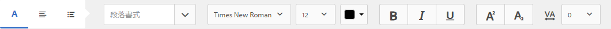

   段落ツールバー
   [ 整列ツ 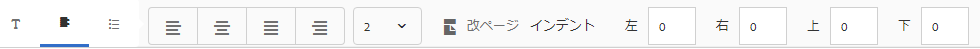](assets/paragrapheditingtoolbar-1.png)ー整列ツールバー

   

   リストツールバー（クリックしてフルサイズの画像を開く）

1. 別のアプリケーション（MS Word や HTML ページなど）から複数の段落のテキストを再利用するには、テキストをコピーしてテキストエディタに貼り付けます。コピーされたテキストの書式設定は、テキストエディタでも保持されます。

   編集可能なテキストモジュールでは、1 つ以上のテキスト段落をコピーして貼り付けることができます。たとえば、次のような居住証明書の箇条書きリストを含む MS Word 文書があるとします。

   

   編集可能なテキストモジュールでは、MS Word 文書からテキストを直接コピーして貼り付けることができます。箇条書きリスト、フォント、テキストの色などの書式は、テキストモジュールでも保持されます。

   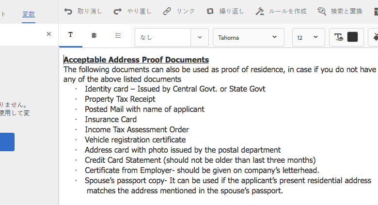

   >[!NOTE]
   >
   >ただし、貼り付けられたテキストの書式設定にはいくつかの[制約](https://helpx.adobe.com/aem-forms/kb/cm-copy-paste-text-limitations.html)があります。

1. 必要に応じて、ドキュメントフラグメントに特殊文字を挿入します。例えば、特殊文字パレットを使用して、以下の特殊文字を挿入することができます。

   * 通貨記号（€、¥、£など）
   * 数学記号（∑、√、∂、^など）
   * やなどの句読‟記号
   

   Correspondence Managementhas では、210 種類の特殊文字に初期状態から対応しています。The admin can [add support for more/custom special characters by customization](/help/forms/using/custom-special-characters.md).

1. 編集可能なインラインモジュールのテキストの一部をハイライト表示または強調するには、テキストを選択して「ハイライト表示の色」をタップします。

   

   You can either directly tap a basic color `**[A]**` present in the Basic Colors palette or tap **Select** after using the slider `**[B]**` to choose the appropriate shade of the color.

   Optionally, you can also go to the Advanced tab to select the appropriate Hue, Lightness, and Saturation `**[C]**` to create the precise color and then tap Select `**[D]**` to apply the color to highlight the text.

   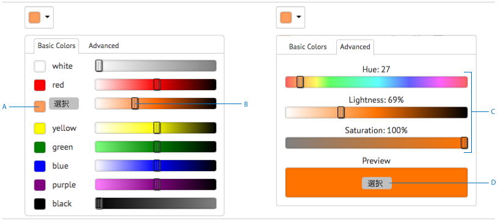

1. データディクショナリ要素とプレースホルダー要素をデータパネルからテキストにドラッグ＆ドロップします。

   宛先：

   * Add a data dictionary element in the text, select a data element from the list, and tap Insert ( 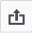). 「保護」を選択した場合、データディクショナリ要素は読み取り専用になり、レターエディターに表示されますが、通信を作成ユーザーインターフェイスまたは Correspondence Creator には表示されません。 
   * テキストにプレースホルダー要素を追加するには、データ要素パネルで「新規作成」をタップし、新しいデータ要素の詳細を入力します。次に、「作成」をタップし、新しい要素をリストに追加します。新しいプレースホルダーは、データディクショナリ要素と同じ方法でテキストに挿入できます。プレースホルダーを編集するには、プレースホルダーを選択し、「編集」をタップします。
   

   データディクショナリのサンプルデータファイルで指定されたプレースホルダー要素

   

   サンプルデータファイルで指定したデータディクショナリ変数によって入力された、CCR ビュー内のプレースホルダー要素値

   @記号を使用して、データディクショナリやプレースホルダー要素を検索し、テキストエディターに追加することもできます。 要素を挿入する位置にカーソルを置きます。 @の後に検索文字列を入力します。 テキストエディターは、テキストディクショナリフラグメントで使用可能なすべてのデータディクショナリとプレースホルダー要素に対してドキュメントを実行します。 検索操作は、検索文字列を含む要素を取得し、ドロップダウンリストとして表示します。 検索結果内を移動し、カーソル位置に挿入する要素をクリックします。 検索結果を非表示にするには、Escキーを押します。

1. インライン条件と繰り返しを使用して、文脈に応じて変化する適切に構造化されたレターにすることができます。For more information on inline condition and repeat, see [Inline conditions and repeat in letters](/help/forms/using/cm-inline-condition.md).
1. 「**保存**」をタップします。

#### テキストへのハイパーリンクの挿入 {#insert-hyperlink}

次の手順を実行して、テキストアセット内にハイパーリンクを作成します。

1. テキストエディターで、テキストまたはデータモデルオブジェクトを選択します。

2. 「リンク」 **[!UICONTROL をタップしま]**&#x200B;す。 「代替テキ **[!UICONTROL スト]** 」フィールドをタップして、既存のデータモデルオブジェクトの名前またはテキストを削除します。

3. URLを指定し、「保存」をタッ 。

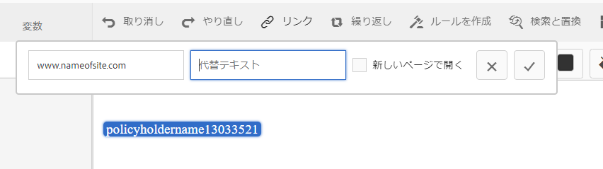

#### テキストの検索と置換 {#searching-and-replacing-text}

大きなテキストの本文を含むテキスト要素を使用する場合は、特定のテキスト文字列を検索する必要があります。 また、特定のテキスト文字列を別の文字列で置き換える必要がある場合もあります。

「検索と置換」機能はテキスト要素内にある任意の文字列の検索（および置換）を可能にします。この機能には、強力な正規表現検索も含まれています。

#### テキストモジュールでテキストを検索するには {#to-search-text-in-a-text-module}

1. テキストエディターでテキストモジュールを開きます。 

1. 「検索と置換」をタップします。
1. 検索するテキストを「検索」テキストボックスに入力して、「検索」を押します。テキストモジュールで検索テキストがハイライトされます。 
1. テキストの次のインスタンスを検索するには、もう一度「検索」を押します。

   「検索」ボタンを押し続けると、検索はページの下に続きます。After the last instance of the text is found, the message **Reached end of module** indicates that no more search results were found.

   ただし、テキストモジュールで検索テキストのインスタンスが見つからない場合は、「**一致が見つかりませんでした**」というメッセージが表示されます。

1. 「検索」を再び押すと、検索はページの一番上から続きます。

#### 検索オプション {#search-options}

**大文字と小文字を区別：** 検索では、大文字と小文字のみが同じ結果が返されます。

**単語全体：** 検索では単語全体のみが返されます。

**注意：**「検索」テキストボックスに特殊文字を入力すると、「単語全体」オプションは無効になります。

**正規表現：** 正規式。 例えば、次の正規表現はテキストモジュール内の電子メールアドレスを検索します。

`[a-zA-Z0-9._%+-]+@[a-zA-Z0-9.-]+\.[a-zA-Z]{2,4}`

#### テキストモジュールでテキストを検索および置換するには {#to-search-and-replace-text-in-a-text-module}

1. テキストエディターでテキストモジュールを開きます。 
1. 「検索と置換」をタップします。
1. 「検索」テキストボックスに検索するテキスト、および見つかったテキストと置換するためのテキストを入力し、「置換」を押します。
1. 検索テキストが見つかると、テキストは置換テキストと置換されます。

   * 検索テキストの他のインスタンスが見つかった場合、そのインスタンスはテキストモジュールでハイライトされます。再び「置換」を押すと、ハイライトされたインスタンスは置換され、3 つ目のインスタンスが見つかった場合は、カーソルは先に進みます。
   * 他のインスタンスが見つからない場合、カーソルは最後に置換されたインスタンスで止まります。

1. 「検索」を再び押すと、検索はページの一番上から続きます。

   「すべて置換」オプションを使用して、テキストモジュール内のすべてのインスタンスを置換します。「」を使用すると、置換の数が「検索と置換」ダイアログにメッセージとして表示されます。

#### テキストモジュールについてのベストプラクティス、ヒントおよびテクニック {#best-practices-tips-and-tricks-for-text-modules}

* 重複を回避するために、一貫性のある命名規則を使用します。
* テキストモジュールで適切なデータディクショナリの連結を使用します。
* テキストアセットを変更するときにテキストエディターを使用する場合、次のルールが適用されます。

   * **変数の追加：**&#x200B;可
   * **変数の削除：**&#x200B;可
   * **プロパティの更新：**&#x200B;可
   * **データディクショナリの変更：**&#x200B;データディクショナリ要素が使用されなくなるまでは可。更新については、データディクショナリを変更できません。

## リスト {#list}

リストは、テキスト、（その他の）リスト、条件、画像を含む、一連のドキュメントフラグメントです。リスト要素の順番は固定または編集可能にできます。レターを作成する際は、リスト要素の一部またはすべてを使用して、再利用可能な要素のパターンを複製することができます。リストは基本的に、他のターゲット内にネストできるターゲットとして動作します。

### リストの実装 {#implementing-lists}

リストの実装は次の 2 つの手順から構成されます。

1. 名前、説明、データディクショナリなどのコアプロパティの定義。
1. リストの一部になるコンテンツのセクションの設定。次にリストのロック順やライブラリアクセスなどのプロパティの設定。

### リストの作成 {#create-a-list}

リストは、レターテンプレートで単一のユニットとして使用できる、関連するコンテンツのグループです。任意の種類のコンテンツをリストに追加できます。リストは入れ子にすることもできます。リストモジュールは次のように指定できます。

* **順序指定済み**：Correspondence Creator の実行時に順序を変更できません。
* **ライブラリアクセス**：モジュールをリストに追加できます。このフラグはライブラリアクセスを有効にするかどうかを指定します。有効にする（開く）と、レターをプレビューしながら、モジュールをリストに追加できます。
* リストを作成するときに、次のようなタイプを指定できます。
* **なし**：追加のスタイルフォーマットはリストに適用されません。
* **箇条書き記号**：シンプルな箇条書きでリストがフォーマットされます。
* **番号**：標準（1、2、...）、大文字のローマ字（I、II、...）および小文字のローマ字（i、ii、...）から選択できる番号付きリスト。
* **アルファベット**：小文字（a、b、...）および大文字（A、B、...）から選択できるアルファベットのリスト。
* **カスタム**：番号およびアルファベットのタイプや、プレフィックスおよびサフィックスの値を希望に応じて作成できます。

1. 「**フォーム**／**ドキュメントフラグメント**」を選択します。

1. Select **Create** > **List**.

1. リストの次の情報を指定します。

   * **タイトル（オプション）：**&#x200B;リストのタイトルを入力します。タイトルは一意である必要はなく、特殊文字や英語以外の文字を含めることもできます。リストは、そのタイトル（使用可能な場合）によって、サムネールやアセットのプロパティとして参照されます。
   * **名前：** リストの一意の名前。 状態にかかわらず、複数のアセット（テキスト、条件、リスト）の名前を同じにすることはできません。「名前」フィールドでは、英数字およびハイフンのみ使用できます。「名前」フィールドは、タイトルフィールドの値が自動的に入力されます。「タイトル」フィールドに入力した特殊文字、スペース、数字および英数字以外の文字は、ハイフンに置き換えられます。 「タイトル」フィールドの値は「名前」フィールドに自動的にコピーされますが、値を編集することもできます。
   * **説明（オプション）**:アセットの説明を入力します。
   * **データディクショナリ（オプション）**:必要に応じて、接続するデータディクショナリを選択します。 リストと同じデータディクショナリを使用するアセット、またはデータディクショナリが割り当てられていないアセットのみをリストに追加できます。データディクショナリをリストに割り当てると、レターテンプレートを作成するときに、適切なリストが見つけやすくなります。
   * **タグ（オプション）**:適用するタグを選択します。 新しいタグ名を入力して作成することもできます。(The new tag is created when you tap **Save**.)

1. 「**次へ**」をタップします。
1. Tap **Add Asset**.
1. To add assets to the list, select them in the Select Assets page and tap **Done**.

   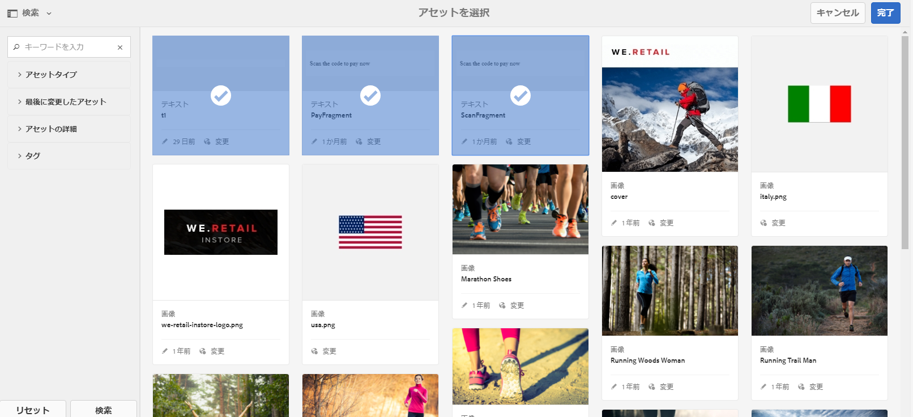

1. アセットがリスト項目ページに追加されます。To change the order of the assets within the list, tap and hold the arrows icon (  ) and drag-and-drop. ユーザーが通信を作成ユーザーインターフェイスでレターテンプレートを開くと、ここで定義した順にコンテンツがアセンブルされます。

   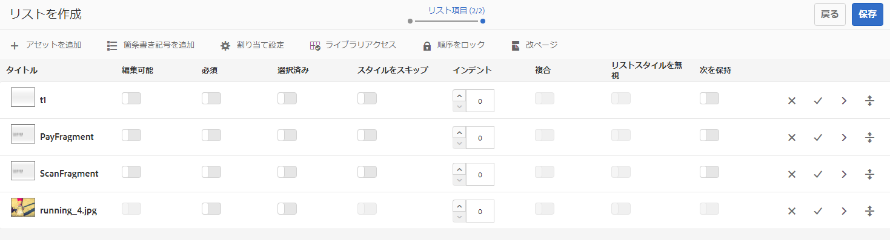

1. CCR ユーザーインターフェイスでのリストの動作を指定するには、次のオプションを選択します。

   * **ライブラリアクセス**：ライブラリにアクセスしてアセットを追加するには、「ライブラリアクセス」をタップします。「ライブラリアクセス」を有効にすると、要求処理担当者はリストにコンテンツを追加できます。有効にしない場合、要求処理担当者はリスト用に定義したコンテンツのみに使用を制限されます。
   * **順序をロック**：要求処理担当者が順序を変更できないようにリストのアセット順をロックするには、「順序をロック」をクリックします。このオプションを選択しない場合、要求処理担当者はリスト項目の順序を変更できます。

   * **箇条書き記号を追加**：モジュールに箇条書きスタイルまたは段落番号スタイルを適用するには、このオプションを使用します。事前設計されたリストスタイルまたはカスタムのリストスタイルのどちらかを使用できます。また、各項目の前後に表示するテキストを指定することもできます。
   * **改ページ**:このオプション( )を選択すると、リストの内容の間に改ページが追加されます。 When this option is not selected ( ), if the contents of the list are overflowing to the next page, the whole list is shifted to the next page instead of breaking in the page between the list.

   * **割り当て設定**：リストに追加できるアセットの最小数と最大数を指定するには、このオプションを使用します。

1. リスト内にある各アセットの実行時の動作を指定するには、次のオプションを選択します。

   * **編集可能：**&#x200B;このオプションを選択すると、通信を作成ユーザーインターフェイスでコンテンツを編集できます。(このオプションは、画像モジュールとリストモジュールでは使用できません)。
   * **必須：**&#x200B;このオプションを選択すると、通信を作成ユーザーインターフェイスでコンテンツが必須となります。
   * **選択済み：**&#x200B;このオプションを選択すると、通信を作成ユーザーインターフェイスでコンテンツが事前に選択されます。
   * **スタイルをスキップ：**&#x200B;このオプションを選択すると、通信を作成ユーザーインターフェイスでコンテンツの箇条書きと段落番号がスキップされます。（このオプションは画像モジュールには使用できません。また、モジュールに適用できるのは「スタイルをスキップ」、「複合」、「無視リストスタイル」のいずれか 1 つのオプションのみになります。モジュールに「箇条書き記号を追加」を選択した場合、これらのオプションのいずれか 1 つを使用できます。）
   * **インデント：**&#x200B;リストの一部として選択した各モジュール / コンテンツのインデントレベルを変更できます。インデントはレベル単位（0から始まる）で指定し、各インデントレベルが36ポイントのパディングに対応するようにします。
   * **複合：**&#x200B;選択すると、複合段落番号が、外側の（親）リストのスタイルとそのリストのスタイルの組み合わせとして適用されます。この入れ子リストの複合段落番号は、この入れ子リストが外側のリストで表示される順序に基づきます。
   * **無視リストスタイル**：「複合段落番号」オプションをオフにすると、「リストスタイルを無視する」オプションが有効になります。このオプションを選択すると、入れ子リストのスタイルは無視され、段落番号は外側のリストから継続されます。そのため、入れ子リストのモジュールは、外側のリストの一部として扱われ、入れ子リストで指定したすべてのスタイルが無視されます。入れ子リストに対して「リストスタイルを無視する」オプションをオフにすると、入れ子リストに含まれるモジュールには、独自の段落番号スタイルが設定されます。
   * **次を保持：**&#x200B;リストに含まれるアセットの改ページを設定します。リストの 1 つのアセットの「次を保持」プロパティを「**オン**」に設定すると、そのアセットと次のアセットは同じページになります。これは、選択されたアセットと次のアセットのコンテンツはページ間で区切られないことを意味します。

1. 「**保存**」をタップします。

### ベストプラクティス、ヒントおよびテクニック {#best-practices-tips-and-tricks}

* 重複を回避するために、一貫性のある命名規則を使用します。
* 適切なデータディクショナリの連結を使用します。
* リストを変更するときにリストエディターを使用する場合、次のルールが適用されます。

   * プロパティの更新：可
   * **データディクショナリの変更：**&#x200B;データディクショナリを使用するアイテムが関連付けられなくなるまでは可。更新については、データディクショナリを変更できません。

## 条件 {#conditions}

条件を使用すると、提示されたデータに基づいて通信／レターの作成時に含めるコンテンツを定義できます。制御変数を使用して条件を記述します。条件を追加するときに、制御変数の値に基づいてアセットを含めることもできます。

選択したオプションに基づき、true と判断された最初の式のみまたはすべての条件が、現在の条件変数に基づいて評価されます。通信の作成（CCR）でのレターへの入力時、条件は「ホワイトボックス」のように機能します。条件の結果がリストになる場合、リストのすべての必須アイテムと事前に選択されたアイテムが出力されます。これらのアイテム自体が条件やリストになる場合、その結果のコンテンツも、テキストと画像のコンテンツのフラットリストとしてトップダウン式の深さ優先順で出力されます。条件結果のタイプは任意です（テキスト、リスト、条件、画像）。

### 条件の実装 {#implementing-conditions}

条件エディターでは[式ビルダー](/help/forms/using/expression-builder.md)のユーザーインターフェイスも提供され、複数のプレースホルダーとデータディクショナリ要素を使用した式の作成がサポートされています。この式には、共通のオペランドとローカル関数およびグローバル関数が使用できます。式はそれぞれコンテンツと関連付けることができます。オプションとして、true の評価がない場合はデフォルトのセクションにすることができます。各式を定義された順番に評価し、最初に true を返した式が選択され、その式に関連付けられたコンテンツがその条件モジュールによって返されます。

例えば、レターの条項を顧客が住んでいる州によって異なり、データディクショナリに「state」という要素が含まれている場合は、次のような条件を追加できます。 • state = NY, select T&amp;C_NY text paragraph • state = NC, select T&amp;C_NC text paragraph

条件エディターを使用すると、デフォルト条件を指定できます。制御変数の値がいずれの条件とも一致しない場合、デフォルト条件に関連付けられたコンテンツが使用されます。前述の例の後に、次の条件の行を追加できます。
• Default, select T&amp;C_Rest

### 条件の作成 {#create-a-condition}

1. 「**フォーム**／**ドキュメントフラグメント**」を選択します。
1. 「**作成／条件**」を選択します。
1. リストの次の情報を指定します。

   * **タイトル（オプション）:** 条件のタイトルを入力します。 タイトルは一意である必要はなく、特殊文字や英語以外の文字を含めることもできます。条件は、（利用可能な場合）タイトルによって、サムネールやアセットのプロパティとして参照されます。
   * **名前：** 条件の一意の名前。 状態にかかわらず、複数のアセット（テキスト、条件、リスト）の名前を同じにすることはできません。「名前」フィールドでは、英数字およびハイフンのみ使用できます。「名前」フィールドは、タイトルフィールドに基づいて自動的に入力されます。「タイトル」フィールドに入力した特殊文字、スペース、数字および英数字以外の文字は、ハイフンに置き換えられます。 「タイトル」フィールドの値は「名前」フィールドに自動的にコピーされますが、値を編集することもできます。
   * **説明（オプション）** ：条件の説明を入力します。
   * **データディクショナリ（オプション）**:必要に応じて、接続するデータディクショナリを選択します。 条件と同じデータディクショナリを使用するアセット、またはデータディクショナリが割り当てられていないアセットのみをリストに追加できます。データディクショナリをリストに割り当てると、レターテンプレートを作成するときに、適切な条件が見つけやすくなります。
   * **タグ（オプション）**:必要に応じて、適用するタグを選択します。 新しいタグ名を入力して作成することもできます。(The new tag is created when you tap **Save**.)

1. 「**次へ**」をタップします。
1. Tap **Add Asset**.
1. To add an asset to the Condition, select it in the Select Assets page and tap **Done**. アセットが式ウィンドウに追加されます。
1. 条件の実行時の動作を指定するには、次のオプションを選択します。

   * **複数の結果評価を無効化 / 複数の結果評価を有効化**：このオプションを有効にする（「複数の結果評価を有効化」を表示する）と、すべての条件が評価され、結果としてすべての true 条件の概要が表示されます。このオプションを無効にする（「複数の結果評価を無効化」を表示する）と、true と判断された最初の条件のみが評価され、その条件が出力されます。
   * **改ページ**:条件のモジュール間に改 、このオプション（改ページ）を選択します。 When this option is not selected ( ), if a condition is overflowing to the next page, the whole condition is shifted to the next page instead of breaking in the page between the condition.

1. To change the order of the assets within the condition, tap and hold the arrows icon (  ) and drag-and-drop. ユーザーが通信を作成ユーザーインターフェイスでレターテンプレートを開くと、ここで定義した順にコンテンツがアセンブルされます。
1. Tap **Delete** to delete the row. デフォルトの行で「削除」をタップすると、アセット情報のみがクリアされます。
1. Tap **Copy** to duplicate a row.
1. Tap **Edit** to change the asset or edit the expression.

   さらに、以下の点も変更されています。

   * アセットを更新するには、アセット列の下にあるフォルダーアイコンをタップします。
   * 式ビルダーを開いて式を挿入するには、式列の下にあるフォルダーアイコンをタップします。For more information on Expression Builder, see [Expression Builder](/help/forms/using/expression-builder.md).

### ベストプラクティス、ヒントおよびテクニック {#best-practices-tips-and-tricks-1}

* 検索を容易にし、重複を回避するため、一貫性のある命名規則を使用します。
* 条件はケース文のように動作するので、条件の順序は重要です。最初の一致が返されます。
* 適切なデータディクショナリの連結を使用します。
* 条件を編集するときに条件エディターを使用する場合、次のルールが適用されます。

   * **変数の追加：**&#x200B;可
   * **変数の削除：**&#x200B;可
   * **プロパティの更新：**&#x200B;可
   * **データディクショナリの変更：**&#x200B;データディクショナリ要素が使用されなくなるまでは可。

## レイアウトフラグメント {#layoutfragments}

レイアウトフラグメントは Designer で作成された XDP に基づいています。For creating layout fragments, you need to create the XDPs and [upload them to AEM Forms](/help/forms/using/import-export-forms-templates.md).

1 つ以上のレイアウトフラグメントによってレターのパーツを形成し、これらのパーツのグラフィカルレイアウトを定義できます。レイアウトフラグメントには、「アドレス」、「参照番号」、ターゲット領域を指定する空のサブフォームなど、一般的なフォームフィールドを含めることができます。また、レイアウトフラグメントを使用してテーブルを作成し、テーブルをレターに挿入できます。 

一般的には、再利用可能なレイアウトパターンをレターで見つけて、これらのパターンを使用してレイアウトフラグメントを作成します。例えば、複数のレターで同じ順に表示される挨拶、住所、レターの件名を使用します。または、複数のレターで使用されている行数と列数が同じテーブルなどを使用します。 

レイアウトフラグメントは既存の XDP に基づいて作成できます。レイアウトフラグメントはフィールドとターゲット領域を使用するか、1 つ以上のテーブルを使用して作成できます。レイアウト内のテーブルは静的または動的にすることができます。XDP は Designer で作成され、[AEM Forms にアップロード](/help/forms/using/import-export-forms-templates.md)されます。XDP はレイアウトフラグメントまたはレターの構造を形成できます。More information on [Layout Design](/help/forms/using/layout-design-details.md).

ターゲット領域に連結されているフラグメントを使用することで、作成時にレターを変更できます。異なるサイズのレイアウトフラグメントを作成し、適切なフラグメントをターゲット領域に連結できます。レイアウトフラグメントでは、次のように一部のテーブルプロパティをカスタマイズすることもできます。

1. 行数と列数を追加できます。
1. 追加した行と列にヘッダーおよびフッターのテキストを指定できます。
1. テーブル列の幅の比率を指定できます。実行時に、指定した比率と空きスペースに基づいてテーブル列がサイズ変更されます。幅の比率の合計は 100 になる必要があります。そうでない場合は適用できません。
1. テーブルがプレースホルダー（空白のセルを 1 つだけ含む）の場合、新しい列のタイプ（ターゲット領域またはフィールド）を指定できます。
1. ヘッダー行およびフッター行を非表示にできます。

この手順を実行する前に、Designer を使用して XFA フラグメントを作成します。フラグメントには、フィールドとターゲット領域の構成するためのテーブルを含めることができます。Designer では、静的と動的の 2 つのタイプのテーブルを作成できます。静的テーブルの行数は固定されています。静的テーブルには、ターゲット領域とフィールドを含めることができます。これらのターゲット領域とフィールドを、繰り返し DDE に連結することはできません。動的テーブルにも 1 つの行を含めることができます。動的テーブルの行数は、テーブルセルに連結されるデータによって決まります。動的テーブルには、フィールドのみを含めることができます。DDE は、繰り返しでも繰り返しなしでも連結できます。

テーブルをデザインする際は、次のポイントを考慮します。

1. レイアウトフラグメントの作成時に、テーブルをカスタマイズできます。ただし、カスタマイズのオプションはテーブルの親サブフォームがフローの場合のみ有効です。
1. 動的テーブルの場合、フィールド、繰り返し可能な行およびテーブルではすべて「名前による」の連結を使用し、データが正しくマージされるようにします。
1. 動的テーブルの場合、テーブルフィールドに連結される繰り返し DDE がすべて同じ階層の一部となるようにします。繰り返しなしの DDE については、このような制限がありません。
1. レイアウトフラグメントを親ターゲット領域にマージするとき、テーブルが空きスペースに合わせてサイズ変更されますが、サイズ変更はレイアウトフラグメントが最上位のサブフォーム内に直接設定されているターゲット領域またはフィールドを含まない場合のみ行われます。テーブル内のターゲット領域およびフィールドは許可されます。
1. プレースホルダーテーブルを作成できます。プレースホルダーテーブルには、空白のセルが 1 つだけあります。

* プレースホルダーテーブルの場合、フラグメントの作成時に次のプロパティをカスタマイズできます。

   * 行数
   * 列数
   * 各列のヘッダーおよびフッター
   * 各列のタイプ（ターゲット領域またはフィールド）
   * 各列の幅の比率

* プレースホルダー以外のテーブルでは、次のプロパティをカスタマイズできます。

   * 行数
   * 列数
   * 追加する列のヘッダーおよびフッター
   * 各列の幅の比率

レターではフラグメントをネストできます。これはフラグメント内にフラグメントを追加できることを意味します。The Correspondence Management solution supports up to four levels of nesting within a letter: **Letter**->**Fragment**->**Fragment**->**Fragment**->**Fragment.**

For a detailed example of using static and dynamic tables in layout fragments, see [Example with sample files: using static and dynamic tables in a letter](#examplewithsamplefiles).

### レイアウトフラグメントの作成 {#creating-a-layout-fragment}

1. 「**作成**／**レイアウトフラグメント**」を選択します。
1. Correspondence Management に利用可能な XDP が表示されます。Select the XDP on which you want to base your layout fragment and tap **Next**.
1. レイアウトの次の情報を指定します。

   * **タイトル（オプション）：**&#x200B;レイアウトフラグメントのタイトルを入力します。タイトルは一意である必要はなく、特殊文字や英語以外の文字を含めることもできます。レイアウトフラグメントは、そのタイトル（使用可能な場合）によって、サムネールやアセットのプロパティとして参照されます。
   * **名前：** レイアウトフラグメントの一意の名前。 状態にかかわらず、複数のアセット（テキスト、条件、リスト）の名前を同じにすることはできません。「名前」フィールドでは、英数字およびハイフンのみ使用できます。「名前」フィールドは、タイトルフィールドに基づいて自動的に入力されます。「タイトル」フィールドに入力した特殊文字、スペース、数字および英数字以外の文字は、ハイフンに置き換えられます。 「タイトル」フィールドの値は「名前」フィールドに自動的にコピーされますが、値を編集することもできます。この名前は、アセットを管理リストインターフェイスに表示されます。
   * **説明（オプション）**:アセットを管理ユーザーインターフェイスのリストに表示される説明です。
   * **タグ（オプション）**:オプションで、条件に適用するタグを選択します。 新しいタグ名を入力して作成することもできます。

1. 「**テーブル**」タブをタップし、レイアウトの次の情報を指定します。

   * **設定**:設定するテーブルを選択します。ドロップダウンのテーブル名のサフィックスは、テーブルが静的な場合は「（静的）」、テーブルが動的な場合は「（動的）」です。 静的テーブルの行数は固定されています。静的テーブルには、ターゲット領域とフィールドを含めることができます。これらのターゲット領域とフィールドを、繰り返し DDE に連結することはできません。動的テーブルの行数は、テーブルセルに連結されるデータによって決まります。

   * **行**：レイアウトの行数を選択します。元の行数以上に設定する必要があります。
   * **列**：レイアウトの列数を選択します。元の列数以上に設定する必要があります。
   列ごとに、次の内容を設定する必要があります。

   * **ヘッダー**：ヘッダーとして表示するテキスト
   * **フッター**：フッターとして表示するテキスト
   * **タイプ**：追加する列のタイプ。フィールドまたはターゲット領域を設定します。「タイプ」は静的プレースホルダーテーブルで有効です。「タイプ」は列のレベルで指定でき、セルのレベルでは指定できません。拡張された列のセルはすべて同じタイプになります。動的テーブルの場合、すべての列がフィールドタイプになります。プレースホルダー以外のテーブルの場合、追加する列のタイプは指定できません。この場合、拡張された列で追加されたセルのタイプは、その行の最後の列のタイプと同じになり、追加された行のセルのタイプは、その列の最後のセルのタイプと同じになります。
   * **幅の比率：テーブル列の幅の比率。**
   For a detailed example of using static and dynamic tables in layout fragments, see [Example with sample files: using static and dynamic tables in a letter](#main-pars-header-28).

1. 「**保存**」をタップします。

### Correspondence Management への XDP のアップロード {#upload-an-xdp-to-correspondence-management}

Correspondence Management に XDP をアップロードする／読み込む手順については、「[AEM Forms におけるアセットの読み込みと書き出し](/help/forms/using/import-export-forms-templates.md)」を参照してください。

### ベストプラクティス、ヒントおよびテクニック {#best-practices-tips-and-tricks-2}

#### デフォルトのサブフォームの連結の設定 {#set-the-default-subform-binding}

Designer でターゲット領域を作成する場合、すべての新しいサブフォームのデフォルトの連結を簡単に「なし」に設定できます。

デフォルトの連結を設定するには、次の手順を実行します。

1. In Designer, tap **Tools** > **Options** > **Data Bindings** > **Subform Binding**.

1. 「新規サブフォーム」リストの「デフォルトの連結」で、「**データ連結なし**」を選択します。

「挿入／サブフォーム」コマンドを使用するか、オブジェクトパレットからドラッグ＆ドロップして挿入したサブフォームは、デフォルトで「なし」の連結があります。つまり、すべての新しいサブフォームはデフォルトで、コンテンツを追加するか、連結設定を変更するか、サフィックスが「_int」の名前をサブフォームに付けるという操作をしない限り、ターゲット領域になります。

#### リハビリテーション法第 508 条への準拠 {#section-compliance}

通信を作成ユーザーインターフェイスで作成したレターを、今後のワークフローで入力に使用する場合、レイアウトの際には、米国リハビリテーション法第 508 条に関連する次の推奨事項に従います。そうしないと、レター PDF は単に表示用になり、これらの推奨事項を無視することになる可能性があります。

* レイアウト内のすべてのターゲット領域のサブフォームとすべてのフィールドには、タブ順を指定します。
* キャプションがあるフィールドは、デフォルトで 508 準拠です。フィールドの /field/assist/speak@priority 属性はデフォルトで「custom」に設定されています。つまり、カスタムのスクリーンリーダーテキストを提供しない限り、フィールドのキャプションがスクリーンリーダーによって読み取られます。
* キャプションがないフィールドにはツールチップを指定し、スクリーンリーダーがツールチップを読み取るように指定します。これには、

`/field/assist/speak@priority="toolTip"` にツールヒントテキストを指定しま `/field/assist/toolTip`す。

#### Designer および Asset Configuration Manager での日付形式 {#date-formats-in-designer-and-asset-configuration-manager}

Designer でレイアウトをデザインするとき、日付フィールドの形式が、[Correspondence Management 設定プロパティ](/help/forms/using/cm-configuration-properties.md)の日付の表示形式で指定した日付形式と一致していることを確認します。詳しくは、Designer ヘルプの「フィールド値の形式設定とパターンの使用」を参照してください。

#### 日付の範囲のキャプチャ {#capturing-date-ranges}

startDate ～ endDate など、日付の組み合わせを処理する場合、単一のサブフォームを使用して、完成したレターの配置が正しいことを確認し、フィールドの数を最小限に抑えます。

#### フォームレベルの連結の設定 {#setting-form-level-binding}

レイアウトに、単一の XML 要素にマッピングされるフィールドとターゲット領域が多数ある場合、フォームレベルの連結を使用し、各要素に個別のノードを作成します。Correspondence Management でデータをマッピングするときに、フォームレベルで連結されるフィールドは無視されます。

#### マスターページでサブフォームのターゲット領域は使用不可 {#do-not-use-subform-target-areas-in-a-master-page}

マスターページのサブフォームのターゲット領域は、アセットを管理ユーザーインターフェイスで表示されません。また、データをマッピングできません。

#### ターゲット領域に適した位置とタイプの選択 {#choosing-appropriate-positions-and-types-for-target-areas}

レイアウトをデザインする場合、サブフォームの選択には注意が必要です。レイアウトに含まれるサブフォームが単一の場合、フロータイプにすることができます。サブフォームにフィールドを配置した後に、別のサブフォームでラップできます。その結果、ラップされたサブフォームもフローするようになり、レイアウトが乱れません。

#### マスターページへのフィールドの配置 {#placing-fields-on-master-pages}

マスターページにフィールドを配置する場合は、次の点に注意する必要があります。

* マスターフィールドの連結を「グローバルデータによる」に設定します。
* フィールドをマスターページの PageArea のルート直下には配置しません。
* フィールドを名前の付いたサブフォームに含めて、名前の付いたサブフォームの連結が「名前による」に設定されていることを確認します。

## レイアウトフラグメントを使用したテーブルの作成 {#creating-tables-using-layout-fragments}

レターテンプレートの多くにテーブルが含まれます。テーブルには静的テーブルがあります。例えば契約条件のテーブルでは、行ごとに 1 つずつ条件が示され、個別の列に各パーツが表示されます。動的テーブルもあります。例えばアカウント情報のテーブルには、顧客の名前、アカウント ID、取引番号および取引金額などの情報が含まれます。

* **静的テーブル**：契約条件のテーブルなど、行によって列の数が異なるテーブルを作成する場合があります。このようなテーブルでは、各行に 1 つずつ条件が表示され、条件ごとに異なるサブパーツが含まれます。各パーツは、個別の列に表示されます。
* **動的テーブル**：レイアウトフラグメントには、動的テーブルのフィールドをコレクション DDE に連結させる機能があります。レター生成時に、コレクション DDE のサイズに従ってテーブル行が生成されます。

DD には Nominee_details コレクション要素があります。このコレクション要素には 1 つの複合要素と、Nominee_name、Nominee_address、Nominee_gender という 3 つのプリミティブ要素があります。動的 XDP にも同じヘッダーがあります。このため、上記の DD フィールドを使用して、動的 XDP フィールドをマッピングできます。 

### サンプルファイルを用いた例：レター内での静的および動的テーブルの使用 {#examplewithsamplefiles}

この例では、動的および静的テーブルを 1 つずつ作成し、動的テーブルを DDE に連結して、これらの 2 つのテーブルを含むレターを作成する方法を示します。この例を使用すると、ファイルを最初から作成するか、手順を実行するために用意されている入力ファイルを使用できます。

1. 図に示すように、例で使用するデータディクショナリ（DD）を作成します。

   次に、DD を選択してサンプルデータを書き出します。提供される XML ファイルには従業員データと、Nominee_details の 3 つのインスタンスが含まれています（デフォルトでは 3 つのインスタンスがダウンロードされますが、必要に応じて追加または削除できます）。値を更新し、テストデータを DD に読み込みます。CMP ファイルはパッケージになっていて、DD が含まれています。DD を Correspondence Management に読み込みます。

   データディクショナリとテストデータの使用について詳しくは、「[データディクショナリ](/help/forms/using/data-dictionary.md#p-working-with-test-data-p)」を参照してください。

   

   [ファイルを入手](assets/exportpackage_1431709897770.cmp.zip)

1. Designer で、2 つの XDP（レイアウトフラグメント）、つまり動的テーブルと静的テーブルを 1 つずつ作成します。両方のレイアウトに対して次の操作を実行します。

   * サ追加ブフォームを表の列に追加します。 テーブルの親サブフォームのレイアウトをフローに変更し、テーブル内のサブフォームの連結を削除してください。
   * テ追加ーブルセルのサブフォーム。 テーブルの親サブフォームのレイアウトをフローに変更し、テーブル内のサブフォームの連結を削除してください。
   または、この手順を実行するために用意されている静的および動的 XDP を使用します。

   レイアウトフラグメントの使用について詳しくは、「[レイアウトフラグメント](#layoutfragments)」を参照してください。レイアウトのデザインについて詳しくは、「[Designer ヘルプ](https://help.adobe.com/en_US/AEMForms/6.1/DesignerHelp/)」を参照してください。

   [ファイルを入手](assets/static.xdp.zip)

   [ファイルを入手](assets/dynamic.xdp.zip)

1. XDP を AEM Forms にアップロードします。 
1. 動的 XDP に基づいてレイアウトフラグメントを作成します。プロパティの「テーブル」タブに、テーブルが動的であることが示されます（「設定対象フィールド」）。行数（1）および列数（3）は、XDP／レイアウトフラグメントから派生します。 

   このレイアウトのフィールドは読み込んだ DD に後で連結されます。また、レターでは、行数がテストデータファイル（DD に付属している XML データファイル）のレコード数に基づいて動的に作成されます。

   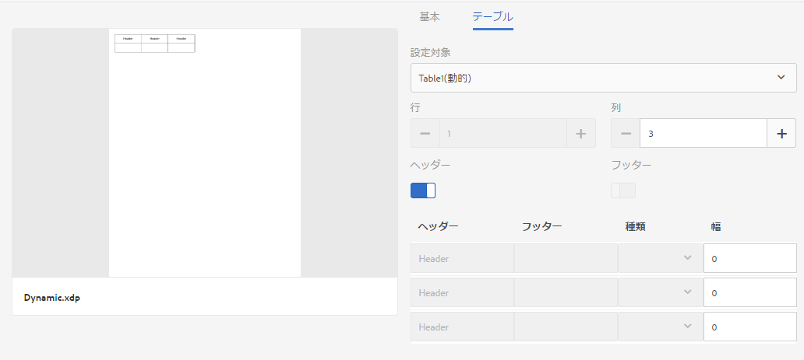

   クリックすると拡大画像が開きます

1. 静的 XDP に基づいてレイアウトフラグメントを作成します。プロパティの「テーブル」タブにテーブルが静的であることが示されます（「設定対象フィールド」）。行数（1）および列数（3）は、XDP／レイアウトフラグメントから派生します。 

   ここで列数と行数を変更できます。画面での選択内容に応じて、静的テーブルの行数と列数は、後でこのレイアウトを使用して作成されるレターで固定されます。
   [ 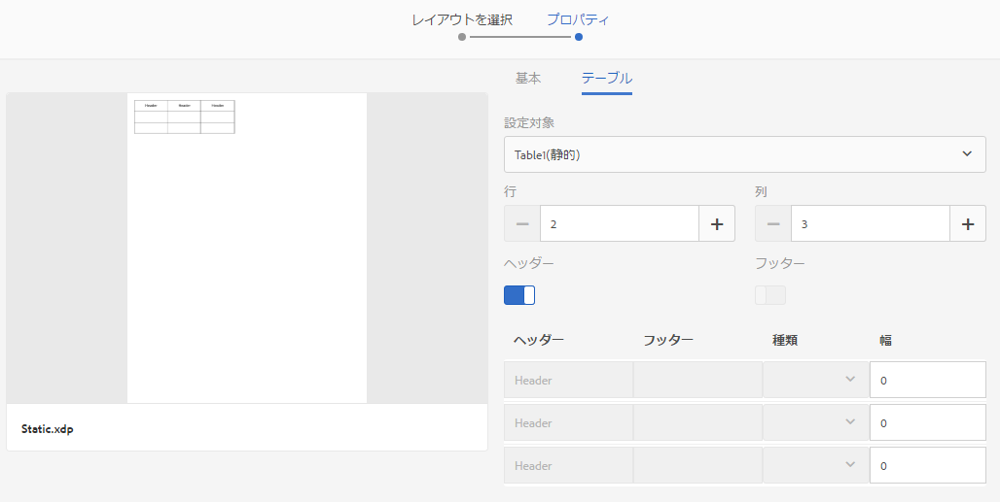](assets/statictableproperties-1.png)

1. 両方のレイアウトフラグメントを使用してレターを作成します。動的 XDP をレターに挿入する際、フィールドの連結をデータディクショナリのコレクション要素に設定します。

   レターおよびレターテンプレートの作成について詳しくは、「[レターの作成](/help/forms/using/create-letter.md)」を参照してください。

1. レターを保存してプレビューします。レターをプレビューすると、データディクショナリの値がレターに表示されます。動的テーブルには、行が 3 つあります。テストデータには 3 つのレコードがあり、それぞれ行ごとに含まれていたためです。 

   静的テーブルには、レイアウトフラグメントの作成中に指定した数だけ行と列があります。

   

   動的テーブルには、テストデータファイル内のレコード数に基づいて 3 つの行が表示されます。これは、レイアウトをレターに追加する際に、動的テーブルのフィールドとデータディクショナリのコレクション要素間に連結を作成したためです。名前、住所、性別の値は、使用したテストデータファイルによって入力されます。

   

## ドキュメントフラグメントのコピーを作成する {#create-a-copy-of-a-document-fragment}

フラグメントをコピーして貼り付けることで、既存のドキュメントフラグメントに類似したプロパティとコンテンツを持つドキュメントフラグメントをすばやく作成できます。

1. ドキュメントフラグメントのリストから、ドキュメントフラグメントを 1 つ以上選択します。UI に「コピー」アイコンが表示されます。
1. 「コピー」をタップします。UI に「貼り付け」アイコンが表示されます。レターを貼り付ける前に、フォルダー内に移動することもできます。複数のフォルダーに同じ名前のアセットを保管することができます。For more information on folders, see [Folders and organizing assets](/help/forms/using/import-export-forms-templates.md#folders-and-organizing-assets).
1. 「貼り付け」をタップします。貼り付けダイアログが表示されます。複数のドキュメントフラグメントをコピーして同じ場所に貼り付けると、それらのレターの新しいコピーに対して名前とタイトルが自動的に割り当てられますが、その名前とタイトルは編集することができます。
1. 必要に応じて、ドキュメントフラグメントのコピーを保存するタイトルと名前を編集します。
1. 「貼り付け」をタップします。ドキュメントフラグメントのコピーが作成されます。

