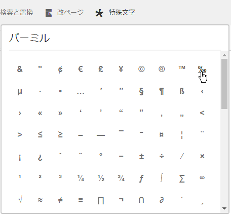
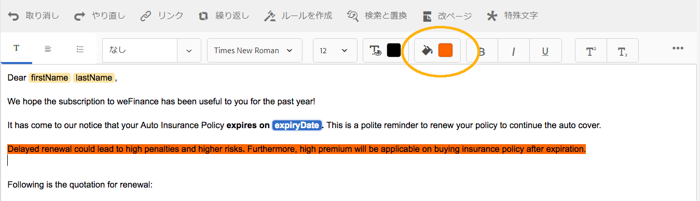

# ドキュメントフラグメント{#document-fragments}

## ドキュメントフラグメント {#document-fragments-1}

ドキュメントフラグメントは、レター／通知を作成できる、再利用可能な通知のパーツ／コンポーネントです。ドキュメントフラグメントには、次の種類があります。

* **テキスト**：テキストアセットは、1 つ以上のテキストパラグラフで構成される 1 つのコンテンツです。段落は静的または動的にすることができます。
* **リスト**：リストは、テキスト、リスト、条件および画像を含むドキュメントフラグメントのグループです。リスト要素の順序は、固定または編集可能にすることができます。レターを作成する際に、一部またはすべてのリスト要素を使用して、再利用可能な要素のパターンを複製できます。
* **条件**：条件を使用すると、指定されたデータに基づいて、通信の作成時に含めるコンテンツを定義できます。条件は、制御変数で記述されます。制御変数は、データディクショナリ要素またはプレースホルダーのいずれかです。
* **レイアウトフラグメント**：レイアウトフラグメントは、1 つ以上のレター内で使用できるレイアウトです。レイアウトフラグメントは、繰り返し可能なパターン（特に動的テーブル）を作成するために使用します。レイアウトには、「アドレス」や「参照番号」などの一般的なフォームフィールドを含めることができます。また、ターゲット領域を示す空のサブフォームを含めることもできます。レイアウト（XDP）は Designer で作成され、AEM Forms にアップロードされます。

## テキスト {#text}

テキストアセットは、1 つまたは複数の段落で構成される 1 つのコンテンツです。段落は静的または動的にすることができます。動的段落には、データ要素への参照が含まれます。データ要素の値は実行時に提供されます。例えば、挨拶文の顧客名は動的データ要素であり、その値は実行時に使用可能になります。これらの値を変更すると、同じレターテンプレートを使用して、異なる顧客向けにレターを生成できます。

Correspondence Management Solution は、動的データ項目（可変データ）に対して 2 種類のサポートを行います。

* **データディクショナリ要素**：これらの要素はデータディクショナリに連結され、指定されたデータソースから値を取得します。データディクショナリ変数は、保護または非保護にすることができます。通信の作成時に、ユーザーは保護されていないデータディクショナリ変数のデフォルト値を変更できますが、保護された変数は変更できません。
* **プレースホルダー**：これらは、バックエンドのデータソースに連結されない変数です。通信の作成時にユーザーが値を入力する必要があります。プレースホルダーは、デフォルトでは保護されていません。

>[!NOTE]
>
>Correspondence Management テンプレートでは、プレースホルダーを作成する際に一意の名前を作成するように強制されません。テキストと条件など、同じ名前のプレースホルダーを 2 つ作成し、その両方を 1 つのレターテンプレートで使用する場合、最後に挿入したプレースホルダーの値が両方のプレースホルダーに使用されます。2 つのプレースホルダーの名前が同じ場合、その型が比較されます。型が異なる場合、型は文字列になります。ただし、モジュール内では、同じ名前のプレースホルダーを複数作成することはできません。

### テキストの作成 {#create-text}

1. **フォーム**／**ドキュメントフラグメント**&#x200B;を選択します。
1. **作成**／**テキスト**&#x200B;を選択、またはテキストアセットを選択して、**編集**&#x200B;を選択します。
1. テキストの次の情報を指定します。

   * **タイトル：（オプション）**&#x200B;テキストアセットのタイトルを入力します。タイトルは一意である必要はなく、特殊文字や英語以外の文字を含めることもできます。テキストは、サムネイルやアセットプロパティなど、タイトル（使用可能な場合）で参照されます。
   * **名前：**&#x200B;テキストアセットの一意の名前。どの状態にも、同じ名前のアセット（テキスト、条件、リスト）は 2 つ存在できません。「名前」フィールドに入力できるのは、英語の文字、数字、ハイフンのみです。「名前」フィールドは、「タイトル」フィールドに基づいて自動的に入力されます。「タイトル」フィールドに入力した特殊文字、スペース、および英数字以外の文字はハイフンに置き換えられます。「タイトル」フィールドの値は「名前」フィールドに自動的にコピーされますが、値を編集することもできます。
   * **説明**：アセットの説明を入力します。
   * **データディクショナリ**：（オプション）マッピングするデータディクショナリを選択します。この属性を使用すると、テキストアセット内のデータディクショナリ要素への参照を追加できます。
   * **タグ**：（オプション）カスタムタグを作成するには、テキストフィールドに値を入力して Enter を押します。タグのテキストフィールドの下にタグが表示されます。このテキストを保存すると、新しく追加されたタグも作成されます。

1. 「**次へ**」を選択します。テキストの段落やデータ要素をテキストに追加できるエディターページが、Correspondence Management によって表示されます。

   ブラウザーのデフォルトのスペルチェッカーは、テキストエディターでスペルチェックを行います。スペルチェックや文法チェックを管理するには、ブラウザーのスペルチェッカー設定を編集するか、またはスペルチェックや文法チェックを行うためのブラウザプラグインやアドオンをインストールします。

   また、テキストエディターでは、様々なキーボードショートカットを使用して、テキストの管理、編集や書式設定を行うこともできます。[テキストエディター](/help/forms/using/keyboard-shortcuts.md#p-formatting-p)キーボードショートカットについて詳しくは、「Correspondence Management キーボードショートカット」を参照してください。

1. テキストエディターが開くので、テキストを入力します。ページの最上部にあるツールバーを使用して、テキストの書式設定や、条件、リンク、改ページの挿入を行います。

   

   * **リンク**：テキストに[ハイパーリンク](#insert-hyperlink)を挿入します。
   * **繰り返し**：区切り文字を使用して、データディクショナリのコレクション要素を繰り返し印刷します。
   * **条件**：選択して条件を挿入します。条件に基づいてテキストを挿入します。条件が true の場合、文字にテキストが表示され、それ以外の場合は表示されません。
   * **説明を追加**：テキストに注釈を追加します。これは作成者に表示されるメタデータで、作成したレターには含まれません。
   * **改ページ**：テキストモジュールの改ページ属性を false に設定した場合、テキストモジュールはページ間で区切られません。

   テキストエディターが開きます。テキストを入力します。段落、整列、リストなど、編集のタイプによってツールバーが変わります。

   

   以下のツールバーのタイプ（段落、整列またはリスト）を選択します。

   

   段落ツールバー
   整列ツールバー

   

   リストツールバー（クリックすると拡大画像が開きます）

1. MS Word や HTML ページなど、別のアプリケーションに存在するテキストの段落を 1 つ以上再利用するには、テキストをコピーしてテキストエディターに貼り付けます。コピーしたテキストの書式は、テキストエディターでも保持されます。

   編集可能なテキストモジュールでは、1 つ以上のテキスト段落をコピーして貼り付けることができます。例えば、次のような許容可能な居住証明書の箇条書きリストを含む MS Word ドキュメントがあるとします。

   

   MS Word ドキュメントから編集可能なテキストモジュールに、テキストを直接コピーして貼り付けることができます。箇条書きリスト、フォント、テキストの色などの書式は、テキストモジュールでも保持されます。

   

   >[!NOTE]
   >
   >ただし、貼り付けられたテキストの書式設定にはいくつかの[制約](https://helpx.adobe.com/jp/aem-forms/kb/cm-copy-paste-text-limitations.html)があります。

1. 必要に応じて、ドキュメントフラグメントに特殊文字を挿入します。例えば、特殊文字パレットを使用して、以下の特殊文字を挿入することができます。

   * 通貨記号（€、￥、£ など）
   * 数学記号（∑、√、∂、^ など）
   * 句読記号（‟、” など）

   

   Correspondence Management では、210 種類の特殊文字に初期状態から対応しています。管理者は、[カスタマイズすることで特殊文字を増やしたり、カスタムの特殊文字を追加したりする](/help/forms/using/custom-special-characters.md)ことができます。

1. 編集可能なインラインモジュールのテキストの一部をハイライト表示または強調するには、テキストを選択して「ハイライトの色」を選択します。

   

   基本色パレットに表示されている基本色 `**[A]**` を直接タップすることも、スライダー `**[B]**` を使用して「**選択**」を選択し、その色の適切な網掛けを選択することもできます。

   オプションで、「詳細」タブに移動して、適切な色相、明度、彩度 `**[C]**` を選択して正確な色を作成し、「`**[D]**` を選択」を選択して、その色を適用してテキストをハイライト表示することもできます。

   

1. データパネルからデータディクショナリ要素とプレースホルダー要素をドラッグして、テキストにドロップします。

   To:

   * テキストにデータディクショナリ要素を追加し、リストからデータ要素を選択して、「挿入」（）を選択します。「保護」を選択すると、データディクショナリ要素は読み取り専用となり、レターエディターに表示されますが、「通信を作成」ユーザーインターフェイスや Correspondence Creator には表示されません。
   * テキストにプレースホルダー要素を追加し、データ要素パネルで「新規作成」を選択して、新しいデータ要素の詳細を入力します。次に、「作成」を選択し、新しい要素をリストに追加します。新しいプレースホルダーは、データディクショナリ要素と同じ方法でテキストに挿入できます。プレースホルダーを編集するには、プレースホルダーを選択し、「編集」を選択します。

   

   データディクショナリのサンプルデータファイルで指定されたプレースホルダー要素

   

   サンプルデータファイルで指定したデータディクショナリ変数によって入力された、CCR ビュー内のプレースホルダー要素値

   @ 記号を使用し、データディクショナリとプレースホルダー要素を検索してテキストエディターに追加することもできます。要素を挿入する位置にカーソルを置きます。@ の後に検索文字列を入力します。テキストエディターは、テキストドキュメントフラグメントで使用可能なすべてのデータディクショナリとプレースホルダー要素に対して検索操作を実行します。検索操作は、検索文字列を含む要素を検索し、ドロップダウンリストとして表示します。検索結果間を移動し、カーソル位置で挿入する要素をクリックします。検索結果を非表示にするには、Esc キーを押します。

1. インライン条件と繰り返しを使用して、文脈性の高い、構成力のあるレターにすることができます。インライン条件と繰り返しについて詳しくは、[レターのインライン条件と繰り返し](/help/forms/using/cm-inline-condition.md)を参照してください。
1. 「**保存**」を選択します。

#### テキストにハイパーリンクを挿入 {#insert-hyperlink}

テキストアセット内にハイパーリンクを作成するには、次の手順を実行します。

1. テキストエディターで、テキストまたはデータモデルオブジェクトを選択します。

2. 「**[!UICONTROL リンク]**」を選択します。**[!UICONTROL 代替テキスト]**&#x200B;フィールドを選択して、既存のデータモデルオブジェクトの名前またはテキストを削除します。

3. URL を指定して、「」を選択します。

#### テキストの検索と置換 {#searching-and-replacing-text}

大量のテキストを含むテキスト要素で作業する際、特定のテキスト文字列を検索する必要があります。また、特定のテキスト文字列を別の文字列と置換する必要がある場合もあります。

検索と置換機能により、テキスト要素内の任意のテキスト文字列を検索して置き換えることができます。この機能には、強力な正規表現検索も含まれています。

#### テキストモジュールでテキストを検索するには {#to-search-text-in-a-text-module}

1. テキストエディターでテキストモジュールを開きます。

1. 「検索と置換」を選択します。
1. 検索するテキストを「検索文字列」テキストボックスに入力して、「検索」を押します。テキストモジュールで検索テキストがハイライト表示されます。 
1. テキストの次のインスタンスを検索するには、再び「検索」を押します。

   「検索」ボタンを押し続けると、ページの下方に検索が継続されます。テキストの最後のインスタンスが見つかった後に表示される「**モジュールの最後に達しました**」のメッセージは、検索結果がそれ以上見つからないことを示します。

   ただし、テキストモジュールで検索テキストのインスタンスが見つからない場合は、**一致が見つかりませんでした**&#x200B;というメッセージが表示されます。

1. 「検索」を再び押すと、検索はページの一番上から続行されます。

#### 検索オプション {#search-options}

**大文字／小文字の一致**：検索は、大文字／小文字が一致する結果のみを返します。

**単語全体：**&#x200B;単語全体が一致する結果のみを返します。

>[!NOTE]
>
>「検索」テキストボックスに特殊文字を入力すると、「単語全体」オプションは無効になります。

**Reg ex：**&#x200B;正規表現を使用して検索します。例えば、次の正規表現はテキストモジュール内のメールアドレスを検索します。

`[a-zA-Z0-9._%+-]+@[a-zA-Z0-9.-]+\.[a-zA-Z]{2,4}`

#### テキストモジュールでテキストを検索および置換するには {#to-search-and-replace-text-in-a-text-module}

1. テキストエディターでテキストモジュールを開きます。 
1. 「検索と置換」を選択します。
1. 検索するテキストを「検索文字列」テキストボックスに入力し、検索テキストを置き換えるためのテキストを入力して、「置換」を押します。
1. 検索テキストが見つかると、そのテキストは置換テキストに置き換えられます。

   * 検索テキストの別のインスタンスが見つかった場合、そのインスタンスはテキストモジュールでハイライト表示されます。もう一度「置換」を押して、3 つ目のインスタンスが見つかった場合は、ハイライト表示されたインスタンスが置き換えられ、カーソルが先に進みます。
   * 別のインスタンスが見つからない場合、カーソルは最後に置き換えられたインスタンスで停止します。

1. 「検索」を再び押すと、検索はページの一番上から続行されます。

   「すべてを置換」オプションを使用すると、テキストモジュール内のテキストのインスタンスがすべて置換されます。us`` を行うと、「検索と置換」ダイアログで置換の数がメッセージとして表示されます。

#### テキストモジュールのベストプラクティス／ヒントとテクニック {#best-practices-tips-and-tricks-for-text-modules}

* 重複を避けるために、一貫した命名規則を使用します。
* テキストモジュールで適切なデータディクショナリバインディングを使用します。
* テキストエディターを使用してテキストアセットを変更する場合は、次のルールが適用されます。

   * **変数の追加：**&#x200B;可
   * **変数の削除：**&#x200B;可
   * **プロパティの更新：**&#x200B;可
   * **データディクショナリの変更：**&#x200B;データディクショナリ要素が使用されなくなるまでは可。更新時にデータディクショナリを変更することはできません。

## リスト {#list}

リストは、テキスト、（その他の）リスト、条件、画像などのドキュメントフラグメントのグループです。リスト要素の順序は、固定または編集可能にすることができます。レターを作成する際は、リスト要素の一部またはすべてを使用して、再利用可能な要素のパターンを複製することができます。リストは基本的に、他のターゲット内でネスト可能なターゲットとして動作します。

### リストの実装 {#implementing-lists}

リストの実装は、次の 2 つの手順で構成されます。

1. 名前、説明、データディクショナリなどのコアプロパティの定義。
1. リストの一部になるコンテンツのセクションの設定に続いて、リストのロック順序やライブラリアクセスなどのプロパティの設定。

### リストの作成 {#create-a-list}

リストは、レターテンプレートで単一のユニットとして使用できる、関連するコンテンツのグループです。任意の種類のコンテンツをリストに追加できます。リストをネストすることもできます。リストモジュールは、次のように指定できます。

* **順序付き**：通信の作成の実行時に順序を変更することはできません。
* **ライブラリアクセス**：ユーザーは、リストにモジュールを追加できます。このフラグは、ライブラリアクセスを有効にするかどうかを指定します。有効にする（開く）と、レターをプレビューしながら、リストにモジュールを追加できます。
* リストの作成時には、次のようなタイプを指定できます。
* **書式なし**：リストに追加のスタイル書式は適用されません。
* **箇条書き**：シンプルな箇条書きで書式設定されたリストです。
* **番号付き**：標準（1、2、...）、大文字のローマ字（I、II、...）、小文字のローマ字（i、ii、...）から選択できる番号付きのリストです。
* **アルファベット付き**：小文字（a、b、...）と大文字（A、B、...）から選択できるアルファベット付きのリストです。
* **カスタム**：任意の番号／文字付きのタイプや、接頭辞と接尾辞の値を選択して作成できるリストです。

1. 「**フォーム**／**ドキュメントフラグメント**」を選択します。

1. 「**作成**／**リスト**」を選択します。

1. リストに関する次の情報を指定します。

   * **タイトル（オプション）：**&#x200B;リストのタイトルを入力します。タイトルは一意である必要はなく、特殊文字や英語以外の文字を含めることができます。リストは、サムネイルやアセットプロパティなど、タイトル（使用可能な場合）で参照されます。
   * **名前：**&#x200B;リストの一意の名前。どの状態にも、同じ名前のアセット（テキスト、条件、リスト）は 2 つ存在できません。「名前」フィールドに入力できるのは、英語の文字、数字、ハイフンのみです。「名前」フィールドは、「タイトル」フィールドの値が自動的に入力されます。「タイトル」フィールドに入力した特殊文字、スペース、および英数字以外の文字はハイフンに置き換えられます。「タイトル」フィールドの値は「名前」に自動的にコピーされますが、値を編集することもできます。
   * **説明（オプション）**：アセットの説明を入力します。
   * **データディクショナリ（オプション）**：接続するデータディクショナリを選択します。リストと同じデータ要素を使用するアセットか、データ要素が割り当てられていないアセットのみをリストに追加できます。データ要素をリストに割り当てると、レターテンプレートの作成時に適切なリストを見つけやすくなります。
   * **タグ（オプション）**：適用するタグを選択します。新しいタグの名前を入力して作成することもできます。（「**保存**」を選択すると、新しいタグが作成されます。）

1. 「**次へ**」を選択します。
1. 「**アセットを選択**」を選択します。
1. リストにアセットを追加するには、アセット選択ページでアセットを選択して「**完了**」を選択します。

   

1. アセットがリスト項目ページに追加されます。
リスト内のアセットの順序を変更するには、矢印アイコン（）を選択して長押しして、ドラッグ＆ドロップします。ユーザーが通信を作成ユーザーインターフェイスでレターテンプレートを開くと、ここで定義した順にコンテンツがアセンブリされます。

   

1. CCR ユーザーインターフェイスでのリストの動作を指定するには、次のオプションを選択します。

   * **ライブラリアクセス**：ライブラリにアクセスしてアセットを追加するには、「ライブラリアクセス」を選択します。ライブラリアクセスが有効になっていると、要求処理担当者はリストにコンテンツを追加することができます。有効になっていない場合、要求処理担当者が使用できるのはリスト用に定義したコンテンツのみに限定されます。
   * **順序をロック**：要求処理担当者が順序を変更できないようにリストのアセット順をロックするには、「順序をロック」を選択します。このオプションを選択しない場合、要求処理担当者はリスト項目の順序を変更できます。

   * **箇条書き記号の追加**：モジュールに箇条書きスタイルまたは段落番号スタイルを適用するには、このオプションを使用します。事前にデザインされたリストスタイルまたはカスタムスタイルのいずれかを使用できます。また、各リスト項目の前後に表示するテキストを指定することもできます。
   * **改ページ**：リストのコンテンツに改ページを追加するには、このオプション（）を選択します。このオプション（）を選択しない場合、リストのコンテンツが次のページにオーバーフローすると、リストの間でページを区切らずにリスト全体が次のページに移動します。

   * **割り当て設定**：リストに追加できるアセットの最小数と最大数を指定するには、このオプションを使用します。

1. リスト内にある各アセットの実行時の動作を指定するには、次のオプションを選択します。

   * **編集可能：**&#x200B;このオプションを選択すると、通信を作成ユーザーインターフェイスでコンテンツを編集できます。（このオプションはリストモジュールと画像モジュールには使用できません） 。
   * **必須：**&#x200B;このオプションを選択すると、通信を作成ユーザーインターフェイスでコンテンツが必須となります。
   * **選択済み：**&#x200B;このオプションを選択すると、通信を作成ユーザーインターフェイスでコンテンツが事前に選択されます。
   * **スタイルをスキップ：**&#x200B;このオプションを選択すると、通信を作成ユーザーインターフェイスでコンテンツの箇条書きと段落番号がスキップされます。（このオプションは、画像モジュールには使用できません。また、モジュールに適用できるオプションは「スタイルをスキップ」、「複合」、「リストスタイルを無視」のいずれか 1 つのみです。モジュールに「箇条書き記号の追加」を選択すると、これらのオプションのいずれか 1 つをモジュールに使用できます。）
   * **インデント：**&#x200B;リストの一部として選択した各モジュールやコンテンツのインデントレベルを変更できます。インデントはレベル単位で指定します（ゼロから始まります）。1 インデントレベルは、36 pt のパディングに対応します。
   * **複合：**&#x200B;選択すると、複合段落番号が、外側の（親）リストのスタイルとそのリストのスタイルの組み合わせとして適用されます。この入れ子リストの複合段落番号は、この入れ子リストが外側のリストで表示される順序に基づきます。
   * **無視リストスタイル**：「複合段落番号」オプションをオフにすると、「リストスタイルを無視する」オプションが有効になります。このオプションを選択すると、入れ子になったリストのスタイルは無視され、番号が外側のリストから継続されます。したがって、入れ子リストのモジュールは、外側のリストの一部として扱われ、入れ子リストで指定されたスタイルは無視されます。入れ子リストに対して「リストスタイルを無視する」オプションをオフにすると、その入れ子リストに含まれるモジュールには独自の番号付けスタイルが設定されます。
   * **次を保持：**&#x200B;リストに含まれるアセットの改ページを設定します。リストのいずれかのアセットで「次を保持」プロパティを&#x200B;**オン**&#x200B;に設定すると、そのアセットと次のアセットが同じページに表示されます。つまり、選択したアセットと次のアセットのコンテンツがページ間で区切られなくなります。

1. 「**保存**」を選択します。

### ベストプラクティス／ヒントとテクニック {#best-practices-tips-and-tricks}

* 重複を避けるために、一貫した命名規則を使用します。
* 適切なデータ要素の連結を使用する
* リストエディターを使用してリストを変更する場合は、次のルールが適用されます。

   * プロパティの更新：可
   * **データディクショナリの変更：**&#x200B;データディクショナリを使用するアイテムが関連付けられなくなるまでは可。更新時にデータディクショナリを変更することはできません。

## 条件 {#conditions}

条件を使用すると、提示されたデータに基づいて通信／レターの作成時に含めるコンテンツを定義できます。条件は、制御変数で記述されます。条件を追加するときに、制御変数の値に基づいてアセットを含めることもできます。

選択したオプションによって、現在の条件変数に基づいて true と判断された最初の式のみが評価されるか、すべての条件が評価されます。通信の作成（CCR）でレターに入力する際、条件は「ホワイトボックス」として動作します。条件の結果がリストの場合、リストのすべての必須項目と事前に選択された項目が出力されます。これらの項目のいずれかが条件またはリストである場合、その結果のコンテンツも、テキストと画像コンテンツのフラットリストとしてトップダウン式の深さ優先順で出力されます。条件の結果は、任意のタイプ（テキスト、リスト、条件、画像）にすることができます。

### 条件の実装 {#implementing-conditions}

条件エディターでは[式ビルダー](/help/forms/using/expression-builder.md)のユーザーインターフェイスが提供されており、複数のプレースホルダーとデータ要素を使用した式の作成がサポートされています。このような式では、一般的なオペランドとローカル関数／グローバル関数を使用できます。各式はいくつかのコンテンツに関連付けることができ、必要に応じて、true と評価される式がない場合にデフォルトのセクションにすることができます。すべての式を定義された順番に評価し、最初に true を返した式が選択され、その式に関連するコンテンツが該当する条件付きモジュールによって返されます。

例えば、レター内の利用条件テキストが顧客が住んでいる州によって異なり、データ要素に「state」という要素が含まれている場合は、次のような条件を追加できます。
* state = NY, select T&amp;C_NY text paragraph
* state = NC, select T&amp;C_NC text paragraph

条件エディターを使用すると、デフォルトの条件を指定できます。制御変数の値がどの条件とも一致しない場合は、デフォルトの条件に関連付けられたコンテンツが使用されます。前述の例の後に、次の条件の行を追加できます。

* Default, select T&amp;C_Rest

### 条件の作成 {#create-a-condition}

1. 「**フォーム**／**ドキュメントフラグメント**」を選択します。
1. 「**作成／条件**」を選択します。
1. リストに関する次の情報を指定します。

   * **タイトル（オプション）：**&#x200B;条件のタイトルを入力します。タイトルは一意である必要はなく、特殊文字や英語以外の文字を含めることができます。条件は、そのタイトルによって（利用可能な場合）、サムネールやアセットのプロパティとして参照されます。
   * **名前**：条件の一意の名前。どの状態にも、同じ名前のアセット（テキスト、条件、リスト）は 2 つ存在できません。「名前」フィールドに入力できるのは、英語の文字、数字、ハイフンのみです。「名前」フィールドは、「タイトル」フィールドに基づいて自動的に入力されます。「タイトル」フィールドに入力した特殊文字、スペース、および英数字以外の文字はハイフンに置き換えられます。「タイトル」フィールドの値は「名前」に自動的にコピーされますが、値を編集することもできます。
   * **説明（オプション）**：条件の説明を入力します。
   * **データ辞書（オプション）**：接続するデータ辞書をオプションとして選択します。条件と同じデータ要素を使用するアセット、またはデータ要素が割り当てられていないアセットのみをリストに追加できます。データ要素をリストに割り当てると、レターテンプレートを作成する際に、適切な条件を見つけやすくなります。
   * **タグ（オプション）**：適用するタグをオプションとして選択します。新しいタグの名前を入力して作成することもできます。（「**保存**」を選択すると、新しいタグが作成されます。）

1. 「**次へ**」を選択します。
1. 「**アセットを選択**」を選択します。
1. アセットを条件に追加するには、アセットを選択ページでアセットを選択し、「**完了**」を選択します。アセットが式ウィンドウに追加されます。
1. 条件の実行時の動作を指定するには、次のオプションを選択します。

   * **複数の結果評価を無効化／複数の結果評価を有効化**：このオプションを有効にする（「複数の結果評価を有効化」を表示する）と、すべての条件が評価され、結果としてすべての true 条件の概要が表示されます。このオプションを無効にする（「複数の結果評価を無効化」を表示する）と、true と判断された最初の条件のみが評価され、その条件が出力されます。
   * **改ページ**：条件のモジュール間に改ページを追加するには、このオプション（）を選択します。このオプション（）を選択しない場合、条件が次のページにオーバーフローすると、条件の間でページを区切らずに条件全体が次のページに移動します。

1. 条件内のアセットの順序を変更するには、矢印アイコン（）を選択して長押しし、ドラッグ＆ドロップします。ユーザーが通信を作成ユーザーインターフェイスでレターテンプレートを開くと、ここで定義した順にコンテンツがアセンブリされます。
1. 行を削除するには、「**削除**」を選択します。デフォルトの行で「削除」を選択すると、アセット情報のみがクリアされます。
1. 「**コピー**」を選択し、行を複製します。
1. 「**編集**」を選択し、アセットを変更するか、式を編集します。

   詳細情報：

   * アセットを更新するには、「アセット」列のフォルダーアイコンを選択します。
   * 式ビルダーを開いて式を挿入するには、式列の下にあるフォルダーアイコンを選択します。式ビルダーについて詳しくは、[式ビルダー](/help/forms/using/expression-builder.md)を参照してください。

### ベストプラクティス／ヒントとテクニック {#best-practices-tips-and-tricks-1}

* 検索を容易にし、重複を避けるために、一貫性のある命名規則を使用します。
* 条件は case ステートメントと同じような動作をするので、条件の順序は重要です。最初に一致したものが返されます。
* 適切なデータ要素の連結を使用する
* 条件エディターを使用して条件を編集する場合、次のルールが適用されます。

   * **変数の追加：**&#x200B;可
   * **変数の削除：**&#x200B;可
   * **プロパティの更新：**&#x200B;可
   * **データ辞書の変更：**&#x200B;データ辞書要素が使用されなくなるまでは可。

## レイアウトフラグメント {#layoutfragments}

レイアウトフラグメントは、Designer で作成した XDP に基づいています。レイアウトフラグメントを作成するには、XDP を作成し、[それを AEM Forms にアップロード](/help/forms/using/import-export-forms-templates.md)する必要があります。

1 つまたは複数のレイアウトフラグメントでレターのパーツを形成でき、各パーツのグラフィカルなレイアウトを定義できます。レイアウトフラグメントには、「住所」や「参照番号」などの一般的なフォームフィールドや、ターゲット領域を示す空のサブフォームを含めることができます。さらに、レイアウトフラグメントを使用してテーブルを作成して、レターに挿入することもできます。

一般的な使用例としては、再利用可能なレイアウトパターンをレター内に配置し、それらのレイアウトフラグメントを作成することが挙げられます。例えば、複数の文字が同じ順序で出現する、レターの敬称、住所、件名の部分です。または、複数のレターで使用されている行数と列数が同じテーブルなどを使用します。

既存の XDP に基づいてレイアウトフラグメントを作成できます。レイアウトフラグメントは、フィールドとターゲット領域、または 1 つ以上のテーブルで構成できます。レイアウト内のテーブルは、静的または動的に設定できます。XDP は Designer で作成し、[AEM Forms にアップロード](/help/forms/using/import-export-forms-templates.md)します。XDP は、レイアウトフラグメントまたはレターの構造を形成できます。詳しくは、[レイアウトデザイン](/help/forms/using/layout-design-details.md)を参照してください。

ターゲット領域にバインドされたフラグメントを使用すると、作成時にレターを変更できます。異なるサイズのレイアウトフラグメントを作成し、適切なフラグメントをターゲット領域に連結できます。レイアウトフラグメントを使用すると、テーブルプロパティの一部をカスタマイズすることもできます。

1. 行数と列数を増やすことができます。
1. 追加の行と列にヘッダーとフッターのテキストを指定できます。
1. テーブルの列の幅の比率を定義できます。テーブルの列は、定義した比率と利用可能なスペースに応じて実行時にサイズが変更されます。幅の比率の合計は 100 にする必要があります。それ以外の場合は適用されません。
1. テーブルがプレースホルダーである（空白のセルが 1 つだけ含まれている）場合、新しい列のタイプ（ターゲット領域／フィールド）を定義できます。
1. ヘッダー行とフッター行を非表示にできます。

この手順を実行する前に、Designer を使用して XFA フラグメントを作成します。このフラグメントには、フィールドやターゲット領域を整理するためのテーブルを含めることができます。Designer では、静的テーブルと動的テーブルの 2 つのタイプのテーブルを作成できます。静的テーブルでは、行数が固定されています。静的テーブルには、ターゲット領域とフィールドを含めることができます。これらのターゲット領域やフィールドを、繰り返し DDE に連結することはできません。動的テーブルにも、1 つの行を含めることができます。動的テーブルの行数は、テーブルのセルに連結されるデータによって決まります。動的テーブルには、フィールドのみを含めることができます。DDE は、繰り返し連結することも、繰り返しなしで連結することもできます。

テーブルを設計する際は、次のポイントを考慮してください。

1. テーブルは、レイアウトフラグメントの作成時にカスタマイズできます。ただし、カスタマイズオプションは、テーブルの親サブフォームがフローされている場合にのみ有効です。
1. 動的テーブルの場合、すべてのフィールド、繰り返し可能な行、テーブルでは、データを正しく結合するために「名前を使用」の連結を使用します。
1. 動的テーブルの場合、テーブルフィールドに連結されたすべての繰り返し DDE は同じ階層の一部になります。繰り返しなしの DDE については、このような制限がありません。
1. レイアウトフラグメントを親ターゲット領域にマージすると、テーブルは使用できるスペースに応じてサイズ変更されますが、サイズ変更は、レイアウトフラグメントが最上位のサブフォーム内にターゲット領域やフィールドをダイレクトに含まない場合にのみ行われます。テーブル内のターゲット領域とフィールドは許可されています。
1. プレースホルダーテーブルを作成できます。プレースホルダーテーブルには、空白セルが 1 つのみ含まれます。

* プレースホルダーテーブルの場合、フラグメントの作成時に次のプロパティをカスタマイズできます。

   * 行数
   * 列数
   * 各列のヘッダーとフッター
   * 各列のタイプ（ターゲット領域／フィールド）
   * 各列の幅の比率

* プレースホルダー以外のテーブルでは、次のプロパティをカスタマイズできます。

   * 行数
   * 列数
   * 追加列のヘッダーとフッター
   * 各列の幅の比率

レターでは、フラグメントを入れ子にすることができます。つまり、フラグメント内にフラグメントを追加することができます。Correspondence Management ソリューションは最大 4 レベルのネストをレター内でサポートします。**レター&#x200B;*＞*フラグメント&#x200B;*＞*フラグメント&#x200B;*＞*フラグメント&#x200B;*＞*フラグメント**

レイアウトフラグメントで静的および動的テーブルを使用する例について詳しくは、[サンプルファイルの使用例：レター内での静的および動的テーブルの使用](#examplewithsamplefiles)を参照してください。

### レイアウトフラグメントの作成 {#creating-a-layout-fragment}

1. 「**作成**／**レイアウトフラグメント**」を選択します。
1. Correspondence Management に利用可能な XDP が表示されます。レイアウトフラグメントのベースとする XDP を選択し、「**次へ**」を選択します。
1. レイアウトの次の情報を指定します。

   * **タイトル（オプション）：**&#x200B;レイアウトフラグメントのタイトルを入力します。タイトルは一意である必要はなく、特殊文字や英語以外の文字を含めることができます。レイアウトフラグメントは、そのタイトルによって（利用可能な場合）、サムネールやアセットのプロパティとして参照されます。
   * **名前：**&#x200B;レイアウトフラグメントの一意の名前。どの状態にも、同じ名前のアセット（テキスト、条件、リスト）は 2 つ存在できません。「名前」フィールドに入力できるのは、英語の文字、数字、ハイフンのみです。「名前」フィールドは、「タイトル」フィールドに基づいて自動的に入力されます。「タイトル」フィールドに入力した特殊文字、スペース、および英数字以外の文字はハイフンに置き換えられます。「タイトル」フィールドの値は「名前」に自動的にコピーされますが、値を編集することもできます。この名前はアセットの管理ユーザーインターフェイスのリストに表示されます。
   * **説明（オプション）**：アセットの管理ユーザーインターフェイスのリストに表示される説明。
   * **タグ（オプション）**：条件に適用するタグをオプションで選択します。新しいタグの名前を入力して作成することもできます。

1. 「**テーブル**」タブを選択し、レイアウトの次の情報を指定します。

   * **設定**：設定するテーブルを選択します。ドロップダウン内のテーブル名のサフィックスは、テーブルが静的な場合は「Static」、テーブルが動的な場合は「Dynamic」になります。静的テーブルでは、行数が固定されています。静的テーブルには、ターゲット領域とフィールドを含めることができます。これらのターゲット領域やフィールドを、繰り返し DDE に連結することはできません。動的テーブルの行数は、テーブルのセルに連結されるデータによって決まります。

   * **行**：レイアウトの行数を選択します。設定した行数は、元の行数以上である必要があります。
   * **列**：レイアウトの列数を選択します。設定する列数は、元の列数以上である必要があります。

   列ごとに、次の詳細が必要です。

   * **ヘッダー**：ヘッダー用に表示するテキスト
   * **フッター**：フッター用に表示するテキスト
   * **型**：追加の列の型。フィールドまたはターゲット領域。型は、静的プレースホルダーテーブルに対して有効です。型は、セルレベルではなく列レベルで定義できます。拡張列内のすべてのセルの型は同じです。動的テーブルの場合、すべての列はフィールド型です。プレースホルダー以外のテーブルの場合、追加の列の型を定義することはできません。この場合、拡張された列の追加のセルの型は、その行の最後の列の型と同じです。また、追加行のセルの型は、その列の最後のセルの型と同じです。
   * **幅の比率：**&#x200B;テーブル列の幅の比率。

   レイアウトフラグメントで静的および動的テーブルを使用する例について詳しくは、[サンプルファイルの使用例：レター内での静的および動的テーブルの使用](#examplewithsamplefiles)を参照してください。

1. 「**保存**」を選択します。

### Correspondence Management に XDP をアップロード {#upload-an-xdp-to-correspondence-management}

Correspondence Management に XDP をアップロード／読み込む手順については、[AEM Forms へのアセットの読み込みと書き出し](/help/forms/using/import-export-forms-templates.md)を参照してください。

### ベストプラクティス／ヒントとテクニック {#best-practices-tips-and-tricks-2}

#### デフォルトのサブフォーム連結を設定 {#set-the-default-subform-binding}

Designer でターゲット領域を作成する場合、新しいすべてのサブフォームのデフォルトの連結を「なし」に設定すると便利です。

デフォルトの連結を設定する手順は次のとおりです。

1. Designer で、**ツール**／**オプション**／**データ連結**／**サブフォームの連結**&#x200B;を選択します。

1. 新規サブフォームリストの「デフォルトの連結」で、「**データ連結なし**」を選択します。

これにより、挿入／サブフォームコマンドを使用するか、オブジェクトパレットからドラッグ＆ドロップして挿入したサブフォームは、デフォルトで「なし」の連結を持つようになります。つまり、デフォルトでは、コンテンツを追加したり、連結設定を変更したり、サブフォームに「_int」サフィックスを付けたりしない限り、新しいサブフォームはすべてターゲット領域になります。

#### 米国リハビリテーション法 508 条の準拠 {#section-compliance}

通信を作成ユーザーインターフェイスで作成し完成したレターが、後のワークフローでの入力に使用される場合。レイアウトを作成する際は、508 条に関する次のレコメンデーションに従います。それ以外の場合、レター PDF は表示用であり、次のレコメンデーションを無視することができます。

* レイアウト内のすべてのターゲット領域サブフォームとすべてのフィールドには、タブ順を設定します。
* キャプションを含むフィールドは、デフォルトで 508 条に準拠しています。フィールドの /field/assist/speak@priority 属性は、デフォルトで「custom」に設定されています。つまり、カスタムのスクリーンリーダーテキストが提供されない限り、スクリーンリーダーはフィールドのキャプションを読み取ります。
* キャプションのないフィールドは、ツールチップを指定し、以下の設定によってスクリーンリーダーがツールチップを読み取るように指定します。

`/field/assist/speak@priority="toolTip"` を設定し、`/field/assist/toolTip` でツールヒントのテキストを指定します。

#### Designer と Asset Configuration Manager での日付形式 {#date-formats-in-designer-and-asset-configuration-manager}

Designer でレイアウトをデザインするときは、日付フィールドの形式が、[Correspondence Management 設定プロパティ](/help/forms/using/cm-configuration-properties.md)のデータ表示形式で指定されている日付形式と一致していることを確認してください。詳しくは、Designer ヘルプの「フィールド値の形式設定とパターンの使用」を参照してください。

#### 日付範囲のキャプチャ {#capturing-date-ranges}

startDate～endDate など、日付の組み合わせを処理する場合は、1 つのサブフォームを使用して、完成したレターの配置が正しいことを確認し、フィールドの数を最小限に抑えます。

#### フォームレベルの連結の設定 {#setting-form-level-binding}

レイアウトに、単一の XML 要素にマッピングされる多数のフィールドとターゲット領域が含まれる場合、フォームレベルの連結を使用し、要素ごとに個別のノードを作成します。Correspondence Management でデータをマッピングする際、フォームレベルで連結されたフィールドは無視されます。

#### マスターページではサブフォームのターゲット領域を使用しません {#do-not-use-subform-target-areas-in-a-master-page}

マスターページのサブフォームのターゲット領域は、アセットを管理ユーザーインターフェイスに表示されず、データをマッピングできません。

#### ターゲット領域に適した位置とタイプの選択 {#choosing-appropriate-positions-and-types-for-target-areas}

レイアウトをデザインする際は、サブフォームを選択する際に注意が必要です。レイアウトに 1 つのサブフォームが含まれる場合、フロータイプにすることができます。サブフォーム内にフィールドを配置した後は、別のサブフォームに含めて、ラップされたサブフォームもフローに配置し、レイアウトを乱さないようにすることができます。

#### マスターページへのフィールドの配置 {#placing-fields-on-master-pages}

マスターページにフィールドを配置する場合は、次の点に注意してください。

* マスターページフィールドの連結を「グローバルデータを使用」に設定します。
* このフィールドは、マスターページのルート PageArea の直下に配置しないでください。
* フィールドを名前の付いたサブフォームにラップし、名前の付いたサブフォームの連結が「名前による」に設定されていることを確認します。

## レイアウトフラグメントを使用したテーブルの作成 {#creating-tables-using-layout-fragments}

多くのレターテンプレートにはテーブルが含まれています。テーブルは静的にすることができます。例えば、利用条件のテーブルでは、各行が 1 つの条件を表し、各部分が別々の列に表示されます。テーブルには、顧客名、アカウント ID、取引番号、取引額などの情報を含む、動的なアカウント情報なども含まれます。

* **静的テーブル**：利用条件のテーブルなど、行の列数が異なるテーブルを作成する場合もあります。各行が 1 つの条件を表し、各条件に異なるサブパーツを含めることができます。各パーツは別々の列に表示されます。
* **動的テーブル**：レイアウトフラグメントは、動的テーブルのフィールドをコレクション DDE に連結する機能を提供します。レター生成時に、コレクション DDE のサイズに応じて、テーブル行が生成されます。

DD には Nominee_details コレクション要素があります。このコレクション要素には 1 つの複合要素と、Nominee_name、Nominee_address、Nominee_gender という 3 つのプリミティブ要素があります。動的 XDP にも同じヘッダーがあります。このため、上記の DD フィールドを使用して、動的 XDP フィールドをマッピングできます。

### サンプルファイルの例：レター内での静的および動的テーブルの使用 {#examplewithsamplefiles}

この例では、動的テーブルと静的テーブルを作成し、動的テーブルを DDE に連結して、これら 2 つのテーブルを含むレターを作成する方法を示します。この例を使用する際は、最初からファイルを作成するか、手順で指定した入力ファイルを使用できます。

1. 図に示すように、例で使用するデータディクショナリ（DD）を作成します。

   次に、DD を選択し、サンプルデータを書き出します。取得する XML ファイルには、Employee データと Nominee_details 用の 3 つのインスタンスが含まれています（デフォルトでは、3 つのインスタンスがダウンロードされます。必要に応じて追加または削除できます）。値を更新し、DD にテストデータを読み込みます。CMP ファイルはパッケージで、DD が含まれています。DD を Correspondence Management に読み込みます。

   データディクショナリとテストデータの使用について詳しくは、[データディクショナリ](/help/forms/using/data-dictionary.md#p-working-with-test-data-p)をご覧ください。

   

[ファイルを入手](assets/exportpackage_1431709897770.cmp.zip)

1. Designer で、動的テーブルと静的テーブルの 2 つの XDP（レイアウトフラグメント）を作成します。両方のレイアウトで、次の操作を行います。

   * テーブル列にサブフォームを追加します。テーブルの親サブフォームのレイアウトをフローに変更し、テーブル内のサブフォームの連結を削除してください。
   * テーブルのセルにサブフォームを追加します。テーブルの親サブフォームのレイアウトをフローに変更し、テーブル内のサブフォームの連結を削除してください。

   または、この手順を実行するために用意されている静的および動的 XDP を使用します。

   レイアウトフラグメントの使用について詳しくは、[レイアウトフラグメント](#layoutfragments)を参照してください。
レイアウトのデザインについて詳しくは、[Designer ヘルプ](https://help.adobe.com/ja_JP/AEMForms/6.1/DesignerHelp/)を参照してください。

[ファイルを入手](assets/static.xdp.zip)

[ファイルを入手](assets/dynamic.xdp.zip)

1. XDP を AEM Forms にアップロードします。
1. 動的 XDP に基づいてレイアウトフラグメントを作成します。プロパティの「テーブル」タブに、テーブルが動的であることが表示されます（「設定対象」フィールド）。行数（1）および列数（3）は、XDP／レイアウトフラグメントから派生します。

   このレイアウトのフィールドは読み込んだ DD に後で連結されます。また、レターでは、行数がテストデータファイル（DD に付属している XML データファイル）のレコード数に基づいて動的に作成されます。

   

   クリックすると拡大画像が開きます

1. 静的 XDP に基づいてレイアウトフラグメントを作成します。プロパティの「テーブル」タブに、テーブルが静的であることが表示されます（「設定対象」フィールド）。行数（1）および列数（3）は、XDP／レイアウトフラグメントから派生します。

   ここで列数と行数を変更できます。画面での選択内容に応じて、静的テーブルの行数と列数は、後でこのレイアウトを使用して作成されるレターで固定されます。
   

1. 両方のレイアウトフラグメントを使用してレターを作成します。動的 XDP をレターに挿入する際、フィールドの連結をデータディクショナリのコレクション要素に設定します。

   レターおよびレターテンプレートの作成について詳しくは、[レターの作成](/help/forms/using/create-letter.md)を参照してください。

1. レターを保存してプレビューします。レターをプレビューすると、データディクショナリの値がレターに表示されます。動的テーブルには、行が 3 つあります。テストデータには 3 つのレコードがあり、それぞれ行ごとに含まれていたためです。

   静的テーブルには、レイアウトフラグメントの作成中に指定した数だけ行と列があります。

   

   動的テーブルには、テストデータファイル内のレコード数に基づいて 3 つの行が表示されます。これは、レイアウトをレターに追加する際に、動的テーブルのフィールドとデータディクショナリのコレクション要素間に連結を作成したためです。名前、住所、性別の値は、使用したテストデータファイルによって入力されます。

   

## ドキュメントフラグメントのコピーを作成 {#create-a-copy-of-a-document-fragment}

フラグメントをコピーして貼り付けることで、既存のドキュメントフラグメントに類似したプロパティとコンテンツを持つドキュメントフラグメントを素早く作成できます。

1. ドキュメントフラグメントのリストから、ドキュメントフラグメントを 1 つ以上選択します。UI にコピーアイコンが表示されます。
1. 「コピー」を選択します。UI に貼り付けアイコンが表示されます。レターを貼り付ける前に、フォルダー内に移動することもできます。複数のフォルダーに同じ名前のアセットを保管することができます。フォルダーについて詳しくは、[フォルダーとアセットの整理](/help/forms/using/import-export-forms-templates.md#folders-and-organizing-assets)を参照してください。
1. 「貼り付け」を選択します。貼り付けダイアログが表示されます。複数のドキュメントフラグメントをコピーして同じ場所に貼り付けると、それらのレターの新しいコピーに対して名前とタイトルが自動的に割り当てられますが、その名前とタイトルは編集することができます。
1. 必要に応じて、ドキュメントフラグメントのコピーを保存するタイトルと名前を編集します。
1. 「貼り付け」を選択します。ドキュメントフラグメントのコピーが作成されます。
