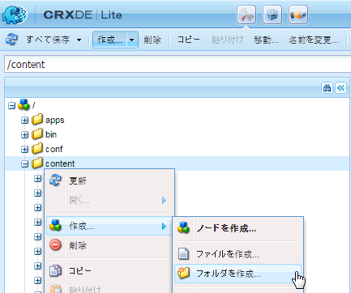
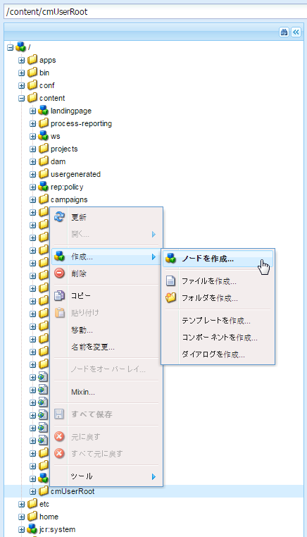
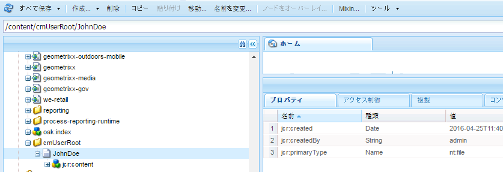
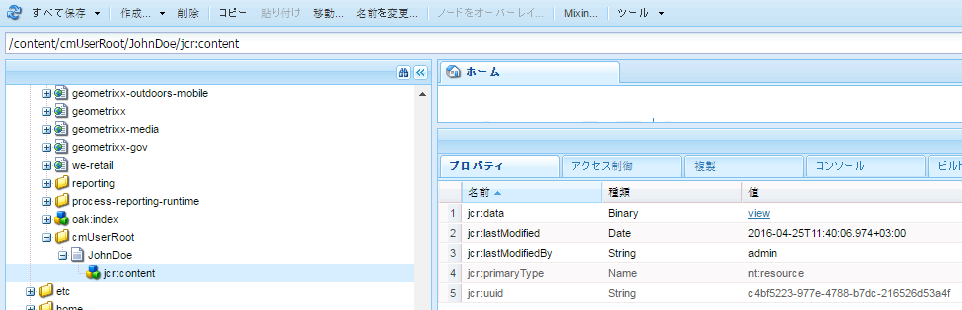
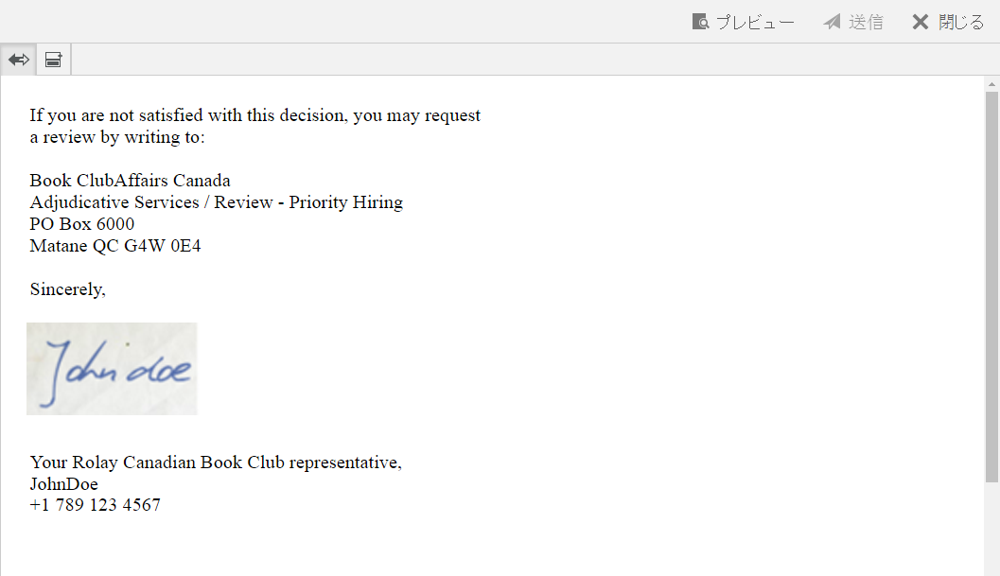

# エージェント署名画像を管理{#manage-agent-signature-images}

## 概要 {#overview}

Correspondence Managementでは、レター内にエージェント署名を描画するために画像を使用することができます。エージェント署名画像を設定した後、レターの作成時に、送信者エージェントの署名としてエージェント署名画像をレンダリングできます。

agentSignatureImage DDE は算出された DDE として、エージェントの署名画像を表します。算出された DDE の式では、Expression Manager 構築ブロックにより公開された新しいカスタム関数を使用します。このカスタム関数は、agentID と agentFolder を入力パラメーターとして取得し、これらのパラメーターに基づき画像コンテンツを取得します。SystemContextシステムデータディクショナリは、Correspondence Managementのレターに、現在のシステムコンテキストの情報へのアクセスを提供します。 システムコンテキストには、現在ログイン中のユーザーとアクティブな設定パラメーターに関する情報が含まれます。

画像は、cmuserroot フォルダの下に追加することができます。In [Correspondence Management Configuration Properties](/help/forms/using/cm-configuration-properties.md), using the CM User Root property you can change the folder from where agent signature image is picked up.

agentFolder DDEの値は、Correspondence Management設定プロパティのCMUserRoot設定パラメーターから取得されます。 デフォルトでは、この設定パラメーターはCRXリポジトリの/content/cmUserRootを指します。 CMUserRoot設定の値は、「Configuration Properties」で変更できます。
また、デフォルトのカスタム関数を上書きして、ユーザー署名画像を取得するための独自のロジックを定義することもできます。

## エージェント署名画像を追加する {#adding-agent-signature-image}

1. エージェント署名画像の名前と、AEMのユーザ名が一致することを確認してください。（画像のファイル名に拡張子は不要です）。
1. CRXで、コンテンツフォルダ内に「`cmUserRoot`」フォルダを作成します。

   1. `https://'[server]:[port]'/crx/de` にアクセスします。必要に応じて、管理者としてログインします。

   1. 「**content**」フォルダーを右クリックし、「**作成**」／「**フォルダの作成**」を選択します。

      

   1. 「ファイルを作成」ダイアログで、フォルダ名を「`cmUserRoot`」と入力します。「**すべて保存**」をクリックします。

      >[!NOTE]
      >
      >デフォルトでは、AEM がエージェント署名画像を参照する際に cmUserRoot を開きます。You can, however, change it by editing the CM User Root property in the [Correspondence Management configuration properties](/help/forms/using/cm-configuration-properties.md).

1. Content Explorer で cmUserRoot フォルダに移動し、その中にエージェント署名画像を追加します。

   1. `https://'[server]:[port]'/crx/explorer/index.jsp` にアクセスします。必要に応じて、管理者としてログインします。
   1. 「**Content Explorer**」をクリックします。Content Explorerが新しいウィンドウで開きます。
   1. Content Explorerでユーザーのルートフォルダに移動し、それを選択します。**cmUserRoot** フォルダを右クリックし、「**新規ノード**」を選択します。

      

      新しいノードの行に以下のエントリを作成した後、緑色のチェックマークをクリックします。

      **名前：** JohnDoe（またはエージェント署名ファイルの名前）

      **タイプ：** nt:file

      Under the `cmUserRoot` folder, a new folder called `JohnDoe` (or the name you have given in the previous step) is created.

   1. 新しく作成したフォルダをクリックします（ここでは「`JohnDoe`」）。フォルダの内容がグレー表示で表示されます。

   1. Double-click the **jcr:content** property, set its type as **nt:resource**, and then click the green check mark to save the entry.

      プロパティが表示されていない場合は、まず、名前が「jcr:content」のプロパティを作成します。

      

      jcr:content サブプロパティの中に、暗く表示されている jcr:data を探します。jcr:data をダブルクリックします。プロパティが編集可能になり、「ファイルを選択」ボタンがエントリに表示されます。 Click **Choose File** and select the image file you want to use as a logo. 画像ファイルには拡張子は不要です。

      
   「**すべて保存**」をクリックします。

1. レターの中で使用した XDP\layout について、署名画像を描画するための画像フィールドが左下（または、署名を描画する他の適切な場所）に表示されていることを確認してください。
1. 通信の作成時は、以下の手順に従って、署名画像を配置するための画像フィールドを「データ」タブから選択します。

   1. 右ペインの「リンケージタイプ」ポップアップメニューから「システム」を選択します。

   1. SystemContext DD 用のデータ要素パネルのリストから、agentSignatureImage DDE を選択します。

   1. レターを保存します。

1. レターのプレビューを描画すると、レイアウトに応じて配置された画像フィールド内に署名が表示されます。

   

