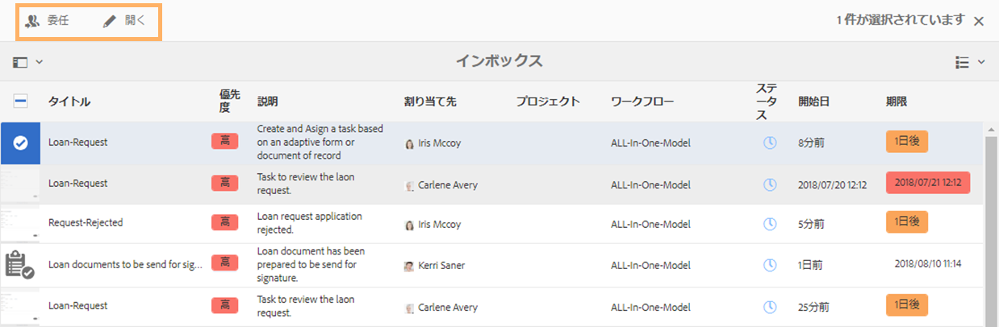
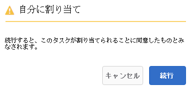
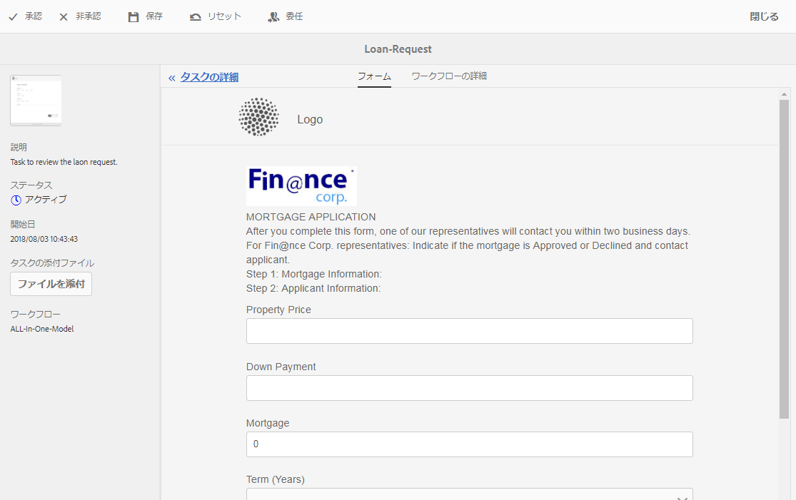
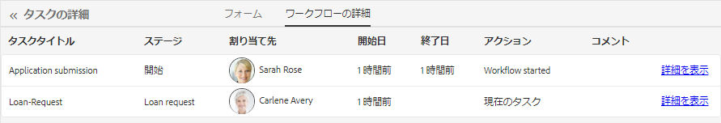

# AEM インボックスでの Forms アプリケーションとタスクの管理{#manage-forms-applications-and-tasks-in-aem-inbox}

Forms 中心のワークフローを起動またはトリガする多くの方法の 1 つに、AEM インボックスのアプリケーションから行う方法があります。Forms ワークフローを使用できるようにするためのワークフローアプリケーションを、インボックス内のアプリケーションとして作成する必要があります。For more information about workflow application and other ways to launch Forms workflows, see [Launch a Forms-centric workflow on OSGi](../../forms/using/aem-forms-workflow.md#launch).

さらに、AEM インボックスは、Forms ワークフローを含む様々な AEM コンポーネントの通知やタスクを統合します。タスクの割り当て手順を含む Forms ワークフローがトリガされると、関連するアプリケーションが担当者のインボックスにタスクとしてリストされます。担当者がグループの場合、そのタスクは、個人が要求するまで、またはタスクを委任するまで、グループのメンバー全員のインボックスに表示されます。

インボックスのユーザーインターフェースでは、リストビューまたはカレンダービューでタスクを表示できます。ビューの設定も構成することができます。様々なパラメーターに基づいて、タスクをフィルターすることができます。For more information about view and filters, see [Your Inbox](/help/sites-authoring/inbox.md).

要約すると、インボックスでは新しいアプリケーションを作成して割り当てタスクを管理することができます。

>[!NOTE]
>
>AEM インボックスを使用するには、ワークフローユーザーグループのメンバーである必要があります。

## アプリケーションの作成 {#create-application}

1. Go to AEM Inbox at https://&#39;[server]:[port]&#39;/aem/inbox.
1. In the Inbox UI, tap **[!UICONTROL Create > Application]**. [アプリの選択]ページが表示されます。
1. Select an application and click **[!UICONTROL Create]**. アプリに関連付けられたアダプティブフォームが開きます。 アダプティブフォームの情報を入力し、「 **[!UICONTROL 送信]**」をタップします。 関連するワークフローが起動し、担当者のインボックスにタスクが作成されます。

## タスクの管理 {#manage-tasks}

Forms ワークフローがトリガして、自分が担当者であるまたは担当者グループの一部である場合には、インボックスにタスクが表示されます。インボックス内のタスクについて、タスクの詳細を表示し使用可能なアクションを実行することができます。

### タスクの要求または委任 {#claim-or-delegate-tasks}

グループに割り当てられたタスクは、グループのメンバー全員のインボックスに表示されます。グループのメンバーなら誰でも、タスクを要求したり他のグループメンバーに委任することができます。この作業を行うには：

1. タスクのサムネイルをタップして選択します。タスクを開く、または委任するオプションが上部に表示されます。

   

1. 次のいずれかの操作をおこないます。

   * タスクを委任するには、「**[!UICONTROL 委任]**」をタップします。項目を委任ダイアログが開きます。Select a user, optionally add a comment, and tap **[!UICONTROL OK]**.

   

   * タスクを要求するには、「**[!UICONTROL 開く]**」をタップします。自分に割り当てダイアログが開きます。「**[!UICONTROL 続行]**」をタップして、タスクを要求します。要求したタスクが、自分が担当者としてインボックスに表示されます。

   

### タスクの詳細の表示とアクションの実行 {#view-details-and-perform-actions-on-tasks}

タスクを開くと、タスクの詳細を表示して使用可能なアクションを実行することができます。タスクで使用可能なアクションは、関連する Forms ワークフローのタスクの割り当て手順で定義できます。

1. タスクのサムネイルをタップして選択します。選択したタスクを開く、または委任するオプションが上部に表示されます。
1. 「**開く**」をタップしてタスクの詳細を表示し、アクションを実行します。タスクの詳細表示が開きます。このビューでは、タスクの詳細を表示しアクションを実行することができます。

   >[!NOTE]
   >
   >タスクがグループに割り当てられている場合、詳細表示を開くにはタスクを要求する必要があります。



タスクの詳細表示は、次のセクションで構成されます。

* タスクの詳細
* フォーム
* ワークフローの詳細
* アクションツールバー

#### タスクの詳細 {#task-details}

タスクの詳細セクションは、タスクについての情報を表示します。The information displayed depends on the configuration settings of the [Assign task step](/help/sites-developing/workflows-step-ref.md) in the workflow. 上記の例では、タスクの説明、状態、開始日、および使用されているワークフローが表示されています。また、タスクにファイルを添付することもできます。

#### フォーム {#form}

メインコンテンツ領域の「フォーム」タブには、送信されたフォームと、フィールドレベルの添付ファイル（存在する場合）が表示されます。

#### ワークフローの詳細 {#workflow-details}

上部にある「ワークフローの詳細」タブには、ワークフロー全体を通してタスクの進捗が表示されます。これは、タスクの完了、現在、保留の段階を示します。The stages for a workflow are defined in the [Assign task step](/help/sites-developing/workflows-step-ref.md) of the associated workflow.

さらに、タブはワークフローの完了した各段階ごとのタスクの履歴を表示します。完了した段階の「**[!UICONTROL 詳細を表示]**」をタップして、その段階の詳細を知ることができます。タスクに関するコメント、フォーム、タスクの添付ファイル、状態、開始日、終了日などが表示されます。


#### アクションツールバー {#actions-toolbar}

アクションツールバーは、タスクの使用可能なすべてのオプションを表示します。デフォルトのアクションは保存、リセット、委任です。その他のアクションは、[タスクの割り当て手順](/help/sites-developing/workflows-step-ref.md)で設定されます。上記の例では、ワークフローに承認と拒否が設定されています。

タスクに対してアクションを実行すると、ワークフローの次の段階に進みます。

### 完了したタスクの表示 {#view-completed-tasks}

AEM インボックスでは、アクティブなタスクのみ表示されます。完了したタスクはリストには表示されません。ただし、インボックスフィルターを使用して、いくつかのパラメーター（タスクのタイプ、状態、開始日と終了日など）に基づいてタスクをフィルターすることができます。完了したタスクを表示するには：

1. In AEM Inbox, tap  to open the filter selector.
1. 「**[!UICONTROL タスクステータス]**」アコーディオンをタップし、「**[!UICONTROL 完了]**」を選択します。完了されたすべてのタスクが表示されます。

   

1. Tap to select a task and click **[!UICONTROL Open]**.

タスクが開き、タスクに関連するドキュメントまたはアダプティブフォームが表示されます。For adaptive form, the task displays the read-only adaptive form or its PDF document of record as configured in the Form/Document tab of the [Assign Task workflow step](/help/sites-developing/workflows-step-ref.md).

タスクの詳細セクションでは、実行済みアクション、タスクのステータス、開始日、終了日が表示されます。


The **[!UICONTROL Workflow Details]** tab shows each step of the workflow. Tap **[!UICONTROL View details]** for a step for detailed information.



## トラブルシューティング {#troubleshooting-workflows}

### AEM受信トレイのAEMワークフローに関連する項目を表示できません {#unable-to-see-aem-worklow-items}

ワークフローモデルの所有者は、AEM受信トレイのAEMワークフローに関連する項目を表示できません。 この問題を解決するには、次に示すインデックスをAEMリポジトリに追加し、インデックスを再構築します。

1. インデックスを追加するには、次のいずれかの方法を使用します。

   * CRX DEで次のノードを、次の表に示す各プロパティ `/oak:index/workflowDataLucene/indexRules/granite:InboxItem/properties` を使用して、で作成します。

      | Node | プロパティ | 型 |
      |---|---|---|
      | sharedWith | sharedWith | STRING |
      | ロックしている | ロックしている | BOOLEAN |
      | returned | returned | BOOLEAN |
      | allowInboxSharing | allowInboxSharing | BOOLEAN |
      | allowExplicitSharing | allowExplicitSharing | BOOLEAN |


   * AEMパッケージを使用してインデックスを展開します。 AEM [アーキタイプ](https://docs.adobe.com/content/help/ja-JP/experience-manager-core-components/using/developing/archetype) プロジェクトを使用して、デプロイ可能なAEMパッケージを作成できます。 次のサンプルコードを使用して、AEM Archetypeプロジェクトにインデックスを追加します。

   ```Java
      .property("sharedWith", "sharedWith").type(TYPENAME_STRING).propertyIndex()
      .property("locked", "locked").type(TYPENAME_BOOLEAN).propertyIndex()
      .property("returned", "returned").type(TYPENAME_BOOLEAN).propertyIndex()
      .property("allowInboxSharing", "allowInboxSharing").type(TYPENAME_BOOLEAN).propertyIndex()
      .property("allowExplicitSharing", "allowExplicitSharing").type(TYPENAME_BOOLEAN).propertyIndex()
   ```

1. [プロパティインデックスを作成し、trueに設定します](https://docs.adobe.com/content/help/en/experience-manager-65/deploying/deploying/queries-and-indexing.html#the-property-index)。

1. CRX DEでインデックスを設定した後、またはパッケージを介してデプロイした後、リポジトリの [インデックスを再作成します](https://helpx.adobe.com/in/experience-manager/kb/HowToCheckLuceneIndex.html#Completelyrebuildtheindex)。

https://docs.adobe.com/content/help/en/experience-manager-65/deploying/deploying/queries-and-indexing.html
