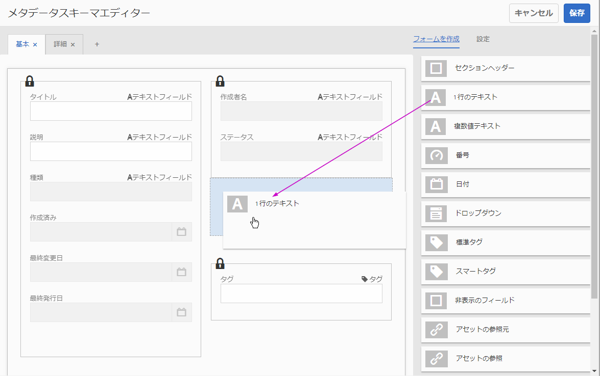

# フォームメタデータの管理{#manage-form-metadata}

## 概要  {#overview-nbsp}

メタデータを使用すると、アセットの分類および編成を容易に行うことができ、特定のアセットを検索しやすくなります。

AEM Forms では、デフォルトで各アセットタイプに対してメタデータの定義済みセットが提供されます。デフォルトのメタデータに加え、各アセットタイプにカスタムメタデータを追加することができます。AEM Forms では、フォーム用のメタデータすべてを効率よく作成、管理およびやり取りを行う適切な方法も提供されます。

開発者またはサイト所有者の場合、フォームポータル、AEM Forms のエンドユーザーインターフェイスをカスタマイズして、組織で使用しているメタデータを反映させることができます。フォームポータルについて詳しくは、[ポータルでのフォーム発行の概要](../../forms/using/introduction-publishing-forms.md)を参照してください。

## Metadata in AEM Forms {#metadata-in-aem-forms}

AEM Forms では、アセットに関連付けられたメタデータのプロパティのリストはタイプによって異なります。また、任意のカスタムメタデータのプロパティを追加すると、カスタムメタデータが追加されたタイプのすべてのアセットに追加されます。

### Asset types {#asset-types}

次のアセットタイプは AEM Forms でサポートされます。

* フォームテンプレート（XFA フォーム）
* PDF のフォーム
* ドキュメント（非インタラクティブな PDF）
* アダプティブフォーム
* リソース
* XFS

#### Extensive list of metadata {#extensive-list-of-metadata}

次のリストは、AEM Forms でサポートされるメタデータのプロパティの広範なリストです。

<table>
 <tbody> 
  <tr> 
   <td><strong>プロパティ名</strong></td> 
   <td><strong>アセットタイプ</strong></td> 
   <td><strong>説明</strong>  </td> 
  </tr> 
  <tr> 
   <td>タイトル</td> 
   <td>リソース以外のすべて</td> 
   <td>フォームの名前を表示します。  </td> 
  </tr> 
  <tr> 
   <td>説明</td> 
   <td>リソース以外のすべて</td> 
   <td>フォームの説明。 ユーザーはこの値を指定できます。  </td> 
  </tr> 
  <tr> 
   <td>型</td> 
   <td>すべての </td> 
   <td>
アセットのタイプを指定する読み取り専用の値です。次のいずれかの値になります。
 
    <ul> 
     <li>フォームテンプレート</li> 
     <li>PDF フォーム、PDF フォーム（Acroform）、または PDF フォーム（署名済み）</li> 
     <li>ドキュメント、ドキュメント（署名付き）</li> 
     <li>アダプティブフォーム</li> 
     <li>Resource</li> 
    </ul> </td> 
  </tr> 
  <tr> 
   <td>作成日</td> 
   <td>すべての </td> 
   <td>アセット作成の時間を指定する読み取り専用の値です。</td> 
  </tr> 
  <tr> 
   <td>Last modification date</td> 
   <td>すべての </td> 
   <td>アセットが最後に変更された時間を指定する読み取り専用の値です。</td> 
  </tr> 
  <tr> 
   <td>作成者</td> 
   <td>リソース以外のすべて</td> 
   <td>
フォームタイプに基づいて自動で算出される読み取り専用の値です。
 
    <ul> 
     <li>PDF/フォームテンプレート/ドキュメント — アップロードされたバイナリファイルから取得しました。</li> 
     <li>アダプティブフォーム — フォーム作成時にログインしたユーザー。</li> 
    </ul> </td> 
  </tr> 
  <tr> 
   <td>ステータス</td> 
   <td>リソース以外のすべて</td> 
   <td>
 次のフォームの状態のいずれかを定義する読み取り専用の値です。
 
    <ul> 
     <li>値なし：フォームが一度も発行されていない場合。</li> 
     <li>発行済み：フォームが発行されたとき。</li> 
     <li>変更済み：一度発行された後にフォームが変更されたとき。</li> 
    </ul> </td> 
  </tr> 
  <tr> 
   <td>Last publish date</td> 
   <td>リソース以外のすべて</td> 
   <td>フォームが最後に発行されたときの時間を指定する読み取り専用の値です。</td> 
  </tr> 
  <tr> 
   <td>Publish on/off time</td> 
   <td>リソース以外のすべて</td> 
   <td>
フォームが自動で発行または未発行になるようにスケジュールされる時間です。ユーザーはこの値をメタデータの編集で設定します。
 
    <ul> 
     <li>Publish On および Publish Off のどちらの時間も、現在の日付よりも後の日付にする必要があります。 </li> 
     <li>Publish Off Time は、Publish On Time よりも後の時間でなければなりません. </li> 
    </ul> </td> 
  </tr> 
  <tr> 
   <td>送信 URL</td> 
   <td>
フォームテンプレート
 
PDF フォーム
 </td> 
   <td>
フォームデータをサーブレットに送信するためにユーザー指定の URL を設定する方法です。
 
送信 URL は、次の方法（好ましい順）のいずれかを使用して設定できます。
 
    <ul> 
     <li>AEM Forms Designer で XFA フォームを作成しているときに、「HTTP 送信」ボタンを使用して、送信 URL をフォームテンプレートに直接指定します。</li> 
     <li>AEM Forms の UI で、メタデータのプロパティ編集時にフォームを選択し、送信 URL を指定します。</li> 
     <li>フォームポータルで、検索とリスターコンポーネントを編集し、「フォームリンク」タブで送信 URL を指定します。</li> 
    </ul> </td> 
  </tr> 
  <tr> 
   <td>HTML render profile</td> 
   <td>フォームテンプレート</td> 
   <td>HTML 形式のフォームテンプレートのレンダリング中に使用される HTML レンダリングプロファイル。</td> 
  </tr> 
  <tr> 
   <td>Render format</td> 
   <td>
フォームテンプレート
 
アダプティブフォーム
 </td> 
   <td>
このオプションを使用すると、ユーザーはフォームが発行されるときのフォームのレンダリング形式を指定できます。
 
    <ul> 
     <li>HTML</li> 
     <li>PDF</li> 
     <li>両方</li> 
    </ul> 
このオプションは、エンドユーザーに表示されるフォームポータルでのみフォームのレンダリング形式を制限する場合に使用されます。
 </td> 
  </tr> 
  <tr> 
   <td>タグ</td> 
   <td>リソース以外のすべて</td> 
   <td>検索をすばやく容易に行うためにフォームに関連付けられたラベルです。</td> 
  </tr> 
  <tr> 
   <td>参照</td> 
   <td>
アダプティブフォーム
 
フォームテンプレート
 
Resource
 </td> 
   <td>
このフォームが関連付けられているアセット（その他のフォームまたはリソース）のリストです。これらのアセットは、次の 2 つに分類されます。
 
    <ul> 
     <li>参照先：現在のフォームが参照しているアセット。</li> 
     <li>参照元：現在のアセットを参照しているアセット。</li> 
    </ul> 
これらのアセットはリンクとして表示され、リンクをクリックすると、そのメタデータに直接アクセスできます。   
 </td> 
  </tr> 
  <tr> 
   <td>Form model (XDP/XSD) selection</td> 
   <td>アダプティブフォーム</td> 
   <td>
アダプティブフォームのオーサリング中に使用されるフォームモデルを指定します。このプロパティは次の値を含めることができます。
 
    <ul> 
     <li>Form template：リポジトリに存在するテンプレートの中からフォームテンプレートが選択されます。この値は更新できます。</li> 
     <li>XML schema：XSD ファイルがアップロードされます。この値は更新できます。</li> 
     <li>なし</li> 
    </ul> 
    

      フォームモデルを選択すると、更新できますが削除できません。 
    
 </td> 
  </tr> 
 </tbody> 
</table>

## View form metadata {#view-form-metadata}

アセットには既存のプロパティの値が含まれ、これは読み取り専用モードで表示できます。このメタデータは、フォームのアプロード時またはフォーム作成時に生成されます。

1. メタデータを表示するアセットの場所に移動します。

1. 次のいずれかの方法を使用してプロパティページを開きます。

   1. クイックアクションの表示プロパティ  アイコンをクリックします。

      >[!NOTE]
      >
      >クイックアクションは、マウスのカーソルを合わせたときにサムネール上に表示されるアクション項目です。

   1. Select the form and click the View Properties  icon that appears in the toolbar.
   1. 選択モードではない場合にフォームのサムネールをクリックして、フォーム詳細ページに移動します。Now, click the  eye icon on the upper right, and then click Properties in the list beneath it.

1. プロパティページが開き、いくつかの値を保持するメタデータのプロパティのみを含むスキーマが表示されます。

   プロパティページには、2 つのアクションアイコンが表示されるツールバーがあります。

   * 編集：  メタデータプロパティの値の編集
   * View:  Navigate to the form details page, which opens the form in the preview mode.

   コンテンツ部分は 2 つのパートに分かれています。

   * 左のパネルにはフォームのサムネールが含まれます
   * 右のパネルには、様々なタブに配布される、読み取り専用モードのメタデータプロパティが含まれます。

## Add/update form metadata values {#add-update-form-metadata-values}

既存のメタデータプロパティの値を編集したり、新しい値を既存のメタデータプロパティのフィールドに追加する（例えば、メタデータフィールドが空白の場合など）ことができます。

### メタデータプロパティの値の更新 {#update-metadata-property-values}

1. 前のセクションで説明した手順に従って、選択したフォームの既存のメタデータを表示するプロパティページを開きます。

1. From the toolbar, click the edit icon  to change the mode of the page from read-only to read/write.

1. 編集可能な入力フィールドとスタティックテキストの組み合わせを含むスキーマを保持するプロパティページが開きます。 

1. スタティックテキストに表示されるプロパティは、編集できないプロパティです。

1. 別のタブに移動して、メタデータプロパティが格納されている入力フィールドを検索します。 

   このページのツールバーには、ビューモードのツールバーとは異なる 2 つのアイコンが表示されます。

   * Cancel:  Cancel any changes made to metadata property values so far
   * Done:  Save all the changes made to metadata property values so far

   どちらのアクションでも、更新済みの値を含むプロパティページを読み取り専用モードに戻すようユーザーは指示されます。

### Update the form thumbnail {#update-the-form-thumbnail}

プロパティページの左のパネルには、フォームのサムネイルが表示されます。デフォルトでは、表示されるサムネイルはフォーム（アダプティブフォーム）作成時またはフォームアップロード時に生成されたサムネイルです。

すべてのフォームタイプには、「**[!UICONTROL 画像のアップロード]**」をクリックして画像をアップロードするオプション、およびローカルディレクトリから画像ファイルを参照するオプションがあります。デフォルトのサムネイルの代わりに、選択された画像がサムネイルとして使用されます。

アダプティブフォームでは、ユーザーが現在のアダプティブフォームプレビューのスナップショットとしてサムネイルを生成することができる追加機能が提供されています。AEM Forms はアダプティブフォームのオーサリングもサポートするため、アダプティブフォームを変更するたびにアダプティブフォームのプレビューが変更される可能性があります。サムネイルを生成するこの機能により、現在のプレビューステータスに基づいてアダプティブフォーム用に新規サムネールを取得できます。「**[!UICONTROL プレビューを生成]**」をクリックし、このアクションを実行します。

>[!NOTE]
>
>* サムネイルには四角形の画像を使用します。四角形以外の画像を使用し、サムネイルを一覧表示で表示すると、サムネイルはクリップされて表示されます。
>* 新しい画像がアップロードまたは生成されると、サムネイルはこの画像に置き換えられ、以前の画像にリセットすることはできません。

>

## Add custom metadata {#add-custom-metadata}

初期設定の状態で提供されているメタデータとは別に、AEM Forms は新規のカスタムメタデータをサポートします。

A tool (Metadata Schema Editor) is provided to define the schema for the metadata layout; that is, the layout of what appears in the **[!UICONTROL Properties]** page of a form. メタデータスキーマエディターを使用して、アセットのカスタムスキーマを追加または変更できます。

AEM Forms は、このツールでサポート対象のフォームタイプのメタデータスキーマを公開します。この方法で、これらのスキーマにアクセスし、メタデータスキーマエディターで提供される機能を使用してカスタムプロパティを追加できます。

### Navigate the metadata schema editor {#navigate-the-metadata-schema-editor}

1. **[!UICONTROL ツール／アセット／メタデータスキーマ]**&#x200B;に移動します。

1. 一覧表示されたスキーマフォームで&#x200B;**[!UICONTROL 「]**&#x200B;フォーム」をクリックします。

1. 開いたリストで、カスタムメタデータを追加するアセットタイプをクリックします。

   >[!NOTE]
   >
   >これらのスキーマには初期設定で提供されるメタデータプロパティが含まれていますが、機能的な問題の発生を防ぐため、変更および編集（チェックボックスの選択およびツールバーで編集をクリック）することはできません。

1. 任意のアセットタイプをクリックすると、`extendedmetadata` オプションを含むリストが開きます。このスキーマを編集します。

1. Select the checkbox beside `extendedmetadata` and then click the edit  icon that appears in the toolbar.

1. 選択されたアセットタイプ（この場合はアダプティブフォーム）のメタデータスキーマエディターまたはフォームビルダーが、AEM Forms で開きます。

   

   メタデータエディター

   1. 左のパネルにはフィールドが配置されるタブ付きセクションが含まれ、左のパネルで選択したフィールドの使用可能なすべての UI コンポーネントとプロパティが右のパネルに表示されます。

   1. ロックされたセクションは編集することができず、初期設定で提供されるすべてのメタデータプロパティのフィールドが含まれます。

   1. + 記号をクリックして、追加のタブを追加できます。 

   1. 「**[!UICONTROL フォームを作成]**」セクションからスキーマページにフィールドコンポーネントをドラッグして、必要なタイプのカスタムフィールドを追加できます。
   1. このフィールドの仕様は、フィールドをクリックした後に「**[!UICONTROL 設定]**」セクションの下に提供されます。 

### Add custom metadata property in schema editor {#add-custom-metadata-property-in-schema-editor}

1. カスタムプロパティを追加する既存または新規のタブに移動します。 

1. 必要なタイプのコンポーネントを「**[!UICONTROL フォームをビルド]**」セクションから左のパネルにドラッグし、適切な場所に配置します。 

   >[!NOTE]
   >
   >ロックされたセクションは移動できませんが、空いている場所であればどこでもコンポーネントを配置できます。

1. ドラッグしたコンポーネントをクリックします。右のパネルに開いた「設定」タブで、次のフィールドに情報を入力します。

   1. スキーマに配置されるフィールドの上に表示される名前に使用するフィールドラベルを指定します（例えば、部門など）
   1. プロパティにマッピングフィールドの下に、事前入力された値 **&#39;./jcr:content/metadata/default&#39;** が表示されます。‘**default**’ を、必要なプロパティ名に変更します。これは、crx リポジトリにプロパティを保存するために使用されます（例えば、 &#39;./jcr:content/metadata/department&#39;）。

      >[!NOTE]
      >
      >プレフィックス ‘./jcr:content/metadata/’ は、プロパティが保存されるパスを定義しているので、変更しないでください。
      >
      >また、リポジトリの同じ場所に 2 つ以上のプロパティの値が書き込まれるのを防ぐため、プロパティ名は一意にする必要があります。そのため、&#39;default&#39; の値は変更することをお勧めします。

   1. 要件に基づいてその他の設定を入力します。例えば、フィールドを必須フィールドにする場合は、必須オプションを選択します。 
   1. To delete a field you added, select the field and then click the delete  icon.

1. 必要に応じて、手順 1 から 3 に従って、別のプロパティを追加します。
1. すべての変更を行ったら、「**完了**」をクリックします。

   カスタムメタデータのプロパティを正常に追加しました。

AEM Forms のすべてのアダプティブフォームに、この追加のメタデータプロパティが含まれるようになりました。このプロパティは、プロパティページから編集できます。
