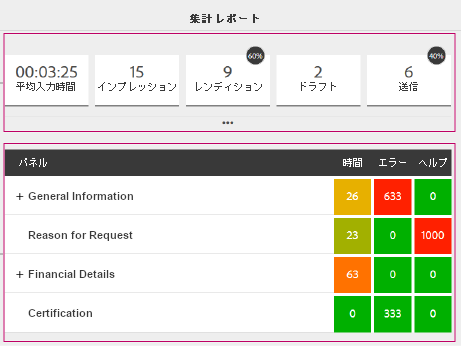

# フォームのコンバージョン率の測定と効率性の改善{#measure-and-improve-effectiveness-and-conversion-of-forms}

## 課題 {#the-challenge-br}

今日、組織はますます顧客の裁量を拡大し、複数チャンネルにまたがるデジタルのセルフサービス経由で取引を行うことを推奨しています。ただし、1 対 1 のフィードバックを受け取る仕組みがない場合、ビジネスがどれくらい成功しているのかを測定し、デジタルフォームを使用してカスタマーエクスペリエンスを改善し、コンバージョン率を上げるのは難しい課題になります。

ROI を最大化するには、顧客がサービスをどのように利用しているのかをモニタリングし、デジタルフォームを使用してカスタマーエクスペリエンスを改善する必要があります。成功を測定して改善に向けた戦略を策定するには、組織は次のような疑問に答えられなければなりません。

* フォームを利用して取引を行った顧客の数は？
* 問題なく取引を完了した顧客の数は？
* フォームを使用しなかった顧客の数は？
* 顧客が困難を感じる問題箇所はどこか？
* どのような変更を施し、コンバージョンの向上のためには何をテストすべきか？

## ソリューション {#the-solution}

AEM Forms integrates with [Adobe Marketing Cloud](https://www.adobe.com/marketing-cloud.html) solutions - [Adobe Analytics](https://www.adobe.com/marketing-cloud/web-analytics.html) and [Adobe Target](https://www.adobe.com/marketing-cloud/testing-targeting.html) - that can help you monitor and analyze how your forms are performing and enable you to experiment and identify the experience that leads to better conversion rate.

## ワークフロー {#the-workflow}

ここでは、フォームのパフォーマンスを測定してコンバージョン率を上げる方法について説明します。

### 対象オーディエンス {#target-audience}

* マーケティング戦略と成功に向けて責任を負うビジネスユーザーおよびアナリスト
* インフラストラクチャ、構成済みソリューション、メンテナンスを担当する IT 責任者

### 関連する AEM Forms のコンポーネントおよび機能 {#aem-forms-components-and-features-involved}

* アダプティブフォーム
* Adobe Analytics との統合（顧客がアダプティブフォームをどのように利用しているかについて、情報の収集、整理、レポートを行う）
* Adobe Target との統合により、アダプティブフォームで A/B テストが可能

### 前提 {#assumptions}

* Adobe Marketing Cloud アカウントを所有し、Analytics および Taget ソリューションに登録済みであること。
* 顧客がアクセスできる発行済のアダプティブフォームがあること。

### ワークフロー手順 {#workflow-steps}

#### 手順 1：AEM Forms で Analytics および Target を設定  {#step-configure-analytics-and-target-in-aem-forms-br}

**Analytics の設定**

顧客がフォームをどのように利用しているかについて詳しく知るには、最初に AEM Forms で Analytics を設定する必要があります。以下の手順を実行します。

1. Adobe Analytics でのレポートスイートの作成
1. AEM でクラウドサービス設定の作成
1. AEM でクラウドサービスのフレームワーク作成
1. AEM で AEM Forms Analytics Configuration サービスを設定
1. AEM でフォームの Analytics を有効化

For detailed steps, see [Configuring analytics and reports for adaptive forms](../../forms/using/configure-analytics-forms-documents.md).

**Target の設定**

To create and run A/B tests for your adaptive forms, configure Target in AEM Forms as described in [Set up and integrate Target in AEM Forms](../../forms/using/ab-testing-adaptive-forms.md#p-set-up-and-integrate-target-in-aem-forms-p).

#### 手順 2：分析レポートの表示 {#step-view-analytics-report-br}

Analytics が有効になっているフォームに顧客がアクセスして操作を実行すると、その操作に関する情報が、高度な方法で保護された Analytics データベースに保存されます。データベースはクライアントごとにセグメント化され、安全な接続を通してアクセスすることができます。

Analytics が有効になっているフォームと分析データについて、AEM でレポートを表示することができます。レポートを表示するには：

1. AEM サーバーで、**フォーム／フォームとドキュメント**&#x200B;に移動します。
1. 分析レポートを表示するフォームを選択します。
1. Analytics レポートアイコンをクリックします。レポートが表示されます。

Analytics によってフォーム用に収集されてレポートされたデータポイントを確認してください。

**フォームの分析レポート**

アダプティブフォームの分析レポートでは以下のフォームレベルの KPI（キーパフォーマンスインジケーター）が取得されます。

* **平均記入時間**：フォームの記入にかかった平均時間
* **インプレッション数**：検索結果にフォームが表示された回数

* **レンディション**：フォームがレンダリングされた、または開かれた回数
* **ドラフト**：フォームがドラフトとして保存された回数

* **送信**：フォームが送信された回数
* **中止**：フォームが完了されずに中止された回数
* **訪問回数／送信回数**：訪問回数と送信回数の比率

加えて、フォームの各パネルに関する次の詳細を取得できます。

* **時間**：パネルとパネル内のフィールドに費やした平均時間（秒）

* **エラー**：フォームのレンダリング 1000 回ごとの、パネルとパネル内のフィールドでのエラー発生回数

* **ヘルプ**：フォームのレンダリング 1000 回ごとの、パネルとパネル内のフィールドでユーザーがコンテキスト内ヘルプにアクセスした回数

分析レポートの詳細については、「[AEM Forms の分析レポートの確認方法と詳細](../../forms/using/view-understand-aem-forms-analytics-reports.md)」を参照してください。

>[!NOTE]
>
>Adobe Marketing Cloud の Analytics アカウントで詳細なレポートを表示することにより、顧客がフォームをどのように利用しているかについて詳しく分析することができます。

#### 手順 3：データポイントの分析 {#step-analyze-data-points}

この手順では、分析レポート内のデータポイントを調べて、フォームのパフォーマンスを推測します。サクセス KPI の基準に満たないようであれば、データに基づいて仮定を立てて、問題の修正方法を検討することができます。次に例を示します。

* フォームの平均記入時間が予想を上回る場合、フォームが複雑で顧客にとって理解しにくいことが考えられます。または、フォームで標準的な用語が使われていない、長すぎるなどの問題が考えられます。この場合、フォームの構造とフィールドの単純化、デザインの見直し、長さの短縮、または標準的でないフォームフィールドへのヘルプ文章や例示の追加などで対応することが考えられます。
* フォームパネルで大半の顧客がヘルプにアクセスしていることをデータが示しているような場合は、記入する情報に関して分かりにくいことが明らかです。代替の用語を使用する、またはそのパネルに記入例やヘルプ説明を追加するなどの対応策が考えられます。
* フォームの中止または破棄率が予想を上回る場合は、フォームのレンダリング速度が遅い、顧客が誤ってフォームを表示させた、または複雑すぎるなどの原因が考えられます。この場合、検索結果に表示されるフォームの説明を最適化する、フォームを単純化する、フォームを最適化して読み込みを早くするなどの対応策が考えられます。

各種のデータポイントを分析して仮説を立てることができたら、フォーム内で必要な変更を行います。

#### 手順 4：分析と修正の検証 {#step-validate-your-analysis-and-fixes}

この手順では、フォーム内で行った変更内容を検証し、それらの変更がコンバージョン率に影響するかどうかを確認します。

**A/B テストの実行**

AEM Forms は Target と統合されているため、アダプティブフォームの A/B テストを作成できます。A/B テストでは、リアルタイムでランダムにフォームの異なるエクスペリエンスを顧客に提示することで、より良いエクスペリエンスとコンバージョンを知ることができます。他のエクスペリエンスより優れたコンバージョンを生じているエクスペリエンスのデータを発見できたら、そのエクスペリエンスを推奨結果として宣言することで、それをすべての顧客に表示されるデフォルトのエクスペリエンスにすることができます。

アダプティブフォームの A/B テストの作成方法について詳しくは、「[アダプティブフォームの A/B テスト](../../forms/using/ab-testing-adaptive-forms.md)」を参照してください。

## ベストプラクティス {#best-practices}

このワークフローを実行すれば真のベストプラクティスを見つけることができます。ベストプラクティスは個人の環境および要求ごとに固有のものです。ワークフローを通して知識を取得し、ベストプラクティスとしてドキュメント化しておきましょう。

フォームのデザインおよび A/B テストの実行時に、以下の推奨事項が挙げられます。

**フォームデザイン**

* フォームは単純で短く、簡単にナビゲーションできること。ナビゲーション用に方向指示キューを使用すること。
* フォームフィールドに標準的または一般的な用語を使用すること。
* ユーザーが間違いやすいところには、例示やヘルプなどでフィールドおよび入力必須箇所に説明を加えること。
* フォーム送信時のエラーを防止するために、ユーザーの入力を入力時に検証すること。
* デスクトップならびにモバイルデバイス用にレイアウトを最適化すること。
* 既知のユーザーの情報を自動入力すること。

**A/B テスト**

* A/B テストに先立って仮説を立て、成功指標を特定すること。
* 代替のエクスペリエンスにおいて最小のバリエーション（理想的にはバリエーション一つ）のみを試みて、コンバージョン率への影響度合を把握すること。
* 頻繁にテストを実施して非効率性を排除すること。

