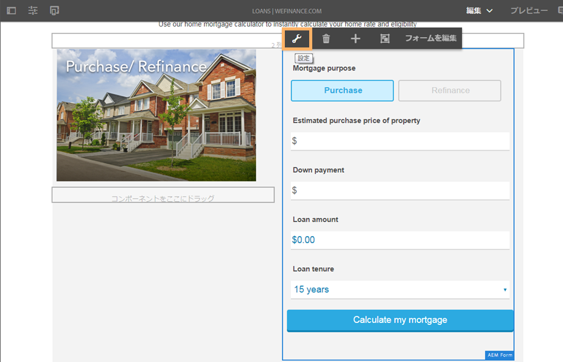

# We.Finance リファレンスサイトの住宅ローンワークフローのための Microsoft Dynamics 365 の設定 {#configure-microsoft-dynamics-for-the-home-mortgage-workflow-of-the-we-finance-reference-site}

We.Finance リファレンスサイトの住宅ローンワークフローでアダプティブフォームを通じて Microsoft Dynamics 365 を活用する方法について説明します

## 概要 {#overview}

Microsoft® Dynamics 365は、顧客アカウント、連絡先、リード、オポチュニティ、事例を作成および管理するエンタープライズソリューションを提供する顧客関係管理(CRM)およびエンタープライズリソース計画(ERP)ソフトウェアです。

AEM Forms provides a cloud service to integrate Dynamics 365 with [Forms Data Integration](/help/forms/using/data-integration.md) module. Microsoft® Dynamicsシナリオでホーム住宅ローンアプリケーションのチュートリアルを使用する前に、We.Financeリファレンスサイトで使用するMicrosoft® Dynamics 365を構成する必要があります。

## 前提条件 {#prerequisites}

Dynamics 365 のセットアップと設定に進む前に、以下を実行または入手している必要があります。

* AEM 6.3 Forms Service Pack 1 以降
* Microsoft® Dynamics 365 のアカウント
* Microsoft® Azure Active Directoryに登録されたDynamics 365サービスのアプリケーション
* 登録済みアプリケーションのクライアントIDとクライアントシークレット。

## サイトのホームページと住宅ローン計算機のリンク {#link-the-home-mortgage-calculator-with-your-site-home-page}

1. オーサーインスタンスで次のページに移動します。

   `https://[server]:[port]/editor.html/content/we-finance/global/en/loan-landing-page.html`

1. 住宅ローン計算機まで下にスクロールします。
1. 計算機の右側の列を反転させてから、タップしてポップアップメニューを表示します。ポップアップメニューで、「設定」をタップします。AEM Form コンテナを編集ダイアログが表示されます。

   

1. AEM Form コンテナを編集ダイアログで、アセットのパスを参照してから以下のパスにある home-mortgage-calculator を選択して「**確認**」をタップします。

   formsanddocuments/We.Finance/MS Dynamics/

   

1. 「**完了**」をタップします。
1. 編集したページを発行します。

   >[!NOTE]
   >
   >計算機フィールドと FDM の連結は、We.Finance 参照サイトのパッケージで事前に設定されています。連結を表示するには、オーサリングモードでフォームを開き、フィールドの連結の参照を確認します。

1. 住宅ローン申し込みの申請者の記録を保存するためにカスタムエンティティを作成するには、AEMFormsFSIRefsite_1_0.zip ソリューションパッケージを Microsoft® Dynamics インスタンスに読み込みします。

   1. パッケージを次の場所からダウンロードします。

      `https://'[server]:[port]'/content/aemforms-refsite-collaterals/we-finance/home-mortgage/ms-dynamics/AEMFormsFSIRefsite_1_0.zip`

   1. ソリューションパッケージを Microsoft® Dynamics インスタンスに読み込みます。In your Microsoft® Dynamics instance, go to **Settings** > **Solutions** and then tap **Import**.

1. refsite で使用する連絡先の詳細を設定するには、Sarah Rose Contact.CSV パッケージを Microsoft® Dynamics インスタンスにインポートします。

   1. パッケージを次の場所からダウンロードします。

      `https://'[server]:[port]'/content/aemforms-refsite-collaterals/we-finance/home-mortgage/ms-dynamics/Sarah%20Rose%20Contact.csv`

   1. パッケージを Microsoft® Dynamics インスタンスにインポートします。In your Microsoft® Dynamics instance, go to **Sales** > **Contacts** and then tap **Import Data**.

