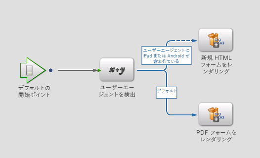
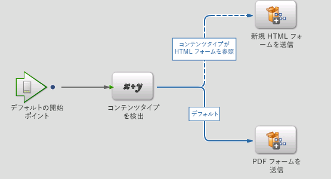

# 新しいレンダリングと送信サービス{#new-render-and-submit-service}

## 概要 {#introduction}

Workbench で `AssignTask` 操作を定義する場合は、特定のフォーム（XDP または PDF フォーム）を指定します。また、アクションプロファイル経由で一連のレンダリングと送信サービスを指定します。

XDP は、PDF フォームまたは HTML フォームとしてレンダリングすることができます。新しい機能により、以下のことが可能です。

* XDP フォームを HTML としてレンダリングして送信する
* XDP フォームをデスクトップで PDF として、およびモバイルデバイス（iPad など）で HTML としてレンダリングして送信する

### 新しい HTML フォームサービス {#new-html-forms-service}

新しい HTML フォームサービスでは、フォームの新しい機能を活用して HTML としての XDP フォームのレンダリングをサポートします。新しい HTML フォームサービスでは以下のメソッドを表示します。

```java
/*
 * Generates a URL (for the HTML Form) to be passed to client, given a TaskContext.
 * The output of this API is something like this - /lc/content/xfaforms/profiles/default.ws.html?ContentRoot=repository://Applications/MyApplication/MyFolder&template=MyForm.xdp
 * @param taskContext task context
 * @param profileName Forms servlet URL.
 * @return form URL string
 */
public String generateFormURL(TaskContext taskContext, String profileName);

/*
 * Render the XDP Form as HTML. Can be used directly for updating the runtimeMap in render.
 * It adds the following keys to the map -
 * hint:new html form = true
 * newHTMLFormURL = the URL returned after calling 'generateFormURL' API.
 * @param TaskContext taskContext
 * @param profileName Forms servlet URL.
 * @param runtimeMap runtime map<string,object> associated with form rendering.
 * return runtimeMap
 */
public Map<String, Object> renderHTMLForm (TaskContext taskContext, String profileName, Map<String,Object> runtimeMap);
```

モバイルフォームプロファイルについて詳しくは、「[カスタムプロファイルの作成](/help/forms/using/custom-profile.md)」を参照してください。

## 新しい HTML フォームのレンダリングと送信プロセス  {#new-html-form-render-amp-submit-processes}

各「タスクの割り当て」操作で、フォームでレンダリングと送信プロセスを指定します。カスタム処理ができるように、これらのプロセスは TaskManager `renderForm` および `submitForm` API によって呼び出されます。新しい HTML フォームのためのこれらのプロセスのセマンティック：

### 新しい HTML フォームのレンダリング  {#render-a-new-html-form}

すべてのレンダリングプロセスと同様に、HTML をレンダリングするための新しいプロセスには以下の I/O パラメータがあります。

必要情報 - `taskContext`

出力 - `runtimeMap`

出力 - `outFormDoc`

このメソッドは、NewHTMLFormsService の `renderHTMLForm` API の正確な動作をシミュレーションします。これは、`generateFormURL` API を呼び出してフォームの HTML 表示の URL を取得します。その後、以下のキーまたは値で runtimeMap を入力します。

new html form = true

newHTMLFormURL = `generateFormURL` API を呼び出した後で返された URL

### 新しい HTML フォームの送信 {#submit-a-new-html-form}

この新しい HTML フォームを送信するプロセスには、以下の I/O パラメータと連携します。

必要情報 - `taskContext`

出力 - `runtimeMap`

出力 - `outputDocument`

プロセスは、`outputDocument`を`taskContext`から取得した`inputDocument`に設定します。

## デフォルトのレンダリングまたは送信プロセス、およびアクションプロファイル {#default-render-or-submit-processes-and-action-profiles}

デフォルトのレンダリングと送信サービスにより、デスクトップで PDF およびモバイルデバイス（iPad）で HTML をレンダリングするためのサポートが可能です。

### デフォルトのレンダリングフォーム  {#default-render-form}

このプロセスでは、XDP フォームを複数のプラットフォームにシームレスにレンダリングします。プロセスは、`taskContext` からユーザーエージェントを取得し、データを使用して HTML または PDF のいずれかをレンダリングするプロセスを呼び出します。



### デフォルトの送信フォーム {#default-submit-form}

このプロセスでは、XDP フォームを複数のプラットフォームにシームレスに送信します。`taskContext` からユーザーエージェントを取得し、データを使用して HTML または PDF のいずれかを送信するプロセスを呼び出します。



## モバイルフォームのレンダリングの PDF から HTML への切り替え {#switch-the-rendering-of-mobile-forms-from-pdf-to-html}

Adobe Acrobat および Adobe Acrobat Reader のプラグインを含め、ブラウザーは NPAPI ベースのプラグインを徐々にサポートしなくなっています。モバイルフォームのレンダリングを PDF から HTML に変更するには、次の手順を実行します。

1. 有効なユーザーとして Workbench にログインします。
1. 「**ファイル**/**アプリケーションの取得**」を選択します。

   Get Applications ダイアログが表示されます。

1. モバイルフォームのレンダリングを変更するアプリケーションを選択し、「**OK**」をクリックします。
1. レンダリングを変更する対象のプロセスを開きます。
1. 対象のスタートポイント／タスクを開き、「Presentation &amp; Data」セクションに移動して、「**Manage Action Profiles**」をクリックします。

   アクションプロファイルの管理ダイアログが表示されます。
1. デフォルトのレンダリングプロファイル設定をPDFからHTMLに変更し、「**OK**」をクリックします。
1. プロセスをチェックインします。
1. 手順を繰り返して、他のプロセスのレンダリングを変更します。
1. 変更したプロセスに関連するアプリケーションをデプロイします。

### デフォルトのアクションプロファイル  {#default-action-profile}

デフォルトのアクションプロファイルは、XDP フォームを PDF としてレンダリングしていました。このビヘイビアーは、デフォルトのレンダリングフォームとデフォルトの送信フォームプロセスを使用するように変更されました。

アクションプロファイルに関するよくある質問の一部を次に示します。

 **どのレンダリング/送信プロセスを追加設定なしで使用できますか。**

* Guide のレンダリング（Guide は推奨されていません）
* Render Form Guide
* PDF フォームのレンダリング
* HTML フォームのレンダリング
* 新規 HTML フォームのレンダリング（新規）
* デフォルトのフォームのレンダリング（新規）

および同等の送信プロセス。

 **追加設定なしで使用できるアクションプロファイル**

XDP フォームの場合：

* デフォルト（新しい「デフォルトのレンダリング / 送信」プロセスを使用したレンダリング / 送信）

 **フォームをデバイス上でHTMLに、デスクトップ上でPDFにレンダリングするには、プロセスデザイナーは何を行う必要がありますか？**

何も必要ありません。デフォルトのアクションプロファイルが自動的に選択されて、レンダリングのモードも同じく自動的に対処されます。

 **必要がありますか。**

ユーザーは、デフォルトプロファイルで HTML ラジオボタンを選択する必要があります。

 **デフォルトのアクションプロファイルの動作を変更すると、アップグレードに何らかの影響がありますか。**

はい。デフォルトのアクションプロファイルに関連付けられた以前のレンダリングと送信サービスは異なるため、それらは既存のフォームのカスタマイズとして処理されます。「**デフォルトに戻す**」をクリックすると、デフォルトのレンダリングサービスと送信サービスが代わりに設定されます。

既存のレンダリングまたは送信 PDF Form サービスを変更した場合またはカスタムサービス（たとえば custom1）を作成した場合、HTML レンダリングに対して同じ機能を使用したいとします。新しいレンダリングまたは送信サービス（custom2）を置き換えて、これらに同様のカスタマイズを適用する必要があります。そこで、レンダリングまたは送信の custom1 の代わりに、custom2 サービスを使用して XDP を開始するようにアクションプロファイルを変更します。

デバイス上では HTML、デスクトップ上では PDF にフォームをレンダリングする場合、プロセスデザイナーは何を行う必要がありますか？デバイス上では HTML、デスクトップ上では PDF にフォームをレンダリングする場合、プロセスデザイナーは何を行う必要がありますか？
