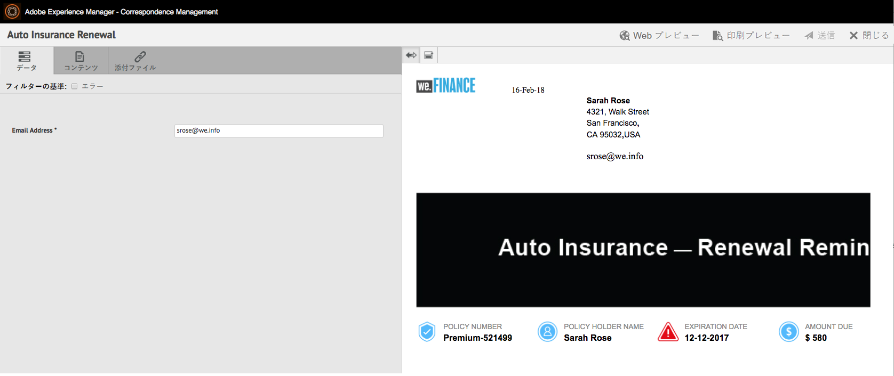
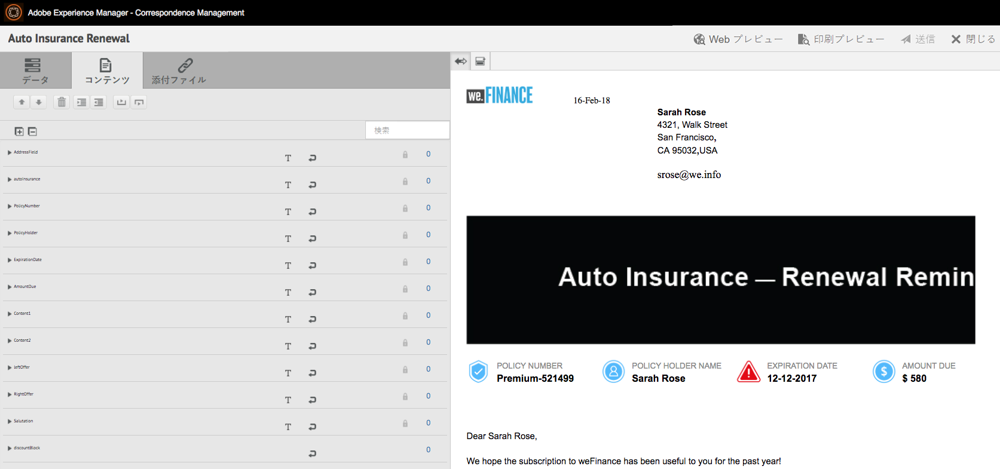
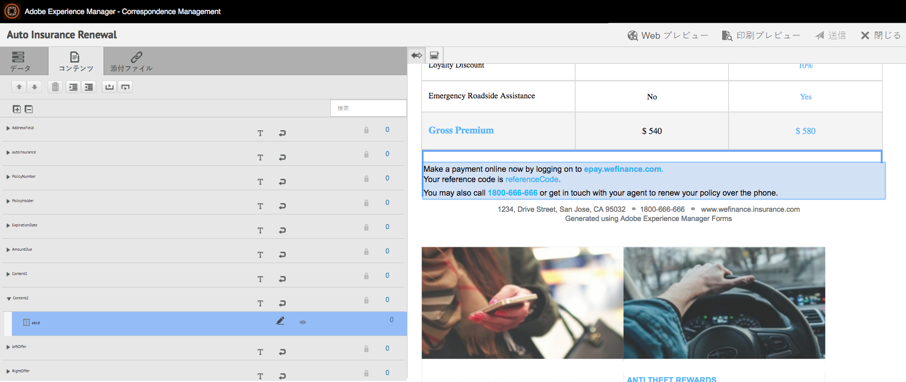
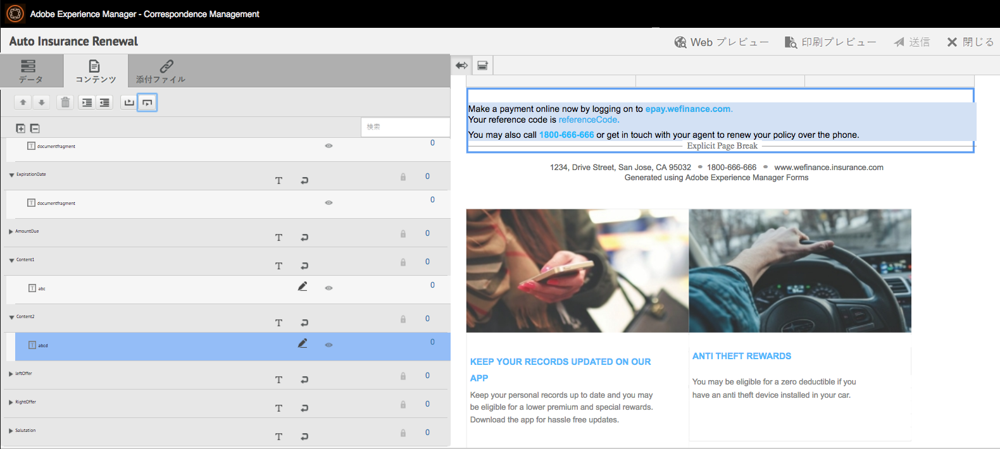
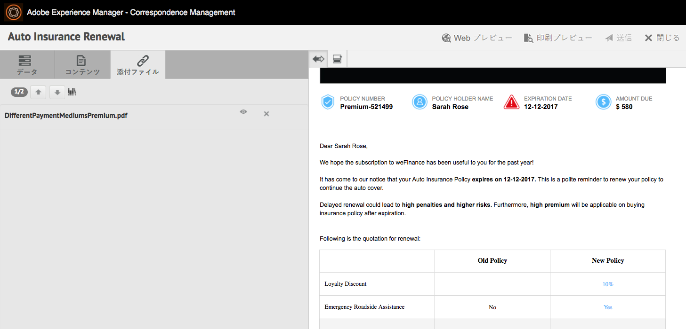
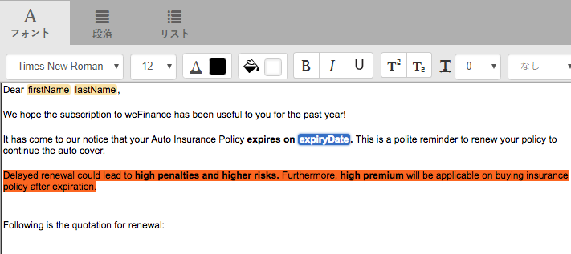
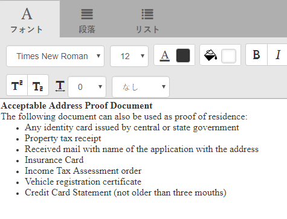
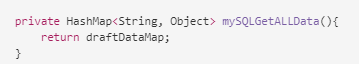

# エージェント UI を使用してインタラクティブ通信の準備と送信を行う {#prepare-and-send-interactive-communication-using-the-agent-ui}

エージェント UI を使用してインタラクティブ通信の準備を行い、後処理用として送信することができます。エージェントは、許可設定に基づいて必要な変更を行い、電子メールの送信や印刷出力などの後処理用としてインタラクティブ通信を送信します。

## 概要 {#overview}

対話型通信の作成後、エージェントはエージェントUIで対話型通信を開き、データを入力し、コンテンツと添付ファイルを管理することで、受信者固有のコピーを作成できます。 最後に、エージェントはインタラクティブ通信を後処理に送信できます。

エージェントUIを使用して対話型通信を準備する際、エージェントは、後処理に送信する前に、エージェントUIで対話型通信の次の側面を管理します。

* **データ**：エージェント UI の「データ」タブには、インタラクティブ通信内の変数とロックが解除されたフォームデータモデルプロパティが表示されます（エージェントを使用して編集できる変数とフォームデータモデルプロパティ）。これらの変数とプロパティは、インタラクティブ通信内のドキュメントフラグメントの編集時または作成時に生成されます。「データ」タブには、XDP テンプレートまたは印刷チャネルテンプレートに組み込まれているフィールドも表示されます。「Data」タブは、エージェントが編集可能なインタラクティブ通信の変数、フォームデータモデルのプロパティまたはフィールドがある場合にのみ表示されます。
* **コンテンツ**：エージェントにより、「コンテンツ」タブに表示される各種コンテンツ（インタラクティブ通信内のドキュメントフラグメントやコンテンツ変数など）が管理されます。エージェントは、ドキュメントフラグメントのプロパティで対話型通信を作成する際に、ドキュメントフラグメントに許可された変更を加えることができます。 また、ドキュメントフラグメントの並べ替え、追加/削除、改ページの追加も可能です（可能な場合）。
* **添付ファイル**:「添付ファイル」タブは、対話型通信に添付ファイルがある場合、またはエージェントがライブラリにアクセスできる場合にのみ、エージェントUIに表示されます。 エージェントは添付ファイルの変更や編集を許可される場合とできない場合があります。

## Prepare Interactive Communication using the Agent UI {#prepare-interactive-communication-using-the-agent-ui}

1. **[!UICONTROL フォーム]**／**[!UICONTROL フォームとドキュメント]**&#x200B;を選択します。
1. Select the appropriate Interactive Communication and tap **[!UICONTROL Open Agent UI]**.

   >[!NOTE]
   >
   >エージェントUIは、選択した対話型通信に印刷チャネルがある場合にのみ機能します。

   

   インタラクティブ通信のコンテンツとプロパティに基づいて、エージェント UI に、「データ」タブ、「コンテンツ」タブ、「添付ファイル」タブという 3 つのタブが表示されます。

   

   次に、データの入力、コンテンツの管理、添付ファイルの管理を行います。

### データの入力 {#enter-data}

1. 「データ」タブで、変数のデータ、フォームデータモデルのプロパティ、印刷テンプレート（XDP）のフィールドを、必要に応じて入力します。Fill up all the mandatory fields marked with an asterisk (&amp;ast;) to enable the **Submit** button.

   対話型通信プレビューのデータフィールドの値をタップすると、「データ」タブで対応するデータフィールドが強調表示されます。逆の場合も同様です。

### コンテンツを管理 {#manage-content}

「コンテンツ」タブで、インタラクティブ通信内のドキュメントフラグメントやコンテンツ変数などのコンテンツを管理します。

1. 「**[!UICONTROL コンテンツ]**」を選択します。対話型通信のコンテンツタブが表示されます。

   

1. 必要に応じて、「コンテンツ」タブでドキュメントフラグメントを編集します。コンテンツ階層の関連するフラグメントにフォーカスするには、インタラクティブ通信プレビューで関連する行または段落をタップするか、コンテンツ階層で直接フラグメントをタップします。

   例えば、以下のプレビュー画面で、「Make a payment online now ...」という行が含まれているドキュメントフラグメントを選択すると、「コンテンツ」タブでも同じドキュメントフラグメントが選択されます。

   

   In the Content or Data tab, by tapping Highlight Selected Modules In Content ( ) on upper left of the preview, you can disable or enable functionality to go to the document fragment when the relevant text, paragraph, or data field is tapped/selected in the preview.

   The fragments that are allowed to be edited by the agent while creating the Interactive Communication have the Edit Selected Content ( ) icon. このアイコンをタップすると、フラグメントが編集モードで表示され、フラグメントを編集できるようになります。テキストの書式設定と管理を行うには、以下のオプションを使用します。

   * [書式設定オプション](#formattingtext)

      * [書式設定されたテキストを他のアプリケーションからコピーして貼り付け](#pasteformattedtext)
      * [テキストの一部をハイライト表示](#highlightemphasize)
   * [特殊文字](#specialcharacters)
   * [ショートカットキー](/help/forms/using/keyboard-shortcuts.md)

   For more information on the actions available for various document fragments in the Agent user interface, see [Actions and info available in the Agent user interface](#actionsagentui).

1. To add a page break to the print output of the Interactive Communication, place the cursor where you want to insert a page break and select Page Break Before or Page Break After ( ).

   インタラクティブ通信に、改ページのプレースホルダーが明示的に挿入されます。この明示的な改ページによってインタラクティブ通信の外観がどのように変わるのかを確認するには、印刷出力をプレビュー表示します。

   

   次に、インタラクティブ通信の添付ファイルの管理を行います。

### 添付ファイルの管理 {#manage-attachments}

1. Select **[!UICONTROL Attachment]**. エージェントUIは、対話型通信の作成時に設定したとおりに、使用可能な添付ファイルを表示します。

   表示アイコンをタップして、Interactive Communicationと共に添付ファイルを送信しないように選択できます。また、添付ファイルの×印をタップすると、添付ファイルを削除（エージェントが添付ファイルを削除または非表示にできる場合）をInteractive Communicationから削除できます。 インタラクティブ通信の作成時に必須ファイルとして指定された添付ファイルの場合、ビューアイコンと削除アイコンは無効になります。

   

1. Tap the Library Access ( ) icon to access Content Library to insert DAM assets as attachments.

   >[!NOTE]
   >
   >ライブラリアクセスアイコンは、Interactive Communicationの作成中に(印刷チャネルのドキュメントコンテナのプロパティで)ライブラリアクセスが有効になっている場合にのみ使用できます。

1. インタラクティブ通信の作成時に、添付ファイルの順序をロックしなかった場合は、添付ファイルを選択して上下の矢印をタップすると、添付ファイルの順序を変更することができます。
1. Web プレビューと印刷プレビューを使用して、2 つの出力が正しく作成されているかどうかを確認します。

   If you find the previews to be satisfactory, tap **[!UICONTROL Submit]** to submit/send the Interactive Communication to a post process. または、変更を行うには、プレビューを終了して変更に戻ります。

## テキストの書式設定 {#formattingtext}

エージェント UI でテキストフラグメントを編集する場合、編集のタイプ（フォント、段落、リスト）に応じて、表示されるツールバーが異なります。

 

フォントツールバー


段落ツールバー


リストツールバー

### テキストの一部をハイライト表示または強調表示する {#highlightemphasize}

編集可能なフラグメント内のテキストの一部をハイライト表示または強調表示するには、目的のテキストを選択して「ハイライト表示の色」をタップします。



### 書式設定されたテキストの貼り付け {#pasteformattedtext}



### テキスト内に特殊文字を挿入する {#specialcharacters}

エージェント UI では、210 個の特殊文字がサポートされています。The admin can [add support for more/custom special characters by customization](/help/forms/using/custom-special-characters.md).

#### 添付ファイルの配信 {#attachmentdelivery}

* Server-side APIを使用してインタラクティブ通信がインタラクティブまたは非インタラクティブPDFとしてレンダリングされる場合、レンダリングされるPDFには、添付ファイルがPDF添付ファイルとして含まれます。
* インタラクティブ通信に関連付けられた後処理がエージェントUIを使用して送信の一部として読み込まれると、添付ファイルはリスト&lt;com.adobe.idp.ドキュメント> inAttachmentDocsパラメーターとして渡されます。
* 配信メカニズムワークフロー（電子メールや印刷出力など）により、PDF 版のインタラクティブ通信と共に添付ファイルも配信されます。

## エージェント UI で使用できる操作と情報 {#actionsagentui}

### ドキュメントフラグメント {#document-fragments}


* **上矢印と下矢印**：上矢印と下矢印を使用して、インタラクティブ通信内のドキュメントフラグメントを上下に移動することができます。
* **削除**:可能な場合は、ドキュメントフラグメントをインタラクティブ通信から削除します。
* **直前に改ページ**：（ターゲット領域の子フラグメントで使用可能）ドキュメントフラグメントの直前に改ページが挿入されます。
* **インデント**:ドキュメントフラグメントのインデントを増減します。
* **直後に改ページ** (ターゲット領域の子フラグメントに適用):ドキュメントフラグメントの後に改ページを挿入します。


* 編集：（テキストフラグメントの場合のみ）テキストドキュメントフラグメントを編集するためのリッチテキストエディターが起動します。詳しくは、[テキストのフォーマット](#formattingtext)を参照してください。

* 選択（目のアイコン）：インタラクティブ通信にドキュメントフラグメントを含めたり、インタラクティブ通信からドキュメントフラグメントを除外したりすることができます。
* 未入力値：ターゲット領域の未入力変数の数が表示されます。これは、表示専用情報です。

### リストドキュメントフラグメント {#list-document-fragments}


* 空白行を挿入： 空白行を挿入します。
* 選択（目のアイコン）：インタラクティブ通信にドキュメントフラグメントを含めたり、インタラクティブ通信からドキュメントフラグメントを除外したりすることができます。
* 箇条書き／番号付けをスキップ：リストドキュメントフラグ内で、箇条書きまたは番号付けをスキップすることができます。
* 未入力値：ターゲット領域の未入力変数の数が表示されます。これは、表示専用情報です。

## 対話型通信をドラフトとして保存 {#save-as-draft}

エージェントUIを使用して、各対話型通信用の1つ以上のドラフトを保存し、後でドラフトを取得して、そのドラフトの操作を続行できます。 ドラフトごとに異なる名前を指定して、ドラフトを識別できます。

Adobeでは、Interactive Communicationをドラフトとして正常に保存するために、これらの手順を順に実行することをお勧めします。

### 「ドラフトとして保存」機能の有効化 {#before-save-as-draft}

「ドラフトとして保存」機能は、デフォルトでは有効になっていません。 この機能を有効にするには、次の手順を実行します。

1. ccrDocumentInstance [](https://helpx.adobe.com/experience-manager/6-5/forms/javadocs/com/adobe/fd/ccm/ccr/ccrDocumentInstance/api/services/CCRDocumentInstanceService.html) サービスプロバイダーインターフェイス(SPI)を実装します。

   SPIを使用すると、対話型通信の下書きを一意の識別子としてドラフトIDを持つデータベースに保存できます。 これらの手順は、Mavenプロジェクトを使用してOSGiバンドルを構築する方法に関する事前の知識があることを前提としています。

   SPIの実装例については、「 [サンプルccrDocumentInstance SPIの実装](#sample-ccrDocumentInstance-spi)」を参照してください。
1. を開 `http://<hostname>:<port>/ system/console/bundles` き、「 **[!UICONTROL インストール/更新]** 」をタップしてOSGiバンドルをアップロードします。 アップロードしたパッケージのステータスが「アク **ティブ**」と表示されていることを確認します。 パッケージのステータスが「 **アクティブ**」と表示されない場合は、サーバーを再起動します。
1. `https://'[server]:[port]'/system/console/configMgr` にアクセスします。
1. Tap **[!UICONTROL Create Correspondence Configuration]**.
1. 「CCRDocumentInstanceServiceを使用して保存を **[!UICONTROL 有効にする]** 」を選択し、「 **[!UICONTROL 保存]**」をタップします。

### 対話型通信をドラフトとして保存 {#save-as-draft-agent-ui}

次の手順を実行して、対話型通信をドラフトとして保存します。

1. Formsマネージャーで対話型の通信を選択し、「 **[!UICONTROL エージェントUIを開く]**」をタップします。

1. エージェントUIに適切な変更を加え、「 **[!UICONTROL ドラフトとして保存]**」をタップします。

1. 「 **[!UICONTROL 名前]** 」フィールドにドラフトの名前を指定し、「 **[!UICONTROL 完了]**」をタップします。

対話型通信をドラフトとして保存した後、「変更の **[!UICONTROL 保存]** 」をタップして、ドラフトに対する変更を保存します。

### 対話型通信の下書きの取得 {#retrieve-draft}

インタラクティブ通信をドラフトとして保存した後、その通信を取得して、操作を続行できます。 次を使用して対話型通信を取得します。

`https://server:port/aem/forms/createcorrespondence.hmtl?draftid=[draftid]`

[draftid] は、インタラクティブ通信をドラフトとして保存した後に生成されるドラフトバージョンの固有の識別子を指します。

>[!NOTE]
>
>ドラフトとして保存した後にインタラクティブ通信に変更を加えた場合、ドラフトバージョンは開けません。

### ccrDocumentInstance SPIの実装例 {#sample-ccrDocumentInstance-spi}

SPIを実装して、Interactive Communicationをドラフトとして保存します。 `ccrDocumentInstance` The following is a sample implementation of the `ccrDocumentInstance` SPI.

```javascript
package Implementation;

import com.adobe.fd.ccm.ccr.ccrDocumentInstance.api.exception.CCRDocumentException;
import com.adobe.fd.ccm.ccr.ccrDocumentInstance.api.model.CCRDocumentInstance;
import com.adobe.fd.ccm.ccr.ccrDocumentInstance.api.services.CCRDocumentInstanceService;
import org.apache.commons.lang3.StringUtils;
import org.osgi.service.component.annotations.Component;
import org.slf4j.Logger;
import org.slf4j.LoggerFactory;

import java.util.*;


@Component(service = CCRDocumentInstanceService.class, immediate = true)
public class CCRDraftService implements CCRDocumentInstanceService {

 private static final Logger logger = LoggerFactory.getLogger(CCRDraftService.class);

 private HashMap<String, Object> draftDataMap = new HashMap<>();

 @Override
 public String save(CCRDocumentInstance ccrDocumentInstance) throws CCRDocumentException {
     String documentInstanceName = ccrDocumentInstance.getName();
     if (StringUtils.isNotEmpty(documentInstanceName)) {
         logger.info("Saving ccrData with name : {}", ccrDocumentInstance.getName());
         if (!CCRDocumentInstance.Status.SUBMIT.equals(ccrDocumentInstance.getStatus())) {
             ccrDocumentInstance = mySQLDataBaseServiceCRUD(ccrDocumentInstance,null, "SAVE");
         }
     } else {
         logger.error("Could not save data as draft name is empty");
     }
     return ccrDocumentInstance.getId();
 }

 @Override
 public void update(CCRDocumentInstance ccrDocumentInstance) throws CCRDocumentException {
     String documentInstanceName = ccrDocumentInstance.getName();
     if (StringUtils.isNotEmpty(documentInstanceName)) {
         logger.info("Saving ccrData with name : {}", documentInstanceName);
         mySQLDataBaseServiceCRUD(ccrDocumentInstance, ccrDocumentInstance.getId(), "UPDATE");
     } else {
         logger.error("Could not save data as draft Name is empty");
     }
 }

 @Override
 public CCRDocumentInstance get(String id) throws CCRDocumentException {
     CCRDocumentInstance cCRDocumentInstance;
     if (StringUtils.isEmpty(id)) {
         logger.error("Could not retrieve data as draftId is empty");
         cCRDocumentInstance = null;
     } else {
         cCRDocumentInstance = mySQLDataBaseServiceCRUD(null, id,"GET");
     }
     return cCRDocumentInstance;
 }

 @Override
 public List<CCRDocumentInstance> getAll(String userId, Date creationTime, Date updateTime,
                                         Map<String, Object> optionsParams) throws CCRDocumentException {
     List<CCRDocumentInstance> ccrDocumentInstancesList = new ArrayList<>();

     HashMap<String, Object> allSavedDraft = mySQLGetALLData();
     for (String key : allSavedDraft.keySet()) {
         ccrDocumentInstancesList.add((CCRDocumentInstance) allSavedDraft.get(key));
     }
     return ccrDocumentInstancesList;
 }

 //The APIs call the service in the database using the following section.
 private CCRDocumentInstance mySQLDataBaseServiceCRUD(CCRDocumentInstance ccrDocumentInstance,String draftId, String method){
     if(method.equals("SAVE")){

         String autoGenerateId = draftDataMap.size() + 1 +"";
         ccrDocumentInstance.setId(autoGenerateId);
         draftDataMap.put(autoGenerateId, ccrDocumentInstance);
         return ccrDocumentInstance;

     }else if (method.equals("UPDATE")){

         draftDataMap.put(ccrDocumentInstance.getId(), ccrDocumentInstance);
         return ccrDocumentInstance;

     }else if(method.equals("GET")){

         return (CCRDocumentInstance) draftDataMap.get(draftId);

     }
     return null;
 }

 private HashMap<String, Object> mySQLGetALLData(){
     return draftDataMap;
 }
}
```

データベース・サービス `save`、 `update`、 `get`、および `getAll` 操作は、Interactive Communicationをドラフトとして保存し、Interactive Communicationを更新し、データベースからデータを取得し、データベース内で使用可能なすべてのInteractive Communicationsのデータを取得するために、データベース・サービスを呼び出します。 このサンプルでは、データベースサービス `mySQLDataBaseServiceCRUD` の名前としてを使用します。

次の表で、サンプル `ccrDocumentInstance` SPIの実装について説明します。 この例では、サンプル実装で、 `save`、 `update`、 `get`および `getAll` 操作がデータベースサービスを呼び出す方法を示します。

<table> 
 <tbody>
 <tr>
  <td><p><strong>Operation</strong></p></td>
  <td><p><strong>データベースサービスの例</strong></p></td> 
   </tr>
  <tr>
   <td><p>対話型通信用のドラフトを作成するか、直接送信することができます。 保存操作のAPIは、対話型通信がドラフトとして送信され、ドラフト名が含まれているかどうかを確認します。 次に、APIは、Saveを入力メソッドとして使用してmySQLDataBaseServiceCRUDサービスを呼び出します。</p></br></br>[#$sd1_sf1_dp9]</td>
   <td><p>mySQLDataBaseServiceCRUDサービスは、Saveを入力メソッドとして検証し、自動生成されたドラフトIDを生成してAEMに返します。 ドラフトIDを生成するロジックは、データベースによって異なる場合があります。</p></br></br>[#$sd1_sf1_dp13]</td>
   </tr>
  <tr>
   <td><p>更新操作のAPIは、Interactive Communicationドラフトのステータスを取得し、Interactive Communicationドラフトにドラフト名が含まれているかどうかを確認します。 APIはmySQLDataBaseServiceCRUDサービスを呼び出して、データベース内のその状態を更新します。</p></br></br>[#$sd1_sf1_dp17]</td>
   <td><p>mySQLDataBaseServiceCRUDサービスは、Updateを入力メソッドとして検証し、Interactive Communicationドラフトのステータスをデータベースに保存します。</br></p></td>
   </tr>
   <tr>
   <td><p>get操作のAPIは、インタラクティブ通信にドラフトIDが含まれているかどうかを確認します。 次に、APIは、Getを入力メソッドとして使用してmySQLDataBaseServiceCRUDサービスを呼び出し、インタラクティブ通信のデータを取得します。</br></p></td>
   <td><p>mySQLDataBaseServiceCRUDサービスはGetを入力メソッドとして検証し、ドラフトIDに基づいてInteractive Communicationのデータを取得します。</p></br></br>[#$sd1_sf1_dp29]</td>
   </tr>
   <tr>
   <td><p>getAll操作のAPIは、mySQLGetALLDataサービスを呼び出して、データベースに保存されているすべてのInteractive Communicationsのデータを取得します。</br></p></td>
   <td><p>mySQLGetALLDataサービスは、データベースに保存されているすべてのInteractive Communicationsのデータを取得します。</p></br></br>[#$sd1_sf1_dp37]</td>
   </tr>
  </tbody>
</table>

以下は、実装に含まれる `pom.xml` ファイルの例です。

```xml
<?xml version="1.0" encoding="UTF-8"?>
<project xmlns="http://maven.apache.org/POM/4.0.0"
         xmlns:xsi="http://www.w3.org/2001/XMLSchema-instance"
         xsi:schemaLocation="http://maven.apache.org/POM/4.0.0 http://maven.apache.org/xsd/maven-4.0.0.xsd">
    <modelVersion>4.0.0</modelVersion>

    <groupId>com.adobe.livecycle</groupId>
    <artifactId>draft-sample</artifactId>
    <version>2.0.0-SNAPSHOT</version>

    <name>Interact</name>
    <packaging>bundle</packaging>

    <dependencies>
        <dependency>
            <groupId>com.adobe.aemfd</groupId>
            <artifactId>aemfd-client-sdk</artifactId>
            <version>6.0.122</version>
        </dependency>
    </dependencies>


    <!-- ====================================================================== -->
    <!-- B U I L D D E F I N I T I O N -->
    <!-- ====================================================================== -->
    <build>
        <plugins>
            <plugin>
                <groupId>org.apache.felix</groupId>
                <artifactId>maven-bundle-plugin</artifactId>
                <version>3.3.0</version>
                <extensions>true</extensions>
                <executions>
                    <!--Configure extra execution of 'manifest' in process-classes phase to make sure SCR metadata is generated before unit test runs-->
                    <execution>
                        <id>scr-metadata</id>
                        <goals>
                            <goal>manifest</goal>
                        </goals>
                    </execution>
                </executions>
                <configuration>
                    <exportScr>true</exportScr>
                    <instructions>
                        <!-- Enable processing of OSGI DS component annotations -->
                        <_dsannotations>*</_dsannotations>
                        <!-- Enable processing of OSGI metatype annotations -->
                        <_metatypeannotations>*</_metatypeannotations>
                        <Bundle-SymbolicName>${project.groupId}-${project.artifactId}</Bundle-SymbolicName>
                    </instructions>
                </configuration>
            </plugin>
            <plugin>
                <groupId>org.apache.maven.plugins</groupId>
                <artifactId>maven-surefire-plugin</artifactId>
            </plugin>
            <plugin>
                <groupId>org.apache.maven.plugins</groupId>
                <artifactId>maven-compiler-plugin</artifactId>
                <configuration>
                    <source>8</source>
                    <target>8</target>
                </configuration>
            </plugin>
        </plugins>
    </build>
    <profiles>
        <profile>
            <id>autoInstall</id>
            <build>
                <plugins>
                    <plugin>
                        <groupId>org.apache.sling</groupId>
                        <artifactId>maven-sling-plugin</artifactId>
                        <executions>
                            <execution>
                                <id>install-bundle</id>
                                <phase>install</phase>
                                <goals>
                                    <goal>install</goal>
                                </goals>
                            </execution>
                        </executions>
                    </plugin>
                </plugins>
            </build>
        </profile>
    </profiles>

</project>
```

>[!NOTE]
>
>ファイル内の `aemfd-client-sdk` 依存関係を6.0.122に更新してく `pom.xml` ださい。
