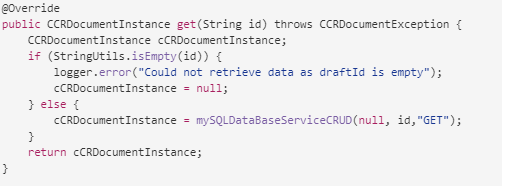

# エージェント UI を使用してインタラクティブ通信の準備と送信を行う {#prepare-and-send-interactive-communication-using-the-agent-ui}

エージェント UI を使用すると、エージェントはインタラクティブ通信を準備し、後処理に送信できます。 エージェントは、許可されている必要な変更を行い、インタラクティブ通信を電子メールや印刷などの後処理に送信します。

## 概要 {#overview}

インタラクティブ通信を作成したら、エージェントを使用してそのインタラクティブ通信をエージェント UI で開き、データ入力と、コンテンツや添付ファイルの管理を行って、受信者固有のコピーを作成することができます。その後、エージェントにより、後処理用としてインタラクティブ通信を送信することができます。

エージェント UI を使用してインタラクティブ通信の準備を行う際に、以下に示すインタラクティブ通信の構成要素が、エージェントによりエージェント UI で管理されます。その後、インタラクティブ通信が後処理用に送信されます。

* **データ**：エージェント UI の「データ」タブには、インタラクティブ通信内の編集可能なエージェント変数と、ロックが解除されたフォームデータモデルのプロパティが表示されます。 これらの変数やプロパティは、インタラクティブ通信に含まれるドキュメントフラグメントを編集または作成する際に作成されます。 「データ」タブには、XDP/印刷チャネルテンプレートで作成されたフィールドも含まれます。 「データ」タブが表示されるのは、エージェントを使用して編集できる変数、フォームデータモデルプロパティまたはフィールドが、インタラクティブ通信内に含まれている場合だけです。
* **コンテンツ**：エージェントにより、「コンテンツ」タブに表示される各種コンテンツ（インタラクティブ通信内のドキュメントフラグメントやコンテンツ変数など）が管理されます。エージェントは、ドキュメントフラグメントのプロパティを使用してインタラクティブ通信を作成する際に、許可設定に従って、そのドキュメントフラグメントを変更します。また、許可されている場合は、ドキュメントフラグメントの並べ替え、追加、削除、改ページの追加も、エージェントによって実行されます。   
* **添付ファイル**：エージェント UI で「添付ファイル」タブが表示されるのは、インタラクティブ通信にファイルが添付されている場合と、エージェントがライブラリにアクセスする場合だけです。エージェントに対して添付ファイルの変更と編集が許可されている場合もあれば、許可されていない場合もあります。

## エージェント UI を使用したインタラクティブ通信の準備 {#prepare-interactive-communication-using-the-agent-ui}

1. **[!UICONTROL フォーム]**／**[!UICONTROL フォームとドキュメント]**&#x200B;を選択します。
1. 適切なインタラクティブ通信を選択し、 **[!UICONTROL エージェント UI を開く]**.

   >[!NOTE]
   >
   >エージェント UI が機能するのは、選択したインタラクティブ通信に印刷チャネルが含まれている場合だけです。

   

   インタラクティブ通信のコンテンツとプロパティに基づいて、エージェント UI に、「データ」タブ、「コンテンツ」タブ、「添付ファイル」タブという 3 つのタブが表示されます。

   

   次に、データの入力、コンテンツの管理、添付ファイルの管理を行います。

### データを入力 {#enter-data}

1. 「データ」タブで、必要に応じて、変数、フォームデータモデルのプロパティ、印刷テンプレート (XDP) フィールドのデータを入力します。 アスタリスク（&amp;ast;）の付いた必須フィールドをすべて入力し、「**送信**」ボタンを有効にします。

   インタラクティブ通信のプレビューでデータフィールドの値を選択し、「データ」タブで対応するデータフィールドをハイライト表示するか、逆にハイライト表示します。

### コンテンツの管理 {#manage-content}

「コンテンツ」タブでは、インタラクティブ通信内のドキュメントフラグメントやコンテンツ変数などのコンテンツを管理します。

1. 「**[!UICONTROL コンテンツ]**」を選択します。インタラクティブ通信の「コンテンツ」タブが表示されます。

   

1. 必要に応じて、「コンテンツ」タブでドキュメントフラグメントを編集します。コンテンツ階層内の関連するフラグメントにフォーカスを移すには、インタラクティブ通信のプレビューで関連する行または段落を選択するか、コンテンツ階層内で直接フラグメントを選択します。

   例えば、以下のプレビュー画面で、「Make a payment online now ...」という行が含まれているドキュメントフラグメントを選択すると、「コンテンツ」タブでも同じドキュメントフラグメントが選択されます。

   

   「コンテンツ」タブまたは「データ」タブで、プレビューの左上にある「コンテンツ内の選択したモジュールをハイライト表示」（）をタップすると、関連するテキスト、段落またはデータフィールドがプレビュー画面でタップまたは選択されたときにドキュメントフラグメントに移動する機能の有効と無効を切り替えることができます。

   インタラクティブ通信の作成時にエージェントが編集できるフラグメントには、「選択したコンテンツを編集」( ) アイコンをクリックします。 「選択したコンテンツを編集」アイコンを選択して、フラグメントを編集モードで起動し、変更を加えます。 テキストの書式設定と管理には、次のオプションを使用します。

   * [書式設定オプション](#formattingtext)

      * [書式設定されたテキストを他のアプリケーションからコピー＆ペースト](#pasteformattedtext)
      * [テキストの一部をハイライト表示](#highlightemphasize)

   * [特殊文字](#specialcharacters)
   * [ショートカットキー](/help/forms/using/keyboard-shortcuts.md)

   エージェント UI で各種のドキュメントフラグメントを操作する方法については、[エージェント UI で使用できる操作と情報](#actionsagentui)を参照してください。

1. インタラクティブ通信の印刷出力に改ページを追加するには、改ページを追加する位置にカーソルを置き、「直前に改ページ」または「直後に改ページ」を選択します（）。

   インタラクティブ通信に、改ページのプレースホルダが明示的に挿入されます。 明示的な改ページがインタラクティブ通信に与える影響を確認するには、印刷プレビューを参照してください。

   

   インタラクティブ通信の添付ファイルの管理に進みます。

### 添付ファイルを管理 {#manage-attachments}

1. 「**[!UICONTROL 添付ファイル]**」を選択します。エージェント UI に、インタラクティブ通信の作成時に設定可能な添付ファイルが表示されます。  

   表示アイコンをタップして、インタラクティブ通信と共に添付ファイルを送信しないように選択できます。また、添付ファイルのバツ印を選択して（エージェントが添付ファイルを削除または非表示にできる場合）、インタラクティブ通信から添付ファイルを削除できます。 インタラクティブ通信の作成時に必須ファイルとして指定された添付ファイルの場合、ビューアイコンと削除アイコンは無効になります。

   

1. ライブラリアクセス ( ) アイコンをクリックしてコンテンツライブラリにアクセスし、DAM アセットを添付ファイルとして挿入します。

   >[!NOTE]
   >
   >ライブラリアクセスアイコンを使用できるのは、インタラクティブ通信の作成時に、印刷チャンネルの「ドキュメントコンテナ」プロパティでライブラリへのアクセスを有効にした場合だけです。

1. インタラクティブ通信の作成時に、添付ファイルの順序をロックしなかった場合は、添付ファイルを選択して上下の矢印をタップすると、添付ファイルの順序を変更することができます。
1. Web プレビューと印刷プレビューを使用して、2 つの出力が正しく作成されているかどうかを確認します。

   プレビューが満足のいくものであると思われる場合は、 **[!UICONTROL 送信]** インタラクティブ通信を後処理に送信または送信する。 さらに変更を行う場合は、プレビュー画面を終了して変更画面に戻ります。

## テキストの書式設定 {#formattingtext}

エージェント UI でテキストフラグメントを編集する際、選択した編集の種類（フォント、段落、リスト）に応じて、ツールバーが変わります。

 

フォントツールバー


段落ツールバー


リストツールバー

### テキストの一部をハイライト表示/強調 {#highlightemphasize}

編集可能なフラグメント内のテキストの一部をハイライト表示または強調するには、テキストを選択し、「ハイライトの色」を選択します。


### 書式設定されたテキストの貼り付け {#pasteformattedtext}


### テキストに特殊文字を挿入します {#specialcharacters}

エージェント UI には、210 個の特殊文字に対するサポートが組み込まれています。 管理者は、[カスタマイズすることで特殊文字を増やしたり、カスタムの特殊文字を追加したりする](/help/forms/using/custom-special-characters.md)ことができます。

#### 添付ファイルの配信 {#attachmentdelivery}

* サーバーサイドの API を使用して、インタラクティブ通信をインタラクティブ PDF または非インタラクティブ PDF としてレンダリングすると、レンダリング後の PDF に PDF ファイルが添付されます。
* エージェント UI を使用して、インタラクティブ通信に関連付けられた後処理を送信処理の一部としてロードすると、添付ファイルが List&lt;com.adobe.idp.Document> inAttachmentDocs パラメーターとして渡されます。
* 配信メカニズムのワークフロー（電子メールや印刷など）は、インタラクティブ通信のPDFバージョンと共に添付ファイルも配信します。

## エージェントのユーザーインターフェイスで使用可能なアクションと情報 {#actionsagentui}

### ドキュメントフラグメント {#document-fragments}


* **上向き/下向き矢印**：インタラクティブ通信内でドキュメントフラグメントを上下に移動する矢印。
* **削除**：インタラクティブ通信からドキュメントフラグメントを削除します（削除が許可されている場合）。
* **直前に改ページ**：（ターゲット領域の子フラグメントで使用可能）ドキュメントフラグメントの直前に改ページが挿入されます。
* **インデント**：ドキュメントフラグメントのインデントを増減します。
* **直後に改ページ**（ターゲット領域の子フラグメントで使用可能）：ドキュメントフラグメントの直後に改ページが挿入されます。


* 編集（テキストフラグメントの場合のみ）：テキストドキュメントフラグメントを編集するためのリッチテキストエディターが起動します。詳しくは、[テキストのフォーマット](#formattingtext)を参照してください。

* 選択（目のアイコン）：インタラクティブ通信にドキュメントフラグメントを含めたり、インタラクティブ通信からドキュメントフラグメントを除外したりすることができます。
* 未入力値：ドキュメントフラグメントの未入力変数の数が表示されます。これは、表示専用情報です。

### ドキュメントフラグメントのリスト {#list-document-fragments}


* 空白行を挿入： 空白行を新たに挿入します。
* 選択（目のアイコン）：インタラクティブ通信にドキュメントフラグメントを含めたり、インタラクティブ通信からドキュメントフラグメントを除外したりすることができます。
* 箇条書き/段落番号をスキップ：リストドキュメントフラグメントで箇条書き/段落番号をスキップする場合に有効にします。
* 未入力値：ドキュメントフラグメントの未入力変数の数が表示されます。これは、表示専用情報です。

## インタラクティブ通信をドラフトとして保存 {#save-as-draft}

エージェント UI を使用して、各インタラクティブ通信の 1 つ以上のドラフトを保存し、後でそのドラフトを取得して、作業を続行できます。それぞれのドラフトに異なる名前を指定して、識別しやすくすることができます。

インタラクティブ通信をドラフトとして正常に保存するために、これらの手順を順番に実行することをお勧めします。

### ドラフトとして保存機能の有効化 {#before-save-as-draft}

ドラフトとして保存機能は、デフォルトでは有効になっていません。この機能を有効にするには、次の手順を実行します。

1. [ccrDocumentInstance](https://helpx.adobe.com/jp/experience-manager/6-5/forms/javadocs/com/adobe/fd/ccm/ccr/ccrDocumentInstance/api/services/CCRDocumentInstanceService.html) サービスプロバイダーインターフェイス（SPI）を実装します。

   SPI を使用すると、インタラクティブ通信のドラフトバージョンを、固有の識別子としてドラフト ID を指定したうえで、データベースに保存できます。これらの手順は、Maven プロジェクトを使用して OSGi バンドルをビルドする方法に関する基本知識があることを前提としています。

   SPI の実装例について詳しくは、[ccrDocumentInstance SPI の実装例](#sample-ccrDocumentInstance-spi)を参照してください。
1. 開く `http://<hostname>:<port>/ system/console/bundles` を選択し、 **[!UICONTROL インストール/更新]** :OSGi バンドルをアップロードします。 アップロードされたパッケージのステータスが&#x200B;**アクティブ**&#x200B;と表示されていることを確認します。パッケージのステータスが&#x200B;**アクティブ**&#x200B;と表示されない場合は、サーバーを再起動します。
1. `https://'[server]:[port]'/system/console/configMgr` にアクセスします。
1. 選択 **[!UICONTROL 通信設定を作成]**.
1. 選択 **[!UICONTROL CCRDocumentInstanceService を使用して保存を有効にする]** を選択し、 **[!UICONTROL 保存]**.

### インタラクティブ通信をドラフトとして保存 {#save-as-draft-agent-ui}

インタラクティブ通信をドラフトとして保存するには、次の手順を実行します。

1. Forms Manager でインタラクティブ通信を選択し、 **[!UICONTROL エージェント UI を開く]**.

1. エージェント UI で適切な変更を行い、「 」を選択します。 **[!UICONTROL ドラフトとして保存]**.

1. 下書きの名前を **[!UICONTROL 名前]** 「 」フィールドで「 」を選択します。 **[!UICONTROL 完了]**.

インタラクティブ通信を下書きとして保存したら、 **[!UICONTROL 変更を保存]** をクリックして、ドラフトに対する変更を保存します。

### インタラクティブ通信のドラフトの取得 {#retrieve-draft}

インタラクティブ通信をドラフトとして保存した後、その通信を取得して作業を続行できます。以下を使用してインタラクティブ通信を取得します。

`https://server:port/aem/forms/createcorrespondence.hmtl?draftid=[draftid]`

[draftid] とは、インタラクティブ通信をドラフトとして保存した後に生成されるドラフトバージョンの固有の識別子を指します。

### ccrDocumentInstance SPI の実装例 {#sample-ccrDocumentInstance-spi}

`ccrDocumentInstance` SPI を実装し、インタラクティブ通信をドラフトとして保存します。`ccrDocumentInstance` SPI の実装例は次のとおりです。

```javascript
package Implementation;

import com.adobe.fd.ccm.ccr.ccrDocumentInstance.api.exception.CCRDocumentException;
import com.adobe.fd.ccm.ccr.ccrDocumentInstance.api.model.CCRDocumentInstance;
import com.adobe.fd.ccm.ccr.ccrDocumentInstance.api.services.CCRDocumentInstanceService;
import org.apache.commons.lang3.StringUtils;
import org.osgi.service.component.annotations.Component;
import org.slf4j.Logger;
import org.slf4j.LoggerFactory;

import java.util.*;


@Component(service = CCRDocumentInstanceService.class, immediate = true)
public class CCRDraftService implements CCRDocumentInstanceService {

    private static final Logger logger = LoggerFactory.getLogger(CCRDraftService.class);

    private HashMap<String, Object> draftDataMap = new HashMap<>();

    @Override
    public String save(CCRDocumentInstance ccrDocumentInstance) throws CCRDocumentException {
        String documentInstanceName = ccrDocumentInstance.getName();
        if (StringUtils.isNotEmpty(documentInstanceName)) {
            logger.info("Saving ccrData with name : {}", ccrDocumentInstance.getName());
            if (!CCRDocumentInstance.Status.SUBMIT.equals(ccrDocumentInstance.getStatus())) {
                ccrDocumentInstance = mySQLDataBaseServiceCRUD(ccrDocumentInstance,null, "SAVE");
            }
        } else {
            logger.error("Could not save data as draft name is empty");
        }
        return ccrDocumentInstance.getId();
    }

    @Override
    public void update(CCRDocumentInstance ccrDocumentInstance) throws CCRDocumentException {
        String documentInstanceName = ccrDocumentInstance.getName();
        if (StringUtils.isNotEmpty(documentInstanceName)) {
            logger.info("Saving ccrData with name : {}", documentInstanceName);
            mySQLDataBaseServiceCRUD(ccrDocumentInstance, ccrDocumentInstance.getId(), "UPDATE");
        } else {
            logger.error("Could not save data as draft Name is empty");
        }
    }

    @Override
    public CCRDocumentInstance get(String id) throws CCRDocumentException {
        CCRDocumentInstance cCRDocumentInstance;
        if (StringUtils.isEmpty(id)) {
            logger.error("Could not retrieve data as draftId is empty");
            cCRDocumentInstance = null;
        } else {
            cCRDocumentInstance = mySQLDataBaseServiceCRUD(null, id,"GET");
        }
        return cCRDocumentInstance;
    }

    @Override
    public List<CCRDocumentInstance> getAll(String userId, Date creationTime, Date updateTime,
                                            Map<String, Object> optionsParams) throws CCRDocumentException {
        List<CCRDocumentInstance> ccrDocumentInstancesList = new ArrayList<>();

        HashMap<String, Object> allSavedDraft = mySQLGetALLData();
        for (String key : allSavedDraft.keySet()) {
            ccrDocumentInstancesList.add((CCRDocumentInstance) allSavedDraft.get(key));
        }
        return ccrDocumentInstancesList;
    }

    //The APIs call the service in the database using the following section.
    private CCRDocumentInstance mySQLDataBaseServiceCRUD(CCRDocumentInstance ccrDocumentInstance,String draftId, String method){
        if(method.equals("SAVE")){

            String autoGenerateId = draftDataMap.size() + 1 +"";
            ccrDocumentInstance.setId(autoGenerateId);
            draftDataMap.put(autoGenerateId, ccrDocumentInstance);
            return ccrDocumentInstance;

        }else if (method.equals("UPDATE")){

            draftDataMap.put(ccrDocumentInstance.getId(), ccrDocumentInstance);
            return ccrDocumentInstance;

        }else if(method.equals("GET")){

            return (CCRDocumentInstance) draftDataMap.get(draftId);

        }
        return null;
    }

    private HashMap<String, Object> mySQLGetALLData(){
        return draftDataMap;
    }
}
```

`save`、`update`、`get` および `getAll` の操作はそれぞれ、データベースサービスを呼び出して、インタラクティブ通信をドラフトとして保存、インタラクティブ通信の更新、データベースからデータを取得、データベースで使用可能なすべてのインタラクティブ通信のデータ取得を行います。この例では、`mySQLDataBaseServiceCRUD` をデータベースサービスの名前として使用します。

次の表では、`ccrDocumentInstance` SPI の実装例を説明しています。具体的には、`save`、`update`、`get` および `getAll` 操作が実装例でデータベースサービスを呼び出す方法を示しています。

<table> 
 <tbody>
 <tr>
  <td><p><strong>操作</strong></p></td>
  <td><p><strong>データベースサービスの例</strong></p></td> 
   </tr>
  <tr>
   <td><p>インタラクティブ通信のドラフトを作成するか、直接送信することができます。保存操作用の API は、インタラクティブ通信がドラフトとして送信され、ドラフト名が含まれているかどうかを確認します。次に API は、Save を入力メソッドとして mySQLDataBaseServiceCRUD サービスを呼び出します。</p></br></td>
   <td><p>mySQLDataBaseServiceCRUD サービスは、Save を入力メソッドとして検証し、自動生成されたドラフト ID を生成して AEM に返します。ドラフト ID を生成するロジックは、データベースに応じて異なる場合があります。</p></br></td>
   </tr>
  <tr>
   <td><p>更新操作用の API は、インタラクティブ通信のドラフトのステータスを取得し、インタラクティブ通信にドラフト名が含まれているかどうかを確認します。API は mySQLDataBaseServiceCRUD サービスを呼び出して、データベース内のそのステータスを更新します。</p></br></td>
   <td><p>mySQLDataBaseServiceCRUD サービスは、Update を入力メソッドとして検証し、インタラクティブ通信のドラフトのステータスをデータベースに保存します。</br></p></td>
   </tr>
   <tr>
   <td><p>GET 操作の API は、インタラクティブ通信にドラフト ID が含まれているかどうかを確認します。 次に、API は、GET を入力メソッドとして mySQLDataBaseServiceCRUD サービスを呼び出し、インタラクティブ通信のデータを取得します。</br></p></td>
   <td><p>mySQLDataBaseServiceCRUD サービスは、GET を入力メソッドとして検証し、ドラフト ID に基づいてインタラクティブ通信のデータを取得します。</p></br></td>
   </tr>
   <tr>
   <td><p>getAll 操作の API は、mySQLGetALLData サービスを呼び出して、データベースに保存されているすべてのインタラクティブ通信のデータを取得します。</br></p></td>
   <td><p>mySQLGetALLData サービスは、データベースに保存されているすべてのインタラクティブ通信のデータを取得します。</p></br></td>
   </tr>
  </tbody>
</table>

次に、実装の一部である `pom.xml` ファイルの例をご紹介します。

```xml
<?xml version="1.0" encoding="UTF-8"?>
<project xmlns="https://maven.apache.org/POM/4.0.0"
         xmlns:xsi="https://www.w3.org/2001/XMLSchema-instance"
         xsi:schemaLocation="https://maven.apache.org/POM/4.0.0 https://maven.apache.org/xsd/maven-4.0.0.xsd">
    <modelVersion>4.0.0</modelVersion>

    <groupId>com.adobe.livecycle</groupId>
    <artifactId>draft-sample</artifactId>
    <version>2.0.0-SNAPSHOT</version>

    <name>Interact</name>
    <packaging>bundle</packaging>

    <dependencies>
        <dependency>
            <groupId>com.adobe.aemfd</groupId>
            <artifactId>aemfd-client-sdk</artifactId>
            <version>6.0.160</version>
        </dependency>
    </dependencies>


    <!-- ====================================================================== -->
    <!-- B U I L D D E F I N I T I O N -->
    <!-- ====================================================================== -->
    <build>
        <plugins>
            <plugin>
                <groupId>org.apache.felix</groupId>
                <artifactId>maven-bundle-plugin</artifactId>
                <version>3.3.0</version>
                <extensions>true</extensions>
                <executions>
                    <!--Configure extra execution of 'manifest' in process-classes phase to make sure SCR metadata is generated before unit test runs-->
                    <execution>
                        <id>scr-metadata</id>
                        <goals>
                            <goal>manifest</goal>
                        </goals>
                    </execution>
                </executions>
                <configuration>
                    <exportScr>true</exportScr>
                    <instructions>
                        <!-- Enable processing of OSGI DS component annotations -->
                        <_dsannotations>*</_dsannotations>
                        <!-- Enable processing of OSGI metatype annotations -->
                        <_metatypeannotations>*</_metatypeannotations>
                        <Bundle-SymbolicName>${project.groupId}-${project.artifactId}</Bundle-SymbolicName>
                    </instructions>
                </configuration>
            </plugin>
            <plugin>
                <groupId>org.apache.maven.plugins</groupId>
                <artifactId>maven-surefire-plugin</artifactId>
            </plugin>
            <plugin>
                <groupId>org.apache.maven.plugins</groupId>
                <artifactId>maven-compiler-plugin</artifactId>
                <configuration>
                    <source>8</source>
                    <target>8</target>
                </configuration>
            </plugin>
        </plugins>
    </build>
    <profiles>
        <profile>
            <id>autoInstall</id>
            <build>
                <plugins>
                    <plugin>
                        <groupId>org.apache.sling</groupId>
                        <artifactId>maven-sling-plugin</artifactId>
                        <executions>
                            <execution>
                                <id>install-bundle</id>
                                <phase>install</phase>
                                <goals>
                                    <goal>install</goal>
                                </goals>
                            </execution>
                        </executions>
                    </plugin>
                </plugins>
            </build>
        </profile>
    </profiles>

</project>
```

>[!NOTE]
>
>必ず `pom.xml` ファイルの `aemfd-client-sdk` 依存関係を 6.0.160 にアップデートしてください。
