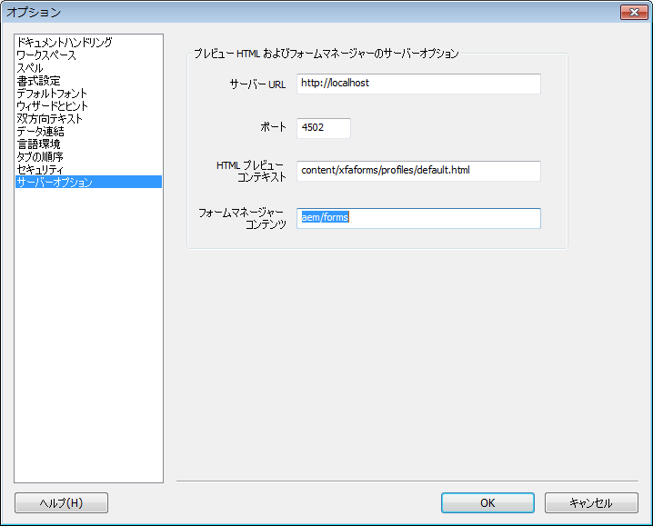

# XDP フォームの HTML5 プレビューの生成{#generate-html-preview-of-an-xdp-form}

AEM Forms Designer でフォームをデザインする間、フォームの PDF レンダリングをプレビューする他に、HTML5 レンダリングをプレビューすることもできます。「**HTML プレビュー**」タブを使用すると、フォームがブラウザでどのように表示されるかをプレビューすることができます。

## Designer での XDP フォームの HTML プレビューの有効化 {#html-preview-of-forms-in-forms-designer}

Designer での XDP フォームの HTML プレビューの生成を有効にするには、次の設定を行います。

* Apache Sling Authentication Service の設定
* 保護モードの無効化
* AEM Forms サーバーの詳細の指定

### Apache Sling Authentication Service の設定 {#configure-apache-sling-authentication-service}

1. OSGiで実行さ `https://'[server]:[port]'/system/console/configMgr` れているAEM Formsに移動または
   `https://'[server]:[port]'/lc/system/console/configMgr` JEE上で実行されているAEM Formsの場合。
1. **Apache Sling Authentication Service** 設定を探してクリックし、編集モードで開きます。 

1. AEM Forms を OSGi または JEE のどちらで実行しているかにより、**Authentication Requirements** フィールドで以下を追加します。

   * JEE 上の AEM Forms

      * -/content/xfaforms
      * -/etc/clientlibs
   * OSGi での AEM Forms

      * -/content/xfaforms
      * -/etc/clientlibs/fd/xfaforms
   >[!NOTE]
   >
   >Authentication Requirements フィールドで指定した値をコピーアンドペーストしないでください。値に使用されている特殊文字が文字化けするおそれがあります。代わりに、フィールドに指定の値を入力します。

1. 「**[!UICONTROL 匿名ユーザー名]**」フィールドと「**[!UICONTROL 匿名ユーザーパスワード]**」フィールドで、ユーザー名とパスワードをそれぞれ指定します。指定した資格情報は、匿名認証を処理し、匿名ユーザーにアクセスを許可するために使用されます。
1. 「**Save**」をクリックして、 設定を保存します。

### 保護モードの無効化 {#disable-protected-mode}

[保護モード](../../forms/using/get-xdp-pdf-documents-aem.md)は、デフォルトで有効になっています。実稼働環境の場合、このモードを有効のままにしてください。開発環境でこのモードを無効にすると、Designer で HTML5 フォームのプレビューを表示することができます。次の手順を実行して無効にします。

1. 管理者として AEM Web コンソールにログインします。

   * URL for AEM Forms on OSGi is `https://'[server]:[port]'/system/console/configMgr`
   * JEE上のAEM FormsのURLは `https://'[server]:[port]'/lc/system/console/configMgr`

1. **[!UICONTROL Mobile Forms の設定]**&#x200B;を編集用に開きます。
1. 「**[!UICONTROL 保護モード]**」オプションの選択を解除して「**[!UICONTROL 保存]**」をクリックします。

### AEM Forms サーバーの詳細の指定 {#provide-details-of-aem-forms-server}

1. Designer で、**ツール**／**オプション**&#x200B;に移動します。
1. In the Options window, select **Server Options** page, provide the following details, and click **OK**.

   * **Server URL**：AEM Forms サーバーの URL です。

   * **HTTP port number**：AEM サーバーポート。デフォルト値は 4502 です。
   * **HTMLプレビューコンテキスト：** XFAフォームをレンダリングするプロファイルのパスです。 次のデフォルトのプロファイルを使用して、Designerでフォームのプレビューを行います。 ただし、カスタムプロファイルへのパスを指定することもできます。

      * `/content/xfaforms/profiles/default.html` (OSGi 上の AEM Forms)

      * `/lc/content/xfaforms/profiles/default.html` (JEE 上の AEM Forms)
   * **Forms Manager Context :** Forms Manager UI がデプロイされるコンテキストパス。デフォルト値は次のとおりです。

      * `/aem/forms` (OSGi 上の AEM Forms)
      * `/lc/forms` (JEE 上の AEM Forms)
   **注：**&#x200B;サーバーが起動および実行されていることを確認してください。The HTML preview connects to the CRX server to *generate* a preview.

   

   AEM Forms Designer のオプション

1. To preview a form in HTML, click the **Preview HTML** tab.

   >[!NOTE]
   >
   >
   >
   >
   >    * 「HTML Preview」タブが閉じている場合は、F4 を押して「Preview HTML」を開けます。 また、表示メニューから「Preview HTML」を選択して、「Preview HTML」タブを開けることもできます。
   >    * HTML プレビューは PDF ドキュメントをサポートしません。HTML プレビューは XDP ドキュメント専用です。

   >[!CAUTION]
   >
   >実際のエンドユーザーエクスペリエンスをテストするには、外部ブラウザー（Google Chrome、Microsoft Edge、Mozilla Firefoxなど）でフォームをプレビューします。 各ブラウザーは、HTMLのレンダリングに別々のプレビューを使用するので、Designerと外部ブラウザーでのフォームエンジンの違いが生じる場合があります。

## サンプルデータを使用してフォームをプレビューするには {#to-preview-a-form-using-sample-data}

Designer では、サンプル XML データを使用してフォームをプレビューおよびテストすることができます。フォームが正しくレンダリングされるよう、フォームをサンプルデータで頻繁にテストすることをお勧めします。

サンプルデータがない場合には、Designer で自動生成するか、または独自に作成することができます。[フォームのプレビュー用にサンプルデータを自動生成するには](https://help.adobe.com/en_US/AEMForms/6.1/DesignerHelp/WS107c29ade9134a2c136ae6f212a1f379c94-8000.2.html#WS92d06802c76abadb-728f46ac129b395660c-7efe.2)および[フォームのプレビュー用にサンプルデータを作成するには](https://help.adobe.com/en_US/AEMForms/6.1/DesignerHelp/WS107c29ade9134a2c136ae6f212a1f379c94-8000.2.html#WS92d06802c76abadb-728f46ac129b395660c-7eff.2)も参照してください。

サンプルデータソースを使用してフォームをテストすると、データとフィールドがマップされていること、および繰り返しサブフォームが指定どおりに繰り返されることを確認できます。各オブジェクトに結合されたデータを表示するにあたり適切なスペースが確保された、バランスのよいフォームレイアウトを作成できます。

1. **ファイル／フォームのプロパティ**&#x200B;を選択します。

1. 「**プレビュー**」タブをクリックし、「データファイル」ボックスに、テストデータファイルへの完全なパスを入力します。参照ボタンを使用してファイルを指定することもできます。

1. 「**OK**」をクリックします。次回に「**HTML プレビュー**」タブでフォームをプレビューするときには、それぞれのオブジェクトにサンプル XML ファイルからのデータ値が表示されます。

## リポジトリにあるフォームのプレビュー {#html-preview-of-forms-in-forms-manager}

AEM Forms では、リポジトリにあるフォームやドキュメントをプレビューすることができます。プレビューを使用すると、エンドユーザーによって使用される際にどのように見え、作動するのかを明確に理解できます。

[サポートへのお問い合わせ](https://www.adobe.com/account/sign-in.supportportal.html)
