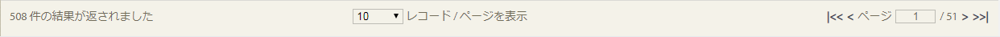

# プロセス内のアドホッククエリレポート{#ad-hoc-queries-in-process-reporting}

## プロセス内のアドホッククエリレポート {#ad-hoc-queries-in-process-reporting-1}

プロセスレポートのアドホッククエリを使用すると、AEM Forms環境で定義されたAEM Formsプロセスインスタンスのプロセスおよびタスクの詳細を検索するために使用できるカスタムクエリを作成できます。

また、アドホッククエリは、プロセスプロパティとタスクプロパティのフィルターを使用して定義できます。 これらのフィルターは保存し、後でレポートを実行するために使用できます。

[**Process Search **](/help/forms/using/process-reporting/adhoc-queries-in-process-reporting.md#p-process-task-search-p):プロセス属性に基づいて、ユーザー定義の検索フィルターを使用してプロセスインスタンスを検索します。

[**プロセスの詳細&#x200B;**](/help/forms/using/process-reporting/adhoc-queries-in-process-reporting.md#p-process-task-details-p):表示IDを指定することによるプロセスインスタンスの詳細。

**タスク検索**:タスク属性に基づいて、ユーザ定義の検索フィルターを使用してタスクインスタンスを検索します。

**タスクの詳細**:表示IDを指定してタスクインスタンスのタスクの詳細。

### プロセスとタスク {#processes-and-tasks}

プロセスの詳細に対してフィルターを作成し、クエリを実行する手順は、タスクの場合と同じです。

つまり、プロセス検索とタスク検索のユーザーインターフェイスは、検索できるフィールドと検索結果に返されるフィールドでのみ異なります。 これは、多くのフィールドが同じですが、特定のフィールドはプロセスに固有で、特定のフィールドはタスクに固有であるためです。

この記事では、「プロセス/タスクの検索」と「プロセス/タスクの詳細」の節について説明します。 適切な場所で、具体的な違いは何でも呼び出されます。

## プロセス/タスク検索 {#process-task-search}

プロセス/タスク検索を使用して、プロセス/フィルターインスタンスを照会するタスクを定義します。

### プロセス/タスク検索クエリ {#to-create-a-process-task-search-query}

1. 保存したプロセス/タスク検索クエリを表示する場合、またはクエリを作成する場合は、「アドホック **クエリ** 」をクリックし、「プロセス/ **タスク検索」をクリックします**。

   

   [マイ **フィルター** ]パネルがツリー表示の右側に表示されます。

   マイフィルター **パネルで** 、新しいアドホッククエリを作成し、をクリックして、以前に保存したクエリを実行できます。

   

1. 既存のクエリを実行するには、マイクエリパネルでフィルターをクリ **ックします** 。
1. クエリを作成するには、 **** (+)をクリックします。

   フィルタ **ーの作成** パネルが表示されます。

   

   クエリは1つ以上のクエリフィルター。 フィルターを作成するには、フィルター行をクエリに追加します。 デフォルトでは、フィルター行が1つクエリに追加されます。

   **フィルタを定義するには**

   1. フィールドを選択します。

      

      >[!NOTE]
      >
      >フィールドリストには、AEM Formsのプロセス/タスクに固有のフィールドが含まれます。

   1. 条件を選択します。

      

      >[!NOTE]
      >
      >表示される条件は、フィルタリング用に選択した属性によって異なります。

   1. 値を入力します。

      

   1. クエリに別のフィルターを追加するに **追加は、フィルター行の右にある** (+)をクリックします。

      フィルタをクエリから削除するに **は、フィルタ行の右にある** [削除] (-)をクリックします。

      

クエリを作成した後、フィルターを作成パネルの右上隅にあるオプションを使用し **て** 、次の操作を行います。

* **キャンセル**:変更をキャンセルし、「マイフィルター **** 」パネルに戻ります。
* **実行**:現在のクエリを実行し、結果を確認します。 この場合、実行前にクエリを保存する必要はありません。 結果を確認し、必要に応じて変更を加え、出力に満足したらクエリを保存することができます。
* **保存**:フィルターを保存します。 その後、フィルターを[マイフィルター **** ]パネルで表示および実行できます。

### マイオプションパネルのフィルター {#options-in-my-filters-panel}

My ******** _add_filter pr_edit pr_filterpr_edit **lc_delete** filterpr_delete lc_delete ****pr_edit_ad_hocフィルター

### 検索クエリ {#to-execute-a-search-query}

1. クエリを実行するには、 **Myフィルターパネルでフィルターをクリックするか** 、フィルターを作成または編集する場合は **「実行** 」ボタンをクリックします。
1. クエリの結果は、「プロセスの結 **果」ウィンドウの** 「レポート」パ **ネルに表示されます** 。

   

   レポートの下部に表示されるページ編集パネルを使用して、検索結果をページ分割できます。

   

   「表示」ド **ロップダウン** リストで、1ページに表示する結果の数を選択します。

   「ページ **」テキスト** ・ボックスに、そのページに直接移動するページ番号を入力します。

1. プロセスの検索結果には、次のフィールドが表示されます。

   * **プロセスID**:プロセスのID。 フィールドはハイパーリンクされています。 このフィールドのプロセスIDをクリックすると、そのプロセスの **[!UICONTROL Process Details]** パネルにリダイレクトされます。
   * **イニシエータ**:プロセスインスタンスを開始したAEM Formsユーザー
   * **作成日時**:プロセスインスタンスが開始した日時
   * **完了時刻**:プロセスインスタンスが完了した日時
   * **期間**:プロセスインスタンスの開始から完了までの時間
   * **ステータス**:プロセスインスタンスの現在のステータス。
   デフォルトでは、結果はプロセスIDで並べ替えられます。 ただし、結果をいずれかのフィールドで並べ替えるには、フィールドのタイトルをクリックします。

   並べ替えは切り替え操作なので、列ヘッダーをクリックして結果を昇順に並べ替え、もう一度クリックして降順に並べ替えます。

   同様に、次のフィールドが検索結果タスクに表示されます。

   * **タスクID**:タスクのID。 フィールドはハイパーリンクされています。 このフィールドでタスクIDをクリックすると、そのタスクの **[!UICONTROL タスクの詳細]** パネルにリダイレクトされます。
   * **イニシエータ**:プロセスインスタンスを開始したAEM Formsユーザー
   * **作成日時**:プロセスインスタンスが開始した日時
   * **完了時刻**:プロセスインスタンスが完了した日時
   * **期間**:プロセスインスタンスの開始から完了までの時間
   * **ステータス**:プロセスインスタンスの現在のステータス。
   デフォルトでは、結果はタスクIDで並べ替えられます。 ただし、結果をいずれかのフィールドで並べ替えるには、フィールドのタイトルをクリックします。 結果は、列見出しの横に暗い矢印が表示されている列で並べ替えられます。

   並べ替えは切り替え操作なので、フィールドヘッダーをクリックして結果を昇順に並べ替え、もう一度クリックして降順に並べ替えます。 現在の並べ替え順（昇順/降順）は、列ヘッダーの横の暗い矢印の方向で示されます。

   

1. 左上のパネルボタン  (パネルのパネルボタン **lc_pr_rail_button** )をクリックして、「マイフィルター **」ペインを折りたたみ、レポートパネルで使用できる領域を展開** します。
1. **レポート**パネルの右上隅にあるオプションを使用して、結果に対する操作をクエリします。

   * **更新**:レポートを最新のデータで更新します。ストレージ

   * **CSVに書き出し**:レポートデータをコンマ区切りファイルにエクスポートします。
   >[!NOTE]
   >
   >レポートを書き出すと、検索結果全体が現在のページだけでなくCSVファイルに書き出されます

## プロセス/タスクの詳細 {#process-task-details}

特定のプロセスの **詳細を表示するには** 、Process Detailsパネルを使用します。

同様に、 **タスクの詳細** ・パネルを使用して、特定のタスクの詳細を表示します。

### 表示・プロセス/タスク詳細 {#to-view-process-task-details}

特定のAEM Formsのプロセス/表示の詳細をタスクできます。

* **プロセス/タスク検索結果**
* **プロセス/タスクの詳細パネルでプロセス/タスクIDを入力**

#### プロセス/タスク検索結果 {#from-a-process-task-search-result}

1. プロセス/タスク検索の実行 詳しくは、「プロセス検索 [クエリを実行するには](#to-execute-a-search-query)」

   結果に返されるプロセスIDがハイパーリンクされていることに注意してください。

   

1. プロセスの詳細を表示するには、リスト内のプロセスIDを **Process Details** パネルでクリックします。

   プロセス **/タスクの詳細** クエリの結果には、プロセス/タスクに含まれるタスク/フォームの詳細が表示されます。

   デフォルトでは、結果はタスク/フォームIDで並べ替えられます。 ただし、結果をいずれかのフィールドで並べ替えるには、フィールドのタイトルをクリックします。 結果を並べ替える列は、列ヘッダーの横に暗い矢印で示されます。

   並べ替えは切り替え操作なので、フィールドヘッダーをクリックして結果を昇順に並べ替え、もう一度クリックして降順に並べ替えます。 現在の並べ替え順（昇順/降順）は、列ヘッダーの横の暗い矢印の方向で示されます。

   **プロセスの詳細の結果**

   

   **左パネル：** 選択したプロセスの次の詳細が表示されます。

   * プロセスの名前
   * プロセス作成日時
   * プロセス完了日時
   * プロセス期間
   * 処理ステータス
   * プロセス開始者
   **右上のパネル：** 選択したプロセスを構成するタスクの次の詳細が表示されます。

   * タスクID
   * タスク名
   * タスク所有者
   * タスク作成日時
   * タスク更新日時
   * タスク完了日時
   * タスク時間
   * タスク状態
   **右下パネル：** 選択したプロセスのプロセス履歴の次の詳細が表示されます。

   * プロセス名
   * プロセス開始者
   * プロセスの更新日時
   * プロセス完了日時
   * 処理ステータス
   **タスクの詳細結果**

   

   **左パネル：** 選択したオプションの次の詳細が表示されます。タスク:

   * タスク名
   * このタスクが属するプロセスのID
   * タスク説明
   * タスク作成日時
   * タスク完了日時
   * タスク時間
   * タスク状態
   * 選択されたルートのタスク
   **右上のパネル：** 選択したフォームを構成する次の詳細を表示します。タスク

   * Foprm ID
   * フォーム作成日時
   * フォーム更新日時
   * フォームテンプレートURL
   **右下パネル：** 選択したプロセス履歴の次の詳細が表示されます。タスク

   * タスク割り当てタイプ
   * タスク所有者
   * タスク割り当て作成日時
   * タスク更新日時

1. 「プロ **セス/タスクの検索に戻る** 」をクリックして、プロセス/タスクの詳細がドリルダウンされた検索結果に戻ります。

   

   ただし、特定のプロセス/タスクIDを入力してプロセス/タスクの詳細が見つかった場合、「プロセス/タスクの検索に戻る」をクリックすると、検索結果を表示せずに「 **Process/タスクの検索**」に戻ります。

#### プロセス/タスクの詳細パネルでプロセス/タスクIDを入力 {#by-entering-the-process-task-id-in-the-process-task-details-panel-br}

1. プロセス/ **タスクの詳細** 。

   

1. 「プロセスID/タスクID」テキストボックスに、プロセスID/タスクIDを入力します。

   

   「プロセス/タスクの詳 **細** 」クエリ結果のフィールドは、AEM Formsのプロセス/タスクに固有のフィールドです。

   プロセスの場合、クエリ結果には、プロセスに含まれるタスクの詳細が表示されます。

   タスクの場合、クエリ結果には、フォームに含まれる詳細がタスクに表示されます。
