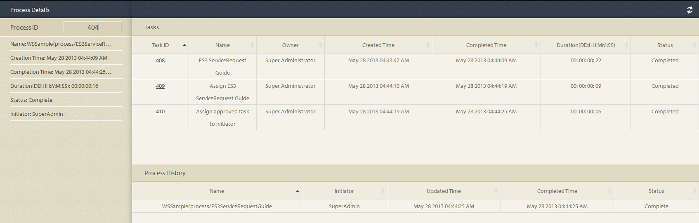

# プロセスレポートのアドホッククエリ{#ad-hoc-queries-in-process-reporting}

## プロセスレポートのアドホッククエリ {#ad-hoc-queries-in-process-reporting-1}

プロセスレポートのアドホッククエリを使用すると、AEM Forms環境で定義されたAEM Formsプロセスインスタンスのプロセスおよびタスクの詳細を検索するために使用できるカスタムクエリを作成できます。

また、アドホッククエリは、プロセスプロパティとタスクプロパティのフィルターを使用して定義できます。 これらのフィルターは保存して、後でレポートを実行するために使用できます。

[**プロセスの検索**](/help/forms/using/process-reporting/adhoc-queries-in-process-reporting.md#p-process-task-search-p):プロセス属性に基づいて、ユーザー定義の検索フィルターを使用してプロセスインスタンスを検索します。

[**プロセスの詳細**](/help/forms/using/process-reporting/adhoc-queries-in-process-reporting.md#p-process-task-details-p):プロセスIDを指定することによるプロセスインスタンスの表示の詳細。

**タスク検索**:タスク属性に基づいて、タスク定義の検索フィルターを使用してユーザーインスタンスを検索します。

**タスクの詳細**:タスクIDを指定して、タスクインスタンスの表示の詳細を表示します。

### プロセスとタスク {#processes-and-tasks}

フィルターを作成し、プロセスの詳細に対してクエリを実行する手順は、タスクの場合と同じです。

つまり、プロセス検索とタスク検索のユーザーインターフェイスは、検索できるフィールドと検索結果に返されるフィールドでのみ異なります。 これは単に、多くのフィールドが同一ですが、特定のフィールドはプロセスに固有で、特定のフィールドはタスクに固有であるためです。

この記事では、「プロセス/タスクの検索」および「プロセス/タスクの詳細」セクションの説明を説明します。 適切な場所で、具体的な違いはすべて呼び出されます。

## プロセス/タスクの検索 {#process-task-search}

プロセス/タスク検索を使用して、プロセス/タスクインスタンスをクエリーするフィルターを定義します。

### プロセス/タスク検索クエリを作成するには {#to-create-a-process-task-search-query}

1. 保存したプロセス/タスク検索クエリを表示する場合、またはクエリを作成する場合は、「 **アドホッククエリ** 」をクリックし、「 **プロセス/タスク検索**」をクリックします。

   

   ツリー表示の右側に **[マイフィルター** ]パネルが表示されます。

   フィルター **** パネルで、新しいアドホッククエリを作成し、をクリックして以前に保存したクエリを実行できます。

   

1. 既存のクエリを実行するには、 **マイフィルター** パネルでクエリをクリックします。
1. クエリを作成するには、 **** 追加(+)をクリックします。

   フィルタ **ーを作成** パネルが表示されます。

   

   クエリは、1つ以上のクエリフィルターで構成されます。 フィルタを作成するには、クエリにフィルタ行を追加します。 デフォルトでは、1つのフィルター行がクエリに追加されます。

   **フィルターを定義するには**

   1. フィールドを選択します。

      

      >[!NOTE]
      >
      >フィールドリストには、AEM Formsのプロセス/タスクに固有のフィールドが含まれます。

   1. 条件を選択します。

      

      >[!NOTE]
      >
      >表示される条件は、フィルタリングの対象として選択した属性によって異なります。

   1. 値を入力します。

      

   1. クエリに別のフィルターを追加するには、フィルター行の右 **にある** (+)をクリックします。

      クエリからフィルタを削除するには、フィルタ行の右にある[ **削除** ] (-)をクリックします。

      

クエリを作成した後、フィルターを **作成パネルの右上隅にあるオプションを使用して** 、次の操作を行います。

* **キャンセル**:変更をキャンセルし、 **マイフィルター** パネルに戻ります。
* **実行**:現在のクエリを実行して、結果を表示/検証します。 この場合、クエリを実行する前にクエリを保存する必要はありません。 結果を確認し、必要に応じて変更を加えた後、出力に満足したらクエリを保存します。
* **保存**:フィルターを保存します。 その後、 **マイフィルター** パネルでフィルターを表示および実行できます。

### マイフィルターパネルのオプション {#options-in-my-filters-panel}

フィルター **パネルのオプションを使用して** 、 ****lc **_pr_add_filter、lc_edit** lc_edit lc_edit ****filter lc_delete pr_delet pr_pr_edit lc_pr_hocクエリのを使用します。

### 検索クエリを実行するには {#to-execute-a-search-query}

1. クエリを実行するには、 **マイフィルター** パネルでフィルターをクリックするか、フィルターを作成または編集する場合は「 **実行** 」ボタンをクリックします。
1. クエリの結果は、 **プロセスレポート** ウィンドウの **レポート** パネルに表示されます。

   

   レポートの下部に表示されるページ編集パネルを使用して、検索結果をページ分けできます。

   

   「 **表示** 」ドロップダウンリストで、1ページに表示する結果の数を選択します。

   「 **ページ** 」テキストボックスに、そのページに直接移動するページ番号を入力します。

1. 次のフィールドがプロセスの検索結果に表示されます。

   * **プロセスID**:プロセスのID。 フィールドはハイパーリンクされています。 このフィールドのプロセスIDをクリックすると、そのプロセスの **[!UICONTROL プロセスの詳細]** パネルにリダイレクトされます。
   * **イニシエータ**:プロセスインスタンスを開始したAEM Formsユーザー
   * **作成時刻**:プロセスインスタンスが開始した日時
   * **完了時刻**:プロセスインスタンスが完了した日時
   * **期間**:プロセスインスタンスの開始から完了までの期間
   * **ステータス**:プロセスインスタンスの現在のステータス。

   デフォルトでは、結果はプロセスIDで並べ替えられます。 一方、フィールドのタイトルをクリックすると、結果を任意のフィールドで並べ替えることができます。

   並べ替えは切り替え操作なので、列ヘッダーをクリックして結果を昇順に並べ替え、もう一度クリックして降順に並べ替えます。

   同様に、タスク検索結果に次のフィールドが表示されます。

   * **タスクID**:タスクのID。 フィールドはハイパーリンクされています。 このフィールドでタスクIDをクリックすると、そのタスクの **[!UICONTROL タスクの詳細]** パネルにリダイレクトされます。
   * **イニシエータ**:プロセスインスタンスを開始したAEM Formsユーザー
   * **作成時刻**:プロセスインスタンスが開始した日時
   * **完了時刻**:プロセスインスタンスが完了した日時
   * **期間**:プロセスインスタンスの開始から完了までの期間
   * **ステータス**:プロセスインスタンスの現在のステータス。

   デフォルトでは、結果はタスクIDで並べ替えられます。 一方、フィールドのタイトルをクリックすると、結果を任意のフィールドで並べ替えることができます。 結果は、列見出しの横に暗い矢印で示される列で並べ替えられます。

   並べ替えは切り替え操作なので、フィールドヘッダーをクリックして結果を昇順に並べ替え、もう一度クリックして降順に並べ替えます。 現在の並べ替え順（昇順/降順）は、列ヘッダーの横にある暗い矢印の方向で示されます。

   

1. 左上のパネルボタン  をクリックして、 **マイフィルターペインを折りたたみ、** レポート **** パネルで使用できる領域を拡張します。
1. **レポート**パネルの右上隅にあるオプションを使用して、クエリ結果に対する操作を実行します。

   * **更新**:ストレージ内の最新データを使用してレポートを更新します

   * **CSVにエクスポート**:レポートデータをコンマ区切りファイルにエクスポートします。
   >[!NOTE]
   >
   >レポートを書き出すと、検索結果の全体が、現在のページだけでなくCSVファイルに書き出されます

## プロセス/タスクの詳細 {#process-task-details}

特定のプロセスの詳細を表示するには、 **プロセスの詳細** パネルを使用します。

同様に、 **タスクの詳細** パネルを使用して、特定のタスクの詳細を表示します。

### 表示プロセス/タスクの詳細へ {#to-view-process-task-details}

特定のAEM Forms・プロセス/タスクの詳細を表示できます。

* **プロセス/タスクの検索結果から**
* **プロセス/タスクの詳細パネルにプロセス/タスクIDを入力する**

#### プロセス/タスクの検索結果から {#from-a-process-task-search-result}

1. プロセス/タスク検索を実行します。 詳しくは、「プロセス検索クエリ [を実行するには](#to-execute-a-search-query)」を参照してください。

   結果で返されるプロセスIDは、ハイパーリンクされています。

   

1. リストでプロセスIDをクリックして、 **プロセスの詳細** パネルにこのプロセスの詳細を表示します。

   「 **プロセス/タスクの詳細** 」クエリ結果には、プロセス/タスクに含まれるタスク/フォームの詳細が表示されます。

   デフォルトでは、結果はタスク/フォームIDで並べ替えられます。 一方、フィールドのタイトルをクリックすると、結果を任意のフィールドで並べ替えることができます。 結果の並べ替えに使用される列は、列ヘッダーの横に暗い矢印で示されます。

   並べ替えは切り替え操作なので、フィールドヘッダーをクリックして結果を昇順に並べ替え、もう一度クリックして降順に並べ替えます。 現在の並べ替え順（昇順/降順）は、列ヘッダーの横にある暗い矢印の方向で示されます。

   **プロセスの詳細の結果**

   

   **左側のパネル：** 選択したプロセスの次の詳細が表示されます。

   * プロセス名
   * プロセス作成日時
   * プロセス完了日時
   * プロセス期間
   * プロセスの状態
   * プロセス開始者

   **右上のパネル：** 選択したプロセスを構成するタスクの次の詳細が表示されます。

   * タスクID
   * タスク名
   * タスク所有者
   * タスク作成日時
   * タスク更新日時
   * タスク完了日時
   * タスク時間
   * タスク状態

   **右下のパネル：** 選択したプロセスのプロセス履歴の次の詳細が表示されます。

   * プロセス名
   * プロセス開始者
   * プロセスの更新日時
   * プロセス完了日時
   * プロセスの状態

   **タスクの詳細の結果**

   

   **左側のパネル：** 選択したタスクの次の詳細が表示されます。

   * タスク名
   * このタスクが属するプロセスのID
   * タスクの説明
   * タスク作成日時
   * タスク完了日時
   * タスク時間
   * タスク状態
   * 選択されたタスクルート

   **右上のパネル：** 選択したタスクを構成するフォームの次の詳細が表示されます。

   * Foprm ID
   * フォーム作成日時
   * フォーム更新日時
   * フォームテンプレートURL

   **右下のパネル：** 選択したタスクのプロセス履歴の次の詳細が表示されます。

   * タスク割り当てタイプ
   * タスク所有者
   * タスク割り当て作成日時
   * タスク更新日時

1. 「 **プロセス/タスク検索に戻る** 」をクリックして、プロセス/タスクの詳細がドリル・ダウンされた検索結果に戻ります。

   

   ただし、特定のプロセス/タスクIDを入力してプロセス/タスクの詳細が見つかった場合は、「Back to Process/Search」をクリックすると、検索結果を表示せずに「 **Process/タスクSearch**」に戻ります。

#### プロセス/タスクの詳細パネルにプロセス/タスクIDを入力する {#by-entering-the-process-task-id-in-the-process-task-details-panel-br}

1. 「 **プロセス/タスクの詳細** 」パネルに移動します。

   

1. 「プロセス/タスクID」テキストボックスに、プロセス/タスクIDを入力します。

   

   「 **プロセス/タスク詳細** 」クエリ結果のフィールドは、AEM Formsのプロセス/タスクに固有のフィールドです。

   プロセスの場合、クエリ結果にはプロセスに含まれるタスクの詳細が表示されます。

   タスクの場合、クエリ結果にはタスクに含まれるフォームの詳細が表示されます。
