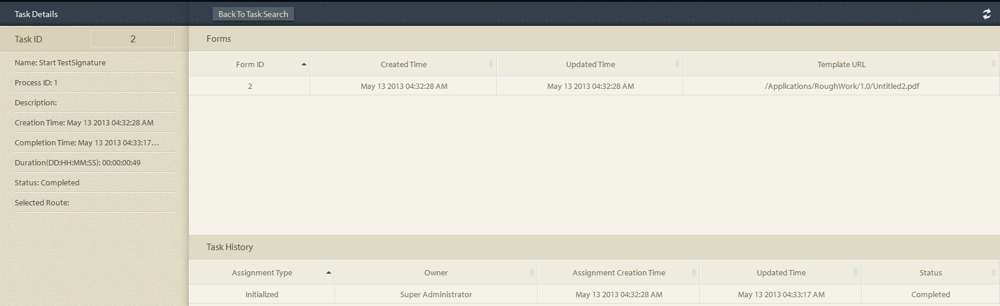

# プロセスレポートのアドホッククエリ{#ad-hoc-queries-in-process-reporting}

## プロセスレポートのアドホッククエリ {#ad-hoc-queries-in-process-reporting-1}

プロセスレポートのアドホッククエリを使用すると、AEM Forms 環境で定義された AEM Forms プロセスインスタンスのプロセスとタスクの詳細を検索するために使用できるカスタムクエリを作成できます。

また、アドホッククエリは、プロセスおよびタスクのプロパティフィルターを使用して定義できます。その後、これらのフィルターを保存し、後でレポートを実行するために使用できます。

[**プロセスの検索**](/help/forms/using/process-reporting/adhoc-queries-in-process-reporting.md#p-process-task-search-p)：プロセス属性に基づいて、ユーザー定義の検索フィルターを使用してプロセスインスタンスを検索します。

[**プロセスの詳細**](/help/forms/using/process-reporting/adhoc-queries-in-process-reporting.md#p-process-task-details-p)：プロセス ID を指定して、プロセスインスタンスの詳細を表示します。

**タスクの検索**：タスク属性に基づいて、ユーザー定義の検索フィルターを使用してタスクインスタンスを検索します。

**タスクの詳細**：タスク ID を指定して、タスクインスタンスの詳細を表示します。

### プロセスとタスク {#processes-and-tasks}

フィルターを作成しクエリを実行してプロセスの詳細を得る際に行う手順は、タスクの場合の手順と同じです。

つまり、「プロセスの検索」と「タスクの検索」のユーザーインターフェイスは、検索フィールドと、検索結果が返されるフィールドのみが異なります。これは単に、多くのフィールドが同一ですが、プロセスに固有のフィールドもあれば、タスクに固有のフィールドもあるためです。

この記事では、「プロセスとタスクの検索」および「プロセスとタスクの詳細」の各節の詳細を説明します。具体的な違いを、適切な場所で具体的に示します。

## プロセスとタスクの検索 {#process-task-search}

プロセスとタスクの検索を使用して、プロセスとタスクのインスタンスを問い合わせるフィルターを定義します。

### プロセスとタスクの検索クエリを作成するには {#to-create-a-process-task-search-query}

1. 保存したプロセスとタスクの検索クエリを表示するか、クエリを作成するには、**アドホッククエリ**／**プロセスとタスクの検索**&#x200B;をクリックします。

   

   **マイフィルター**&#x200B;パネルがツリービューの右側に表示されます。

   **マイフィルター**&#x200B;パネルでは、新しいアドホッククエリを作成し、クリックして以前に保存したクエリを実行できます。

   

1. 既存のクエリを実行するには、**マイフィルター**&#x200B;パネルのクエリを単にクリックします。
1. クエリを作成するには、**追加**（+）をクリックします。

   **フィルターを作成**&#x200B;パネルが表示されます。

   

   クエリは、1 つまたは複数のクエリフィルターで構成されます。フィルターを作成するには、クエリにフィルター行を追加します。デフォルトでは、1 つのフィルター行がクエリに追加されます。

   **フィルターを定義するには**

   1. フィールドを選択します。

      

      >[!NOTE]
      >
      >フィールドリストには、AEM Forms のプロセスとタスクに固有のフィールドが含まれています。

   1. 条件を選択します。

      

      >[!NOTE]
      >
      >表示される条件は、フィルタリング用に選択した属性によって異なります。

   1. 値を入力します。

      

   1. クエリに別のフィルターを追加するには、フィルター行の右側にある&#x200B;**「追加」（+）** をクリックします。

      クエリからフィルターを削除するには、フィルター行の右側にある&#x200B;**「削除」（-）** をクリックします。

      

クエリを作成した後、**フィルターを作成**&#x200B;パネルの右上隅のオプションを使用します。

* **キャンセル**：変更をキャンセルし、**マイフィルター**&#x200B;パネルに戻ります。
* **実行**：現在のクエリを実行して、結果を確認または検証します。この場合、クエリを実行する前にクエリを保存する必要はありません。結果を確認し、必要に応じて変更して、出力に満足したらクエリを保存できます。
* **保存**：フィルターを保存します。その後、フィルターを&#x200B;**マイフィルター**&#x200B;パネルで表示して実行できます。

### マイフィルターパネルのオプション {#options-in-my-filters-panel}

**マイフィルター**&#x200B;パネルのオプションを使用し、 を&#x200B;**追加**&#x200B;し、 を&#x200B;**編集**&#x200B;するか、 アドホッククエリを&#x200B;**削除**&#x200B;してください。

### 検索クエリを実行するには {#to-execute-a-search-query}

1. クエリを実行するには、フィルターを作成もしくは編集している場合、**マイフィルター**&#x200B;パネルまたは「**実行** 」ボタンをクリックしてください。
1. クエリの結果は、**プロセスのレポート**&#x200B;ウィンドウの&#x200B;**レポート**&#x200B;パネルに表示されます。

   

   レポートの下部に表示されるページネーションパネルを使用して、検索結果にページ番号を付けることができます。

   

   **表示**&#x200B;ドロップダウンリストから、1 ページに表示する結果の数を選択します。

   「**ページ**」テキストボックスに、ページ番号を入力してそのページに直接移動します。

1. プロセスの検索結果には、次のフィールドが表示されます。

   * **プロセス ID**：プロセスの ID。このフィールドにはハイパーリンクが付いています。このフィールドでプロセス ID をクリックすると、プロセスの&#x200B;**[!UICONTROL プロセスの詳細]**&#x200B;パネルにリダイレクトされます。
   * **イニシエーター**：プロセスインスタンスを開始した AEM Forms ユーザー
   * **作成時刻**：プロセスインスタンスが開始した日時
   * **完了時間**：プロセスインスタンスが完了した日時
   * **期間**：プロセスインスタンスの開始から完了までの期間
   * **ステータス**：プロセスインスタンスの現在のステータス。

   デフォルトでは、結果はプロセス ID で並べ替えられます。ただし、任意のフィールドで結果を並べ替える場合は、フィールドのタイトルをクリックしてください。

   並べ替えは切り替えによる操作なので、列ヘッダーをクリックして結果を昇順に並べ替え、もう一度クリックして降順に並べ替えます。

   同様に、次のフィールドがタスクの検索結果に表示されます。

   * **Task ID**：タスクの ID。このフィールドにはハイパーリンクが付いています。このフィールドでタスク ID をクリックすると、そのタスクの&#x200B;**[!UICONTROL タスクの詳細]**&#x200B;パネルにリダイレクトされます。
   * **イニシエーター**：プロセスインスタンスを開始した AEM Forms ユーザー
   * **作成時刻**：プロセスインスタンスが開始した日時
   * **完了時間**：プロセスインスタンスが完了した日時
   * **期間**：プロセスインスタンスの開始から完了までの期間
   * **ステータス**：プロセスインスタンスの現在のステータス。

   デフォルトでは、結果はタスク ID で並べ替えられます。ただし、任意のフィールドで結果を並べ替えるには、フィールドのタイトルをクリックします。結果は、列ヘッダーの横に暗い矢印が表示される列で並べ替えられます。

   並べ替えは切り替え操作なので、結果を昇順に並べ替えるにはフィールドヘッダーをクリックし、降順に並べ替えるには再度クリックします。現在の並べ替え順（昇順／降順）は、列ヘッダーの隣にある暗い矢印の方向で示されます。

   

1. 左上のレールボタン  をクリックし、**マイフィルター**&#x200B;ペインを折りたたみ、**レポート**&#x200B;パネルで利用可能なスペースを展開します。
1. **レポート ** パネルの右上隅にあるオプションを使用して、クエリ結果に対する操作を実行します。

   * **更新**：ストレージに存在する最新のデータでレポートを更新します

   * **CSV に書き出し**：レポートデータをコンマ区切りファイルにエクスポートします。
   >[!NOTE]
   >
   >レポートをエクスポートする場合、検索結果全体が現在のページだけでなく CSV ファイルにエクスポートされます

## プロセス／タスクの詳細 {#process-task-details}

**プロセスの詳細**&#x200B;パネルを使用して、特定のプロセスの詳細を表示できます。

同様に、**タスクの詳細**&#x200B;パネルを使用して、特定のタスクの詳細を表示します。

### プロセス／タスクの詳細の表示 {#to-view-process-task-details}

特定の AEM Forms プロセス／タスクの詳細を表示できます。

* **プロセス／タスク検索結果から**
* **プロセス／タスクの詳細パネルでプロセス／タスク ID を入力する**

#### プロセス／タスク検索結果から {#from-a-process-task-search-result}

1. プロセス/タスク検索を実行します。詳しくは、[プロセス検索クエリを実行するには](#to-execute-a-search-query)を参照してください。

   結果で返されるプロセス ID の表示はハイパーリンクされていることにご注意ください。

   

1. リストでプロセス ID をクリックすると、**プロセスの詳細**&#x200B;パネルにこのプロセスの詳細が表示されます。

   **プロセス／タスクの詳細**&#x200B;のクエリ結果には、プロセス／タスクに含まれるタスク／フォームの詳細が表示されます。

   デフォルトでは、結果はタスク／フォーム ID で並べ替えられます。ただし、任意のフィールドで結果を並べ替えるには、フィールドのタイトルをクリックします。結果の並べ替えに使用される列は、列ヘッダーの隣にある暗い矢印で示されます。

   並べ替えは切り替え操作なので、結果を昇順に並べ替えるにはフィールドヘッダーをクリックし、降順に並べ替えるには再度クリックします。現在の並べ替え順（昇順／降順）は、列ヘッダーの隣にある暗い矢印の方向で示されます。

   **プロセスの詳細の結果**

   

   **左パネル：**&#x200B;選択したプロセスに関する次の詳細が表示されます。

   * プロセスの名前
   * プロセスの作成日時
   * プロセスの完了日時
   * プロセスの期間
   * プロセスのステータス
   * プロセスの開始者

   **右上のパネル：**&#x200B;選択したプロセスを構成するタスクに関する次の詳細が表示されます。

   * タスク ID
   * タスクの名前
   * タスクの所有者
   * タスクの作成日時
   * タスクの更新日時
   * タスクの完了日時
   * タスクの期間
   * タスクのステータス

   **右下のパネル：**&#x200B;選択したプロセスのプロセス履歴に関する次の詳細が表示されます。

   * プロセス名
   * プロセスの開始者
   * プロセスの更新日時
   * プロセスの完了日時
   * プロセスのステータス

   **タスクの詳細の結果**

   

   **左パネル：**&#x200B;選択したタスクに関する次の詳細が表示されます。

   * タスク名
   * このタスクが属するプロセスの ID
   * タスクの説明
   * タスクの作成日時
   * タスクの完了日時
   * タスクの期間
   * タスクのステータス
   * タスクの選択されたルート

   **右上のパネル：** 選択したタスクを構成するフォームに関する次の詳細を表示します。

   * フォーム ID
   * フォームの作成日時
   * フォームの更新日時
   * フォームのテンプレート URL

   **右下のパネル：**&#x200B;選択したタスクのプロセス履歴に関する次の詳細が表示されます。

   * タスクの割り当てのタイプ
   * タスクの所有者
   * タスクの割り当ての作成日時
   * タスクの更新日時

1. 「**プロセス／タスクの検索に戻る**」をクリックして、プロセス／タスクの詳細がドリルダウンされた検索結果に戻ります。

   

   ただし、特定のプロセス／タスク ID を入力してプロセス／タスクの詳細が見つかった場合に、「プロセス／タスクの検索に戻る」をクリックすると、「**プロセス／タスクの検索**」に戻り、検索結果は表示されません。

#### プロセス／タスクの詳細パネルでプロセス／タスク ID を入力する {#by-entering-the-process-task-id-in-the-process-task-details-panel-br}

1. **プロセス／タスクの詳細**&#x200B;パネルに移動します。

   

1. 「プロセス／タスク ID」テキストボックスに、プロセス／タスク ID を入力します。

   

   **プロセス／タスクの詳細**&#x200B;のクエリ結果のフィールドは、AEM Forms のプロセス／タスクに特有のフィールドです。

   プロセスの場合、クエリ結果には、プロセスに含まれるタスクの詳細が表示されます。

   タスクの場合、クエリ結果にはタスクに含まれるフォームの詳細が表示されます。
