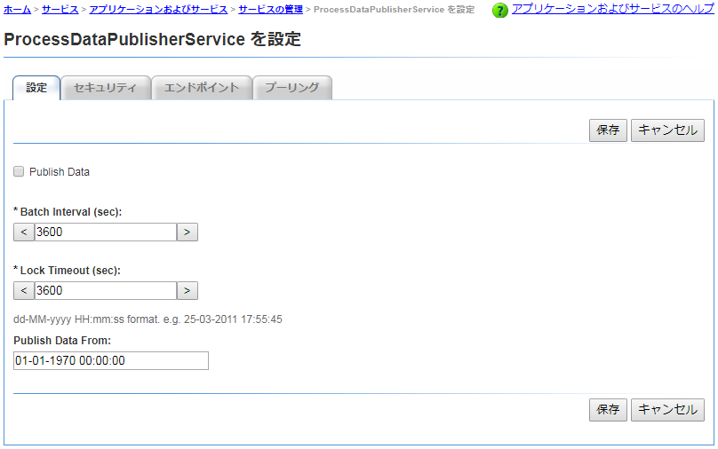
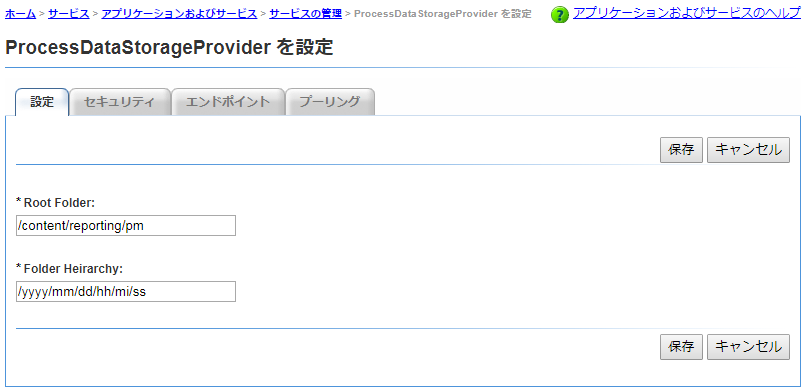
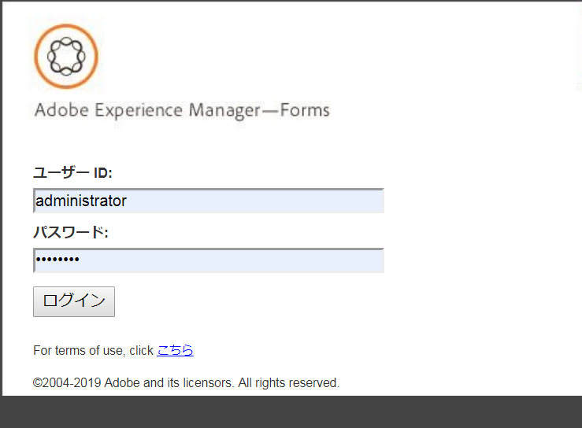
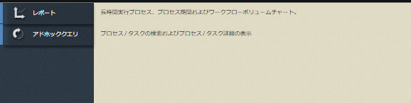

# Getting Started with Process Reporting{#getting-started-with-process-reporting}

プロセスレポートを使用すると、AEM Formsユーザーは、現在AEM Forms実装で定義されているAEM Formsプロセスに関する情報をクエリできます。 ただし、プロセスレポートはAEM Formsリポジトリからデータに直接アクセスすることはありません。 データは、最初に（ProcessDataPublisherおよびProcessDataStorageサービスによって）スケジュールに基づい&#x200B;*てプロセスレポートリポジトリに発*&#x200B;行されます。 次に、プロセスレポートのレポートとクエリは、リポジトリに発行されたプロセスレポートデータから生成されます。 プロセスレポートは、Forms Workflowモジュールの一部としてインストールされます。

この記事では、AEM Formsデータをプロセスリポジトリに発行する手順について詳しく説明します。レポート その後、プロセスレポートを使用してレポートとクエリを実行 この記事では、プロセスレポートサービスの設定に使用できるオプションも扱います。

## プロセスレポートの前提条件 {#process-reporting-pre-requisites}

### 不要なプロセスの削除 {#purge-non-essential-processes}

現在Forms Workflowを使用している場合、AEM Formsデータベースに大量のデータが含まれている可能性があります

プロセスレポート発行サービスは、データベースで現在使用可能なすべてのAEM Formsデータを発行します。 つまり、データベースにレポートやクエリを実行したくないレガシーデータが含まれている場合、レポートの必要がなくても、そのデータはすべてリポジトリに発行されます。 サービスを実行してデータをプロセスレポートリポジトリに発行する前に、このデータを削除することをお勧めします。 これにより、Publisherサービスと、データをレポートするためにクエリするサービスの両方のパフォーマンスが向上します。

AEM Formsプロセスデータの削除について詳しくは、「プロセスデータの削 [除」を参照してくださ](https://help.adobe.com/en_US/livecycle/11.0/AdminHelp/WS92d06802c76abadb-5145d5d12905ce07e7-7cb2.2.html)い。

>[!NOTE]
>
>パージユーティリティのヒントとテクニックについては、プロセスとジョブの削除に関するAdobe Developer Connectionの記 [事を参照してください](https://www.adobe.com/content/dam/Adobe/en/devnet/livecycle/pdfs/purging_processes_jobs.pdf)。

## プロセスレポートサービスの設定 {#configuring-process-reporting-services}

### プロセスデータの公開のスケジュール {#schedule-process-data-publishing}

プロセスレポートサービスは、AEM Formsデータベースのデータをスケジュールに基づいてプロセスレポートリポジトリに発行します。

この操作はリソースを大量に消費し、AEM Formsサーバーのパフォーマンスに影響を与える可能性があります。 このスケジュールは、AEM Formsサーバーの外部でビジータイムスロットを使用する場合に行うことをお勧めします。

デフォルトでは、データの公開は毎日午前2時に実行されるようにスケジュールされています。

次の手順を実行して、発行スケジュールを変更します。

>[!NOTE]
>
>AEM Forms実装をクラスターで実行する場合は、クラスターの各ノードで次の手順を実行します。

1. AEM Formsサーバーインスタンスを停止します。
1. &#x200B;

   * （Windowsの場合）ファイルをエデ `[JBoss root]/bin/run.conf.bat` ィターで開きます。
   * （Linux、AIXおよびSolarisの場合）エディタ `[JBoss root]/bin/run.conf.sh` ー内のファイル。

1. JVM追加引数 `-Dreporting.publisher.cron = <expression>.`

   例：次のcron式を使用すると、プロセスレポートは5時間ごとにAEM Formsデータをプロセスレポートリポジトリに発行します。

   * `-Dreporting.publisher.cron = 0_0_0/5_*_*_?`

1. Save and close the `run.conf.bat` file.

1. AEM Formsサーバーインスタンスを再起動します。

1. AEM Formsサーバーインスタンスを停止します。
1. Log in to the WebSphere Administrative Console. In the navigation tree, click **Servers** > **Application servers** and then, in the right pane, click the server name.

1. Under Server Infrastructure, click **Java and Process Management** > **Process Definition**.

1. 「Additional Properties」で、「**Java Virtual Machine**」をクリックします。

   In the Generic JVM arguments box, add the argument `-Dreporting.publisher.cron = <expression>.`

   **例**:次のcron式を使用すると、プロセスレポートは5時間ごとにAEM Formsデータをプロセスレポートリポジトリに発行します。

   * `-Dreporting.publisher.cron = 0_0_0/5_*_*_?`

1. Click **Apply**, click OK, and then click **Save directly to the master configuration**.
1. AEM Formsサーバーインスタンスを再起動します。
1. AEM Formsサーバーインスタンスを停止します。
1. WebLogic管理コンソールにログインします。 WebLogic管理コンソールのデフォルトのアドレスはで `https://[hostname]:[port]/console`す。
1. Change Center で、「**Lock &amp; Edit**」をクリックします。
1. 「Domain Structure」で、**Environment**／**Servers** をクリックし、右側のウィンドウで、管理対象サーバー名をクリックします。
1. 次の画面で、「**Configuration**」タブ／「**Server Start**」タブをクリックします。
1. 「Arguments」ボックスにJVM引数を追加します `-Dreporting.publisher.cron = <expression>`。

   **例**:次のcron式を使用すると、プロセスレポートは5時間ごとにAEM Formsデータをプロセスレポートリポジトリに発行します。

   `-Dreporting.publisher.cron = 0_0_0/5_*_*_?`

1. 「**Save**」をクリックし、「**Activate Changes**」をクリックします。
1. AEM Formsサーバーインスタンスを再起動します。

### ProcessDataStorageサービス {#processdatastorage-service}

ProcessDataStorageProviderサービスは、ProcessDataPublisherサービスからプロセスデータを受け取り、そのデータをプロセスレポートリポジトリに保存します。

各公開サイクルで、データは事前定義されたルートフォルダのサブフォルダに保存されます。

管理コンソールを使用して、ルートを設定できます(デフォル&#x200B;**ト**: `/content/reporting/pm`)場所とサブフォルダ(デフォ&#x200B;**ルト**: `/yyyy/mm/dd/hh/mi/ss`)プロセスデータが保存される階層形式。

#### プロセスリポジトリの場所をレポートするには {#to-configure-the-process-reporting-repository-locations}

1. 管理者の資格情報を使 **用して** 、管理コンソールにログインします。 The default URL of Administration Console is `https://'[server]:[port]'/adminui`
1. ホーム/サービス/ **アプリケーション****/サービス** /サービスの管理とオープン・ストレージ・ストレージ・プロ ************ バイダ・サービスに移動します。

   

   **RootFolder**

   プロセスデータが保存されるCRXのレポート。

   `Default`: `/content/reporting/pm`

   **フォルダ階層**

   プロセス作成時間に基づいて、プロセスデータが格納されるフォルダー階層。

   `Default`: `/yyyy/mm/dd/hh/mi/ss`

1. 「**保存**」をクリックします。

### ReportConfigurationサービス {#reportconfiguration-service}

ReportConfigurationサービスは、プロセスレポートがプロセス設定サービスをレポートするために使用します。

#### To configure the ReportingConfiguration service {#to-configure-the-reportingconfiguration-service}

1. CRX管理者の資格情 **報を使用して** 、Configuration Managerにログインします。 Configuration ManagerのデフォルトのURLは、 `https://'[server]:[port]'/lc/system/console/configMgr`
1. ReportingConfigurationサービスを **開きます** 。
1. **レコード数**

   リポジトリでクエリを実行すると、結果に大量のレコードが含まれる可能性があります。 結果セットが大きい場合、クエリの実行でサーバーリソースが消費されます。

   大きな結果セットを処理するために、ReportConfigurationサービスはクエリ処理をレコードのバッチに分割します。 これにより、システムの負荷が軽減されます。

   `Default`: `1000`

   **CRXストレージパス**

   プロセスデータを保存するCRXのレポート。

   `Default`: `/content/reporting/pm`

   >[!NOTE]
   >
   >これは、ProcessDataStorage設定オプションの **Root Folderで指定した場所と同じです**。
   >
   >
   >ProcessDataStorage設定で「Root Folder」オプションを更新する場合は、ReportConfigurationサービスのCRXストレージパスの場所を更新する必要があります。

1. 「 **Save** 」をクリッ **クし、CQ Configuration Managerを閉じます**。

### ProcessDataPublisherサービス {#processdatapublisher-service}

ProcessDataPublisherサービスは、AEM Formsデータベースからプロセスデータを読み込み、データをProcessDataStorageProviderサービスに発行してストレージします。

#### ProcessDataPublisherサービスを設定するには {#to-configure-processdatapublisher-service-nbsp}

1. 管理者の資格情報を使 **用して** 、管理コンソールにログインします。

   The default URL is `https://'server':port]/adminui/`.

1. ホーム/サービ **ス** /アプリケーション **/サービス** /サービスに移動し、デ ************ ータ・パブリッシャ・データ・サービスに移動します。

**データの発行**

このオプションを有効にすると、開始パブリッシングプロセスデータが表示されます。 デフォルトでは、このオプションは無効になっています。

「プロセスレポート」は、プロセスレポートコンポーネントに関連するすべての設定が適切に設定されている場合にのみ有効にします。

または、不要になったプロセスデータの公開を無効にする場合は、このオプションを使用します。

`Default`: `Off`

**バッチ間隔（秒）**

ProcessDataPublisherサービスが実行されるたびに、サービスは、最後に実行されたサービスからの時間をBatch Intervalで最初に分割します。 次に、AEM Formsデータの各間隔を別々に処理します。

これは、サイクル内の各実行（バッチ）の間に、パブリッシャが処理するデータのサイズを制御するのに役立ちます。

例えば、発行者が毎日実行する場合、1日分のデータ全体を1回の実行で処理する代わりに、デフォルトでは、各処理を24バッチの1時間に分割します。

`Default`: `3600`

`Unit`: `Seconds`

**ロックタイムアウト（秒）**

パブリッシャ・サービスは、開始がデータを処理する際にロックを取得するので、パブリッシャの複数のインスタンスが同時に開始を実行してデータを処理することはありません。

ロックを取得したパブリッシャーサービスが、Lock Timeout値で定義された秒数の間アイドル状態の場合、そのロックが解放され、他のパブリッシャーサービスインスタンスの処理を続行できます。

`Default`: `3600`

`Unit`: `Seconds`

**データの発行元**

AEM Forms環境には、データが設定された時点の環境が含まれます。

デフォルトでは、ProcessDataPublisherサービスはAEM Formsデータベースからすべてのデータをインポートします。

レポートのニーズに応じて、特定の日時以降にレポートやクエリをデータで実行する場合は、日時を指定することをお勧めします。 その後、公開サービスはその日付以降に公開されます。

`Default`: `01-01-1970 00:00:00`

`Format`: `dd-MM-yyyy HH:mm:ss`

## プロセスレポートのユーザーインターフェイス {#accessing-the-process-reporting-user-interface}

プロセスユーザーのユーザーインターフェイスは、レポートベースのものです。

プロセスレポートの設定後、AEM Formsのインストール先の次の場所で、プロセスレポートの操作を開始できます。

`https://<server>:<port>/lc/pr`

### 「Log in to Process」レポート {#log-in-to-process-reporting}

プロセスレポートURL(https://&lt;server>:&lt;port>/lc/pr)に移動すると、ログイン画面が表示されます。

資格情報を指定して、プロセスレポートモジュールにログインします。

>[!NOTE]
>
>プロセスレポートユーザーインターフェイスにログインするには、次のAEM Forms権限が必要です。
>
>`PERM_PROCESS_REPORTING_USER`

プロセスレポートにログインすると、ホ **[!UICONTROL ーム]** 画面が表示されます。

### プロセスレポートのホーム画面 {#process-reporting-home-screen}

**プロセスレポートツリー表示:** ホーム画面の左側のツリー表示には、プロセスモジュールモジュールの項目が含まれています。レポート

ツリー表示は、次の最上位レベルの項目で構成されます。

**レポート：** この項目には、プロセスレポートに付属のあらかじめ用意されているレポートが含まれています。

事前定義済みのレポートについて詳しくは、「プロセス [レポートの事前定義済みレポート](/help/forms/using/process-reporting/pre-defined-reports-in-process-reporting.md)」を参照。

**アドホッククエリ:** この項目には、プロセスとオプションのフィルターベースの検索を実行するためのオプションが含まれています。タスク

アドホッククエリについて詳しくは、プロセス [レポートのアドホッククエリを参照してください](/help/forms/using/process-reporting/adhoc-queries-in-process-reporting.md)。

**カスタム：** 「カスタム」ノードには、作成したカスタムレポートが表示されます。

カスタムレポートの作成と表示の手順については、「プロセスレポートのカス [タムレポート」を参照してくださ](/help/forms/using/process-reporting/process-reporting-custom-reports.md)い。

**プロセスレポートのタイトルバー：** プロセスレポートのタイトルバーには、ユーザーインターフェイスで作業する際に使用できる一般的なオプションがいくつか含まれています。

**プロセスレポートのタイトル：** プロセスレポートのタイトルがタイトルバーの左隅に表示されます。

タイトルをクリックすると、ホーム画面に戻ります。

**最終更新時刻：** プロセスデータは、スケジュールに基づいてAEM Formsデータベースからプロセスレポートリポジトリに発行されます。

「最終更新時刻」には、データ更新がプロセスレポートリポジトリにプッシュされた最終日時が表示されます。

データ公開サービスとこのサービスのスケジュール方法について詳しくは、「プロセスレポート [— はじめに](/help/forms/using/process-reporting/install-start-process-reporting.md#p-schedule-process-data-publishing-p) 」の「プロセスデータの公開のスケジュール」を参照してください。

**プロセスレポートユーザー：** ログインしたユーザー名は、最終更新時刻の右側に表示されます。

**プロセスレポートのタイトルバーのドロップダウンリスト:** プロセスリストのタイトルバーの右隅にあるドロップダウンレポートには、次のオプションが含まれます。

* **[!UICONTROL 同期]**:埋め込みのプロセスレポートリポジトリをAEM Formsデータベースと同期します。
* **[!UICONTROL ヘルプ]**:表示プロセスのレポート。
* **[!UICONTROL ログアウト]**:「Log out of Process」レポート

[サポートへのお問い合わせ](https://www.adobe.com/account/sign-in.supportportal.html)
