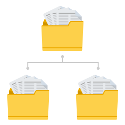

# プロセスレポート{#introduction-to-process-reporting}

プロセスレポートは、AEM Formsのプロセスとタスクに関するレポートを作成および表示するために使用するブラウザベースのツールです。

プロセスレポートは、すぐに使用できる一連のレポートを提供し、長時間実行中のプロセス、プロセス期間、ワークフローの量に関する表示情報をフィルタリングできます。

また、プロセスレポートには、アドホッククエリを実行し、カスタムレポート表示をプロセスレポートユーザーインターフェイスに統合するためのインターフェイスが用意されています。

サポートされるリストのブラウザについては、「 [AEM Formsでサポートされるプラットフォーム](/help/forms/using/aem-forms-jee-supported-platforms.md)」を参照。

プロセスレポートは、次の機能を持つモジュールに基づいて構築されます。

* AEM Formsデータベースからのプロセスデータの読み取り
* 埋め込みのプロセスリポジトリへのプロセスレポートの発行
* ブラウザーベースのユーザーインターフェイスを表示レポートに提供

## Key Capabilities {#key-capabilities}

### 常時オンレポート {#always-on-reporting}

表示を使用して、長時間実行されるプロセスのリスト、プロセス期間のグラフ、およびカスタムクエリを実行します。

プロセスレポートには、レポートおよびクエリデータをCSV形式で書き出すオプションもあります。

### アドホックレポート {#adhoc-reports}

フィルターを使用して、データの特定の表示を取得します。

ID、期間、タスク、終了日、プロセス開始者などでプロセスまたは開始を検索できます。

複数のレポートを組み合わせて、特定のフィルターを作成することができます。

その後、レポートフィルターを保存して、後で実行できます。

### プロセス/タスク履歴 {#process-task-history}

AEM Formsサーバーは、多数のプロセスを並行して実行します。 これらのプロセスは、ある状態から別の状態への移行を継続します。 Formsデータを一定の間隔でプロセスレポートリポジトリに発行すると、プロセスレポートはAEM Formsで実行されているプロセスに関する移行情報を保持します。

### アクセス制御 {#access-control-br}

Process Reportingは、ユーザーインターフェイスへの権限ベースのアクセスを提供します。

つまり、ユーザー権限を持つレポートのみがプロセスユーザーインターフェイスにレポートできます。
