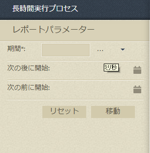
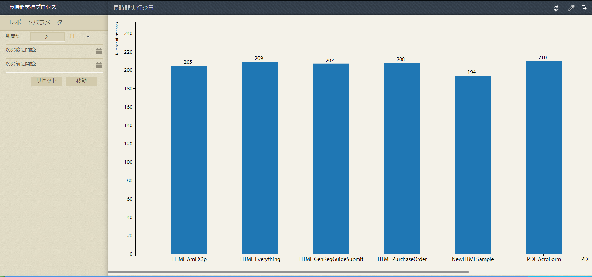
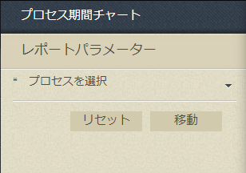
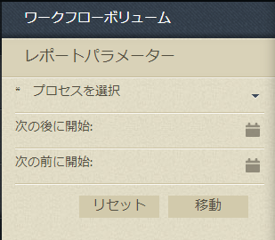

# プロセスレポートの事前定義済みレポート {#pre-defined-reports-in-process-reporting}

## 「Process」レポート {#pre-defined-reports-in-process-reporting-1}

AEM Formsプロセスレポートには、次の *既成のレポートが付属します* 。

* **[Long Running Processes](#long-running-processes)**:指定時間を超えて完了したすべてのAEM Formsプロセスのレポート
* **[Process Duration Chart](#process-duration-report)**:期間別の指定されたAEM Formsプロセスのレポート
* **[Workflow Volume](#workflow-volume-report)**:指定したプロセスの実行中および完了済みインスタンスの日付別レポート

## 長時間実行中のプロセス {#long-running-processes}

長時間実行中のプロセスレポートには、完了に指定時間を超えたAEM Formsプロセスが表示されます。

### 「Long Running Process」レポートを実行するには {#to-execute-a-long-running-process-report}

1. プロセスレポートで事前定義済みのレポートのリストを表示するには、 **プロセスレポートツリー** 表示で、「レポート」ノードをク **リックします** 。
1. 「 **Long Running Processes」レポートノードをクリックします** 。

   

   レポートを選択すると、ツリ **ー・パラメータ** ・パネルがツリー・表示の右に表示されます。

   

   パラメーター:

   * **期間** (*必須*):期間と時間の単位を指定します。 指定した期間を超えて実行されたすべてのAEM Formsプロセスを表示します。
   * **開始日** (オ&#x200B;*プション*):日付を選択します。 レポートをフィルターして、指定した日付以降に開始したプロセスインスタンスを表示します。
   * **前に開始** (オ&#x200B;*プション*):日付を選択します。 レポートをフィルターして、指定した日付より前に開始したプロセスインスタンスを表示します。

1. 「移動」を **クリック** して、レポートを実行します。

   レポートは、「プロセス **レポート** 」ウィンドウの右側のレポートパネルに **表示されます** 。

   

   レポートパネルの右上隅にあるオプションを使 **用して** 、レポートに対して次の操作を実行します。

   * **更新**:レポートを最新のデータで更新します。ストレージ
   * **凡例の色を変更**:レポートの凡例の色を選択して変更する
   * **CSVに書き出し**:レポートからデータを書き出し、コンマ区切りファイルにダウンロードする

## プロセス期間レポート {#process-duration-report}

プロセス期間レポートには、Formsプロセスのインスタンス数が、各インスタンスが実行された日数別に表示されます。

### プロセス期間レポートを実行するには {#to-execute-a-process-duration-report}

1. プロセスレポートで事前定義済みのレポートを表示するには、プロセス **レポートツリー** 表示で、「レポート」ノードをク **リックします** 。
1. 「プロセス期間 **」レポートノード** をクリックします。

   

   レポートを選択すると、ツリ **ー・パラメータ** ・パネルがツリー・表示の右に表示されます。

   

   パラメーター:

   * **Select Process** (必&#x200B;*須*):AEM Formsプロセスを選択します。

1. 「移動」を **クリック** して、レポートを実行します。

   レポートは、「プロセス **レポート** 」ウィンドウの右側のレポートパネルに表示されます。

   

   レポートパネルの右上隅にあるオプションを使 **用して** 、レポートに対して次の操作を実行します。

   * **更新**:レポートを最新のデータで更新します。ストレージ
   * **凡例の色を変更**:レポートの凡例の色を選択して変更する
   * **CSVに書き出し**:レポートからデータを書き出し、コンマ区切りファイルにダウンロードする

## ワークフローのボリュームレポート {#workflow-volume-report}

ワークフローの量レポートには、AEM Formsプロセスの現在実行中のインスタンス数と完了したインスタンス数がカレンダーの日別に表示されます。

### ワークフローボリュームレポートを実行するには {#to-execute-a-workflow-volume-report}

1. プロセスレポートで事前定義済みのレポートを表示するには、プロセス **レポートツリー** 表示で、「レポート」ノードをク **リックします** 。
1. [ワークフローの **量]レポートノード** をクリックします。

   

   レポートを選択すると、ツリ **ー・パラメータ** ・パネルがツリー・表示の右に表示されます。

   

   パラメーター:

   * **Select Process** (必&#x200B;*須*):AEM Formsプロセスを選択します。

   * **開始日** (オ&#x200B;*プション*):日付を選択します。 フィルターレポートに、指定した日付以降に開始したプロセスインスタンスを表示します。

   * **前に開始** (オ&#x200B;*プション*):日付を選択します。 フィルターレポートに、指定した日付より前に開始したプロセスインスタンスを表示します。

1. 「移動」を **クリック** して、レポートを実行します。

   レポートは、「プロセス **レポート** 」ウィンドウの右側のレポートパネルに **表示されます** 。

   

   レポートパネルの右上隅にあるオプションを使 **用して** 、レポートに対して次の操作を実行します。

   * **更新**:レポートを最新のデータで更新します。ストレージ
   * **凡例の色を変更**:レポートの凡例の色を選択して変更する
   * **CSVに書き出し**:レポートからデータを書き出し、コンマ区切りファイルにダウンロードする
