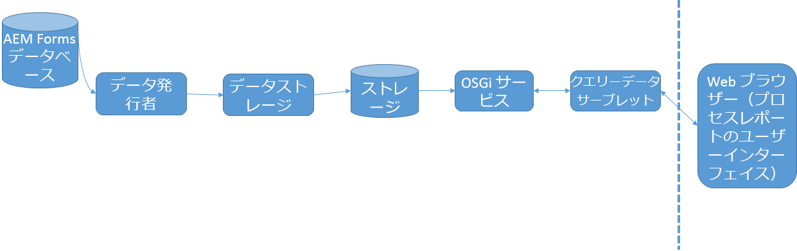

# プロセスレポートの仕組み{#how-process-reporting-works}

プロセスレポートは、JEE上のAEM Formsのレポートモジュールです。

プロセスレポートを使用すると、AEM Formsのプロセスとタスクでレポートを実行できます。

プロセスレポートは、埋め込みのプロセスレポートリポジトリを使用して、Formsデータを発行します。 その後、そのデータを使用してレポートが実行されます。

プロセスレポートは、次のモジュールで構成されます。

* [ProcessDataPublisherサービス](#processdatapublisher-service-br-p)
* [ProcessDataStorageサービス](#processdatastorageprovider-service-br-p)
* [OSGi サービス](#osgi-service-br-p)
* [クエリデータサーブレット](#querydataservlet-service-br-p)
* [プロセスレポートのユーザーインターフェイス](#process-reporting-user-interface-br-p)

## プロセスレポートのアーキテクチャ {#process-reporting-architecture-br}

## プロセスレポートモジュール {#process-reporting-modules}

### ProcessDataPublisherサービス {#processdatapublisher-service-br}

ProcessDataPublisherサーバーは、AEM Formsデータベース上で定期的に実行され、サービスの最後の実行以降に変更されたデータを抽出します。 次に、データをプロセスデータストレージサービスに発行します。

サービスの設定について詳しくは、「ProcessDataPublisherサービスの設定」 [を参照してください](/help/forms/using/process-reporting/install-start-process-reporting.md#p-reportconfiguration-service-p)。

### ProcessDataStorageProviderサービス {#processdatastorageprovider-service-br}

ProcessDataStorageProviderサービスは、ProcessDataPublisherサービスからプロセスデータを受け取り、そのデータをプロセスレポートリポジトリに保存します。

サービスの設定について詳しくは、「ProcessDataStorageProviderサービスの設 [定」を参照してください](/help/forms/using/process-reporting/install-start-process-reporting.md#p-to-configure-the-process-reporting-repository-locations-p)。

### OSGi サービス {#osgi-service-br}

QueryDataServletは、このサービスを使用して、プロセスレポートリポジトリからリポジトリデータを取得します。

### QueryDataServletサービス {#querydataservlet-service-br}

QueryDataServletサービスは、プロセスクエリユーザーインターフェイスからレポートを受け付けます。

次に、サービスはOSGiサービスを使用して関連するレポートデータを取得し、データを処理し、そのデータをユーザインターフェイスに返します。

### プロセスレポートのユーザーインターフェイス {#process-reporting-user-interface-br}

プロセスレポートのユーザーインターフェイスは、Webブラウザーベースのインターフェイスです。 このインターフェイスを使用して、AEM Forms表示から発行されたタスクプロセスおよびデータベース情報をデータベース化します。

プロセスレポートのユーザーインターフェイスの概要については、プロセスレポートのユーザーイ [ンターフェイスを参照してくださ](/help/forms/using/process-reporting/introduction-process-reporting.md)い。

### QueryDataServletサービス {#querydataservlet-service-br-1}

QueryDataServletサービスは、プロセスクエリユーザーインターフェイスからレポートを受け付けます。

次に、サービスはOSGiサービスを使用して関連するレポートデータを取得し、データを処理し、そのデータをユーザインターフェイスに返します。

### カスタムレポート {#custom-reports-br}

独自のカスタムレポートを作成し、これらのレポートをプロセスレポートユーザーインターフェイスの「カスタムレポート」タブに表示できます。

カスタムレポートを作成する手順については、「カスタムレポートを作成するには」を参照して [ください](/help/forms/using/process-reporting/process-reporting-custom-reports.md)。
