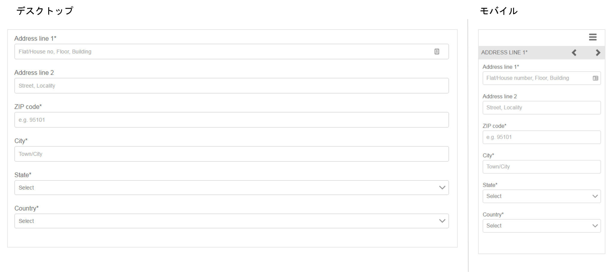
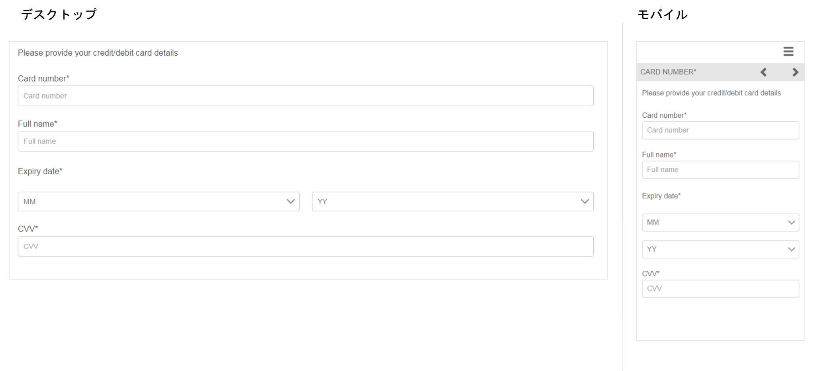

# 参照用のアダプティブフォームフラグメント{#reference-adaptive-form-fragments}

[アダプティブフォームフラグメント](../../forms/using/adaptive-form-fragments.md)は、フォームの作成時に使用できるフィールドのグループまたはフィールドのグループを含むパネルです。これを使用してフォームを簡単にすばやく作成できます。サイドバーのアセットブラウザーを使用して、アダプティブフォームフラグメントをフォームにドラッグ＆ドロップし、それをフォームエディターで編集できます。

アダプティブフォームの作成者を対象に、[AEM Forms アドオンパッケージ](https://experienceleague.adobe.com/docs/experience-manager-release-information/aem-release-updates/forms-updates/aem-forms-releases.html?lang=ja)で参照用のフラグメントが提供されています。次のフラグメントが含まれています。

* アドレス
* 連絡先情報
* クレジットカード情報
* 現在の職業
* 扶養家族の情報
* 職歴
* 収入と支出
* 名前
* 利用条件
* 署名付き利用条件

パッケージをインストールすると、Forms &amp; Documents の下に参照用フラグメントを含む Reference Fragments フォルダーが作成されます。パッケージのインストールについては、[パッケージの作業方法](/help/sites-administering/package-manager.md)を参照してください。

## アドレス {#address}

住所を指定するためのフィールドが含まれています。使用できるフィールドは、住所、郵便番号、市、州および国です。指定された米国の郵便番号に対応する市と州を入力する事前設定済みの Web サービスも含まれています。

<!--[Click to enlarge

](assets/address-1.png)-->

## 連絡先情報 {#contact-information}

電話番号と電子メールアドレスを取得するためのフィールドが含まれています。

<!--[Click to enlarge

](assets/contact-info-1.png)-->

## クレジットカード情報 {#credit-card-information}

支払い処理に使用できるクレジットカード情報を取得するためのフィールドが含まれています。

## 現在の職業 {#current-employment}

雇用形態、雇用分野、役職、会社名、入社日など、現在の職業の詳細を取得するためのフィールドが含まれています。

<!--[Click to enlarge

](assets/current-emp-1.png)-->

## 扶養家族の情報 {#dependents-information}

1 人以上の扶養家族に関する情報（名前、関係、年齢など）を表形式で指定するためのフィールドが含まれています。

<!--[Click to enlarge

](assets/dependents-info-1.png)-->

## 職歴 {#employment-history}

職歴を取得するためのフィールドが含まれています。複数の会社を追加できます。

<!--[Click to enlarge

](assets/emp-history-1.png)-->

## 収入と支出 {#income-expenditure}

1 か月のキャッシュフローと支出を取得するためのフィールドが含まれています。ユーザーに詳しい財務情報を提供するように求めるフォームでは、このフラグメントを使用して収入と支出を取得できます。

<!--[Click to enlarge

](assets/income-1.png)-->

## 名前 {#name}

称号、名、ミドルネームおよび姓を指定するためのフィールドが含まれています。

<!--[Click to enlarge

](assets/name-1.png)-->

## 利用条件 {#terms-conditions}

ユーザーがフォームを送信する前に同意する利用条件を指定します。

<!--[Click to enlarge

](assets/tnc-1.png)-->

## 署名付き利用条件 {#terms-conditions-with-scribble}

ユーザーがフォームを送信する前に同意して署名する利用条件を指定します。

<!--[Click to enlarge

](assets/tnc-scribble-1.png)-->
