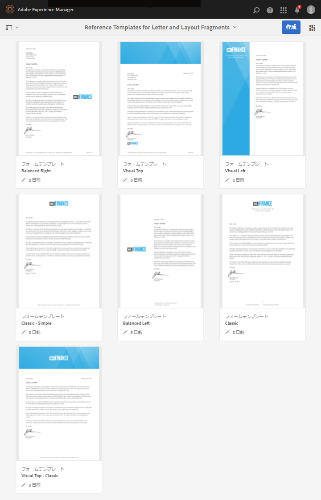
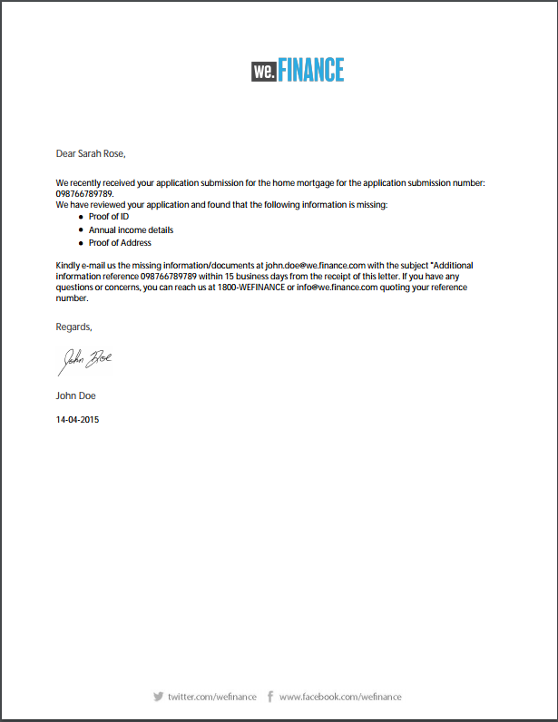
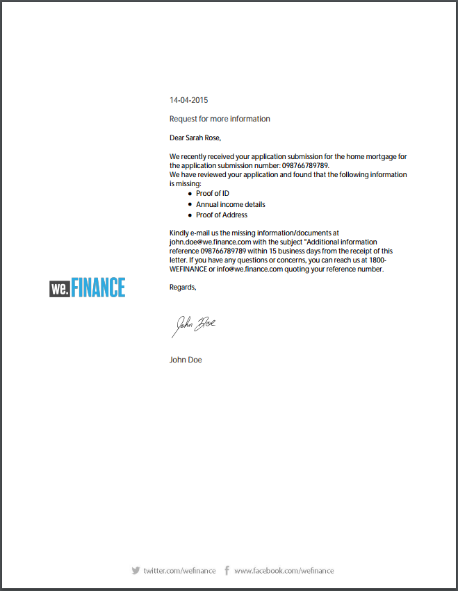

# 参照レターテンプレート {#reference-letter-templates}

Correspondence Management のレターテンプレートには、一般的なフォームフィールド、ヘッダーやフッターなどのレイアウト機能、コンテンツを配置するための空の「ターゲット領域」が含まれています。

Correspondence Management provides letter templates in the AEM Forms package [AEM-FORMS-REFERENCE-LAYOUT-TEMPLATES](https://www.adobeaemcloud.com/content/marketplace/marketplaceProxy.html?packagePath=/content/companies/public/adobe/packages/cq630/fd/AEM-FORMS-6.3-REFERENCE-LAYOUT-TEMPLATES). For installing a package, see [How to Work With Packages](/help/sites-administering/package-manager.md). ブランドやビジネスニーズに応じて、Designerのテンプレートをカスタマイズできます。 パッケージには次のテンプレートが含まれています。

* クラシック
* クラシックシンプル
* バランスレフト
* バランスライト
* ビジュアルレフト
* ビジュアルトップ
* ビジュアルトップ - クラシック

パッケージをインストールすると、レイアウトテンプレート（XDP）が次の場所のテンプレートフォルダーに一覧表示されます。

`https://'[server]:[port]'/[context-root]/aem/forms.html/content/dam/formsanddocuments/templates-folder`

次のフィールドは、このパッケージにあるすべてのテンプレートで共通のフィールドです。

* 日付
* 挨拶
* 結びの挨拶
* 署名

AEM-FORMS-6.3-REFERENCE-LAYOUT-TEMPLATES パッケージをインストールすると、テンプレートがテンプレートフォルダーに一覧表示されます。

## クラシック {#classic}

クラシックテンプレートはロゴが上部に配置されるので、一般的なビジネスレターに適しています。

クラシックテンプレートを使用して作成されたレターの PDF プレビュー

## クラシックシンプル {#classic-simple}

電話番号と電子メールアドレスを取得するためのフィールドが含まれています。クラシックシンプルのテンプレートは、受信者のアドレスを入力するフィールドが含まれていないこと以外はクラシックのテンプレートと同じです。

クラシックシンプルテンプレートを使用して作成されたレターの PDF プレビュー

## バランスレフト {#balanced-left}

バランスレフトのテンプレートは、レターの左にロゴが配置されます。

バランスレフトのテンプレートを使用して作成されたレターの PDF プレビュー

## バランスライト {#balanced-right}

バランスライトのテンプレートは、会社のロゴが右に配置され、受信者の住所をレターに入力するスペースが設けられています。バランスライトのテンプレートには、レターが複数ページにわたる場合にリフローできるフッターも含まれています。

バランスライトのテンプレートを使用して作成されたレターの PDF プレビュー

## ビジュアルレフト {#visual-left}

ビジュアルレフトのテンプレートは、会社のロゴが配置されるサイドヘッダーが含まれています。ビジュアルレフトのテンプレートにはサブジェクトフィールドがありますが、フッターはありません。

ビジュアルレフトのテンプレートを使用して作成されたレターの PDF プレビュー

## ビジュアルトップ {#visual-top}

ビジュアルトップのテンプレートは、上部にビジュアルマージンがあります。ビジュアルトップのテンプレートには、ページ自体に受信者のアドレスを入力するためのフィールドがあります。ビジュアルトップのテンプレートには、複数ページにわたるレターをリフローするサブジェクトフィールドとフッターがあります。

ビジュアルトップのテンプレートを使用して作成されたレターの PDF プレビュー

## ビジュアルトップ - クラシック {#visual-top-classic}

ビジュアルトップ - クラシックのテンプレートには、ページの上部に会社のロゴが配置されるヘッダーがあります。ビジュアルトップ - クラシックのテンプレートにはサブジェクトを入力するフィールドはありますが、フッターはありません。

ビジュアルトップ - クラシックのテンプレートを使用して作成されたレターの PDF プレビュー

