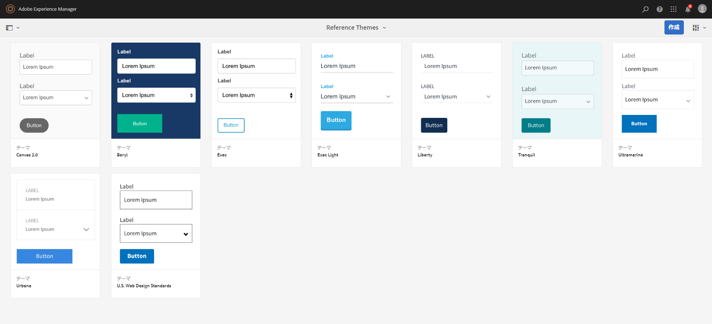

# リファレンステーマ{#reference-themes}

[テーマ](../../forms/using/themes.md)を使用すると、CSS に関する深い知識がなくてもフォームのスタイルを設定できます。In addition to the default theme, you can get the following themes by installing the [AEM-FORMS-REFERENCE-THEMES](https://www.adobeaemcloud.com/content/marketplace/marketplaceProxy.html?packagePath=/content/companies/public/adobe/packages/cq630/fd/AEM-FORMS-6.3-REFERENCE-THEMES) package:

* Beryl
* Exec
* Exec-Light
* Liberty
* Ultramarine
* Urbane
* U.S. Web Design Standards
* Tranquil

各テーマには、独自のエレガントなスタイルが含まれていて、ユーザー向けの使いやすいアダプティブフォームの作成に使用できます。パネル、テキストボックス、数値ボックス、ラジオボタン、表、スイッチなど、セレクター用の独自のスタイル設定が含まれています。これらのテーマ内のスタイルは、要件に基づいています。たとえば、特定のシナリオでは、クリーンなフォントを含む最小限のテーマが必要です。Liberty テーマなら、その外観を実現できます。

このパッケージに含まれるテーマはレスポンシブで、これらのテーマ内のスタイルはモバイルおよびデスクトップ表示用として定義されています。様々なデバイス上のほとんどの最新のブラウザーは、これらのテーマのいずれかが適用されたフォームを問題なくレンダリングできます。

For more information on installing the package, see [How to Work With Packages](/help/sites-administering/package-manager.md).

## Beryl {#beryl}

Beryl テーマは、We.Gov アダプティブフォームで使用され、背景画像、透明度および大きくてフラットなアイコンの使用を強調します。下のスクリーンショットでは、ベリルテーマの見え方と、フォームのスタイル設定を強化する方法を確認できます。

<!--[Click to enlarge

](assets/beryl-1.png)-->

## Exec {#exec}

Exec テーマは、背景を淡色で塗りつぶさず、フォームコンポーネントを強調します。コンポーネントを選択してクリックすると、フォントの色が変わります。デフォルトのキャンバステーマと比較すると、選択したタブのテキストのフォント色は濃い青に変わります。ナビゲーションボタンと「送信」ボタンが Beryl テーマとは異なることに注目してください。

<!--[Click to enlarge

](assets/exec-1.png)-->

## Exec Light {#exec-light}

Exec Light テーマは、ホワイトスペースを使用してシームレスなエクスペリエンスを作成します。「次へ」ボタンと「送信」ボタンは、淡色で塗りつぶされ、3D の影が付きます。左側で選択したタブには、ダブルチェックマークではなく矢印が付きます。

<!--[Click to enlarge

](assets/exec-light-1.png)-->

## Liberty {#liberty}

Liberty テーマは、最小限のアプローチを使用して、重要な部分を強調します。たとえば、訪問済みのタブのフォントの色は緑に変わります。テキストボックスの下のアウトラインだけが表示されます。これは、線が引かれている紙ベースのフォームの外観をエミュレートしています。アクティブなテキストボックスの下のアウトラインは黒で、その他のテキストボックスの下のアウトラインは薄い灰色です。

<!--[Click to enlarge

](assets/liberty-1.png)-->

## Tranquil {#tranquil}

Tranquil テーマは、Tranquil カラースキームの明るいシェーディングと暗いシェーディングを提供して、フォームの様々なコンポーネントを強調します。たとえば、ラジオボタン、パネルおよびタブは、様々なシェーディングの緑色になります。

<!--[Click to enlarge

](assets/tranquil-1.png)-->

## Ultramarine {#ultramarine}

Ultramarine テーマは、濃い青色のシェーディングを使用して、タブ、パネル、テキストボックス、ボタンなどのコンポーネントを強調します。

<!--[Click to enlarge](assets/ultramarine-1.png)-->

## Urbane {#urbane}

あか抜けテーマは、フォームのミニマリスト的で機能的な外観を強調します。 Urbaneテーマをフォームに適用すると、コンポーネントがフラットであることがわかります。 パネルには細いアウトラインが付けられ、モダンな外観を作成します。

<!--[Click to enlarge

](assets/urbane-1.png)-->

## U.S. Web Design Standards {#u-s-web-design-standards}

米国のウェブデザイン標準テーマは、その名の通り、米国のドラフトウェブデザイン標準サイトに記載されている書体とスタイルを使用します。 この Web 標準は、連邦政府の Web サイト間での Web エクスペリエンスを統一するために、連邦政府機関で使用されています。

<!--[Click to enlarge

](assets/usgov.png)-->
