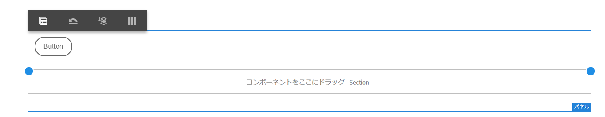

# レイアウトモードを使用したコンポーネントのサイズ変更 {#use-layout-mode-to-resize-components}

インタラクティブ通信の web チャネルオーサリングインターフェイスでは、レイアウトモードを使用してコンポーネントのサイズを変更できます。列内の青い点をドラッグ＆ドロップして、コンポーネントを配置する開始点と終了点を定義します。レスポンシブグリッド内のコンポーネントをタップすると、青い点が表示されます。レスポンシブグリッドは、12 個の等しい列で構成されています。代替列の白と青色の影は、1 つの列と他の列を区別します。

レイアウトモードを使用すると、デスクトップ、タブレット、スマートフォン、その他の小型デバイスなど、あらゆる種類のデバイスのコンポーネントサイズを変更できます。タブレットはデスクトップ版からレイアウト設定を自動的に引き継ぎ、小型デバイスはスマートフォンからレイアウト設定を引き継ぎます。自動的に生成された設定を上書きして、デバイスタイプごとに異なる設定を定義することもできます。

>[!NOTE]
>
>インタラクティブ通信で「[印刷チャネルをマスターとして使用](../../forms/using/create-interactive-communication.md)」を使用して web チャネルを作成する場合、サイズ変更に使用できるコンポーネントには、印刷チャネルを使用して web チャネルで自動生成されるサブフォームとフィールドが含まれます。Web チャネルは、印刷チャネルの要素のレイアウトをレイアウトモードで保持します。

## レイアウトモードへのアクセス {#access-layout-mode}

「**プレビュー**」オプションの横のインタラクティブ通信のオーサリングインターフェイス上部に表示されるドロップダウンリストから、「**レイアウト**」を選択します。フォームがレイアウトモードで表示されます。

1. AEM オーサーインスタンスにログインし、**Adobe Experience Manager**／**フォーム**／**フォームとドキュメント**&#x200B;に移動します。
1. 新しい[インタラクティブ通信](../../forms/using/create-interactive-communication.md)を作成するか、既存のインタラクティブ通信を開きます。
1. 「**プレビュー**」オプションの横の上部に表示されるドロップダウンリストから「**レイアウト**」を選択します。フォームがレイアウトモードで表示されます。

   

## コンポーネントのサイズ変更 {#resize-components}

1. レイアウトモードで、サイズを変更するコンポーネントをタップします。レスポンシブグリッドの開始と終了に青い点が表示されます。
1. レスポンシブグリッド内のコンポーネントの位置を定義する青い点をドラッグ＆ドロップします。

   

   コンポーネントをタップした後に表示されるツールバーは、以下のオプションで構成されます。

   * **親：**&#x200B;コンポーネントの親を選択します。
   * **新しい行にフローティングする：**&#x200B;同じ行内に複数のコンポーネントがある場合は、コンポーネントを次の行に移動します。

   「**[!UICONTROL ブレークポイントレイアウトを元に戻す]**」（）オプションを使用して、サイズ変更されたコンポーネントを含むパネルで、すべてのサイズ変更を元に戻し、デフォルトのレイアウトを適用することができます。サイズ変更されたコンポーネントの親をタップして、オプションを表示します。

   >[!NOTE]
   >
   >レイアウトモードを使用して、テーブルの列、ツールバー、ツールバーボタン、ターゲット領域のコンポーネントのサイズを変更することはできません。スタイルモードを使用して、これらのコンポーネントのサイズを変更します。

### 例 {#example}

**目的：**&#x200B;テーブルコンポーネントと画像コンポーネントを挿入し、インタラクティブ通信でそれらを互いに平行に配置します。

1. インタラクティブ通信の web チャネルで編集モードを使用して、テーブルおよび画像コンポーネントを挿入します。画像コンポーネントは、テーブルコンポーネントの後に表示されます。
1. レイアウトモードに切り替えて、テーブルコンポーネントをタップします。コンポーネントのサイズを変更する青い点が列 1 と列 12 に表示されます。
1. レスポンシブグリッドの列 12 の青い点を列 6 にドラッグ＆ドロップします。

   

1. 同様に、画像コンポーネントを選択し、レスポンシブグリッドの列 1 の青い点を列 7 にドラッグ＆ドロップします。テーブルと画像コンポーネントは互いに平行に表示されます。

   

   画像コンポーネントを選択し、ツールバーにある「**新しい行にフローティングする**」オプションをタップして、画像コンポーネントを次の行に移動できます。

## パネルのサイズ変更 {#resize-panels-layout-mode}

個々のコンポーネントではなくパネル全体のサイズを変更する場合は、以下の手順を実行します。

1. パネル内でサイズを変更するコンポーネントのいずれかをタップし、「」を選択して、ドロップダウンリストの最初のオプションを選択します（パネルがコンポーネントの直接の親である場合）。

   レスポンシブグリッドの開始と終了に青い点が表示されます。

1. レスポンシブグリッド内のパネルの位置を定義する青い点をドラッグ＆ドロップします。手順 1 と 2 を繰り返し、「」を選択して、サイズ変更したパネルを次の行に移動できます。

## パネルの複数列レイアウトの定義

以下の手順を実行して、パネルの列数を定義します。

1. **[!UICONTROL 編集]** モードで、パネルをタップし、「」を選択します。次に、**[!UICONTROL パネルレイアウト]**&#x200B;ドロップダウンリストから「**[!UICONTROL レスポンシブ - ページ上のすべて（ナビゲーションなし）]**」を選択します。

1. 「」をタップして、プロパティを保存します。

1. **[!UICONTROL レイアウト]** モードで、パネル内の任意のコンポーネントをタップし、「」を選択して、パネルを選択します。

1.  をタップし、ドロップダウンリストから列数を選択します。列数の範囲は 1 ～ 12 です。パネルが複数列のレイアウトに分割されます。

## 古いレスポンシブレイアウトを含むフォームに対するレイアウトモードの無効化 {#disable-layout-mode-for-forms-with-old-responsive-layout}

古いレスポンシブレイアウトを含むフォームのレイアウトモードを無効にするには、フォームで使用するテンプレートのプロパティを編集します。

レイアウトモードを無効にするには、以下の手順を実行します。

1. **[!UICONTROL ツール]**／**[!UICONTROL 一般]**／**[!UICONTROL テンプレート]**&#x200B;を選択し、フォームで使用するテンプレートを&#x200B;**[!UICONTROL 編集]**&#x200B;モードで開きます。
1. 左側のウィンドウでドキュメントコンテナを選択し、「**[!UICONTROL ポリシー]**」をタップします。

   

1. 「**[!UICONTROL レイアウト設定]**」タブをタップし、「**[!UICONTROL レイアウトモードを無効にする]**」を選択します。
1. 「」をタップして、テンプレートプロパティを保存します。
