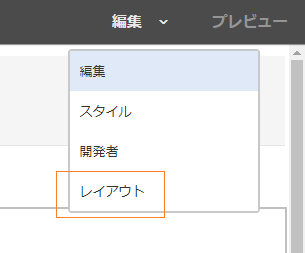
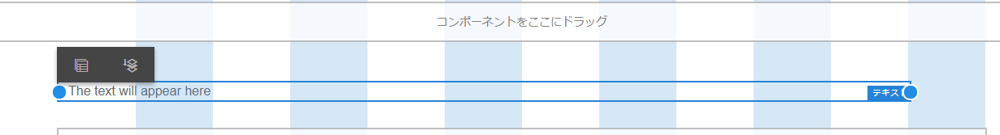
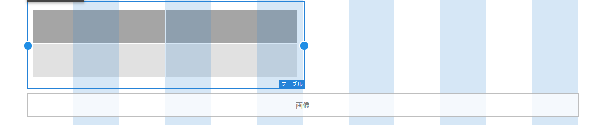
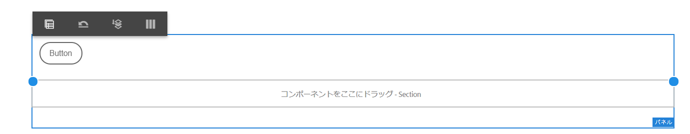
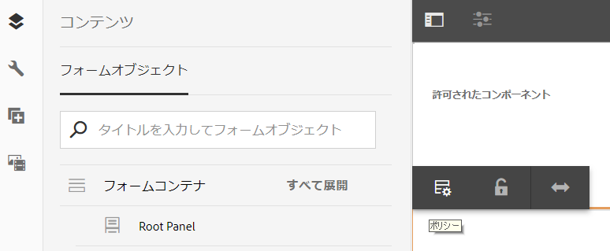

# レイアウトモードを使用してコンポーネントのサイズを変更する {#use-layout-mode-to-resize-components}

アダプティブフォームのオーサリングインターフェイスを使用すると、レイアウトモードを使用してコンポーネントのサイズを変更できます。 列内に青い点をドラッグ&amp;ドロップして、コンポーネントを配置する開始と終点を定義します。 レスポンシブグリッド内のコンポーネントをタップすると、青いドットが表示されます。 レスポンシブグリッドは、12列に等しくなっています。 代替列の白と青の色の陰影は、1つの列と他の列を区別します。

レイアウトモードを使用すると、デスクトップ、タブレット、スマートフォン、その他の小さいデバイスなど、すべての種類のデバイスのコンポーネントのサイズを変更できます。 タブレットはデスクトップバージョンからレイアウト設定を自動的に引き継ぎ、小さいデバイスはスマートフォンからレイアウト設定を引き継ぎます。 ただし、自動的に生成された設定を上書きして、デバイスタイプごとに異なる設定を定義することができます。

## レイアウトモードにアクセス {#access-layout-mode}

アダプティブフォーム作成インターフェイスの上部で、 **プレビュー** リストの横に表示されるドロップダウンオプションから「 **レイアウト** 」を選択します。 フォームがレイアウトモードで表示されます。

1. AEM オーサーインスタンスにログインし、**Adobe Experience Manager**／**フォーム**／**フォームとドキュメント**&#x200B;に移動します。
1. Create a new or open an existing [adaptive form](../../forms/using/creating-adaptive-form.md).
1. 「 **プレビュー** 」オプションの横の上部に表示されるドロップダウンリストから「 **レイアウト** 」を選択します。 フォームがレイアウトモードで表示されます。

   

## コンポーネントのサイズ変更 {#resize-components}

1. レイアウトモードで、サイズを変更するコンポーネントをタップします。 レスポンシブグリッドの開始と端に青い点が表示されます。
1. レスポンシブグリッド内のコンポーネントの位置を定義する青いドットをドラッグ&amp;ドロップします。

   

   コンポーネントをタップした後に表示されるツールバーは、次のオプションで構成されます。

   * **親：** コンポーネントの親を選択します。
   * **新しい行に分離：** 同じ行内に複数のコンポーネントがある場合は、コンポーネントを次の行に移動します。

   「ブレークポイントを **[!UICONTROL 元に戻す]** (ブレークポイントを )」オプションを使用すると、すべてのサイズ変更の変更を元に戻し、サイズ変更されたコンポーネントを含むパネルにデフォルトのレイアウトを適用できます。 サイズ変更したコンポーネントの親をタップして、表示を指定します。

   >[!NOTE]
   >
   >レイアウトモードを使用して、テーブルの列、ツールバー、ツールバーボタン、ターゲット領域のコンポーネントのサイズを変更することはできません。 スタイルモードを使用して、これらのコンポーネントのサイズを変更します。

### 例 {#example}

**目的：** 表コンポーネントと画像コンポーネントを挿入し、アダプティブフォームでそれらを互いに平行に配置する場合。

1. アダプティブフォームで編集モードを使用して表および画像のコンポーネントを挿入します。 画像コンポーネントは、表コンポーネントの後に表示されます。
1. レイアウトモードに切り替えて、表コンポーネントをタップします。 コンポーネントのサイズを変更する青い点は、列1と列12に表示されます。
1. レスポンシブグリッドの列12の青い点を列6にドラッグ&amp;ドロップします。

   

1. 同様に、「画像」コンポーネントを選択し、レスポンシブグリッドの列1から列7に青い点をドラッグ&amp;ドロップします。 テーブルと画像コンポーネントは互いに平行に表示されます。

   

   「画像」コンポーネントを選択し、ツールバーにある「新しい行に **浮動** 」オプションをタップして、画像コンポーネントを次の行に移動できます。

## パネルのサイズ変更 {#resize-panels-layout-mode}

個々のコンポーネントではなくパネル全体のサイズを変更する場合は、次の手順を実行します。

1. パネル内でサイズを変更するコンポーネントのいずれかをタップし、「親を 」を選択します。パネルがコンポーネントの直接の親である場合は、ドロップダウンリストで最初のオプションを選択します。

   レスポンシブグリッドの開始と端に青い点が表示されます。

1. レスポンシブグリッド内でのパネルの位置を定義するには、青いドットをドラッグ&amp;ドロップします。
手順1と2を繰り返し、「親を  」を選択して、サイズ変更したパネルを次の行に移動できます。

## パネルの複数列レイアウトの定義

次の手順を実行して、パネルの列数を定義します。

1. **[!UICONTROL モードで]** 、パネルをタップし、「 」を選択し、パネルレイアウトの編集ドロップダウンリストから「ナビゲーションなし **[!UICONTROL — ページ上のすべて（レスポンシブ）」]****** を選択します。

1. 「」をタップして、プロパティを保存します。

1. レイ **[!UICONTROL アウト]** モードで、パネル内の任意のコンポーネントをタップし、「親を 」を選択して、パネルを選択します。

1. 「  、ドロップダウンリストから列数を選択します。 列数の範囲は1 ～ 12です。 パネルが複数列のレイアウトに分割されます。

## 古いレスポンシブレイアウト用の新しいレスポンシブグリッドを有効にする {#enableresponsivegrid}

AEM Forms6.4以前のバージョンを使用して作成するフォームで、新しいレスポンシブグリッドを有効にして、コンポーネントのサイズを変更します。

>[!NOTE]
>
>新しいレスポンシブグリッドに切り替えると、フォームで使用されているコンポーネントに対して既に定義されているレイアウトプロパティが破棄されます。

次の手順を実行して、新しいレスポンシブグリッドを有効にします。

1. 「 **プレビュー** 」オプションの横の上部に表示されるドロップダウンリストから「 **レイアウト** 」を選択します。 レイアウトモードを有効にするための確認メッセージが表示されます。
1. 「 **はい** 」をタップして、フォームの **レイアウト** モードを有効にします。

### 新しいレスポンシブレイアウトを使用して、古いフラグメントをアダプティブフォームに埋め込む {#embed-an-old-fragment-in-an-adaptive-form-with-new-responsive-layout}

アダプティブフォームの新しいレスポンシブレイアウトを使用すると、古いレスポンシブレイアウトを含むアダプティブフォームフラグメントをフォームに追加できます。 ただし、新しいレイアウトでは、フラグメントで使用されるコンポーネントに対して既に定義されているレイアウトプロパティが破棄されます。 レイアウトモードに切り替えて、フラグメントで使用するコンポーネントのレイアウトプロパティを定義できます。

### 新しいレスポンシブレイアウトを使用して古いアダプティブフォームにフラグメントを埋め込む {#embed-a-fragment-with-new-responsive-layout-in-an-old-adaptive-form}

古いレスポンシブレイアウトを含むアダプティブフォームに、新しいレスポンシブレイアウトを含むフラグメントを埋め込むと、そのフォームのレイアウトモードを有効にし、フラグメントを再埋め込みするよう求められます。

レイアウトモードを有効にするには、 **プレビュー** リストの上部に表示されるドロップダウンオプションから「 **** 」を選択し、「はい **** 」をタップして確認します。 フラグメントを再埋め込みするには、 **編集** モードを選択します。

## 古いレスポンシブレイアウトを含むフォームのレイアウトモードを無効にする {#disable-layout-mode-for-forms-with-old-responsive-layout}

古いレスポンシブレイアウトを含むフォームのレイアウトモードを無効にするには、フォームで使用するテンプレートのプロパティを編集します。

レイアウトモードを無効にするには、次の手順を実行します。

1. **[!UICONTROL ツール]** / **[!UICONTROL 一般]** / **[!UICONTROL テンプレートを選択し、EditFormで使用しているテンプレートを]****** EditFormモードで開きます。
1. 左側のパネルでドキュメントコンテナを選択し、「 **[!UICONTROL ポリシー」をタップします。]**

   

1. 「 **[!UICONTROL レイアウト設定]** 」タブをタップし、「レイアウトモードを **[!UICONTROL 無効にする]**」を選択します。
1. Tap  to save the template properties.

