# アダプティブフォームのルールエディタ－{#adaptive-forms-rule-editor}

## 概要 {#overview}

Adobe Experience Manager Forms のルール編集機能により、フォームのビジネスユーザーや開発者がアダプティブフォームオブジェクトにルールを追加できるようになります。これらのルールは、フォームオブジェクト上でトリガされるアクションを定義します。それらのアクションは、事前定義された条件、ユーザ入力、およびフォーム上のユーザーアクションに基づいてトリガされます。さらに、フォーム入力時の作業を合理化することで、正確で素早く入力できるフォームの実現に役立ちます。

ルールエディタでは、ルールを記述するための直感的でシンプルなユーザーインターフェイスを備えています。ルールエディターは、すべてのユーザーに対してビジュアルエディターを提供します。さらに、Forms のパワーユーザーにのみ、ルールとスクリプトを記述するためのコードエディターを提供します。アダプティブフォームオブジェクト上でルールを用いることにより実行できるアクションのうち、主なものは以下のとおりです。

* オブジェクトの表示 / 非表示を切り替える
* オブジェクトの有効 / 無効を切り替える
* オブジェクトの値を設定する
* オブジェクトの値を検証する
* 関数を実行することにより、オブジェクトの値を計算する
* フォームデータモデルサービス操作を呼び出し処理を実行する
* オブジェクトのプロパティを設定する

ルールエディタは、AEM 6.1Forms以前のリリースのスクリプティング機能を置き換えるものです。 ただし、既存のスクリプトは、新しいルールエディターからも利用できます。ルールエディタで既存のスクリプトを編集する方法の詳細については、「[既存のスクリプトに対するルールエディタの影響](../../forms/using/rule-editor.md#p-impact-of-rule-editor-on-existing-scripts-p)」を参照してください。

forms-power-users グループに追加されたユーザーは、新しいスクリプトの作成と既存のスクリプトの編集を行うことができます。forms-users グループのユーザーは、スクリプトを使用できますが、スクリプトの作成または編集はできません。

## ルールを理解する {#understanding-a-rule}

「ルール」とは、アクションと条件を組み合わせたものを指します。ルールエディターでは、「非表示」、「表示」、「有効化」や「無効化」の各アクションに加え、フォーム内のオブジェクトの値を計算するアクションなどを編集できます。「条件」とは、フォームオブジェクトの状態、値、またはプロパティに対して確認や処理を実行し、それにより評価されるブール式を指します。「アクション」は、条件を評価して返された値（`True` または `False`）に基づいて実行されます。

ルールエディターでは、事前定義された一連のルールタイプを利用できます。これらのルールには、「When」、「Show」、「Hide」、「Enable」、「Disable」、「Set Value Of」、および「Validate 」などが含まれており、ルールを記述するのに便利です。各ルールタイプでは、ルール内の条件とアクションを定義することができます。この記事では、各ルールタイプについてさらに詳細に説明します。

一般的なルールは、次のいずれかの構文に従います。

**条件 — アクション** ：この構文では、条件を最初に定義し、トリガーするアクションを次に定義します。 構文は、プログラミング言語における if-then 文に匹敵します。

ルールエディタで「**When**」ルールタイプを使用することで、条件=アクションの構文が適用されます。

**アクション条件** ：この構文では、トリガーするアクションを最初に定義し、次に評価の条件を定義します。 この構文の別の様式は、「アクション=条件=代替アクション」型です。この中では、条件がFalse を返した場合にトリガする代替アクションも定義します。

ルールエディタで「Show」、「Hide」、「Enable」、「Disable」、「Set Value Of」、「Validate 」の各ルールを設定すると、「アクション=条件」ルール構文が適用されます。デフォルトでは、「Show」の代替アクションは「Hide」、「Enable」の代替アクションは「Disable」（それらの逆も同様）です。デフォルトの代替アクションは変更できません。

>[!NOTE]
>
>利用可能なルールタイプ（ルールエディタで定義した条件やアクションを含む）は、ルールを作成しているフォームオブジェクトの種類によっても異なります。ルールエディターには、条件やアクション構文を作成できる有効なルールタイプとオプションのみが表示されます。すなわち、ここでの表示内容は、特定のフォームオブジェクトタイプに合わせて変化します。たとえば、パネルオブジェクトでは、「Validate」、「Set Value Of」、「Enable」や「Disable」の各ルールは表示されません。

ルールエディターで使用可能なルールタイプの詳細については、「[ルールエディターで利用できるルールタイプ](../../forms/using/rule-editor.md#p-available-rule-types-in-rule-editor-p)」を参照してください。

### ルール構文の選択ガイドライン {#guidelines-for-choosing-a-rule-construct}

どのルール構文を使用しても大部分のユースケースを満たすことはできますが、ここでは特定のルールを選択するための、いくつかのガイドラインを紹介します。For more information about the available rules in rule editor, see [Available rule types in rule editor](../../forms/using/rule-editor.md#p-available-rule-types-in-rule-editor-p).

* ルールを作成する際は一般に、ルールを作成するオブジェクトの背景について考えることから始めます。「フィールド A」にユーザが入力した値に応じて、「フィールド B」の表示・非表示を切り替える場合を想定します。この場合、「フィールド A」の状態を評価し、その戻り値に基づいて「フィールド B」のアクションをトリガします。

   従って、「フィールド B」（状態を評価するオブジェクト）上にルールを記述する場合、「条件=アクション」型の構文か、または「When」のルールタイプを使用します。同様に、「フィールド A」についても、「アクション=条件」構文か、または「Show」・「Hide」のルールタイプを使用します

* 時には、1 つの条件に基づいて複数のアクションを実行する必要があるかもしれません。そのような場合は、「条件=アクション」構文の使用を推奨します。この構文では、一度条件を評価し、その後に複数のアクション文を指定することができます。

   たとえば、ユーザーが「フィールド A」に入力した値を確認する条件を設け、その戻り値に応じて「B」、「C」、「D」の各フィールドを非表示にするには、まず、「フィールド A」に対して「条件=アクション」の構文を記述するか、あるいは「When」のルールタイプを使用し、「B」、「C」、「D」の各フィールドについて表示状態を制御するアクションを作成します。この形式を取らない場合は、「B」、「C」、「D」のフィールドごとに別々のルールを3つ記述し、それぞれ「フィールド A」の状態を確認させる必要が生じます。この例では、3つのオブジェクトに「Show」・「Hide」のルールのタイプを記述するよりも、むしろ単一のオブジェクトに「When」のルールタイプを記述する方が効率的です。

* 複数の条件に基づいてアクションをトリガする場合は、「アクション=条件」構文の使用が奨励されます。たとえば、「B」、「C」、「D」の各フィールドの状態を評価し、その戻り値に応じて「フィールド A」の表示・非表示を切り替える場合は、「フィールド A」に「表示・非表示」のルールタイプを記述します。
* 1つの条件に対して1つのアクションが指定されているルールでは、「条件=アクション」または「アクション＝条件」構文を使用してください。
* フィールドに値を入力した直後や、フィールドを閉じた直後にルールによって条件を確認し、アクションを実行する場合は、条件を評価するフィールドに対して「条件=アクション」型の構文か、「When」のルールタイプを記述することが奨励されます。
* 「When」のルール内に記述した条件は、その条件が適用されるオブジェクトの値をユーザが変更した際に評価されます。しかし、値が変更された場合にサーバ側でアクションをトリガする場合（値を事前入力する場合など）は、フィールドの初期化時にアクションをトリガーする「When」ルールを記述することが推奨されます。
* ドロップダウン、ラジオボタン、チェックボックスオブジェクトのルールを記述する場合、フォーム内のこれらのフォームオブジェクトのオプションや値は、ルールエディターで事前に設定されます。

## ルールエディターで使用可能な演算子の種類とイベント {#available-operator-types-and-events-in-rule-editor}

ルールエディタ－では、次のような論理演算子やイベントを使用してルールを作成することができます。

* **Is Equal To（次と等しい）**
* **Is Not Equal To（次と等しくない）**
* **Starts With（次の値で始まる）**
* **Ends With（次の値で終わる）**
* **Contains（次を含む）**
* **Is Empty（空である）**
* **Is Not Empty（空ではない）**
* **Has Selected（選択済み）：**&#x200B;チェックボックス、ドロップダウン、ラジオボタンの特定のオプションをユーザーが選択した場合に true を返します。
* **Is Initialized (event)（初期化（イベント型））**&#x200B;フォームオブジェクトがブラウザでレンダリングされたときに true を返します。
* **Is Changed (event)（変更（イベント型））：**&#x200B;フォームオブジェクトに入力された値または選択したオプションをユーザーが変更したときに true を返します。

## ルールエディターで利用可能なルールタイプ {#available-rule-types-in-rule-editor}

ルールエディターでは、ルールを記述するための、事前定義された一連のルールタイプを利用できます。ここからは、各ルールタイプについて詳しく説明します。ルールエディターでルールを記述する詳細については、「[ルールの作成](../../forms/using/rule-editor.md#p-write-rules-p)」を参照してください。

### セッションに他のセッション属性 {#whenruletype}

「**When**」のルールタイプは、「**条件=アクション=代替アクション**」のルール構文に従います。また、単に「**条件=アクション**」構文が使用されることもあります。このルールタイプでは、評価条件を指定し、条件が満たされた（`True`）場合にトリガするアクションを記述します。While using the When rule type, you can use multiple AND and OR operators to create [nested expressions](#nestedexpressions).

「When」のルールタイプを使用することで、フォームオブジェクトの状態を評価し、1つ以上のオブジェクトに対してアクションを実行することができます。

代表的な「When」のルール構文は、次のようになります。

`When on Object A:`

`(Condition 1 AND Condition 2 OR Condition 3) is TRUE;`

`Then, do the following:`

Action 2 on Object B; AND Action 3 on Object C;

_

ラジオボタンやリストなど、複数の値を持つコンポーネントがある場合、そのコンポーネントのルールを作成すると、オプションが自動的に取得され、ルールクリエーターが使用できるようになります。 これらのオプションの値を再入力する必要はありません。

例えばリストの場合、赤、青、緑、黄という 4 つのオプションがあります。ルールを作成する場合、オプション（ラジオボタン）が自動的に取得され、これらのオプションを使用してルールを作成することができます。以下に例を示します。

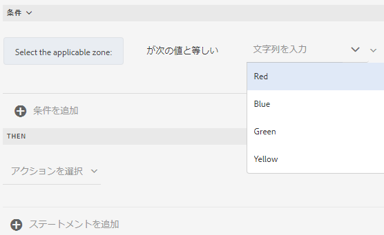

When ルールを記述するときに、「Clear Value Of」アクションをトリガーできます。「Clear Value Of」アクションは、指定したオブジェクトの値をクリアします。「値をクリア」を「When」文のオプションとして指定すると、複数のフィールドを含む複雑な条件を作成できます。

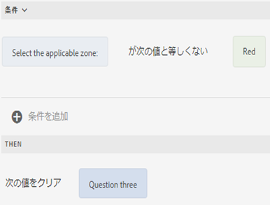

**[非表示** ]指定したオブジェクトを非表示にします。

**[表示** ]指定したオブジェクトを表示します。

**Enable** ：指定したオブジェクトを有効にします。

**[無効** ]指定したオブジェクトを無効にします。

**呼び出しサービス** ：フォームデータモデルに設定されたサービスを呼び出します。 サービスを起動オプションを選択すると、フィールドが表示されます。このフィールドをタップすると、AEM インスタンス上のすべてのフォームデータモデルで設定されたすべてのサービスが表示されます。フォームデータモデルサービスを選択すると、追加のフィールドが表示され、指定したサービスに対する入力パラメータと出力パラメータを使用して、フォームオブジェクトをマップできる追加のフィールドが表示されます。フォームデータモデルサービスの呼び出しについては、「ルール例」を参照してください。

フォームデータサービスに加えて、ダイレクト WSDL URL を指定して Web サービスを呼び出すことができます。ただし、フォームデータモデルサービスには数多くの利点があるので、この方法でサービスを呼び出すことをお勧めします。

For more information about configuring services in form data model, see [AEM Forms Data Integration](/help/forms/using/data-integration.md).

**Set value of** Seped Value指定したオブジェクトの値を計算し、設定します。 オブジェクト値には、文字列、別のオブジェクトの値、数学式や関数を使用して計算された値、オブジェクトのプロパティの値、または設定済みのフォームデータモデルサービスからの出力値を設定できます。 Webサービスのオプションを選択すると、AEMインスタンスのすべてのフォームデータモデルに設定されたすべてのサービスが表示されます。 フォームデータモデルサービスを選択すると、追加のフィールドが表示され、指定したサービスに対する入力パラメータと出力パラメータを使用して、ここでフォームオブジェクトをマップすることができます。

For more information about configuring services in form data model, see [AEM Forms Data Integration](/help/forms/using/data-integration.md).

「 **Set Property** 」のルールタイプでは、条件のアクションに基づいて、指定したオブジェクトのプロパティの値を設定できます。

これにより、ルールを定義して、アダプティブフォームにチェックボックスを動的に追加することができます。 カスタム関数、フォームオブジェクト、またはオブジェクトプロパティを使用して、ルールを定義できます。

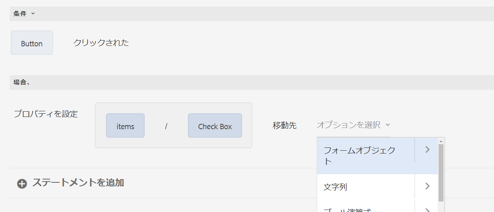

カスタム関数に基づいてルールを定義するには、ドロップダウンリストから「 **関数出力** 」を選択し、「 **関数** 」タブからカスタム関数をドラッグ&amp;ドロップします。 条件アクションが満たされると、カスタム関数で定義されているチェックボックスの数がアダプティブフォームに追加されます。

フォームオブジェクトに基づいてルールを定義するには、ドロップダウンリストから「 **フォームオブジェクト** 」を選択し、「フ **ォームオブジェクト** 」タブからフォームオブジェクトをドラッグ&amp;ドロップします。 条件アクションが満たされると、フォームオブジェクトで定義されているチェックボックスの数がアダプティブフォームに追加されます。

オブジェクトプロパティに基づくプロパティの設定ルールを使用すると、アダプティブフォームに含まれる別のオブジェクトプロパティに基づいて、アダプティブフォーム内の複数のチェックボックスを追加できます。

次の図は、アダプティブフォーム内のドロップダウンリストの数に基づいて、チェックボックスを動的に追加する例を示しています。

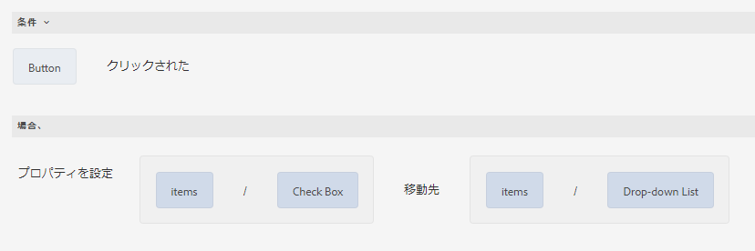

**[値のクリア** ]指定したオブジェクトの値をクリアします。

**[フォーカスを設定** ]指定したオブジェクトにフォーカスを設定します。

**Save Form** ：フォームを保存します。

**送信Forms** ：フォームを送信します。

**フォームのリセット** ：フォームをリセットします。

**Validate Form** ：フォームを検証します。

**追加 Instance** ：指定した繰り返し可能なパネルまたはテーブル行のインスタンスを追加します。

**インスタンスの削除** ：指定した繰り返し可能なパネルまたはテーブル行のインスタンスを削除します。

**「他のインタラクティブコミュニケーション、アダプティブフォーム** 、画像やドキュメントフラグメントなどの他のアセット、外部URLに移動」に移動します。 詳細については、「 [Interactive Communicationの](../../forms/using/create-interactive-communication.md#addbuttontothewebchannel)追加ボタン」を参照してください。

### Set Value of {#set-value-of}

The **[!UICONTROL Set Value of]** rule type allows you to set the value of a form object depending on whether the specified condition is satisfied or not. この値には、他のオブジェクトの値や、リテラル文字列、数式や関数から算出された値、または他のオブジェクトのプロパティ値、フォームデータモデルサービスの出力値を指定することができます。同様に、関数や数式から算出された構成要素、文字列、プロパティ、または値を確認することもできます。

「Set Value Of」のルールタイプは、パネルやツールバーボタンなどの一部のフォームオブジェクトでは利用できないことに注意してください。標準的な「Set Value Of」ルールは、次の構文を有します。


Set value of Object A to:

(string ABC) OR(object Property X of Object C) OR(value from a function) OR(数学式からの値) OR（データモデルサービスまたはWebサービスの出力値）;

When (任意):

(条件1 AND 条件2 AND 条件3) is TRUE;


次の例では、`dependentid` フィールドの値を入力とし、`Relation` フィールドの値を `Relation` フォームデータモデルサービスの `getDependent` 引数の出力に設定します。

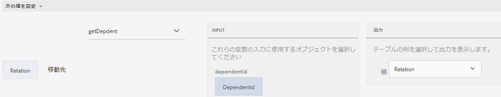

フォームデータモデルサービスを使用した Set Value Of ルールの例

>[!NOTE]
>
>さらに、Set Value Of ルールを使用して、フォームデータモデルサービスまたは Web サービスの出力からドロップダウンリストのコンポーネントのすべての値を計算できます。ただし、選択する出力の引数は配列型引数であることを確認してください。配列に返されたすべての値は、指定したドロップダウンリストで使用できるようになります。

### Show（表示） {#show}

「**Show**」のルールタイプでは、条件を満たしているかどうかに基づいて、フォームオブジェクトの表示・非表示を切り替えることができます。「Show」のルールタイプでは、条件が満たされていないか、あるいは `False` が返された場合に、「Show」アクションをトリガします。

代表的な「Show」のルール構文は、次のようになります。


`Show Object A;`

`When:`

`(Condition 1 OR Condition 2 OR Condition 3) is TRUE;`

`Else:`

`Hide Object A;`


### Hide（非表示） {#hide}

「**Hide**」のルールタイプでは、「Show」のルールタイプと同様に、条件を満たしているかどうか基づいて、フォームオブジェクトの表示・非表示を切り替えることができます。「Hide」のルールタイプでは、条件が満たされていないか、あるいは `False` が返された場合に、「非表示」アクションをトリガします。

代表的な「Hide」のルール構文は、次のようになります。


`Hide Object A;`

`When:`

`(Condition 1 AND Condition 2 AND Condition 3) is TRUE;`

`Else:`

`Show Object A;`


### Enable（有効） {#enable}

「**Enable**」のルールタイプを使用すると、条件を満たしているか否かに基づいて、フォームオブジェクトを有効または無効にすることができます。「Enable」のルールタイプでは、条件が満たされていないか、あるいは `False` が返された場合に、「Enable」アクションをトリガします。

代表的な「Enable」のルール構文は、次のようになります。


`Enable Object A;`

`When:`

`(Condition 1 AND Condition 2 AND Condition 3) is TRUE;`

`Else:`

`Disable Object A;`


### 無効 {#disable}

「**Disable**」のルールタイプでは、「Enable」のルールタイプと同様に、条件を満たしているか否かに基づいて、フォームオブジェクトを有効または無効にすることができます。「Disable」のルールタイプでは、条件が満たされていないか、あるいは `False` が返された場合に、「Disable」アクションをトリガします。

代表的な「Disable」のルール構文は、次のようになります。


`Disable Object A;`

`When:`

`(Condition 1 OR Condition 2 OR Condition 3) is TRUE;`

`Else:`

`Enable Object A;`

### Validate {#validate}

「**Validate**」のルールタイプでは、式を使用してフィールド内の値を検証します。たとえば、式を記述することで、特定の名前のテキストボックスに特殊文字や数字が含まれていないことを確認することができます。

代表的な「Validate」のルール構文は、次のようになります。

`Validate Object A;`

`Using:`

`(Expression 1 AND Expression 2 AND Expression 3) is TRUE;`

>[!NOTE]
>
>入力値が検証ツールと一致しない場合は、検証メッセージをユーザに対して表示させることができます。You can specify the message in the **[!UICONTROL Script validation message]** field in the component properties in the sidebar.

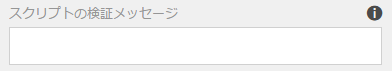

### Set Options Of {#setoptionsof}

「 **Set Options Of** 」のルールタイプを使用すると、アダプティブフォームにチェックボックスを動的に追加するルールを定義できます。 フォームデータモデルまたはカスタム関数を使用して、ルールを定義できます。

カスタム関数に基づいてルールを定義するには、ドロップダウンリストから「 **関数出力** 」を選択し、「 **関数** 」タブからカスタム関数をドラッグ&amp;ドロップします。 カスタム関数で定義されているチェックボックスの数が、アダプティブフォームに追加されます。

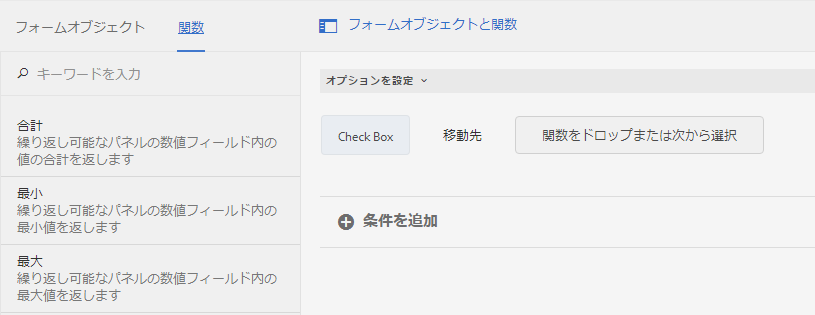

カスタム関数を作成するには、「ルールエディタでの [カスタム関数](#custom-functions)」を参照してください。

フォームデータモデルに基づいてルールを定義するには：

1. ドロップダウンリストから「 **サービス出力** 」を選択します。
1. データモデルオブジェクトを選択します。
1. 「 **表示値** 」ドロップダウンリストからデータモデルオブジェクトプロパティを選択します。 アダプティブフォーム内のチェックボックスの数は、データベース内のそのプロパティに対して定義されたインスタンスの数から得られます。
1. 「値を **保存** 」ドロップダウンリストからデータモデルオブジェクトプロパティを選択します。

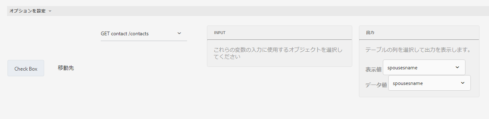

## ルールエディタのユーザーインターフェイスを理解する {#understanding-the-rule-editor-user-interface}

ルールエディタでは、ルールの記述や管理のための、総合的でシンプルなユーザインタフェースが用意されています。ルールエディターのユーザインターフェイスは、オーサリングモードで開いたアダプティブフォーム内から起動できます。

ルールエディターのユーザインターフェイスを起動するには：

1. アダプティブフォームをオーサリングモードで開きます。
1. Tap the form object for which you want to write a rule, and in Component Toolbar tap . ルールエディタのユーザーインターフェイスが表示されます。

   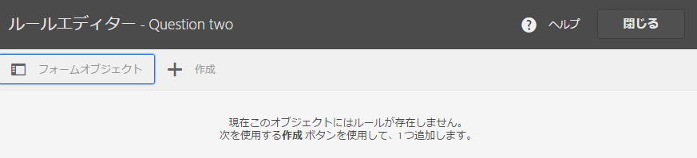

   選択したフォームオブジェクト上に既に存在するルールは、このビューに表示されます。既存ルールの詳細な管理方法については、「[ルール管理](../../forms/using/rule-editor.md#p-manage-rules-p)」を参照してください。

1. Tap **[!UICONTROL Create]** to write a new rule. ルールエディターの初回起動時は、ルールエディターの UI がビジュアルエディターモード（デフォルト）で表示されます。

   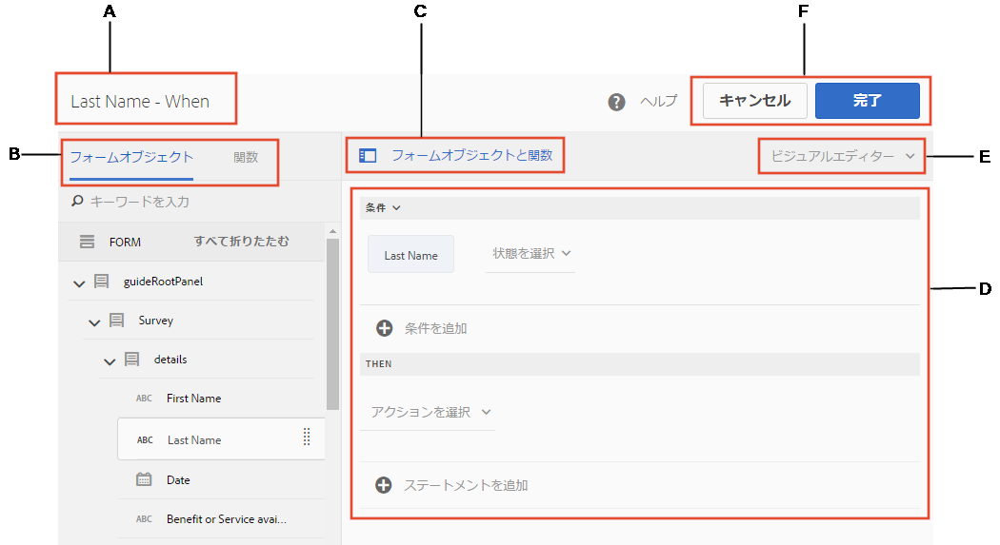

ここからは、ルールエディターのユーザインターフェイスに含まれる各要素について説明します。

### A. コンポーネントルールの表示 {#a-component-rule-display}

ルールエディターを起動したアダプティブフォームオブジェクトのタイトルと、現在選択されているルールタイプを表示します。上記の例では、ルールエディターは「Salary（給与） 」と名付けられたアダプティブフォームオブジェクトから起動されており、「When」のルールタイプが選択されています。

### B. フォームオブジェクトと関数 {#b-form-objects-and-functions-br}

ルールエディタのユーザーインターフェイスの左側のペインには、「**[!UICONTROL フォームオブジェクト]**」と「**[!UICONTROL 関数]**」の2つのタブが含まれています。

「フォームオブジェクト」タブには、アダプティブフォームに含まれているオブジェクトがすべて階層表示されます。ここには、オブジェクトのタイトルとタイプが表示されます。ルールの作成時は、フォームオブジェクトをルールエディターまでドラッグ＆ドロップすることができます。オブジェクトや関数をプレースホルダーにドラッグ&amp;ドロップすると、ルールの作成や編集時に、プレースホルダーは自動的に適切な値の種類に従います。

1つ以上の有効なルールが適用されているフォームオブジェクトには、緑のドットが付いています。フォームオブジェクトに適用されているルールのいずれかが無効な場合、フォームオブジェクトには黄色のドットが付きます。

「関数」タブには、「合計」、「最小値」、「最大値」、「平均値」、「個数」や「検査フォーム」などの組み込み関数のセットが含まれます。これらの関数を使用すると、繰り返し可能なパネルやテーブル行の値を計算し、ルールを記述する際のアクションや条件文で値を使用できます。 You can, however, create [custom functions](#custom-functions) too.

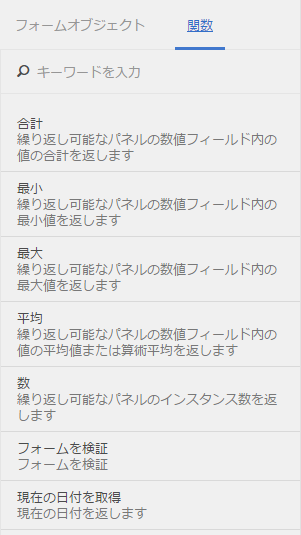

>[!NOTE]
>
>「フォームオブジェクト」と「関数」の各タブ内では、オブジェクトや関数の名前やタイトルを基にテキスト検索を行うことができます。

フォームオブジェクトの左側のツリーでは、フォームオブジェクトをタップすることで、各オブジェクトに適用されるルールを表示することができます。ここでは、各フォームオブジェクトのルール間を移動できるだけでなく、フォームオブジェクト間でルールをコピー＆ペーストすることもできます。詳しくは、「[ルールのコピー＆ペースト](../../forms/using/rule-editor.md#p-copy-paste-rules-p)」を参照してください。

### C. フォームオブジェクトと関数の切り替え {#c-form-objects-and-functions-toggle-br}

トグルボタンをタップすると、フォームオブジェクトペインと関数ペインを切り替えることができます。

### D. ルールのビジュアルエディター {#d-visual-rule-editor}

ルールを記述するビジュアルエディターは、ルールエディターのユーザーインターフェイスをビジュアルエディタモードに切り替えると表示されます。ここでは、ルールの種類を選択し、それに応じて条件とアクションを定義することができます。ルール内の条件とアクションを定義するときは、「フォームオブジェクト」ペインや「関数」ペインから、フォームオブジェクトや関数をドラッグ＆ドロップすることができます。

ルールのビジュアルエディターの詳細については、「[ルールの作成](../../forms/using/rule-editor.md#p-write-rules-p)」を参照してください。

### E. ビジュアルコードエディターの切り替えボタン {#e-visual-code-editors-switcher}

forms-power-users グループに含まれるユーザーは、コードエディターにアクセスできます。その他のユーザーは、コードエディターを使用できません。この権限があれば、ルールエディターの右上にある切り替えボタンを押すことで、ビジュアルエディターモードからルールエディター（またはその逆）に切り替えることができます。ルールエディターの初回起動時は、ビジュアルエディタモードで開きます。ルールを記述する際はビジュアルエディターモードに、ルールスクリプトを記述する際はコードエディタモードに切り替えて使用します。ただし、コードエディターからルールを変更や記述した場合は、コードエディタをクリアしない限り、同じルールをビジュアルエディターから表示することはできません。

AEM Forms では、ルールを記述するために最後に使用したルールエディタモードを記憶します。これにより、ルールエディタの次回起動時も同じモードで開きます。ただし、デフォルトモードを設定することで、ルールエディタを指定されたモードで開くこともできます。この作業を行うには：

1. Go to AEM web console at `https://[host]:[port]/system/console/configMgr`.
1. Click to edit **[!UICONTROL Adaptive Form Configuration Service]**.
1. 「**[!UICONTROL ルールエディターのデフォルトモード]**」のドロップダウンから、「**[!UICONTROL ビジュアルエディター]**」または「**[!UICONTROL コードエディター]**」を選択します。

1. 「**[!UICONTROL 保存]**」をクリックします。

### F. 「完了」ボタンと「キャンセル」ボタン {#f-done-and-cancel-buttons}

The **[!UICONTROL Done]** button is used to save a rule. ルールは、不完全な状態でも保存することができます。ただし、不完全なルールは無効なため、実行されることはありません。フォームオブジェクトに対して保存されたルールは、次回に同じフォームオブジェクトからルールエディターを起動すると一覧表示されます。このビューでは、既存のルールを管理することができます。詳しくは、「[ルール管理](../../forms/using/rule-editor.md#p-manage-rules-p)」を参照してください。

「**[!UICONTROL キャンセル]**」ボタンを押すと、ルールに加えた変更を破棄し、ルールエディターを閉じます。

## ルールの記述 {#write-rules}

ルールを記述するには、ビジュアルルールエディターまたはコードエディターを使用します。ルールエディターの初回起動時は、ビジュアルエディタモードで開きます。その後は、コードエディターモードに切り替えてルールを記述することもできます。ただし、コードエディターからルールを変更や記述した場合は、コードエディターをクリアしない限り、同じルールをビジュアルエディターから表示することはできません。これにより、ルールエディターの次回起動時も、前回ルールの作成に使用したのと同じモードで開きます。

最初に、ビジュアルエディターを使用してルールを作成する方法を説明します。

### ビジュアルエディターを使用する {#using-visual-editor}

ここでは、次のフォーム例と共に、ビジュアルエディターでルールを作成する方法について説明します。


フォーム例のローン申込書における「Loan Requirements（融資要件）」のセクションでは、配偶者の有無や自身の給与（および既婚者の場合は配偶者の給与）を入力することが要求されます。ルールでは、ユーザー入力に基づいて融資適格金額を算出し、「Loan Eligibility（融資適格額）」フィールドに表示します。次のルールを適用して、シナリオを実装します。

* 配偶者の「Salary（給与）」フィールドは、婚姻状況に結婚を選んだ場合にのみ表示されます。
* 融資適格額は、全給与の50パーセントとして計算されます。

ルールを記述する際は、以下の手順を実行します。

1. まず、「Marital Status（婚姻状況）」のラジオボタンの選択内容に応じて「Spouse Salary（配偶者の給与）」フィールドの表示・非表示を制御するためのルールを記述します。

   融資申請フォームをオーサリングモードで開きます。Tap the **Marital Status** component and tap . 次に、ルールエディターを起動し「**[!UICONTROL 作成]**」をタップします。

   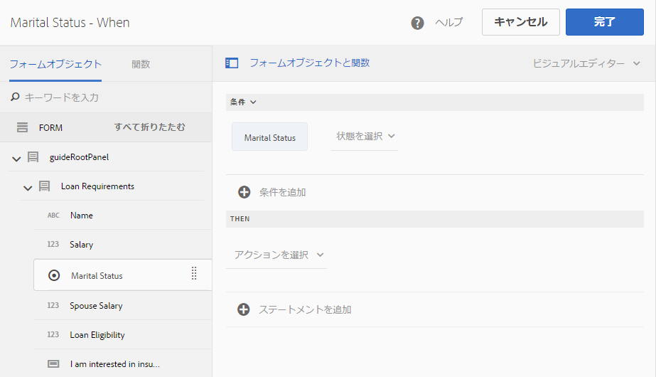

   ルールエディターの起動時は、デフォルトで「When」ルールが選択されています。また、ルールエディターを起動したフォームオブジェクト（この場合は「Marital Status（婚姻状況）」）は、「When」文に入力されています。

   選択したオブジェクトを変更することはできませんが、ルールのドロップダウンを使用することで別のルールタイプを選択することはできます（以下を参照）。別のオブジェクトに新しいルールを作成する場合は、「キャンセル」をタップしてルールエディターを終了し、そのオブジェクトから再びルールエディターを起動します。

1. Tap **[!UICONTROL Select State]** drop-down and select **[!UICONTROL is equal to]**. 「**[!UICONTROL 文字列を入力]**」フィールドが表示されます。

   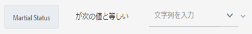

   In the Marital Status radio button, **Married** and **Single** options are assigned **0** and **1** values, respectively. 以下に示すように、割り当てられた値は、「編集」ラジオボタンダイアログの「タイトル」タブから確認することができます。

   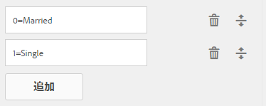

1. ルール内の「**文字列を入力**」フィールドで、**0** を指定します。

   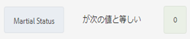

   条件をに定義しました `When Marital Status is equal to Married`。 次に、この条件が True の場合に実行するアクションを定義します。

1. その後の文では、「**[!UICONTROL アクションの選択]**」ドロップダウンから「**[!UICONTROL 表示]**」を選択します。

   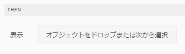

1. Drag-drop the **Spouse Salary** field from the Form Objects tab on the **Drop object or select here** field. Alternatively, tap the **Drop object or select here** field and select the **Spouse Salary** field from the pop-up menu, which lists all form objects in the form.

   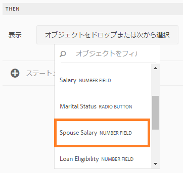

   ルールエディターでは、ルールが次のように表示されます。

   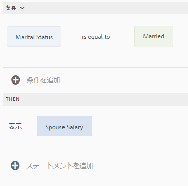

   「**完了**」をクリックして、ルールを保存します。

1. 婚姻状況が「Single（独身）」の場合は「Spouse Salary（配偶者の給与）」フィールドを非表示にするため、手順1～5を繰り返して別のルールを定義します。ルールエディターでは、ルールが次のように表示されます。

   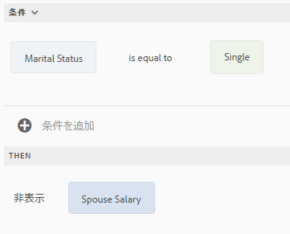

   >[!NOTE]
   >
   >また、同じ動作を実装する場合は、「Marital Status（婚姻状況）」フィールドに2つの「いつ」ルールを記述する代わりに、「Spouse Salary（配偶者の給与）」フィールド上に1つの「表示」ルールを設けることもできます。

   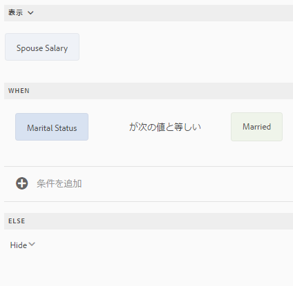

1. 次に、融資適格金額を算出するためのルールを記述します。ここでは、総給与の50パーセントとして計算され、「Loan Eligibility（貸付資格）」フィールドに表示されます。これをするには、「Loan Eligibility」フィールド上に「**指定値**」ルールを作成します。

   In authoring mode, tap the **[!UICONTROL Loan Eligibility]** field and tap . 次に、ルールエディターを起動し「**[!UICONTROL 作成]**」をタップします。

1. ルールのドロップダウンから「**[!UICONTROL 指定値]**」ルールを選択します。

   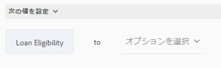

1. Tap **[!UICONTROL Select Option]** and select **[!UICONTROL Mathematical Expression]**. 数式記述用のフィールドが表示されます。

   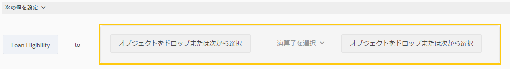

1. 数式記述用のフィールドでは：

   * 「フォームオブジェクト」タブで、最初の「**オブジェクトをドロップするか、または次から選択**」フィールドから「**Salary（給与）**」フィールドを選択するか、またはドラッグ＆ドロップします。

   * 「**演算子の選択**」フィールドから「**プラス**」を選択します。

   * Select or drag-drop from the Forms Object tab the **Spouse Salary** field in the other **Drop object or select here** field.

   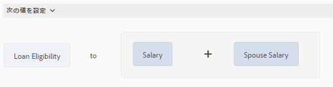

1. Next, tap in the highlighted area around the expression field and tap **Extend Expression**.

   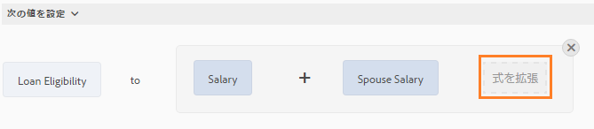

   拡張式フィールドでは、「**演算子の選択**」フィールドから「**divided by（割り算）**」を選択し、「**オプションの選択**」フィールドから「**Number（数字）**」を選択します。次に、数字フィールドに **2** を入力します。

   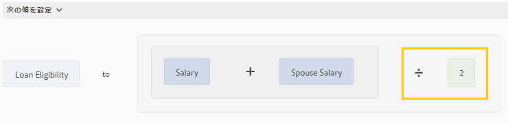

   >[!NOTE]
   >
   >「オプションの選択」フィールドから、コンポーネント、関数、数式、およびプロパティの各値を使用することで、複雑な式を作成することもできます。

   次に、True が返された場合に式を実行する条件を作成します。

1. Tap **Add Condition** to add a When statement.

   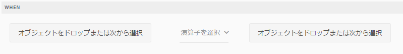

   「When」文内で：

   * 「フォームオブジェクト」タブで、最初の「**オブジェクトをドロップするか、または次から選択**」フィールドから「**Marital Status（婚姻状況）**」フィールドを選択します。

   * 「**演算子の選択**」フィールドから「**is equal to**」を選択します。

   * Select String in the other **Drop object or select here** field and specify **Married** in the **Enter a String** field.

   ルールは、ルールエディターで最終的には次のように表示されます。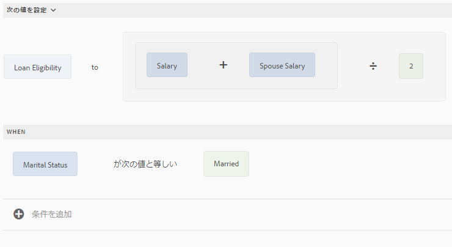

   「**完了**」をクリックして、ルールを保存します。

1. ステップ 7～12 を繰り返し、婚姻状況が「Single（独身）」であれば融資適格額を計算する別のルールを定義します。ルールエディターでは、ルールが次のように表示されます。

   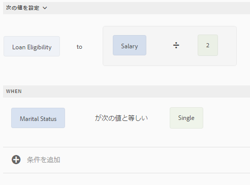

>[!NOTE]
>
>代わりに、「When」ルール内で融資適格性を計算するために「Set Value Of」ルールを使用することもできます。このルールは、「Spouse Salary（配偶者の給与）」フィールドの表示・非表示を切り替えるために作成したものです。「Marital Status（婚姻状況）」が「Single（独身）」の場合、ルールエディターでは組み合わせルールが次のように表示されます。
>
>同様に、「Spouse Salary（配偶者の給与）」フィールドの表示・非表示を切り替えるための別の組み合わせルールを記述することで、「Marital Status（婚姻状況）」が「Married（既婚）」の場合にも融資適格性を計算することができます。

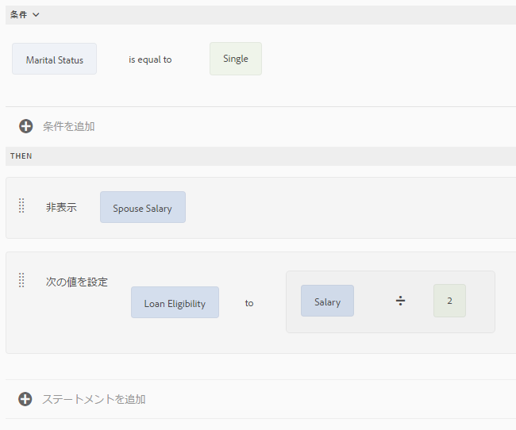

### コードエディターを使用する {#using-code-editor}

forms-power-users グループに追加されたユーザーは、コードエディターを使用できます。ルールエディターでは、ビジュアルエディターを使用して作成したルールの JavaScript コードを自動的に生成します。生成されたコードを表示するには、ビジュアルエディターからコードエディターに切り替えます。ただし、コードエディターでルールコードを変更した場合、ビジュアルエディターに戻すことはできません。ビジュアルエディターではなく、コードエディターでルールを記述することを希望する場合は、コードエディターで新たにルールを記述することもできます。これら2つのモードは、ビジュアルコードエディターの切り替えボタンから切り替えることができます。

コードエディターのJavaScriptは、アダプティブフォームの式言語です。 すべての数式は有効なJavaScriptの数式で、アダプティブフォームのスクリプトモデルAPIを使用しています。これらの数式は、特定のタイプの値を返します。アダプティブフォームクラス、イベント、オブジェクト、パブリック API の完全なリストについては、「[アダプティブフォームの JavaScript ライブラリ API リファレンス](https://helpx.adobe.com/jp/experience-manager/6-5/forms/javascript-api/index.html)」を参照してください。

コードエディターでルールを記述する際の詳細なガイドラインは、「[アダプティブフォームの数式](/help/forms/using/adaptive-form-expressions.md)」を参照してください。

ルールエディターで JavaScript コードを記述する際、次の表示キューが構造と構文に役立ちます。

* 構文のハイライト表示機能
* 自動インデント機能
* フォームオブジェクト、関数、それらのプロパティについてヒントを表示する機能
* フォームコンポーネントの名前と一般的な JavaScript 関数を自動的に入力する機能

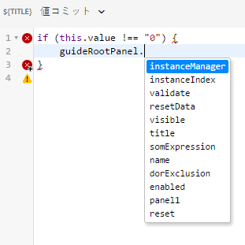

#### ルールエディターでのカスタム関数 {#custom-functions}

Apart from the out-of-the-box functions like *Sum of* that are listed under Functions Output, you can write custom functions that you frequently need. Ensure that the function you write is accompanied by the `jsdoc` above it.

Accompanying `jsdoc` is required:

* カスタムの設定や説明を使用する場合に必須です。
* Because there are multiple ways to declare a function in `JavaScript,` and comments let you keep a track of the functions.

For more information, see [usejsdoc.org](https://usejsdoc.org/).

サポートされ `jsdoc` るタグ：

* **プライベート**構文：
プライベート関数は、カスタム関数としては含まれません。`@private`
プライベート関数は、カスタム関数としては含まれません。

* **名前**構文：
または、次 `@name funcName <Function Name>`の方法 `,` を使用できます。 `@function funcName <Function Name>` **または**`@func``funcName <Function Name>`。
   `funcName` ：関数の名前です（スペースは使用不可）。
   `<Function Name>` は、関数の表示名です。

* **メンバ**ーの構文：
名前空間を関数にアタッチします。`@memberof namespace`
名前空間を関数にアタッチします。

* **パラメータ**ーの構文：
または、次を使用できます。 `@param {type} name <Parameter Description>`
または、次を使用できます。 `@argument` `{type} name <Parameter Description>` **または**`@arg``{type}``name <Parameter Description>`
関数で使用されるパラメータを表示します。関数には、複数のパラメータタグを設けることができます。各パラメーターは、実行順序に応じて 1 個のタグを設けることができます。
   `{type}` パラメータータイプを表します。 許可されているパラメータータイプは、以下のとおりです。

   1. 文字列
   1. 数値
   1. ブール型

   他のすべてのパラメータの種類は、上記のいずれかに分類されます。「なし」はサポートされていません。上記のタイプのいずれかを選択していることを確認してください。タイプでは、大文字と小文字は区別されません。Spaces are not allowed in the parameter `name`. `<Parameter Descrption>` `<parameter>  can have multiple words. </parameter>`

* **戻り値の型**構文：
または、「 `@return {type}`代わりに」を使用し、「」を使用することもでき `@returns {type}`ます。
目的など、関数に関する情報を追加します。
{type}は、関数の戻り値の型を表します。 許可されている戻り値のタイプは次のとおりです。

   1. 文字列
   1. 数値
   1. ブール型

   他のすべての戻り値の型は、上記のいずれかに分類されます。「なし」はサポートされていません。上記のタイプのいずれかを選択していることを確認してください。戻り値の型では、大文字と小文字は区別されません。

>[!NOTE]
>
>カスタム関数の前に記述するコメントには、概要を含めることができます。概要は複数の行に拡張することができます。終端にはタグを使用します。説明を簡潔にするため、ルールビルダーでは1行以内に抑えるように心がけてください。

**カスタム関数を追加する**

たとえば、正方形の面積を計算するカスタム関数を追加するとします。横の長さは、ユーザの入力を使用します。ユーザ入力は、フォーム内の数値ボックスを通して受け取ります。計算された出力は、フォーム内の別の数値ボックスに表示されます。カスタム機能を追加するには、最初にクライアントライブラリを作成し、次に CRX リポジトリに追加する必要があります。

次の手順を実行してクライアントライブラリを作成し、それを CRX リポジトリに追加します。

1. クライアントライブラリを作成します。詳しくは、「[クライアント側ライブラリの使用](/help/sites-developing/clientlibs.md)」を参照してください。
1. In CRXDE, add a property `categories`with string type value as `customfunction` to the `clientlib` folder.

   >[!NOTE]
   >
   >`customfunction`はカテゴリの例です。 You can choose any name for the category you create in the `clientlib`folder.

CRXリポジトリにクライアントライブラリを追加した後は、アダプティブフォームでそれを使用します。これにより、カスタム関数をルールとしてフォーム内で使用することができます。次の手順を実行して、アダプティブフォームにクライアントライブラリを追加します。

1. フォームを編集モードで開きます。To open a form in edit mode, select a form and tap **Open**.
1. In the edit mode, select a component, then tap  > **Adaptive Form Container**, and then tap .
1. サイドバーの「クライアントライブラリの名前」の下から、クライアントライブラリを追加します。( `customfunction` in the example.)

   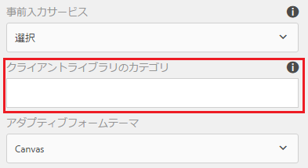

1. Select the input numeric box, and tap  to open the rule editor.
1. Tap **Create Rule**. フォームの「出力」フィールドに入力の二乗値を保存するルールを、次のオプションを使用して作成します。
   [ 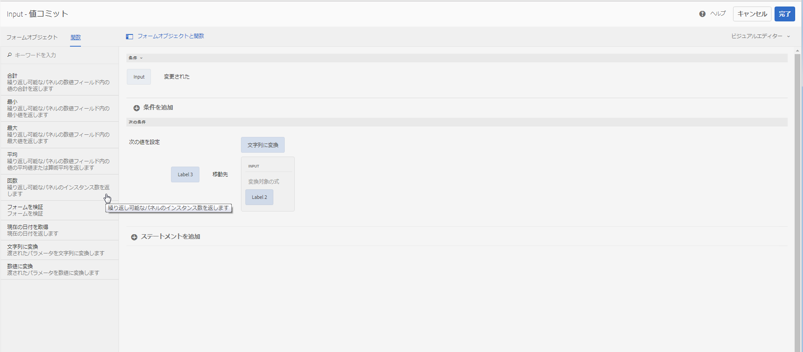](assets/add-custom-rule.png)ルールの作成タップ **完了**。 カスタム関数が追加されます。

#### 関数の宣言でサポートされる型 {#function-declaration-supported-types}

**文関数**

```javascript
function area(len) {
    return len*len;
}
```

This function is included without `jsdoc` comments.

**関数表現**

```javascript
var area;
//Some codes later
/** */
area = function(len) {
    return len*len;
};
```

**関数表現と文関数**

```javascript
var b={};
/** */
b.area = function(len) {
    return len*len;
}
```

**変数の関数宣言**

```javascript
/** */
var x1,
    area = function(len) {
        return len*len;
    },
    x2 =5, x3 =true;
```

制限：関数宣言をリストにまとめた場合、カスタム関数では、変数リストから最初の関数宣言のみが選択されます。関数表現は、すべての関数宣言に使用することができます。

**オブジェクトの関数宣言**

```javascript
var c = {
    b : {
        /** */
        area : function(len) {
            return len*len;
        }
    }
};
```

>[!NOTE]
>
>カスタム関数では、必ず`jsdoc` を使用てください。Although `jsdoc`comments are encouraged, include an empty `jsdoc`comment to mark your function as custom function. これにより、カスタム関数のデフォルト処理が可能になります。

## ルール管理 {#manage-rules}

Any existing rules on a form object are listed when you tap the object and tap . ここでは、タイトルを表示し、ルール概要をプレビュー表示することができます。また、UI からルール概要を拡大して全体を表示したり、ルール順序を変更したり、ルールを編集・削除したりすることもできます。

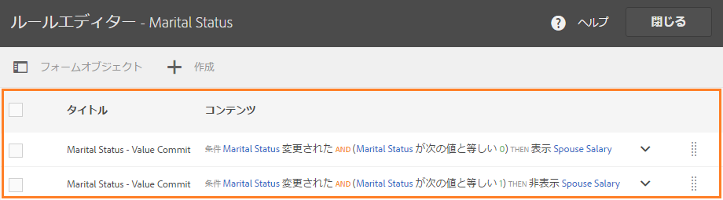

ルールに対しては、以下の操作を実行できます。

* **展開 / 折りたたみ**：ルールリスト内の「コンテンツ」の列には、ルールの内容が表示されます。If the entire rule content is not visible in the default view, tap  to expand it.

* **並べ替え**：作成した新しいルールは、すべてルールリストの一番下に追加されます。ルールは上から下に順に実行されます。一番上のルールが最初に実行され、続けて同じタイプの他のルールが実行されます。たとえば、「When」、「Show」、「Enable」、および「When」の各ルールが、リストの1～4番目にある場合、一番上にある「When」ルールが最初に実行され、次に4番目の「When」ルールが実行されます。そして、「Show」ルールおよび「Enable」ルールが実行されます。You can change the order of a rule by tapping  against it or drag-drop it to the desired order in the list.

* **編集**：ルールを編集するには、ルールタイトルの横にあるチェックボックスを選択します。ルールを編集・削除するための追加オプションが表示されます。Tap **Edit** to open the selected rule in the rule editor in visual or code editor mode depending the mode used to create the rule.

* **削除**:ルールを削除するには、ルールを選択し、「 **削除**」をタップします。

* **有効 / 無効**：ルールの使用を一時的に中止しなければならないことがあります。その際、1 つ以上のルールを選択し、アクションツールバーで「無効」をタップすると、それらのルールが無効になります。ルールが無効になっている場合、実行時には実行されません。 無効化されたルールを有効化するには、そのルールを選択し、アクションツールバーで「有効」をタップします。ルールの「ステータス」列には、そのルールが有効になっているのか無効になっているのかが表示されます。

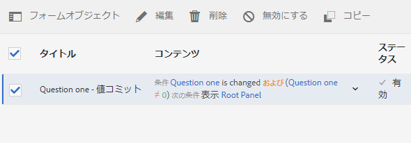

## ルールのコピー＆ペースト {#copy-paste-rules}

時間を節約するために、フィールドのルールを別の類似したフィールドにコピー＆ペーストすることができます。

ルールをコピー＆ペーストするには、次の手順を実行します。

1. Tap the form object from which you want to copy a rule, and in the component toolbar tap . フォームオブジェクトが選択された状態でルールエディターのユーザーインタフェースが表示され、既存のルールが表示されます。

   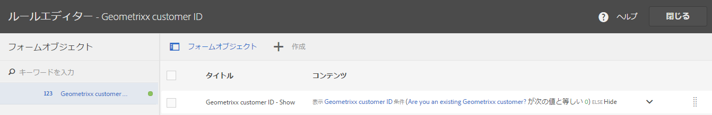

   既存ルールの詳細な管理方法については、「[ルール管理](../../forms/using/rule-editor.md#p-manage-rules-p)」を参照してください。

1. ルールタイトルの横にあるチェックボックスを選択します。ルールを管理するための追加オプションが表示されます。「**コピー**」をタップします。

   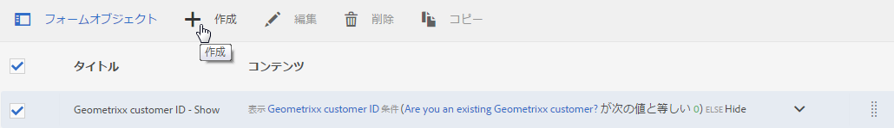

1. Select another form object to which you want to paste the rule and tap **Paste**. また、貼り付けたルールは編集して変更を加えることもできます。

   >[!NOTE]
   >
   >別のフォームオブジェクトにルールを貼り付けることができるのは、コピーされたルールのイベントを、貼り付け先のフォームオブジェクトがサポートしている場合に限られます。たとえば、ボタンはクリックイベントをサポートします。ボタンのクリックイベントにはルールを貼り付けることができますが、チェックボックスには貼り付けできません。

1. 「**完了**」をクリックして、ルールを保存します。

## ネスト式 {#nestedexpressions}

ルールエディターでは、複数の「AND」と「OR」演算子を使用して、ネストしたルールを作成することができます。ルール内には、複数の「AND」と「OR」演算子を混在させることもできます。

以下の例では、ネストされたルールを紹介します。ここでは、必要な条件が満たされた際に、子供の親権適格性についてのメッセージをユーザーに表示します。

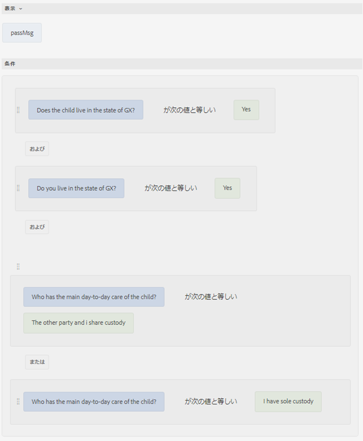

ルール内で条件をドラッグアンドドロップして編集することもできます。Tap and hover over the handle ( ) before a condition. 次に示すようにポインタが手の形になったら、ルール内の任意の場所に条件をドラッグアンドドロップします。ルール構造が変化します。


## 日付式の条件 {#dateexpression}

ルールエディターでは、日付比較を使用して条件を作成できます。

以下の例では、住宅ローンが既に取得済みの場合にスタティックテキストオブジェクトを表示し、ユーザーは日付フィールドに入力することでこれを示します。

ユーザーが入力した物件の住宅ローンの日付が過去のものである場合、アダプティブフォームは収入計算に関する注記を表示します。次のルールは、ユーザーが入力した日付を現在の日付と比較し、ユーザーが入力した日付が現在の日付より前の場合、フォームは（Income という名前の）テキストメッセージを表示します。

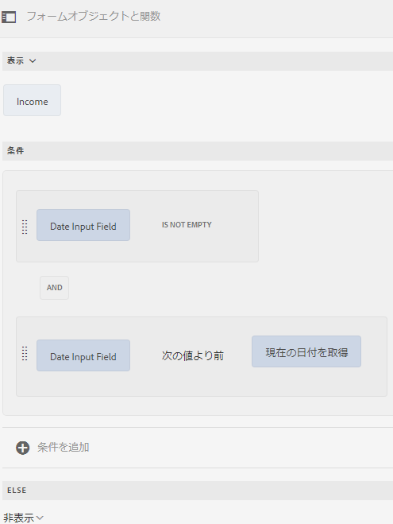

入力された日付が現在の日付よりも前の場合、フォームはテキストメッセージ（Income）を次のように表示します。


## 数値比較条件 {#number-comparison-conditions}

ルールエディターでは、2 つの数値を比較する条件を作成できます。

次の例は、申込者が現在の住所に滞在する月数が36月未満の場合にスタティックテキストオブジェクトを表示する条件です。

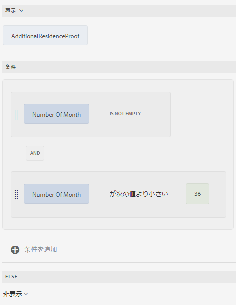

現在の居住地住所に住んでいる期間が 36 か月に満たないことをユーザーが指定した場合、フォームは、追加の居住地証明が要求される場合があるという通知を表示します。


## 既存のスクリプトに対するルールエディタの影響 {#impact-of-rule-editor-on-existing-scripts}

AEM 6.1 Forms 機能パック 1 より前のバージョンの AEM Forms では、フォームの作成者や開発者がダイナミック動作をアダプティブフォームに追加する際に、「編集」コンポーネントダイアログの「スクリプト」タブを使用して式を記述していました。現行バージョンでは、「スクリプト」タブの代わりにルールエディターが導入されています。

「スクリプト」タブで記述する必要があったスクリプトや式は、ルールエディターからすべて利用できます。forms-power-users グループに含まれるユーザーは、ビジュアルエディターでは表示や編集ができませんが、コードエディターからはスクリプトを編集できます。

## ルールの例 {#example}

### フォームデータモデルサービスを呼び出し {#invoke}

Web サービス `GetInterestRates` で、ローン総額、加入年数、申込者の信用度を入力内容から取得し、EMI 総額および年利などのローン計画を返すものとします。Web サービスをデータソースとして使用し、フォームデータモデルを作成します。You add data model objects and a `get` service to the form model. フォームデータモデルの「サービス」タブにサービスが表示されます。その後、データモデルオブジェクトのフィールドを含むアダプティブフォームを作成し、ローン総額、加入年数、申込者の信用度についてユーザーの入力を取得します。計画の詳細を取得するために Web サービスをトリガするボタンを追加します。適切なフィールドで出力が算出されます。

次のルールは、「サービスを起動」アクションを設定してシナリオ例を実行する方法を示しています。

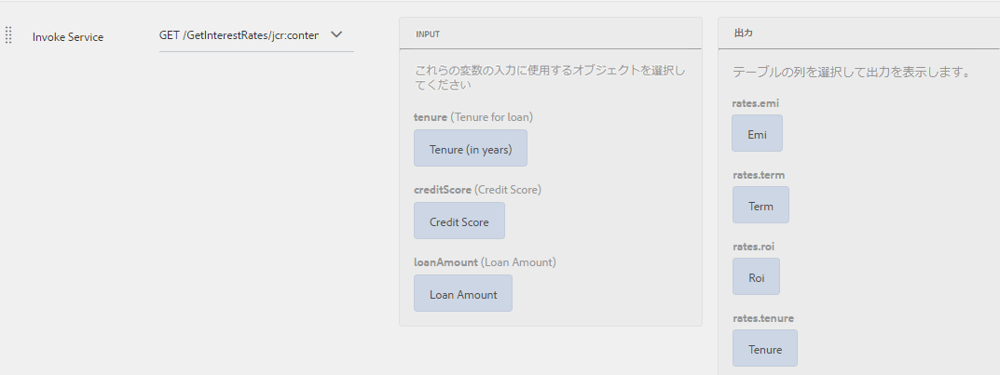

アダプティブフォームルールを使用したフォームデータモデルサービスの呼び出し

### 「When」ルールを使用して複数のアクションをトリガする {#triggering-multiple-actions-using-the-when-rule}

ローン申込フォームでは、ローンの申請者が既存の顧客であるかどうかを判断する必要があります。この情報に基づいて、顧客 ID フィールドの表示・非表示を切り替えます。また、申請者が既存の顧客であれば、顧客 ID フィールドにフォーカスを置きます。ローン申込フォームは、次のコンポーネントから構成されます。

* 「**Are you an existing Geometrixx customer?（Geometrixxに既に登録されていますか？）**」のラジオボタンでは、「はい」と「いいえ」のオプションが設けられています。「はい」の値は **0**、「いいえ」の値は **1** です。

* 「**Geometrixx customer ID（Geometrixx 顧客 ID）**」のテキストフィールドには、顧客 ID が入力されます。

この動作を実装するためラジオボタンに「When」ルールを記述すると、ビジュアルルールエディターにはルールが次のように表示されます。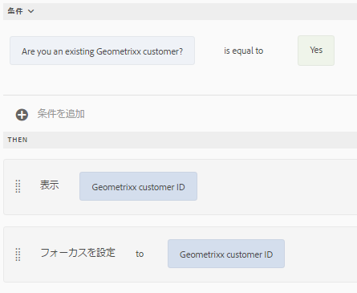

ビジュアルエディターに表示されたルール

上のルール例では、「When」セクション内の文は条件に当たります。これが True を返すと、「Then」セクションで指定されたアクションが実行されます。

コードエディターでは、ルールが次のように表示されます。

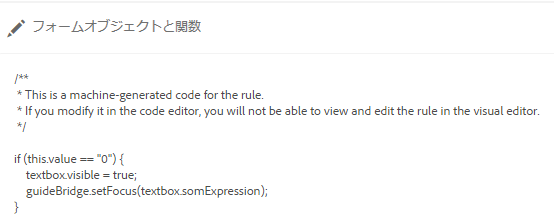

コードエディターに表示されたルール

### ルール内で関数出力を使用する {#using-a-function-output-in-a-rule}

発注フォームでは、次の表が表示されます。この中には、発注者が注文を入力します。表の内容：

* 最初の行は反復可能です。このため、ユーザーは複数の製品を注文し、それぞれ異なる量を指定することができます。Its element name is `Row1`.
* 反復可能な行と「Product Quantity（製品数量）」の列が重なるセルでは、タイトルが「Quantity（数量）」になっています。このセルのエレメント名は「`productquantity`」です。
* 表の2行目は反復しません。また、この行と「Product Quantity（製品数量）」の列が重なるセルでは、タイトルが「Total Quantity（合計数量）」になっています。

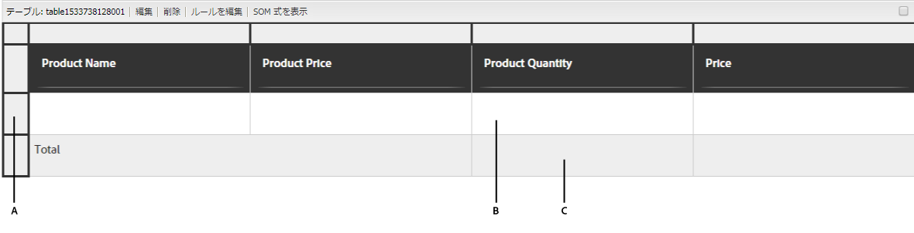

**A.** Row1 **B.** Quantity **C.** Total Quantity

ここでは、「Product Quantity（製品数量）」列で指定された数量を全製品について合計し、「Total Quantity（合計数量）」セルに合計値を表示する必要があります。この動作は、以下に示すように、「Total Quantity（合計数量）」セルに「Set Value Of」ルールを記述することにより実装できます。

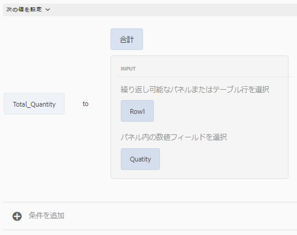

ビジュアルエディターに表示されたルール

コードエディターでは、ルールが次のように表示されます。

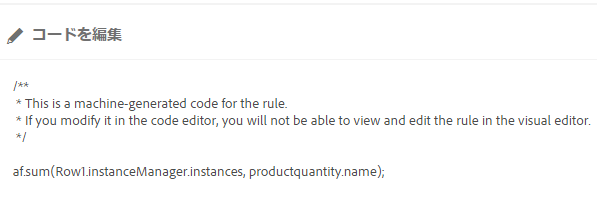

コードエディターに表示されたルール

### 式を使用してフィールド値を検証する {#validating-a-field-value-using-expression}

上の例で説明した発注書フォームでは、価格が 10000 を超える商品について、1 個を超える数量は発注が制限されています。この動作を実装するには、以下に示すように「Validate」ルールを記述します。

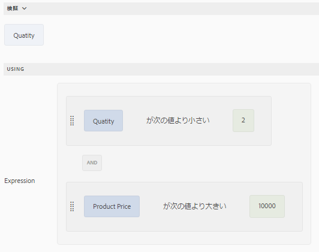

ビジュアルエディターに表示されたルール

コードエディターでは、ルールが次のように表示されます。

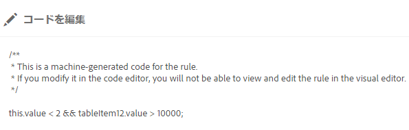

コードエディターに表示されたルール

