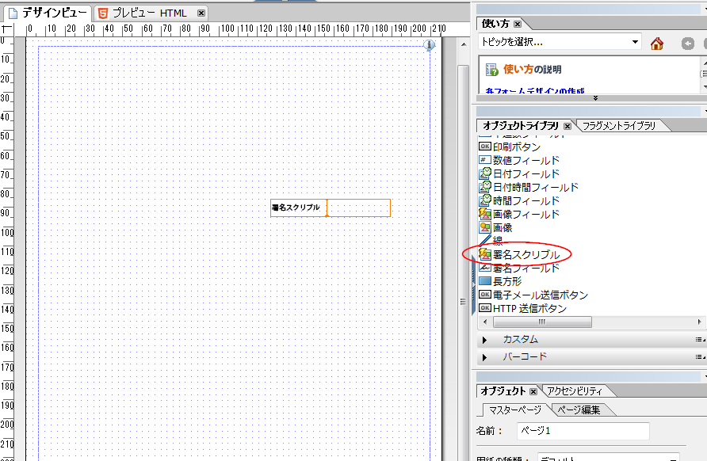

# HTML5 フォームでの手書き署名の使用{#using-scribble-signature-in-html-forms}

タッチデバイスでの使用が増加する HTML5 フォームの一般的な要件として、署名のサポートがあります。スタイラスまたは指を使った手書きは、モバイルデバイスでフォームに署名する方法として受け入れられつつあります。HTML5 フォームおよび Forms Designer では、フォームに手書き署名フィールドを挿入するオプションが可能になりました。フォームがブラウザーでレンダリングされるときに、スタイラス、マウス、または指を使用してこれらのフィールド上に署名することができます。

## 手書き署名フィールドの使用によるフォームのデザイン {#how-to-design-a-form-using-scribble-signature-field}

1. Forms Designer でフォームを開きます。
1. ページ上に手書き署名フィールドをドラッグ＆ドロップします。

   

   >[!NOTE]
   >
   >Forms Designerで選択したフィールドの寸法は、フィールドのレンダリング時に反映されます。 ただし、レンダリングされた署名ボックスの寸法は、Forms Designer で指定された寸法ではなく、フィールドの縦横比に基づいて計算されます。

1. 手書き署名フィールドを設定します。

   iPad の署名プロセス中、手書き署名フィールドは、デフォルトで、位置情報を必須としてマークします（他のデバイスではオプションです）。このデフォルトの動作は `geoLocMandatoryOnIpad` プロパティの値を変更することでオーバーライドできます。このプロパティは手書き署名フィールドのエキストラとして公開されています。それを変更するための手順は：

   1. フォームで、手書き署名フィールドを選択します。
   1. Select the **XML Source** tab.

      >[!NOTE]
      >
      >To open the XML Source tab, click **View** > **XML Source**.

   1. Locate the `<ui>` tag in the `<field>` tag and modify the source code to look like the following:

      ```xml
      <extras name="x-scribble-add-on">
      <boolean name="geoLocMandatoryOnIpad">0</boolean>
      </extras>
      ```

   1. 「**Design View**」タブを選択します。確認ボックスで、「**はい**」を選択します。
   1. フォームを保存します。

1. サポートされているデバイス／デスクトップブラウザーでフォームをレンダリングします。

## 手書き署名とのやりとり {#interfacing-with-the-scribble-signatures}

### Signing {#signing}

手書き署名フィールドがフォームに追加されてレンダリングされたら、そのフィールドをクリックまたはタップするとダイアログボックスが開きます。ユーザーは点線の正方形によって割り当てられた描画領域に、マウス、指、またはスタイラスを使用して、署名を手書きすることができます。


**A.** ブラ **シB** 消しゴ **ムC.** Geolocation **D.** 位置情報

### ジオタグ付け {#geo-tagging}

手書き中に位置情報アイコンをクリックすると、フィールドに位置情報と時間の情報が埋め込まれます。

>[!NOTE]
iPad では、デフォルトで、位置情報の埋め込みは必須です。

iPad では、位置情報アイコンはデフォルトで表示されていなくて、位置情報は「**OK**」をクリックする際に自動的に埋め込まれます。

iPad では、この設定はフィールドの初期化パラメーターで `geoLocManadatoryOnIpad` パラメーターの値を `0` に変更することで変えられます。

* 位置情報が必須の場合、減少した描画領域が提供されます。位置情報のテキストは、ユーザーが残る領域で「**OK**」をクリックすると追加されます。
* その他の場合では、全体が描画可能な領域が提供されます。ユーザーが位置情報を埋め込むことを選択すると、この領域は位置情報のテキストに適合するようにサイズが変更されます。

### 署名の消去 {#clearing-a-signature}

While using this feature, a user can click the **Eraser** icon to clear the field, and start over. 位置情報が追加された場合、それも消去されます。

### 署名の保存 {#saving-a-signature}

「**OK**」アイコンをクリックすると、手書きはフィールドの画像として保存されます。画像と値はさらに処理するためにサーバーに送信できます。ユーザーが「**OK**」クリックしたら、手書きフィールドはロックされます。手書きウィジェットを使用して署名を再び編集することはできません。

手書きフィールドをタップまたはクリックすると、読み取り専用モードでダイアログボックスが開きます。


### ペンサイズの選択 {#selecting-pen-size}

「**Brushes**」アイコンをクリックして、使用可能なペンサイズのリストを表示します。ペンサイズをクリックまたはタップして、その対応するペンを使用します。

### フォームからの署名の削除 {#delete-signatures-from-the-form}

フォームから署名を削除するには、以下を実行します。

* （モバイルデバイス）署名フィールドを長押しし、確認ダイアログで「**はい**」をタップします。
* （デスクトップ）署名フィールドにマウスポインターを置いて「**キャンセル**」アイコンをクリックし、確認ダイアログで「**はい**」をクリックします。
