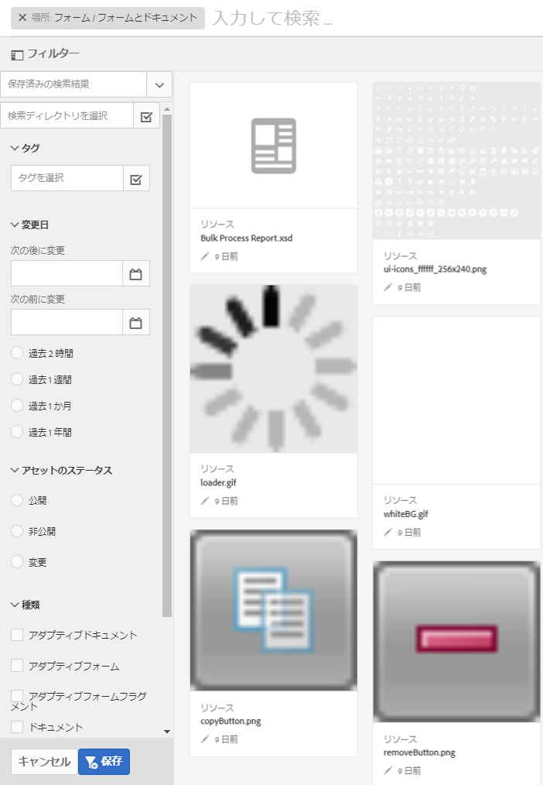

# フォームおよびアセットの検索{#searching-for-forms-and-assets}

文字列または文字列とワイルドカードを使用して、フォームまたはフォームアセットを検索することができます。また、Search パネルのさまざまなカテゴリの条件を利用して、検索結果を絞り込むこともできます。

1 つまたは複数の条件を選択し、文字列も指定すると、文字列と条件の両方に一致するものが検索結果として返されます。検索結果の質は、提供されるフォームとアセットのメタデータの質に左右されます。

をクリックして、検索パネルの表示/非表示を切り替えます。

## 基本検索 {#basic-search}

基本検索は、フィルタを特定することなく実行されるデフォルトの検索です。メタデータプロパティのフルテキスト検索が AEM Forms によって実行されます。

基本検索を実行するには、テキストフィールドに検索クエリを入力し、リターンを押します。また、任意の数の文字に一致するワイルドカード文字 (*) を入力することもできます。

Adobe Experience Manager が、メタデータプロパティ内で入力されたテキストを検索し、対応する結果を返します。複数の単語を入力した場合には、テキスト全体に一致する検索結果が返されます。

基本検索について、次の点に注意してください。

* 検索は、フォームとアセットのメタデータプロパティを利用して実行されます。
* 複数の単語を入力した場合には、テキスト全体に一致する検索結果が返されます。
* 検索では、大文字と小文字は区別されません。例えば、`geometrixx`と入力すると、`Geometrixx`、`GEOMETRIXX`、`GeoMetRixx`のタイトルを持つアセットが検索結果に表示されます。

* 単語の部分一致はサポートされていません。文字列の一部を使って検索するには、ワイルドカード (*) を使用します。ただし、検索クエリが単語全体に一致する場合は、対応するフォームまたはアセットが表示されます。
* 空白は考慮され、検索時にトリミングされません。例えば、`My form`は`My form`と同じ検索クエリではありません。

* メタデータプロパティのフィールドがデータと表示値を別々に持つ場合、表示値を検索パラメーターとして使用することはできません。例えば、変更済み、発行済みなどのステータスのプロパティは、異なる形式で保存されているため、これらを基に検索することはできません。

## 詳細検索 {#advanced-search}

検索条件には、クエリのほかに、基本検索を絞り込み、より効率的にするために指定できる検索パラメーターがいくつかあります。

AEM form とアセット検索の検索フィールドおよびパラメーター / フィルタ

### アセットパス {#asset-path}

アセットパスフィルタを使用することにより、検索結果を現在のディレクトリに限定することができます。「Search In Current Directory」オプションが選択されていない場合には、ベースディレクトリに存在するアセットが検索結果に含まれます。現在のページがディレクトリではなく、「current directoryで検索」オプションが選択されている場合は、親ディレクトリに存在するアセットが返されます。

### アセットの変更 {#asset-modification}

特定の期間内に変更されたすべてのアセットに対して検索を行うには、次のいずれかのオプションを選択します。

| **オプション** | **説明** |
|---|---|
| 2 時間前 | 過去 2 時間以内に変更されたすべてのアセットに対して検索を行います。 |
| 1 週間前 | 過去 1 週間以内に変更されたすべてのアセットに対して検索を行います。 |
| 1 か月前 | 過去 1 か月以内に変更されたすべてのアセットに対して検索を行います。 |
| 1 年前 | 過去 1 年以内に変更されたすべてのアセットに対して検索を行います。 |

### アセットのステータス {#asset-status}

次のステータスのいずれかを使用して、アセットを検索することができます。

* **発行済み**：発行済みのすべてのアセットのうち、発行後に変更されていないアセットを検索します。

* **未発行**：発行されたことのないすべてのアセットを検索します。

* **変更済み**：発行後に変更されたまたは非公開にされたすべてのアセットを検索します。

### アセットタイプ {#asset-type}

任意の数のアセットタイプを選択することができます。選択されたアセットタイプすべてに一致する検索結果が返されます。

<table>
 <tbody>
  <tr>
   <th>オプション</th> 
   <th>説明</th> 
  </tr>
  <tr>
   <td>フォームテンプレート  </td> 
   <td>すべてのフォームテンプレートに対して検索を行います。  </td> 
  </tr>
  <tr>
   <td>PDF フォーム</td> 
   <td>すべての PDF ドキュメントに対して検索を行います。</td> 
  </tr>
  <tr>
   <td>ドキュメント</td> 
   <td>すべてのドキュメントに対して検索を行います。</td> 
  </tr>
  <tr>
   <td>アダプティブフォーム  </td> 
   <td>すべてのアダプティブフォームに対して検索を行います。</td> 
  </tr>
  <tr>
   <td>Resource</td> 
   <td>すべてのリソースに対して検索を行います。  </td> 
  </tr>
 </tbody>
</table>

### タグ {#tags}

タグとは、アセットを識別するためにつけられるラベルのことです。検索時には、必要に応じて、任意の数のタグをドロップダウンリストから選択するか、またはカスタムタグを追加してください。検索結果には、選択されたタグの交点が含まれます。
