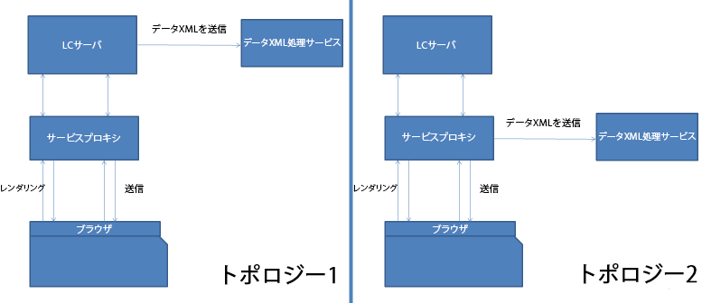

# HTML5 forms サービスプロキシ{#html-forms-service-proxy}

HTML5 forms サービスプロキシは、送信サービスのためのプロキシを登録する設定です。サービスプロキシを設定するには、リクエストパラメーター *submissionServiceProxy* を使って送信サービスの URL を指定します。

## サービスプロキシの利点 {#benefits-of-service-proxy-br}

サービスプロキシは、以下を排除します。

* HTML5 forms ワークフローでは、HTML5 forms ユーザーに対して送信サービス「/content/xfaforms/submission/default」を開く必要があります。これにより、AEM サーバーは意図しない多くの閲覧者にさらされてしまいます。
* サービス URL は、フォームのランタイムモデルに埋め込まれます。サービス URL パスを変更することは不可能です。
* 送信は 2 手順のプロセスです。フォームデータを送信するために、送信はサーバーに対して少なくとも 2 つのジャーニーを必要とします。したがって、サーバーでの負荷が増大します。
* HTML5 forms は、PDF リクエストの代わりに POST リクエストでデータを送信します。PDF と HTML5 forms の両方が関与するワークフローの場合、2 つの異なる方法による送信処理が必要となります。

### トポロジー {#topologies-br}

HTML5 forms は次のトポロジーを使用して LiveCycle サーバーに接続します。

* AEM サーバーまたは HTML5 forms が POST を使ってデータをサーバーに送信するトポロジー。
* プロキシサーバーが POST データをサーバーに送信するトポロジー。

HTML5 forms サービスプロキシのトポロジー

HTML5 forms は AEM サーバーに接続して、サービス側スクリプト、Web サービス、および送信を実行します。HTML5 forms の XFA ランタイムは、AEM サーバーに接続するためのさまざまなパラメーターを付けて、「/bin/xfaforms/submitaction」エンドポイントで Ajax コールを使用します。HTML5 forms は AEM サーバーに接続して、次の操作を実行します。

#### サーバー側スクリプトと Web サービスの実行 {#execute-server-sided-scripts-and-web-services}

サーバー上で実行するようにマークされているスクリプトは「サーバー側スクリプト」といいます。次の表に、リスト側スクリプトとWebサービスで使用されるすべてのパラメーターを示します。

<table>
 <tbody>
  <tr>
   <td>
<strong>パラメーター</strong>
 </td>
   <td>
<strong>説明</strong>
 </td>
  </tr>
  <tr>
   <td>
activity
 </td>
   <td>
activity は、リクエストをトリガーするイベントを指定します。例えば、クリック、終了、または変更など
 </td>
  </tr>
  <tr>
   <td>
contextSom
 </td>
   <td>
contextSom は、イベントが実行されるオブジェクトの SOM 式を指定します。
 </td>
  </tr>
  <tr>
   <td>
テンプレート
 </td>
   <td>
Template は、フォームをレンダリングするために使用するテンプレートを指定します。
 </td>
  </tr>
  <tr>
   <td>
contentRoot
 </td>
   <td>
contentRoot は、フォームをレンダリングするために使用するテンプレートルートディレクトリを指定します。
 </td>
  </tr>
  <tr>
   <td>
データ
 </td>
   <td>
Data は、フォームをレンダリングするために使用するデータバイトを指定します。
 </td>
  </tr>
  <tr>
   <td>
formDom
 </td>
   <td>
formDom は、HTML5 forms の DOM を JSON 形式で指定します。
 </td>
  </tr>
  <tr>
   <td>
packet
 </td>
   <td>
packet は、フォームとして指定されます。
 </td>
  </tr>
  <tr>
   <td>
debugDir
 </td>
   <td>
debugDir は、フォームをレンダリングするために使用するデバッグディレクトリを指定します。
 </td>
  </tr>
 </tbody>
</table>

#### データの送信 {#submit-data}

送信ボタンをクリックすると、HTML5 forms はデータをサーバーに送信します。HTML5 forms がサーバーに送信するすべてのパラメーターを下表に示します。

<table>
 <tbody>
  <tr>
   <td>
<strong>パラメーター</strong>
 </td>
   <td>
<strong>説明</strong>
 </td>
  </tr>
  <tr>
   <td>
テンプレート
 </td>
   <td>
フォームをレンダリングするために使用するテンプレート。
 </td>
  </tr>
  <tr>
   <td>
contentRoot
 </td>
   <td>
フォームをレンダリングするために使用するテンプレートルートディレクトリ。
 </td>
  </tr>
  <tr>
   <td>
データ
 </td>
   <td>
フォームをレンダリングするために使用するデータバイト。
 </td>
  </tr>
  <tr>
   <td>
formDom
 </td>
   <td>
HTML5 forms の DOM を JSON 形式で指定します。
 </td>
  </tr>
  <tr>
   <td>
submiturl
 </td>
   <td>
データ XML が投稿される URL。
 </td>
  </tr>
  <tr>
   <td>
debugDir
 </td>
   <td>
フォームをレンダリングするために使用するデバッグディレクトリ。
 </td>
  </tr>
 </tbody>
</table>

#### 送信プロキシはどのように機能しますか？ {#how-nbsp-the-nbsp-submit-proxy-works}

送信サービスプロキシは、submiturl がリクエストパラメーター内には存在しないようにパスとして機能します。これはパススルーとして機能します。これはリクエストを /bin/xfaforms/submitaction エンドポイントに送信し、応答を XFA ランタイムに送信します。

送信サービスプロキシは、submiturl がリクエストパラメーター内に存在する場合は、トポロジーを選択します。

* AEM サーバーがデータを投稿する場合、プロキシサーバーはパススルーとして機能します。これはリクエストを /bin/xfaforms/submitaction エンドポイントに送信し、応答を XFA ランタイムに送信します。
* If proxy posts the data, the proxy service passes all the parameters except submitUrl to the */bin/xfaforms/submitaction* end point and receives xml bytes in response stream. 次に、プロキシサービスはデータ xml バイトを submitUrl に投稿して処理します。

* データ（POST リクエスト）をサーバーに送信する前に、HTML5 forms はサーバーに接続していて使用できることを確認します。接続と可用性を確認するために、HTML forms は空のヘッドリクエストをサーバーに送信します。サーバーが使用できる場合は、HTML5 forms はデータ（POST リクエスト）をサーバーに送信します。If the server is not available, an error message, *Could’t connect to the server,* is displayed. この事前の検出により、ユーザーがフォームに再記入するなどの問題を回避できます。プロキシサーブレットはヘッドリクエストを処理し、例外をスローしません。
