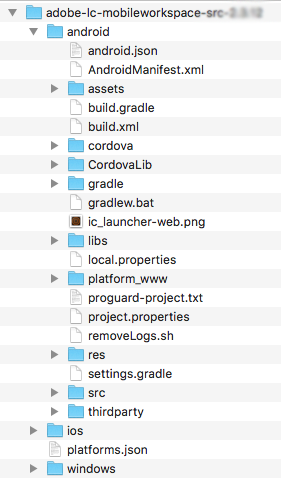

# Android Studio プロジェクトのセットアップと Android アプリの作成 {#set-up-the-android-studio-project-and-build-the-android-app}

ここでは、バージョン 6.3.1.1 移行の AEM Forms アプリケーションを作成する手順について説明します。For building an app from source code of source code of the AEM Forms App 6.3, see [Set up the Eclipse project and build the Android™ app](/help/forms/using/setup-eclipse-project-build-installer.md).

AEM Forms では、AEM Forms アプリケーションの完全なソースコードを提供しています。このソースには、カスタムの AEM Forms アプリケーションを構築するためのすべてのコンポーネントが含まれています。ソースコードアーカイブ `adobe-lc-mobileworkspace-src-<version>.zip` は、ソフトウェア配布 `adobe-aemfd-forms-app-src-pkg-<version>.zip` パッケージの一部です。

AEM Forms アプリケーションソースを入手するには、以下の手順を実行します。

1. Open [Software Distribution](https://experience.adobe.com/downloads)（ソフトウェア配布）。 Adobe IDがソフトウェア配布物にログインする必要があります。
1. ヘッダーメニューで **[!UICONTROL Adobe Experience Manager]** をタップします。
1. In the **[!UICONTROL Filters]** section:
   1. 「 **[!UICONTROL ソリューション]** 」ドロップダウンリストから「 **[!UICONTROL フォーム]** 」を選択します。
   2. パッケージのバージョンと種類を選択します。 また、「 **[!UICONTROL 検索のダウンロード数]** 」オプションを使用して結果をフィルターすることもできます。
1. お使いのオペレーティングシステムに対応するパッケージ名をタップし、「EULA条項に **[!UICONTROL 同意します]**」を選択して、「 **[!UICONTROL ダウンロード]**」をタップします。
1. パッ [ケージマネージャーを開き](https://docs.adobe.com/content/help/ja-JP/experience-manager-65/administering/contentmanagement/package-manager.html) 、「パッケージを **[!UICONTROL アップロード]** 」をクリックしてパッケージをアップロードします。
1. Select the package and click **[!UICONTROL Install]**.

The following image displays the extracted contents of the `adobe-lc-mobileworkspace-src-<version>.zip`.

The following image displays the directory structure of the `android`folder in the `src`folder.

## 標準的な AEM Forms アプリケーションの構築 {#set-up-the-xcode-project}

1. Android™ Studio でプロジェクトを設定し、署名 ID を指定するには、以下の手順を実行します。

   設定済みの Android™ Studio がインストールされているマシンにログインします。

1. Copy the downloaded `adobe-lc-mobileworkspace-src-<version>.zip` archive to:

   **MACユーザーの場合**: `[User_Home]/Projects`

   **Windows®ユーザーの場合**: `%HOMEPATH%\Projects`

   >[!NOTE]
   >
   >Windows® の場合は、Android プロジェクトをシステムドライブに保存することをお勧めします。

1. アーカイブを次のディレクトリに展開します。

   **MACユーザーの場合**: `[User_Home]/Projects/[your-project]`

   **Windows®ユーザーの場合**: `%HOMEPATH%\Projects\[your-project]`

   >[!NOTE]
   >
   >抽出した Android プロジェクトを Android Studio に読み込む前に、そのプロジェクトをシステムドライブに保存することをお勧めします。

1. Android™ Studio を起動します。

   **MACユーザーの場合**: フォルダー内の `local.properties` ファイルを更新し、デスクトップ上の `[User_Home]/Projects/[your-project]/android` 場所を `sdk.dir``SDK` 変数で指定します。

   **Windows®ユーザーの場合**: フォルダー内の `local.properties` ファイルを更新し、デスクトップ上の `%HOMEPATH%\Projects\[your-project]\android` 場所を `sdk.dir``SDK` 変数で指定します。

1. プロジェクトをビルドするには、「**[!UICONTROL 完了]**」をクリックします。

    プロジェクトが ADT Project Explorer で使用できるようになります。 

   

1. Android™ Studio で、「**[!UICONTROL Import Project (Eclipse ADT, Gradle, Etc.)]**」を選択します。
1. In the project explorer, select the root directory of the project that you want to build in the **Root Directory** text box:

   **Macユーザーの場合：** [User_Home]/Projects/MobileWorkspace/src/android

   **Windows®ユーザーの場合：** %HOMEPATH%\Projects\MobileWorkspace\src\android

1. プロジェクトの読み込みが完了すると、ポップアップが表示されます。このポップアップには、Android™ プラグインの Gradle を更新するためのオプションが表示されます。要件に応じて、適切なボタンをクリックします。

   

1. Gradle が正しく作成されると、以下の画面が表示されます。Connect the appropriate device or emulator with the system and click **[!UICONTROL Run Android™]**.

   

1. Android™ Studio に、接続デバイスと使用可能なエミュレーターが表示されます。アプリケーションを実行するデバイスを選択して「**OK**」をクリックします。

   

プロジェクトの作成が完了したら、Android™ Debug Bridge または Android™ Studio を使用して、アプリケーションをインストールすることができます。

### Android™ Debug Bridge を使用する {#andriod-debug-bridge}

[Android™ Debug Bridge](https://developer.android.com/tools/help/adb.html) で以下のコマンドを使用して、アプリケーションを Android™ デバイスにインストールすることができます。

**MACユーザーの場合**: `adb install [User_Home]/Projects/[your-project]/adobe-lc-mobileworkspace-src-[version]/android/build/outputs/apk/android-debug.apk`

**Windows®ユーザーの場合**: `adb install %HOMEPATH%\Projects\[your-project]\adobe-lc-mobileworkspace-src-[version]\android\build\outputs\apk\android-debug.apk`
