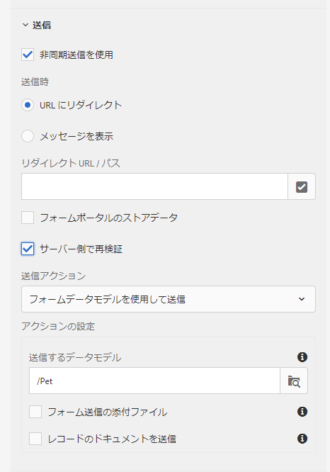

# アダプティブフォーム{#standard-validation-error-messages}の標準検証エラーメッセージ

アダプティブフォームは、事前設定された検証条件に基づいて、フィールドに入力した入力を検証します。 検証条件は、アダプティブフォーム内のフィールドに許容される入力値を参照します。 アダプティブフォームで使用するデータソースに基づいて、検証条件を設定できます。 例えば、RESTful Webサービスをデータソースとして使用する場合、Swagger定義ファイルで検証条件を定義できます。

入力値が検証条件を満たす場合、値がデータソースに送信されます。 そうでない場合は、アダプティブフォームにエラーメッセージが表示されます。

この方法と同様に、アダプティブフォームはカスタムサービスと統合して、データの検証を実行できるようになりました。 入力値が検証条件を満たさず、サーバーから返される検証エラーメッセージが標準メッセージ形式の場合、エラーメッセージはフォームのフィールドレベルで表示されます。

入力値が検証条件を満たさず、サーバー検証エラーメッセージが標準メッセージ形式でない場合、アダプティブフォームには、検証エラーメッセージを標準形式に変換し、フォームのフィールドレベルで表示するメカニズムが用意されています。 次の2つの方法のいずれかを使用して、エラーメッセージを標準の形式に変換できます。

* アダプティブフォーム送信時の追加カスタムエラーハンドラー
* ルールエディターを使用してサービス操作を呼び出す追加ためのカスタムハンドラー

この記事では、検証エラーメッセージの標準形式と、エラーメッセージをカスタム形式から標準形式に変換する手順について説明します。

## 標準検証エラーメッセージの形式{#standard-validation-message-format}

サーバー検証エラーメッセージが次の標準形式の場合、アダプティブフォームはフィールドレベルでエラーを表示します。

```javascript
   {
    errorCausedBy : "SERVER_SIDE_VALIDATION/SERVICE_INVOCATION_FAILURE"
    errors : [
        {
             somExpression  : <somexpr>
             errorMessage / errorMessages : <validationMsg> / [<validationMsg>, <validationMsg>]

        }
    ]
    originCode : <target error Code>
    originMessage : <unstructured error message returned by service>
}
```

ここで、

* `errorCausedBy` 失敗の理由を説明する
* `errors` 検証条件に失敗したフィールドのSOM式と検証エラーメッセージについて言及する
* `originCode` 外部サービスから返されたエラーコードが含まれます。
* `originMessage` 外部サービスから返された生のエラーデータが含まれます。

## カスタムハンドラーを追加するためのアダプティブフォーム送信の設定{#configure-adaptive-form-submission}

サーバー検証エラーメッセージが標準形式で表示されない場合は、非同期送信を有効にし、アダプティブフォームの送信時にカスタムエラーハンドラーを追加して、メッセージを標準形式に変換できます。

### 非同期アダプティブフォーム送信の設定{#configure-asynchronous-adaptive-form-submission}

カスタムハンドラーを追加する前に、アダプティブフォームで非同期送信を設定する必要があります。 以下の手順を実行します。

1. アダプティブフォーム作成モードで、フォームコンテナオブジェクトを選択し、をタップして、そのプロパティを開きます。
1. **[!UICONTROL 送信]**&#x200B;プロパティセクションで、**[!UICONTROL 非同期送信]**&#x200B;を使用を有効にします。
1. 「**[!UICONTROL サーバー]**&#x200B;で再検証」を選択して、送信前にサーバー上の入力フィールドの値を検証します。
1. 送信アクションを選択します。

   * データソースとして&#x200B;**[!UICONTROL フォームデータモデル](work-with-form-data-model.md)に基づくRESTful Webサービスを使用する場合は、「&lt;a0/>Submit using Form Data Model]**」を選択し、適切なデータモデルを選択します。[
   * RESTful Webサービスをデータソースとして使用している場合は、「**[!UICONTROL RESTエンドポイントに送信]**」を選択し、**[!UICONTROL リダイレクトURL/パス]**&#x200B;を指定します。

   

1. 「」をタップして、プロパティを保存します。

### アダプ追加ティブフォーム送信時のカスタムエラーハンドラー{#add-custom-error-handler-af-submission}

AEM Forms には、フォーム送信が成功した場合と失敗した場合の処理を実行するハンドラーが用意されています。これらのハンドラーは、すぐに使用することができます。これらのハンドラーは、サーバーからの応答に従って実行されるクライアント側の関数です。フォームを送信すると、データが検証用としてサーバーに転送され、フォーム送信の成功イベントとエラーイベントに関する情報とともに、サーバーからクライアントに応答が返されます。この情報は、パラメーターとして関連するハンドラーに渡され、対応する関数が実行されます。

次の手順を実行して、アダプティブフォームの送信時にカスタムエラーハンドラーを追加します。

1. アダプティブフォームをオーサリングモードで開き、任意のフォームオブジェクトを選択し、<!---->をタップしてルールエディターを開きます。
1. フォームオブジェクトツリーで「**[!UICONTROL フォーム]**」選択し、「**[!UICONTROL 作成]**」をタップします。
1. 「イベント」ドロップダウンリストから「送信でのエラー&#x200B;**[!UICONTROL 」を選択します。]**
1. カスタムエラー構造を標準エラー構造に変換するルールを作成し、**[!UICONTROL 完了]**&#x200B;をタップしてルールを保存します。

次に、カスタムのエラー構造を標準のエラー構造に変換するためのサンプルコードを示します。

```javascript
var data = $event.data;
var som_map = {
    "id": "guide[0].guide1[0].guideRootPanel[0].Pet[0].id_1[0]",
    "name": "guide[0].guide1[0].guideRootPanel[0].Pet[0].name_2[0]",
    "status": "guide[0].guide1[0].guideRootPanel[0].Pet[0].status[0]"
};

var errorJson = {};
errorJson.errors = [];

if (data) {
    if (data.originMessage) {
        var errorData;
        try {
            errorData = JSON.parse(data.originMessage);
        } catch (err) {
            // not in json format
        }

        if (errorData) {
            Object.keys(errorData).forEach(function(key) {
                var som_key = som_map[key];
                if (som_key) {
                    var error = {};
                    error.somExpression = som_key;
                    error.errorMessage = errorData[key];
                    errorJson.errors.push(error);
                }
            });
        }
        window.guideBridge.handleServerValidationError(errorJson);
    } else {
        window.guideBridge.handleServerValidationError(data);
    }
}
```

`var som_map`は、標準形式に変換するアダプティブフォームフィールドのSOM式をリストします。 アダプティブフォーム内の任意のフィールドのSOM式を表示するには、フィールドをタップし、**[!UICONTROL 表示のSOM式]**&#x200B;を選択します。

このカスタムエラーハンドラーを使用すると、アダプティブフォームは`var som_map`に示すフィールドを標準エラーメッセージ形式に変換します。 その結果、検証エラーメッセージはアダプティブフォームのフィールドレベルで表示されます。

## Invoke Serviceアクションを使用した追加カスタムハンドラー

次の手順を実行して、[ルールエディターの](rule-editor.md)サービスの呼び出しアクションを使用して、カスタムエラー構造を標準エラー構造に変換するエラーハンドラーを追加します。

1. アダプティブフォームをオーサリングモードで開き、任意のフォームオブジェクトを選択し、「」をタップして、ルールエディターを開きます。
1. 「**[!UICONTROL 作成]**」をタップします。
1. ルールの&#x200B;**[!UICONTROL When]**&#x200B;セクションに条件を作成します。 例えば、When[Name of field]が変更されたとします。 この条件を満たすには、**[!UICONTROL 状態を選択]**&#x200B;ドロップダウンリストから「**[!UICONTROL 変更]**」を選択します。
1. 「**[!UICONTROL Then]**」セクションの「**[!UICONTROL アクションの選択]**」ドロップダウンリストで「**[!UICONTROL サービスの呼び出し]**」を選択します。
1. **[!UICONTROL Input]**&#x200B;セクションからPostサービスとそれに対応するデータ連結を選択します。 例えば、アダプティブフォームの&#x200B;**名前**、**ID**、**ステータス**&#x200B;の各フィールドを検証する場合は、ポストサービス(pet)を選択し、**[!UICONTROL 入力]**&#x200B;セクションでpet.name、pet.id、pet.statusを選択します。

このルールの結果、**名前**、**ID**、**ステータス**&#x200B;フィールドに入力した値は、手順2で定義したフィールドが変更され、フォームのフィールド外にタブ移動した直後に検証されます。

1. 「モード選択」ドロップダウンリストから「**[!UICONTROL コードエディター]**」を選択します。
1. 「**[!UICONTROL コードを編集]**」をタップします。
1. 既存のコードから次の行を削除します。

   ```javascript
   guidelib.dataIntegrationUtils.executeOperation(operationInfo, inputs, outputs);
   ```

1. カスタムエラー構造を標準エラー構造に変換するルールを作成し、**[!UICONTROL 完了]**をタップしてルールを保存します。
例えば、カスタムエラー構造を標準エラー構造に変換するために、最後に次のサンプルコードを追加します。

   ```javascript
   var errorHandler = function(jqXHR, data) {
   var som_map = {
       "id": "guide[0].guide1[0].guideRootPanel[0].Pet[0].id_1[0]",
       "name": "guide[0].guide1[0].guideRootPanel[0].Pet[0].name_2[0]",
       "status": "guide[0].guide1[0].guideRootPanel[0].Pet[0].status[0]"
   };
   
   
   var errorJson = {};
   errorJson.errors = [];
   
   if (data) {
       if (data.originMessage) {
           var errorData;
           try {
               errorData = JSON.parse(data.originMessage);
           } catch (err) {
               // not in json format
           }
   
           if (errorData) {
               Object.keys(errorData).forEach(function(key) {
                   var som_key = som_map[key];
                   if (som_key) {
                       var error = {};
                       error.somExpression = som_key;
                       error.errorMessage = errorData[key];
                       errorJson.errors.push(error);
                   }
               });
           }
           window.guideBridge.handleServerValidationError(errorJson);
       } else {
           window.guideBridge.handleServerValidationError(data);
       }
     }
   };
   
   guidelib.dataIntegrationUtils.executeOperation(operationInfo, inputs, outputs, null, errorHandler);
   ```

   `var som_map`は、標準形式に変換するアダプティブフォームフィールドのSOM式をリストします。 アダプティブフォーム内の任意のフィールドのSOM式を表示するには、フィールドをタップし、**[!UICONTROL 詳細オプション]**(...)メニューから&#x200B;**[!UICONTROL 表示SOM式]**&#x200B;を選択します。

   次のサンプルコード行をカスタムエラーハンドラーにコピーしてください。

   ```javascript
   guidelib.dataIntegrationUtils.executeOperation(operationInfo, inputs, outputs, null, errorHandler);
   ```

   executeOperation APIには、新しいカスタムエラーハンドラーに基づく`null`パラメーターと`errorHandler`パラメーターが含まれます。

   このカスタムエラーハンドラーを使用すると、アダプティブフォームは`var som_map`に示すフィールドを標準エラーメッセージ形式に変換します。 その結果、検証エラーメッセージはアダプティブフォームのフィールドレベルで表示されます。