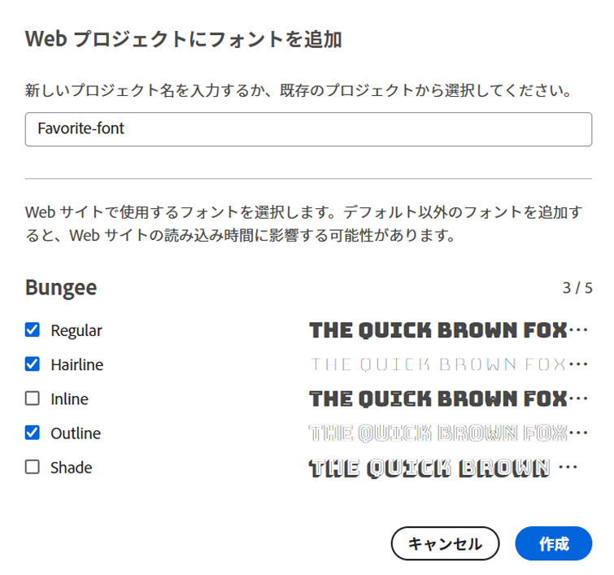
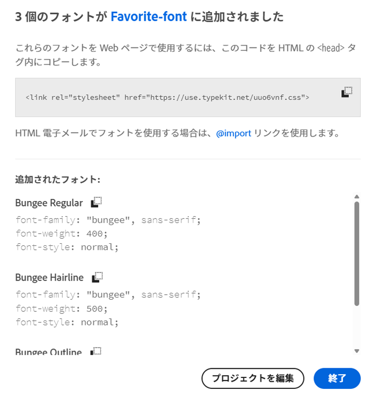

# アダプティブフォームのスタイル設定 {#do-not-publish-style-your-adaptive-form}

カスタムテーマの作成、個別コンポーネントのスタイル設定、テーマでの web フォントの使用について説明します。

これは、[最初のアダプティブフォームを作成する](https://helpx.adobe.com/jp/experience-manager/6-3/forms/using/create-your-first-adaptive-form.html)シリーズを構成するチュートリアルです。チュートリアル内のユースケースを理解して実際に操作できるように、このシリーズのチュートリアルを最初から順に学習することをお勧めします。

## チュートリアルについて  {#about-the-tutorial}

テーマを使用すると、アダプティブフォームに独自のアピアランスやスタイルを設定できます。アダプティブフォームエディター標準のテーマを適用することも、独自のカスタムテーマを作成することもできます。AEM [!DNL Forms] はカスタムテーマを作成するための[テーマエディター](https://helpx.adobe.com/jp/experience-manager/6-3/forms/using/themes.html)を提供します。単一のテーマで、モバイル、タブレット、デスクトップで開いた同一のアダプティブフォームに異なるアピアランスを設定できます。テーマエディターを使用する場合、CSS や LESS の予備知識は特に必要ありません。

このチュートリアルを終了すると、以下の操作を実行できるようになります。

* 標準のテーマをアダプティブフォームに適用
* テーマエディターを使用して、アダプティブフォームのテーマを作成
* 個別コンポーネントのスタイル設定
* ボーナスセクション：カスタムテーマに web フォントを使用

チュートリアルを完了すると、フォームのアピアランスは以下のようになります。

## 事前準備 {#before-you-start}

以下に示すヘッダースタイルとロゴの画像をローカルマシンにダウンロードします。`shipping-address-add-update-form` アダプティブフォームのヘッダーは、ヘッダースタイルとロゴの画像を使用します。ヘッダースタイルの画像はヘッダーの右側に表示されます。

[ファイルを入手](assets/header-style.png)

[ファイルを入手](assets/logo-1.png)

## 手順 1：アダプティブフォームへのテーマの適用 {#step-apply-a-theme-to-your-adaptive-form}

アダプティブフォームエディターには、すぐに使用できる複数のテーマが用意されています。アダプティブフォームにカスタムスタイルを使用しない場合は、標準のテーマを使用してアダプティブフォームを公開することもできます。テーマはアダプティブフォームから独立しています。同一のテーマを複数のアダプティブフォームに適用できます。

**テーマをアダプティブフォームに適用するには、次の手順を実行します。**

1. アダプティブフォームを編集用に開きます。

   [http://localhost:4502/editor.html/content/forms/af/shipping-address-add-update-form.html](http://localhost:4502/editor.html/content/forms/af/shipping-address-add-update-form.html)

1. **[!UICONTROL アダプティブフォームコンテナ]**&#x200B;のプロパティを開きます。プロパティブラウザーで、**[!UICONTROL 基本]**／**[!UICONTROL アダプティブフォームのテーマ]**&#x200B;に移動します。すべての初期設定済みテーマとカスタムテーマが、「**[!UICONTROL アダプティブフォームのテーマ]**」フィールドに表示されます。デフォルトではキャンバステーマが適用されます。
1. 「**[!UICONTROL アダプティブフォームのテーマ]**」フィールドでテーマを選択します（**調査のテーマ**&#x200B;など）。 を選択すると、選択したテーマを適用できます。

   

   **図：** *デフォルトのテーマを使用したアダプティブフォーム*

   

   **図：** *調査テーマを使用したアダプティブフォーム*

## 手順 2：アダプティブフォームの更新 {#step-update-your-adaptive-form}

上記のデザインでは、既存のアダプティブフォームのプレースホルダーテキストとロゴを変更する必要があります。

**アダプティブフォームを更新するには、次の手順を実行します。**

1. 既存のヘッダーのロゴとテキストを変更します。ロゴを削除するには、次の手順を実行します。

   1. フォームエディターでフォームを開きます。

      [http://localhost:4502/editor.html/content/forms/af/shipping-address-add-update-form.html](http://localhost:4502/editor.html/content/forms/af/shipping-address-add-update-form.html)

   1. [!UICONTROL ヘッダー]コンポーネントでロゴの画像を選択し、「 **[!UICONTROL プロパティ]**」をタップします。[!UICONTROL 画像]のプロパティで X を選択し、既存のロゴの画像を削除します。
   1. 「**[!UICONTROL アップロード]**」を選択して、logo.png を選択し、 を選択して変更を保存します。この画像は[事前準備](/help/forms/using/style-your-adaptive-form.md#before-you-start)の節でダウンロードした画像です。
   1. ヘッダーテキスト `We.Retail` を選択してから、「 **[!UICONTROL 編集]**」を選択します。ヘッダーテキストを `we retail` に変更します。太字書式を `we retail` の `we` にのみ適用します。

      

1. タイトルを削除してプレースホルダーテキストを追加します。

   1. 「顧客 ID」フィールドを選択し、「 プロパティ」を選択します。
   1. 「**[!UICONTROL タイトル]**」フィールドの内容を「**[!UICONTROL プレースホルダーテキスト]**」フィールドにコピーします。
   1. 「**[!UICONTROL タイトル]**」フィールドのコンテンツを削除して、 を選択します。
   1. フォーム内のすべてのテキストボックス、数値ボックス、メールフィールドで、上記の 3 つの手順を繰り返します。

      

## 手順 3：アダプティブフォームのカスタムテーマの作成 {#step-create-a-custom-theme-for-your-adaptive-form}

[テーマエディター](/help/forms/using/themes.md)を使用すると、カスタムテーマを作成できます。テーマエディターは非常に強力な WYSIWYG エディターです。視覚的に確認しながら、アダプティブフォームの各種コンポーネントに CSS を適用できます。アダプティブフォームのコンポーネントやパネルのスタイルを詳細に制御できます。

アダプティブフォームと同様、テーマは独立したエンティティです。アダプティブフォームのコンポーネントとパネルのスタイル（CSS）が含まれています。スタイルには背景色、状態色、透明度、配置、サイズなどの、CSS プロパティが含まれています。テーマを適用すると、指定したスタイルがアダプティブフォームの対応コンポーネントに適用されます。

このチュートリアルでは、ヘッダー、フッター、テキストコンポーネント、数値コンポーネント、添付ファイルコンポーネント、ボタンのスタイルを設定します。まずテーマを作成することから始めましょう

### テーマの作成 {#create-a-theme}

1. AEM オーサーインスタンスにログインして、**[!UICONTROL Adobe Experience Manager]**／**[!UICONTROL Forms]**／**[!UICONTROL テーマ]**&#x200B;に移動します。デフォルトの URL は [http://localhost:4502/aem/forms.html/content/dam/formsanddocuments-themes](http://localhost:4502/aem/forms.html/content/dam/formsanddocuments-themes) です。 
1. 「**[!UICONTROL 作成]**」を選択し、「**[!UICONTROL テーマ]**」を選択します。テーマの作成が必要なフィールドを含む「[!UICONTROL テーマを作成]」ページが表示されます。「**[!UICONTROL タイトル]**」フィールドと「**[!UICONTROL 名前]**」フィールドは入力必須です。

   * **タイトル：**&#x200B;テーマのタイトルを指定します。（**グローバルテーマ**&#x200B;など）。タイトルはテーマのリストから目的のテーマを見つけるのに役立ちます
   * **名前：**&#x200B;テーマの名前を指定します。（**グローバルテーマなど）。**&#x200B;指定された名前のノードがリポジトリーに作成されます。タイトルを入力し始めると、名前フィールドの値が自動的に生成されます。候補として入力された値は変更可能です。「ドキュメント名」フィールドには、英数字、ハイフン、アンダースコアのみを使用できます。無効な入力は、すべてハイフンに置き換えられます。

1. 「**[!UICONTROL 作成]**」を選択します。テーマが作成され、フォームを編集用に開くためのダイアログが表示されます。「**[!UICONTROL 開く]**」を選択し、新規作成されたテーマを新しいタブで開きます。テーマエディターでテーマが開きます。テーマエディターでは、スタイル設定に AEM に付属している標準提供のアダプティブフォームを使用します。[!DNL Forms]

   テーマエディター UI の使用について詳しくは、[テーマエディターについて](/help/forms/using/themes.md#aboutthethemeeditor)を参照してください。

1. **[!UICONTROL テーマオプション]** ／**[!UICONTROL 設定]**&#x200B;を選択します。「**[!UICONTROL フォームのプレビュー]**」フィールドで **shipping-address-add-update-form** アダプティブフォームを選択し、「」、「**[!UICONTROL 保存]**」の順に選択します。テーマエディターで、デフォルトのアダプティブフォームではなく独自のアダプティブフォームを使用できるようになります。テーマエディターに戻るには、「**[!UICONTROL キャンセル]**」を選択します。

   

   **図：** *shipping-address-add-update-form アダプティブフォームを使用したテーマエディター*

   

   **図：** *デフォルトのフォームを使用したアダプティブフォーム*

### ヘッダーとフッターのスタイル設定 {#style-header-and-footer}

アダプティブフォームでは、ヘッダーとフッターを使用して一貫性のある外観を独自に作成できます。通常、ヘッダーには組織のロゴと名前が含まれ、フッターには著作権情報が含まれます。これらは組織の複数のフォーム間で統一されます。shipping-address-add-update-form アダプティブフォームのヘッダーとフッターのスタイルを設定するには、次の手順を実行します。

1. セレクターパネルで&#x200B;**[!UICONTROL ヘッダー]**／**[!UICONTROL テキスト]**&#x200B;オプションに移動します。セレクターパネルはテーマエディターの左側にあります。パネルが表示されない場合は、「」を選択します。

1. 「**[!UICONTROL テキスト]**」アコーディオンで以下のプロパティを設定し、「」を選択します。

   | プロパティ | 値 |
   |---|---|
   | フォントファミリー | Arial® |
   | フォントカラー | FFFFFF |
   | フォントサイズ | 54 px |

1. [!UICONTROL ヘッダー]ウィジェットを選択し、「**[!UICONTROL ヘッダー]**」を選択します。ヘッダーウィジェットのスタイルを設定するオプションが左側に表示されます。「**[!UICONTROL 寸法と位置]**」アコーディオンを展開し、「**[!UICONTROL 高さ]** 」を `120px` に設定して、「」を選択します。
1. ヘッダーウィジェットの「**[!UICONTROL 背景]**」アコーディオンを展開し、「**[!UICONTROL 背景色]**」を「`F6921E.`」に設定します。

   **[!UICONTROL 画像とグラデーション]**／**[!UICONTROL + 追加]**&#x200B;にポインタを合わせ、「**[!UICONTROL 画像]**」を選択します。以下のプロパティを設定し、「」を選択します。

   | プロパティ | 値 |
   |---|---|
   | 画像 | header-style.png をアップロードします。この画像は「[事前準備](/help/forms/using/style-your-adaptive-form.md#before-you-start)」セクションでダウンロードした画像です。 |
   | 位置 | 右下 |
   | タイリング | 繰り返しなし |

1. テーマエディターで、ヘッダーのロゴを選択し、「**[!UICONTROL ヘッダーロゴ]**」を選択します。「寸法と位置」アコーディオンを展開し、次のプロパティを設定して、「」を選択します。

   <table> 
    <tbody> 
     <tr> 
      <td><b>余白</b></td> 
      <td><b>値</b></td> 
     </tr> 
     <tr> 
      <td>余白</td> 
      <td> 
       <ul> 
        <li>上：1.5 rem</li> 
        <li>下：-35 px</li> 
        <li>左：1rem<strong>  </strong></li> 
       </ul> 
<strong>ヒント</strong>：フィールドごとに異なる値を設定するには、 リンクアイコンを選択します。  
 </td> 
     </tr> 
     <tr> 
      <td>高さ</td> 
      <td>4.75 rem</td> 
     </tr> 
    </tbody> 
   </table>

1. フッターウィジェットを選択し、「**[!UICONTROL フッター]**」を選択します。**[!UICONTROL 背景]**&#x200B;アコーディオンを展開し、「**[!UICONTROL 背景色]**」を `F6921E` に設定して、「」を選択します。

### データ取得コンポーネントのスタイル設定とアダプティブフォームの背景の適用 {#style-the-data-capture-component-and-apply-a-background-to-the-adaptive-form}

アダプティブフォームでは複数のコンポーネントを使用してデータを取得できます。例えば、テキストボックスや数値ボックスなどです。すべてのデータ取得コンポーネントに同じスタイルを設定することも、コンポーネントごとに異なるスタイルを設定することもできます。このチュートリアルでは、数値ボックス（顧客 ID、郵便番号）とテキストボックス（顧客 ID、名前、発送先住所、状態、メール）に同じスタイルを適用します。データ取得コンポーネントのスタイルを設定するには、次の手順を実行します。

1. 「**[!UICONTROL 顧客 ID]**」フィールドを選択し、「**[!UICONTROL フィールドウィジェット]**」オプションを選択します。次のプロパティを設定し、「」を選択します。

   <table> 
    <tbody> 
     <tr> 
      <td><b>アコーディオン</b></td> 
      <td><b>プロパティ</b></td> 
      <td><b>値</b></td> 
     </tr> 
     <tr> 
      <td>境界線</td> 
      <td>境界線の色</td> 
      <td>A7A9AC</td> 
     </tr> 
     <tr> 
      <td>境界線</td> 
      <td>境界線の半径 </td> 
      <td> 
       <ul> 
        <li>上：7 px  </li> 
        <li>右：7 px  </li> 
        <li>下：7 px  </li> 
        <li>左：7 px  </li> 
       </ul> </td> 
     </tr> 
     <tr> 
      <td>テキスト</td> 
      <td>フォントファミリー</td> 
      <td>Arial®</td> 
     </tr> 
     <tr> 
      <td>テキスト</td> 
      <td>フォントカラー</td> 
      <td>939598  </td> 
     </tr> 
     <tr> 
      <td>テキスト</td> 
      <td>フォントサイズ</td> 
      <td>18 px</td> 
     </tr> 
     <tr> 
      <td>寸法と位置</td> 
      <td>幅</td> 
      <td>60%</td> 
     </tr> 
     <tr> 
      <td>寸法と位置</td> 
      <td>余白</td> 
      <td> 
       <ul> 
        <li>左：10 rem</li> 
       </ul> </td> 
     </tr> 
    </tbody> 
    </table>

1. 「**[!UICONTROL 顧客 ID]**」フィールドの上部で空白領域を選択し、「**[!UICONTROL レスポンシブパネルコンテナ]**」を選択します。**[!UICONTROL 背景]**／**[!UICONTROL 背景色]**&#x200B;を F1F2F2 に設定します。「」を選択します。

   

### ボタンのスタイル設定 {#style-the-buttons}

カスタムテーマを使用すると、アダプティブフォームのすべてのボタンに同じスタイルを適用することも、特定のボタンに[インラインスタイル設定](/help/forms/using/inline-style-adaptive-forms.md)を適用することもできます。ボタンのスタイルを設定するには、次の手順を実行します。

1. 「**[!UICONTROL 送信]**」ボタンを選択し、「**[!UICONTROL ボタン]**」オプションを選択します。次のプロパティを設定し、「」を選択します。

   <table> 
    <tbody> 
     <tr> 
      <td><b>アコーディオン</b></td> 
      <td><b>プロパティ</b></td> 
      <td><b>値</b></td> 
     </tr> 
     <tr> 
      <td>背景</td> 
      <td>背景色</td> 
      <td>F6921E</td> 
     </tr> 
     <tr> 
      <td>境界線  </td> 
      <td>境界線の色</td> 
      <td>F6921E</td> 
     </tr> 
     <tr> 
      <td>境界線</td> 
      <td>境界線の半径 </td> 
      <td> 
       <ul> 
        <li>上：7 px  </li> 
        <li>右：7 px  </li> 
        <li>下：7 px  </li> 
        <li>左：7 px</li> 
       </ul> </td> 
     </tr> 
     <tr> 
      <td>テキスト  </td> 
      <td>フォントファミリー</td> 
      <td>Arial®</td> 
     </tr> 
     <tr> 
      <td>テキスト</td> 
      <td>フォントカラー</td> 
      <td>FFFFFF</td> 
     </tr> 
     <tr> 
      <td>テキスト</td> 
      <td>フォントサイズ</td> 
      <td>18 px</td> 
     </tr> 
    </tbody> 
   </table>

1. アダプティブフォームに[カスタムテーマを適用](/help/forms/using/style-your-adaptive-form.md#step-apply-a-theme-to-your-adaptive-form)するか、グローバルテーマを適用します。スタイルがアダプティブフォームに反映されない場合は、ブラウザーのキャッシュを削除した後、もう一度実行してください。

   

## 手順 4：個別コンポーネントのスタイル設定 {#step-style-individual-components}

一部のスタイルは特定のコンポーネントのみに適用されます。このようなコンポーネントのスタイルは、アダプティブフォームエディターで設定します。

1. アダプティブフォームを編集用に開きます。[http://localhost:4502/editor.html/content/forms/af/shipping-address-add-update-form.html](http://localhost:4502/editor.html/content/forms/af/change-billing-shipping-address.html)
1. 上部バーで「**[!UICONTROL スタイル]**」オプションを選択します。

   

1. 「**[!UICONTROL 添付]**」ボタンを選択し、 アイコンを選択します。「**[!UICONTROL 寸法と位置]**」アコーディオンで以下のプロパティを設定します。

   | プロパティ | 値 |
   |---|---|
   | 浮動小数点数 | 左 |
   | 幅 | 10% |

1. 「**[!UICONTROL 政府が承認した住所の証明]**」オプションを選択し、 アイコンを選択します。次のプロパティを設定します。

   <table> 
    <tbody> 
     <tr> 
      <td><b>アコーディオン</b></td> 
      <td><b>プロパティ</b></td> 
      <td><b>値</b></td> 
     </tr> 
     <tr> 
      <td>寸法と位置</td> 
      <td>浮動小数点数</td> 
      <td>左</td> 
     </tr> 
     <tr> 
      <td>寸法と位置</td> 
      <td>幅</td> 
      <td>73%</td> 
     </tr> 
     <tr> 
      <td>寸法と位置</td> 
      <td>パディング</td> 
      <td> 
       <ul> 
        <li>左：10 px</li> 
       </ul> </td> 
     </tr> 
     <tr> 
      <td>寸法と位置</td> 
      <td>高さ</td> 
      <td>40 px</td> 
     </tr> 
     <tr> 
      <td>寸法と位置  </td> 
      <td>余白</td> 
      <td>  
       <ul> 
        <li>右：2 rem</li> 
        <li>左：10 rem </li> 
       </ul> </td> 
     </tr> 
     <tr> 
      <td>背景</td> 
      <td>背景色</td> 
      <td>FFFFFF</td> 
     </tr> 
     <tr> 
      <td>境界線</td> 
      <td>境界線の幅</td> 
      <td>1 px</td> 
     </tr> 
     <tr> 
      <td>境界線</td> 
      <td>境界線のスタイル</td> 
      <td>実線</td> 
     </tr> 
     <tr> 
      <td>境界線</td> 
      <td>境界線の色</td> 
      <td>A7A9AC</td> 
     </tr> 
     <tr> 
      <td>境界線</td> 
      <td>境界線の半径</td> 
      <td>7 px</td> 
     </tr> 
     <tr> 
      <td>テキスト</td> 
      <td>フォントファミリー</td> 
      <td>Arial®</td> 
     </tr> 
     <tr> 
      <td>テキスト</td> 
      <td>フォントカラー</td> 
      <td>BCBEC0</td> 
     </tr> 
     <tr> 
      <td>テキスト</td> 
      <td>フォントサイズ</td> 
      <td>18 px</td> 
     </tr> 
     <tr> 
      <td>テキスト</td> 
      <td>行の高さ</td> 
      <td>2</td> 
     </tr> 
     </tr> 
    </tbody> 
   </table>

1. 「**[!UICONTROL 送信]**」ボタンを選択し、 アイコンを選択します。次のプロパティを設定します。

   <table> 
    <tbody> 
     <tr> 
      <td><b>アコーディオン</b></td> 
      <td><b>プロパティ</b></td> 
      <td><b>値</b></td> 
     </tr> 
     <tr> 
      <td>寸法と位置</td> 
      <td>浮動小数点数</td> 
      <td>右</td> 
     </tr> 
     <tr> 
      <td>寸法と位置</td> 
      <td>余白</td> 
      <td> 
       <ul> 
        <li>上：5 rem</li> 
        <li>右：14 rem</li> 
        <li>下：20 px</li> 
        <li>左：20 px  </li> 
       </ul> </td> 
     </tr> 
     <tr> 
      <td>背景</td> 
      <td>背景色</td> 
      <td>F6921E</td> 
     </tr> 
     <tr> 
      <td>境界線</td> 
      <td>境界線の色</td> 
      <td>F6921E</td> 
     </tr> 
    </tbody> 
   </table>

   

## 手順 5：オプション：カスタムテーマでの web フォントの使用 {#step-bonus-section-using-web-fonts-in-a-custom-theme}

アダプティブフォームは各種フォントを使用してデザインできます。アダプティブフォームのデザインに使用するフォントが、アダプティブフォームを表示するデバイスに存在しない場合があります。Web フォントサービスを使用すると、必要なフォントを目的のデバイスで使用できます。

[!DNL Adobe Fonts] は web フォントサービスです。アダプティブフォームでこのサービスを設定、使用できます。[!DNL Adobe Fonts] をアダプティブフォームで使用するには：
1. 次を参照： [Adobeフォントのライブラリ](https://fonts.adobe.com/) フォームのスタイルを設定するフォントを選択します。
<!--
>[!NOTE]
>
> [!DNL Typekit] is now called Adobe Fonts and is included with Creative Cloud and other subscriptions. [Learn more](https://fonts.adobe.com/).-->

>[!NOTE]
>
> タグやフィルターを追加して、フォントのリストを絞り込むことができます。

1. &lt;/> ボタンをクリックして、目的のフォントが見つかった場合に備えて、Web プロジェクトにファミリを追加します。

   

   Web プロジェクトにフォントを追加ダイアログ画面が表示されます。

   >[!NOTE]
   >
   > フォントを Web プロジェクトに追加できるのは、「&lt;/>」ボタンが使用可能な場合のみです。

2. Web プロジェクトに名前を付けます。
3. チェックボックスをオンにして、含めるフォントの太さとスタイルを選択します。

   

4. 選択 **クリック** をクリックして、プロジェクトを作成します。
5. 画面から埋め込みコードと URL をコピーします。
   

6. クリック **完了** をクリックして、web プロジェクトウィンドウを閉じます。
7. AEMインスタンスにログインし、URL に移動します。 `http://server:port/crx/de/index.jsp#`
8. CRXDE でフォルダー構造を作成します（例： ）。 `/apps/[fontslibrary]/[customlibrary(clientlibrary)]`.
9. 新しく作成された `clientlibs` フォルダーを作成し、 `allowProxy` および `categories` プロパティ。
10. に移動します。 `/apps/[fontslibrary]/[customlibrary(clientlibrary)]` css フォルダーを作成します。
11. 作成した CSS フォルダーに移動し、ファイルを作成します。 例えば、次のようなファイルを作成します。 `fonts.css` 埋め込みコードと URL を貼り付けます。
   
12. 変更内容を保存します。

>[!NOTE]
>
> アダプティブフォームで追加されたカスタムフォントを使用するには、クライアントライブラリ名を **[!UICONTROL クライアントライブラリカテゴリ]** clientlib フォルダーの categories オプションで指定された名前に従っています。

付属のフォントは、次のカスタムフォントクライアントライブラリを通じてアダプティブフォームからアクセスできるようになりました。

<!--
Create Adobe Fonts Configuration

1. To create a API Token, go to **login** > **API Token** > **Make me a new API token**.

   

2. Once, you click **Make me a new API token**, a new token is generated. 
3. Copy the generated token for future use.
4. Now login to your AEM  author instance. On the author instance, go to **[!UICONTROL Tools]**>**[!UICONTROL Cloud Services]**> **[!UICONTROL Adobe Fonts]**.
5. Select the configuration container and click **Create**. **[UICONTROL Create Adobe Fonts Configuration]** screen appears.
    

6. Spceify the name and paste the API token in the **[!UICONTROL Kit ID]** textbox.
7. Click **Create**.

The fonts added to the **[!UICONTROL Adobe Fonts]** are available for selection in the **[!UICONTROL Text]** accordion of all the components.
1. In the theme editor, navigate to **[!UICONTROL Theme Options]**  > **[!UICONTROL Configure]**. 
2. In the **[!UICONTROL Adobe Fonts Configuration]** field, select the kit, and click **[!UICONTROL Save]**.

1. Create an [Adobe Fonts](https://fonts.adobe.com/?ref=tk.com) account, create a kit, add font Myriad Pro to the kit, publish the kit, and obtain the Kit ID. It is required to use [!DNL Adobe Fonts] (Web Fonts) in an adaptive form. 
1. In the AEM [!DNL Forms] Server, navigate to  **[!UICONTROL Adobe Experience Manager]** > **[!UICONTROL Tools]**  > **[!UICONTROL Adobe Fonts]**. Now, open a configuration folder. If a configuration is already available, click the **[!UICONTROL Create]** button to create an instance.

   On the Create Configuration dialog, specify a **Title** for the configuration, and click **[!UICONTROL Create]**. You are redirected to the configuration page. In the [!UICONTROL Edit Component] dialog that appears, provide your **Kit ID** and click **[!UICONTROL OK]**. -->

