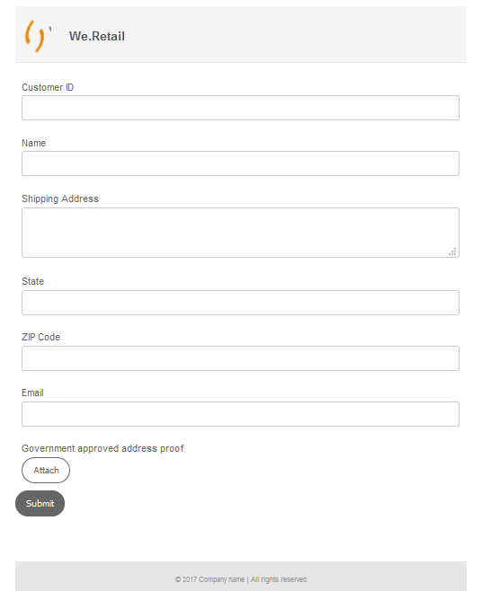
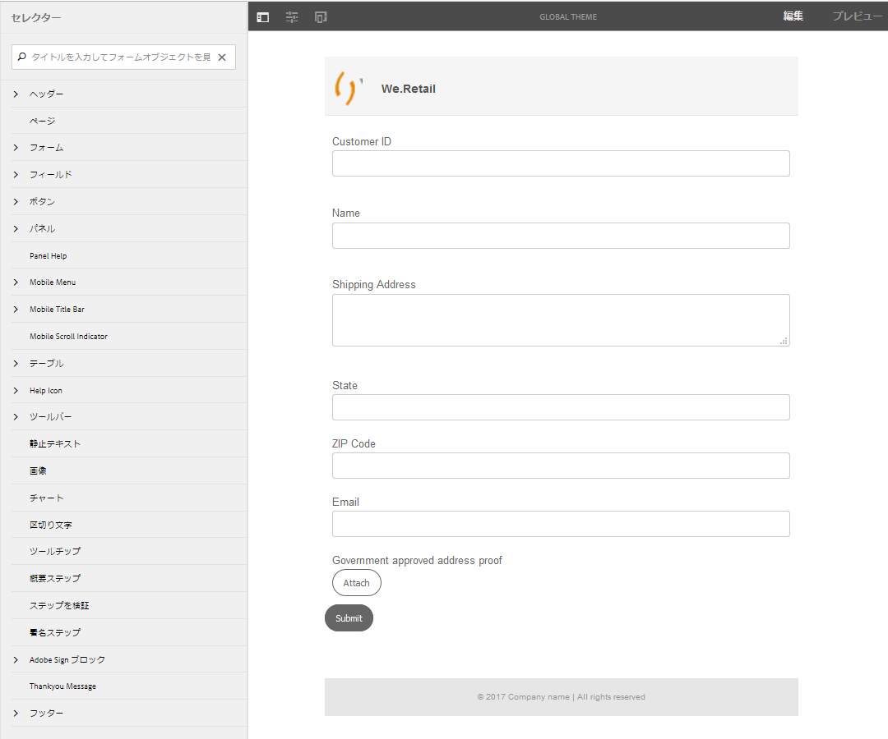
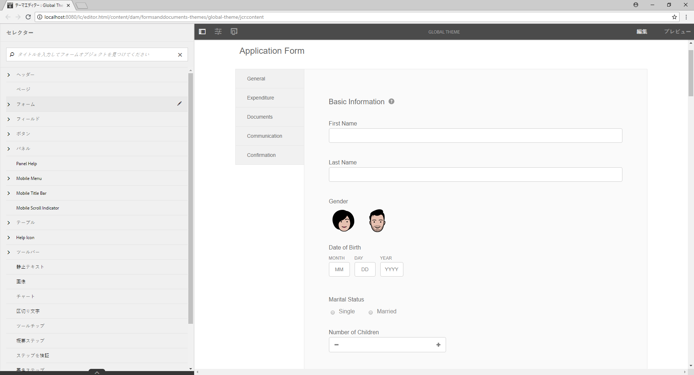
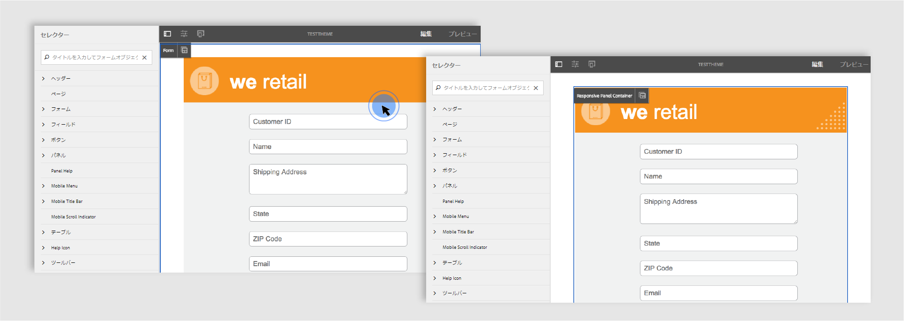
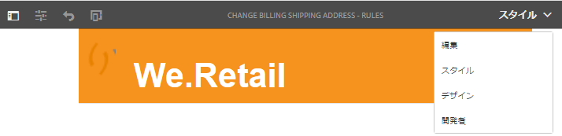

# アダプティブフォームのスタイル設定 {#do-not-publish-style-your-adaptive-form}

カスタムテーマの作成、個別コンポーネントのスタイル設定、テーマでの Web フォントの使用について説明します。

これは、「[最初のアダプティブフォームを作成する](https://helpx.adobe.com/experience-manager/6-3/forms/using/create-your-first-adaptive-form.html)」シリーズを構成するチュートリアルです。チュートリアル内のユースケースを理解して実際に操作できるように、このシリーズのチュートリアルを最初から順に学習することをお勧めします。

## このチュートリアルについて  {#about-the-tutorial}

テーマを使用すると、アダプティブフォームに独自の外観やスタイルを設定できます。アダプティブフォームエディターの初期設定済みテーマを適用することも、独自のカスタムテーマを作成することもできます。AEM [!DNL Forms] provide a [theme editor](https://helpx.adobe.com/jp/experience-manager/6-3/forms/using/themes.html) to create custom themes. 単一のテーマを使用すると、モバイル、タブレット、デスクトップで開いた同一のアダプティブフォームに異なる外観を設定できます。テーマエディターを使用する場合、CSS や LESS の予備知識は特に必要ありません。

このチュートリアルを終了すると、以下の操作を実行できるようになります。

* 初期設定済みテーマをアダプティブフォームに適用する
* テーマエディターを使用して、アダプティブフォームのテーマを作成する
* 個別コンポーネントのスタイルを設定する
* オプション：カスタムテーマに Web フォントを使用する

チュートリアルを完了すると、フォームの外観は以下のようになります。

## 事前準備 {#before-you-start}

以下に示すヘッダースタイルとロゴの画像をローカルマシンにダウンロードします。`shipping-address-add-update-form` アダプティブフォームのヘッダーは、ヘッダースタイルとロゴの画像を使用します。ヘッダースタイルの画像はヘッダーの右側に表示されます。

[ファイルを入手](assets/header-style.png)

[ファイルを入手](assets/logo-1.png)

## 手順 1：アダプティブフォームへのテーマの適用 {#step-apply-a-theme-to-your-adaptive-form}

アダプティブフォームエディターは多数の初期設定済みテーマを提供します。アダプティブフォームにカスタムスタイルを使用する場合は、初期設定済みテーマを使用してアダプティブフォームを発行することもできます。テーマはアダプティブフォームから独立しています。同一のテーマを複数のアダプティブフォームに適用できます。テーマをアダプティブフォームに適用するには、次の手順を実行します。

1. アダプティブフォームを編集用に開きます。

   [http://localhost:4502/editor.html/content/forms/af/shipping-address-add-update-form.html](http://localhost:4502/editor.html/content/forms/af/shipping-address-add-update-form.html)

1. **[!UICONTROL アダプティブフォームコンテナ]**&#x200B;のプロパティを開きます。プロパティブラウザーで、**[!UICONTROL 基本]**／**[!UICONTROL アダプティブフォームのテーマ]**&#x200B;に移動します。すべての初期設定済みテーマとカスタムテーマが、「**[!UICONTROL アダプティブフォームのテーマ]**」フィールドに表示されます。デフォルトではキャンバステーマが適用されます。
1. 「**[!UICONTROL アダプティブフォームのテーマ]**」フィールドでテーマを選択します（**調査テーマ**&#x200B;など）。選択したテ  」をタップします。

   

   **図：***デフォルトテーマを持つアダプティブフォーム*

   

   **図：***調査テーマを含むアダプティブフォーム*

## 手順 2：アダプティブフォームの更新 {#step-update-your-adaptive-form}

上記のデザインでは、既存のアダプティブフォームのプレースホルダーテキストとロゴを変更する必要があります。必要な変更を行うには、次の手順を実行します。

1. ヘッダーの既存のロゴとテキストを変更します。ロゴを削除するには、次の手順を実行します。

   1. フォームエディターでフォームを開きます。

      [http://localhost:4502/editor.html/content/forms/af/shipping-address-add-update-form.html](http://localhost:4502/editor.html/content/forms/af/shipping-address-add-update-form.html)

   1. [!UICONTROL header] コンポーネントのロゴ画像をタップし、 ****&#x200B;プロパティをタップします。 In the [!UICONTROL image] property, tap X to remove the existing logo image.
   1. 「 **[!UICONTROL アップロード]**」をタップし、logo.pngを選択し、「  」をタップして変更を保存します。 The image was downloaded in the [Before you start](/help/forms/using/style-your-adaptive-form.md#before-you-start) section.
   1. ヘッダーテキストをタップ `We.Retail`し、「  」をタップし ****&#x200B;ます。 Change header text to `we retail`. Apply bold formatting only to `we`in `we retail`.

      

1. タイトルを削除してプレースホルダーテキストを追加します。

   1. Tap the Customer ID field and tap  properties.
   1. 「**[!UICONTROL タイトル]**」フィールドの内容を「**[!UICONTROL プレースホルダーテキスト]**」フィールドにコピーします。
   1. 「 **[!UICONTROL タイトル]** 」フィールドの内容を削除し、 。
   1. フォーム内のすべてのテキストボックス、数値ボックス、電子メールフィールドで、上記の 3 つの手順を繰り返します。

      

## 手順 3：アダプティブフォームのカスタムテーマの作成 {#step-create-a-custom-theme-for-your-adaptive-form}

[テーマエディター](/help/forms/using/themes.md)を使用すると、カスタムテーマを作成できます。テーマエディターは非常に強力な WYSIWYG エディターです。視覚的に確認しながら、アダプティブフォームの各種コンポーネントに CSS を適用できます。アダプティブフォームのコンポーネントやパネルのスタイルを詳細にコントロールできます。

アダプティブフォームと同様、テーマは独立したエンティティです。アダプティブフォームのコンポーネントとパネルのスタイル（CSS）が含まれています。スタイルには背景色、状態色、透明度、配置、サイズなど、CSS プロパティが含まれています。テーマを適用すると、指定したスタイルがアダプティブフォームの対応するコンポーネントに適用されます。

このチュートリアルでは、ヘッダー、フッター、テキストコンポーネント、数値コンポーネント、添付ファイルコンポーネント、ボタンのスタイルを設定します。まずテーマを作成することから始めましょう。

### テーマを作成する {#create-a-theme}

1. Log in to the AEM author instance and navigate to **[!UICONTROL Adobe Experience Manager]** > **[!UICONTROL Forms]** > **[!UICONTROL Themes]**. The default URL is [http://localhost:4502/aem/forms.html/content/dam/formsanddocuments-themes](http://localhost:4502/aem/forms.html/content/dam/formsanddocuments-themes).
1. 「**[!UICONTROL 作成]**」をタップし、「**[!UICONTROL テーマ]**」を選択します。The [!UICONTROL Create Theme] page with the fields required to create a theme appears. 「**[!UICONTROL タイトル]**」フィールドと「**[!UICONTROL 名前]**」フィールドは入力必須です。

   * **タイトル：** テーマのタイトルを指定します。 （**グローバルテーマ**&#x200B;など）。タイトルはテーマのリストから目的のテーマを見つけるのに役立ちます。
   * **名前：** テーマの名前を指定します。 （**グローバルテーマ**&#x200B;など）。指定された名前のノードがリポジトリに作成されます。タイトルを入力し始めると、名前フィールドの値が自動的に生成されます。候補として入力された値は変更可能です。「ドキュメント名」フィールドには、英数字、ハイフン、アンダースコアのみを使用することができます。無効な入力はすべてハイフンに置き換えられます。

1. 「**[!UICONTROL 作成]**」をタップします。テーマが作成され、フォームを編集用に開くためのダイアログが表示されます。Tap **[!UICONTROL Open]** to open the newly created theme in a new tab. テーマがテーマエディターで開きます。For styling, the theme editor uses an out-of-the-box adaptive form shipped with AEM [!DNL Forms].

   For information about using theme editor UI, see [About the theme editor](/help/forms/using/themes.md#aboutthethemeeditor).

1. Tap **[!UICONTROL Theme Options]**  > **[!UICONTROL Configure]**. In the **[!UICONTROL Preview Form]** field, select the **shipping-address-add-update-form** adaptive form, tap , tap **[!UICONTROL Save]**. テーマエディターで、デフォルトのアダプティブフォームではなく独自のアダプティブフォームを使用できるようになります。テーマエディターに戻るには、「**[!UICONTROL キャンセル]**」をタップします。

   

   **図：***配送先住所 — 追加 — 更新 — フォームアダプティブフォームを含むテーマエディター*

   

   **図：***デフォルトフォームを含むアダプティブフォーム*

### ヘッダーとフッターのスタイル設定 {#style-header-and-footer}

ヘッダーとフッターをアダプティブフォームで使用すると、独特な外観を作成できます。通常、ヘッダーには組織のロゴと名前が含まれ、フッターには著作権情報が含まれます。これらは組織の複数のフォーム間で統一されます。shipping-address-add-update-form アダプティブフォームのヘッダーとフッターのスタイルを設定するには、次の手順を実行します。

1. セレクターパネルで&#x200B;**[!UICONTROL ヘッダー]**／**[!UICONTROL テキスト]**&#x200B;オプションに移動します。セレクターパネルはテーマエディターの左側にあります。If the panel is not visible, tap  Toggle Side Panel.

1. Set the following properties in the **[!UICONTROL Text]** accordion and tap .

   | プロパティ | 値 |
   |---|---|
   | フォントファミリー | Arial |
   | フォントカラー | FFFFFF |
   | フォントサイズ | 54 px |

1. Tap the [!UICONTROL header] widget and tap **[!UICONTROL Header]**. ヘッダーウィジェットのスタイルを設定するオプションが左側に表示されます。「 **[!UICONTROL Dimensionと位置]** 」アコーディオンを展開し、「 **[!UICONTROL 高さ]** 」を「」に設定し `120px`て、 。
1. Expand the **[!UICONTROL Background]** accordion of the header widget, set the **[!UICONTROL Background Color]** to `F6921E.`

   **[!UICONTROL 画像とグラデーション]** / **[!UICONTROL +]**&#x200B;の上にカーソルを置き **[!UICONTROL 、「]**&#x200B;画像」をタップします。 次のプロパティを設定し、 。

   | プロパティ | 値 |
   |---|---|
   | 画像 | header-style.png をアップロードします。The image was downloaded in the [Before you start](/help/forms/using/style-your-adaptive-form.md#before-you-start) section. |
   | 位置 | 右下 |
   | タイル | 繰り返しなし |

1. テーマエディターで、ヘッダーのロゴをタップし、「**[!UICONTROL ヘッダーロゴ]**」をタップします。Expand the Dimensions &amp; Position accordion, set the following properties and tap .

   <table> 
    <tbody> 
     <tr> 
      <td><b>の余白</b></td> 
      <td><b>値</b></td> 
     </tr> 
     <tr> 
      <td>の余白</td> 
      <td> 
       <ul> 
        <li>上：1.5rem</li> 
        <li>下：-35 px</li> 
        <li>左：1rem<strong>  </strong></li> 
       </ul> 
<strong>ヒント：</strong> フィールドごとに異なる値を設定するには、 リンクアイコンをタップします。  
 </td> 
     </tr> 
     <tr> 
      <td>高さ</td> 
      <td>4.75rem</td> 
     </tr> 
    </tbody> 
   </table>

1. フッターウィジェットをタップし、「**[!UICONTROL フッター]**」をタップします。「 **[!UICONTROL 背景]** 」アコーディオンを展開し、「 **[!UICONTROL 背景色]** 」をに設定し `F6921E`て、 。

### データ取得コンポーネントのスタイル設定とアダプティブフォームの背景の適用 {#style-the-data-capture-component-and-apply-a-background-to-the-adaptive-form}

アダプティブフォームでは複数のコンポーネントを使用してデータを取得できます。例えば、テキストボックスと数値ボックスを使用できます。すべてのデータ取得コンポーネントと同じスタイルを指定することも、各コンポーネントに対して別々のスタイルを指定することもできます。 このチュートリアルでは、数値ボックス（顧客 ID、郵便番号）とテキストボックス（顧客 ID、名前、発送先住所、状態、電子メール）に同じスタイルを適用します。データ取得コンポーネントのスタイルを設定するには：

1. Tap the **[!UICONTROL Customer ID]** field and tap the **[!UICONTROL Field Widget]** option. 次のプロパティを設定し、 。

   <table> 
    <tbody> 
     <tr> 
      <td><b>アコーディオン</b></td> 
      <td><b>プロパティ</b></td> 
      <td><b>値</b></td> 
     </tr> 
     <tr> 
      <td>ボーダー</td> 
      <td>境界線の色</td> 
      <td>A7A9AC</td> 
     </tr> 
     <tr> 
      <td>ボーダー</td> 
      <td>境界線の半径 </td> 
      <td> 
       <ul> 
        <li>上：7 px  </li> 
        <li>右：7 px  </li> 
        <li>下：7 px  </li> 
        <li>左：7 px  </li> 
       </ul> </td> 
     </tr> 
     <tr> 
      <td>テキスト</td> 
      <td>フォントファミリー</td> 
      <td>Arial</td> 
     </tr> 
     <tr> 
      <td>テキスト</td> 
      <td>フォントカラー</td> 
      <td>939598  </td> 
     </tr> 
     <tr> 
      <td>テキスト</td> 
      <td>フォントサイズ</td> 
      <td>18 px</td> 
     </tr> 
     <tr> 
      <td>寸法と位置</td> 
      <td>幅</td> 
      <td>60%</td> 
     </tr> 
     <tr> 
      <td>寸法と位置</td> 
      <td>の余白</td> 
      <td> 
       <ul> 
        <li>左：10rem</li> 
       </ul> </td> 
     </tr> 
    </tbody> 
    </table>

1. Tap on the empty area above the **[!UICONTROL Customer ID]** field and tap **[!UICONTROL Responsive Panel Container]**. **[!UICONTROL 背景]**／**[!UICONTROL 背景色]**&#x200B;を F1F2F2 に設定します。「 」をタップします。

   

### ボタンのスタイル設定 {#style-the-buttons}

You can use a custom theme to apply an identical style to all the buttons of the adaptive form and [inline styling](/help/forms/using/inline-style-adaptive-forms.md) to apply a style to a specific button. ボタンのスタイルを設定するには、次の手順を実行します。

1. 「**[!UICONTROL 送信]**」ボタンをタップし、「**[!UICONTROL ボタン]**」オプションをタップします。次のプロパティを設定し、 。

   <table> 
    <tbody> 
     <tr> 
      <td><b>アコーディオン</b></td> 
      <td><b>プロパティ&lt;/b</td> 
      <td><b>値</b></td> 
     </tr> 
     <tr> 
      <td>背景</td> 
      <td>背景色</td> 
      <td>F6921E</td> 
     </tr> 
     <tr> 
      <td>ボーダー  </td> 
      <td>境界線の色</td> 
      <td>F6921E</td> 
     </tr> 
     <tr> 
      <td>ボーダー</td> 
      <td>境界線の半径 </td> 
      <td> 
       <ul> 
        <li>上：7 px  </li> 
        <li>右：7 px  </li> 
        <li>下：7 px  </li> 
        <li>左：7 px</li> 
       </ul> </td> 
     </tr> 
     <tr> 
      <td>テキスト  </td> 
      <td>フォントファミリー</td> 
      <td>Arial</td> 
     </tr> 
     <tr> 
      <td>テキスト</td> 
      <td>フォントカラー</td> 
      <td>FFFFFF</td> 
     </tr> 
     <tr> 
      <td>テキスト</td> 
      <td>フォントサイズ</td> 
      <td>18 px</td> 
     </tr> 
    </tbody> 
   </table>

1. アダプティブフォームに[カスタムテーマを適用](/help/forms/using/style-your-adaptive-form.md#step-apply-a-theme-to-your-adaptive-form)するか、グローバルテーマを適用します。スタイルがアダプティブフォームに反映されない場合は、ブラウザーのキャッシュを消去してから、やり直してください。

   

## 手順 4：個別コンポーネントのスタイル設定 {#step-style-individual-components}

一部のスタイルは特定のコンポーネントのみに適用されます。このようなコンポーネントのスタイルは、アダプティブフォームエディターで設定します。

1. アダプティブフォームを編集用に開きます。[http://localhost:4502/editor.html/content/forms/af/shipping-address-add-update-form.html](http://localhost:4502/editor.html/content/forms/af/change-billing-shipping-address.html)
1. 上部バーで「**[!UICONTROL スタイル]**」オプションを選択します。

   

1. Tap the **[!UICONTROL Attach]** button and tap the icon. Set the following properties in the **[!UICONTROL Dimensions and Position]** accordion:

   | プロパティ | 値 |
   |---|---|
   | 浮動小数 | Left |
   | 幅 | 10% |

1. Tap the **[!UICONTROL Government approved address proof]** option and tap the icon. 次のプロパティを設定します。

   <table> 
    <tbody> 
     <tr> 
      <td><b>アコーディオン</b></td> 
      <td><b>プロパティ</b></td> 
      <td><b>値</b></td> 
     </tr> 
     <tr> 
      <td>寸法と位置</td> 
      <td>浮動小数</td> 
      <td>Left</td> 
     </tr> 
     <tr> 
      <td>寸法と位置</td> 
      <td>幅</td> 
      <td>73%</td> 
     </tr> 
     <tr> 
      <td>寸法と位置</td> 
      <td>パディング</td> 
      <td> 
       <ul> 
        <li>左：10 px</li> 
       </ul> </td> 
     </tr> 
     <tr> 
      <td>寸法と位置</td> 
      <td>高さ</td> 
      <td>40 px</td> 
     </tr> 
     <tr> 
      <td>寸法と位置  </td> 
      <td>の余白</td> 
      <td>  
       <ul> 
        <li>右：2rem</li> 
        <li>左：10rem </li> 
       </ul> </td> 
     </tr> 
     <tr> 
      <td>背景</td> 
      <td>背景色</td> 
      <td>FFFFFF</td> 
     </tr> 
     <tr> 
      <td>ボーダー</td> 
      <td>境界線の幅</td> 
      <td>1 px</td> 
     </tr> 
     <tr> 
      <td>ボーダー</td> 
      <td>境界線のスタイル</td> 
      <td>実線</td> 
     </tr> 
     <tr> 
      <td>ボーダー</td> 
      <td>境界線の色</td> 
      <td>A7A9AC</td> 
     </tr> 
     <tr> 
      <td>ボーダー</td> 
      <td>境界線の半径</td> 
      <td>7 px</td> 
     </tr> 
     <tr> 
      <td>テキスト</td> 
      <td>フォントファミリー</td> 
      <td>Arial</td> 
     </tr> 
     <tr> 
      <td>テキスト</td> 
      <td>フォントカラー</td> 
      <td>BCBEC0</td> 
     </tr> 
     <tr> 
      <td>テキスト</td> 
      <td>フォントサイズ</td> 
      <td>18 px</td> 
     </tr> 
     <tr> 
      <td>テキスト</td> 
      <td>行の高さ</td> 
      <td>2</td> 
     </tr> 
     </tr> 
    </tbody> 
   </table>

1. Tap the **[!UICONTROL Submit]** button and tap the  icon. 次のプロパティを設定します。

   <table> 
    <tbody> 
     <tr> 
      <td><b>アコーディオン</b></td> 
      <td><b>プロパティ</b></td> 
      <td><b>値</b></td> 
     </tr> 
     <tr> 
      <td>寸法と位置</td> 
      <td>浮動小数</td> 
      <td>Right</td> 
     </tr> 
     <tr> 
      <td>寸法と位置</td> 
      <td>の余白</td> 
      <td> 
       <ul> 
        <li>上：5rem</li> 
        <li>右：14rem</li> 
        <li>下：20 px</li> 
        <li>左：20 px  </li> 
       </ul> </td> 
     </tr> 
     <tr> 
      <td>背景</td> 
      <td>背景色</td> 
      <td>F6921E</td> 
     </tr> 
     <tr> 
      <td>ボーダー</td> 
      <td>境界線の色</td> 
      <td>F6921E</td> 
     </tr> 
    </tbody> 
   </table>

   

## 手順 5：オプション：カスタムテーマでの Web フォントの使用 {#step-bonus-section-using-web-fonts-in-a-custom-theme}

アダプティブフォームは各種フォントを使用してデザインできます。アダプティブフォームのデザインに使用するフォントが、アダプティブフォームを表示するデバイスに存在しない場合があります。Webフォントサービスを使用して、必要なフォントをターゲットデバイスに配信できます。

[!DNL Adobe Fonts] はwebフォントサービスです。 アダプティブフォームでこのサービスを設定、使用できます。To use [!DNL Adobe Fonts] in an adaptive form:

>[!NOTE]
>
> は、現在はAdobe Fontsと呼ばれ [!DNL Typekit] 、Creative Cloudや他の購読に含まれています。 [詳細情報](https://fonts.adobe.com/)を参照してください。

1.  Adobe Fontsアカウントの作成、キットの作成、キットへのフォントMyriadProの追加、キットの公開、キットIDの取得を行います。 It is required to use [!DNL Adobe Fonts] (Web fonts) in an adaptive form.
1. AEM [!DNL Forms] サーバーで、 **[!UICONTROL Adobe Experience Manager/ToolsToolsTools]** Tools **[!UICONTROL negar]****** Adobe Fontsに移動します。 次に、設定フォルダーを開きます。 If a configuration is already available, click the **[!UICONTROL Create]** button to create a new instance.

   On the Create Configuration dialog, specify a **Title** for the configuration, and click **[!UICONTROL Create]**. 設定ページにリダイレクトされます、In the [!UICONTROL Edit Component] dialog that appears, provide your **Kit ID** and click **[!UICONTROL OK]**.

1. Configure your theme to use the [!DNL Adobe Fonts] configuration. On the author instance, open **[!UICONTROL Global Theme]** in the theme editor. In the theme editor, navigate to **[!UICONTROL Theme Options]**  > **[!UICONTROL Configure]**. In **[!UICONTROL Adobe Fonts Configuration]** field, select the kit, and click **[!UICONTROL Save]**.

   **[!UICONTROL Adobe Fontsに追加されたフォントは]** 、すべてのコンポーネントの **[!UICONTROL テキスト]** アコーディオンで選択できます。

