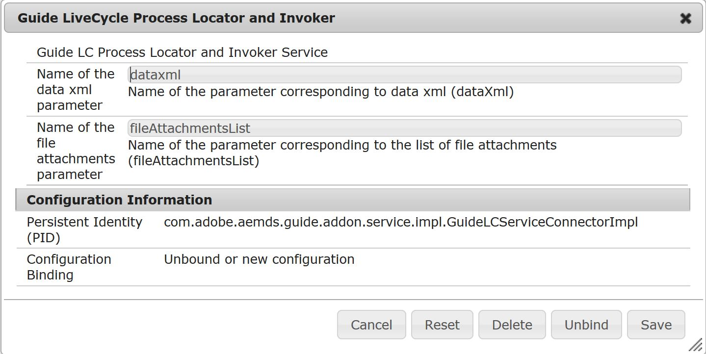

# AEM Forms がフォームデータを JEE 上の AEM Forms プロセスに送信するための設定{#configuring-aem-forms-to-submit-form-data-to-an-aem-forms-on-jee-process}

アダプティブフォームは、JEE 上の AEM Forms プロセスへのデータの送信をサポートしているため、データの追加処理を行えます。送信済みフォームの使用可能なデータを使用して JEE 上の AEM Forms プロセスをトリガーできます。次の手順を実行して、AEM FormsインスタンスがアダプティブフォームをJEE上のAEM Formsに送信するプロセスを有効にします。

## AEM Forms サーバーの設定 {#configure-your-aem-forms-server}

次の手順を実行して、JEE 上の AEM Forms にデータを送信する AEM Forms サーバーを有効にします。

1. AEM Web Configuration Console(https://[*host*]:[*port*]/system/console/configMgr)に移動します。

1. **Adobe LiveCycle Client SDK Configuration** コンポーネントを見つけてクリックします。
1. クリックして、JEE 上の AEM Forms サーバーの URL、ユーザー名、およびパスワードを編集します。
1. 設定を確認し、「**保存**」をクリックします。

## LiveCycle プロセスのフィールドへのデータのマッピング {#map-data-with-process-fields}

AEM Forms の設定が完了したら、データ XML と添付ファイルを、送信済みフォームから JEE 上の AEM Forms プロセスのフィールドにマッピングします。次の手順を実行します。

1. AEM Web Console Configuration で、**Guide LiveCycle Process Locator and Invoker** 設定をクリックして編集します。
1. 以下のパラメーターを指定します。

   * **Name of the data xml parameter** （必須）:送信されたデータの処理に必要なJEE上のAEM FormsプロセスのXMLプロパティファイルを指定します。デフォルト値は **dataxml** です。

   * **Name of the file attachments parameter**（オプション）：JEE 上の AEM Forms プロセスで処理する必要のあるドキュメントオブジェクトのリストを指定します。デフォルト値は&#x200B;**fileAttachmentsList**&#x200B;です。

1. 設定を確認し、「**保存**」をクリックします。

設定が完了すると、「フォームワークフローへの送信」送信アクションには、指定した XML データパラメーターを含む JEE 上の AEM Forms サーバープロセスが一覧表示されます。
