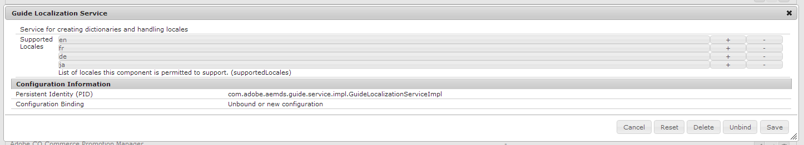

# アダプティブフォームのローカリゼーション用に新しいロケールをサポート{#supporting-new-locales-for-adaptive-forms-localization}

## ロケールの辞書について {#about-locale-dictionaries}

アダプティブフォームのローカリゼーションは、次の 2 種類のロケールの辞書に基づいています。

**フォーム固有の** 辞書アダプティブフォームで使用される文字列を含みます。例えば、ラベル、フィールド名、エラーメッセージ、ヘルプの説明文などです。各ロケールのXLIFFファイルのセットとして管理され、`https://<host>:<port>/libs/cq/i18n/translator.html`からアクセスできます。

**グローバル** 辞書2つのグローバル辞書があり、JSONオブジェクトとして管理され、AEMクライアントライブラリにあります。これらの辞書にはデフォルトのエラーメッセージ、12 か月の名前、通貨シンボル、日付と時間のパターンなどが含まれます。これらの辞書は CRXDe Lite の /libs/fd/xfaforms/clientlibs/I18N にあります。これらの場所では、各ロケールごと別々のフォルダーが用意されています。グローバルの辞書は頻繁に更新されることはありません。各ロケールごとに別の JavaScript ファイルを保持することで、ブラウザーによりそれらがキャッシュされるため、同一サーバー上で異なるアダプティブフォームにアクセスする際に、ネットワーク帯域幅の使用量を減らすことができます。

### アダプティブフォームのローカリゼーションの仕組み {#how-localization-of-adaptive-form-works}

アダプティブフォームのロケールを識別する方法は2つあります。 アダプティブフォームがレンダリングされると、リクエストされたロケールが次のように識別されます。

* アダプティブフォームURLの`[local]`セレクターを確認してください。 URLの形式は`http://host:port/content/forms/af/[afName].[locale].html?wcmmode=disabled`です。 `[local]`セレクターを使用すると、アダプティブフォームをキャッシュできます。

* 指定した順序で次のパラメーターを確認します。

   * リクエストパラメーター`afAcceptLang`
ユーザーのブラウザーロケールを上書きするには、 
`afAcceptLang` リクエストパラメーターを使用して、ロケールを強制的に設定します。例えば、次のURLは日本語ロケールでのフォームのレンダリングを強制します。
      `https://'[server]:[port]'/<contextPath>/<formFolder>/<formName>.html?wcmmode=disabled&afAcceptLang=ja`

   * ユーザーに設定されるブラウザーのロケールです。これは、`Accept-Language`ヘッダーを使用した要求で指定されます。

   * AEM のユーザー指定の言語設定です。

   * ブラウザーのロケールはデフォルトで有効です。 ブラウザーのロケール設定を変更するには
      * Configuration Managerを開きます。 URLは`http://[server]:[port]/system/console/configMgr`です
      * **[!UICONTROL アダプティブフォームとInteractive Communication Webチャネル]**&#x200B;の設定を探して開きます。
      * 「**[!UICONTROL ブラウザーロケールを使用]**」オプションと「**[!UICONTROL 保存]**」設定のステータスを変更します。

ロケールが識別されると、アダプティブフォームはフォームに固有の辞書を参照します。要求されたロケールに対応するフォーム固有の辞書が見つからない場合、アダプティブフォームが作成された言語用の辞書が使用されます。

ロケール情報が存在しない場合、アダプティブフォームはフォームの元の言語で配信されます。 元の言語は、アダプティブフォームの開発時に使用する言語です。

リクエストされたロケールでクライアントライブラリが存在しない場合、ロケールに含まれる言語コードがクライアントライブラリに存在しないかチェックします。例えば、リクエストされたロケールが `en_ZA`（南アフリカ英語）で`en_ZA`用のクライアントライブラリが存在しない場合、アダプティブフォームは、`en`（英語）言語が存在する場合、このクライアントライブラリを使用します。ただし、どちらも存在しない場合、アダプティブフォームでは`en`ロケールの辞書が使用されます。

## サポートされていないロケールにローカリゼーションのサポートを追加する {#add-localization-support-for-non-supported-locales}

AEM Formsでは、英語(en)、スペイン語(es)、フランス語(fr)、イタリア語(it)、ドイツ語(de)、日本語(ja)、ポルトガル語(br)、ポルトガル語(pt-BR)、中国語(zh-CN)、中国語 — 台湾(zh-TW)、韓国語(ko-KR)ロケールでのアダプティブフォームコンテンツのローカライゼーションをサポートしています。

アダプティブフォーム実行時に新しいロケールのサポートを追加するには、次を参照してください。

1. [GuideLocalizationService にロケールを追加する](../../forms/using/supporting-new-language-localization.md#p-add-a-locale-to-the-guide-localization-service-br-p)

1. [XFA クライアントライブラリをロケール用に追加する](../../forms/using/supporting-new-language-localization.md#p-add-xfa-client-library-for-a-locale-br-p)

1. [アダプティブフォームのクライアントライブラリをロケール用に追加する](../../forms/using/supporting-new-language-localization.md#p-add-adaptive-form-client-library-for-a-locale-br-p)
1. [辞書のロケールサポートを追加する](../../forms/using/supporting-new-language-localization.md#p-add-locale-support-for-the-dictionary-br-p)
1. [サーバーの再起動](../../forms/using/supporting-new-language-localization.md#p-restart-the-server-p)

### ガイドローカライゼーションサ追加ービス{#add-a-locale-to-the-guide-localization-service-br}のロケール

1. `https://'[server]:[port]'/system/console/configMgr` にアクセスします。
1. **Guide Localization Service**&#x200B;をクリックしてコンポーネントを編集します。
1. 追加するロケールを、サポート対象のロケールの一覧に追加します。



### XFA クライアントライブラリをロケール用に追加する {#add-xfa-client-library-for-a-locale-br}

`etc/<folderHierarchy>`の下にカテゴリ`cq:ClientLibraryFolder`のノードを作成し、次のファイルをクライアントライブラリに追加します。`xfaforms.I18N.<locale>`

* **に定義され** ているとおり、I18N. `xfalib.locale.Strings` js定義 `<locale>` の `/etc/clientlibs/fd/xfaforms/I18N/ja/I18N`をに対して行います。

* 以下を含む **js.txt** ファイル。

```text
/libs/fd/xfaforms/clientlibs/I18N/Namespace.js
I18N.js
/etc/clientlibs/fd/xfaforms/I18N/LogMessages.js
```

### アダプティブフォームのクライアントライブラリをロケール用に追加する {#add-adaptive-form-client-library-for-a-locale-br}

`etc/<folderHierarchy>`の下に`cq:ClientLibraryFolder`型のノードを作成し、カテゴリを`guides.I18N.<locale>`、依存関係を`xfaforms.3rdparty`、`xfaforms.I18N.<locale>`、`guide.common`型にします。 &quot;

クライアントライブラリに次のファイルを追加します。

* **i18n.** js定義 `guidelib.i18n`, 「calendarSymbols」, `datePatterns`, `timePatterns`, `dateTimeSymbols`, `numberPatterns`,  `numberSymbols`,  `currencySymbols`,  `typefaces`  `<locale>`  [](https://helpx.adobe.com/jp/content/dam/Adobe/specs/xfa_spec_3_3.pdf)per, pの仕様， pの仕様， pのdのxfa, fのdの仕様， fのdのspecificationLocaleのsetのパターンを持つ`/etc/clientlibs/fd/af/I18N/fr/javascript/i18n.js`では、サポートされている他のロケールでの定義も確認できます。
* **LogMessages.** jsdefining `guidelib.i18n.strings` との `guidelib.i18n.LogMessages` 定義（を参照） `<locale>` を参照して `/etc/clientlibs/fd/af/I18N/fr/javascript/LogMessages.js`ください。
* 以下を含む **js.txt** ファイル。

```text
i18n.js
LogMessages.js
```

### 辞書のロケールサポートを追加する {#add-locale-support-for-the-dictionary-br}

追加する`<locale>`が`en`、`de`、`es`、`fr`、`it`、`pt-br`、`zh-cn`、`zh-tw`、`ja`、`ko-kr`の中にない場合にのみ、この手順を実行してください。

1. `etc`の下に`nt:unstructured`ノード`languages`を作成します（存在しない場合）。

1. すでに存在しない場合は、複数の値を持つ文字列プロパティ `languages` をノードに追加します。
1. `<locale>`追加デフォルトのロケール値`de`、`es`、`fr`、`it`、`pt-br`、`zh-cn`、`zh-tw`、`ja`、`ko-kr`が存在しない場合は、それらも存在しません。

1. 追加`<locale>`を`/etc/languages`の`languages`プロパティの値に置き換えます。

`<locale>`は`https://'[server]:[port]'/libs/cq/i18n/translator.html`に表示されます。

### サーバーの再起動 {#restart-the-server}

追加したロケールを有効にするために AEM サーバーを再起動します。

## スペイン語サポートを追加する場合のサンプルライブラリ {#sample-libraries-for-adding-support-for-spanish}

スペイン語サポートを追加する場合のサンプルクライアントライブラリ

[ファイルを入手](assets/sample.zip)
