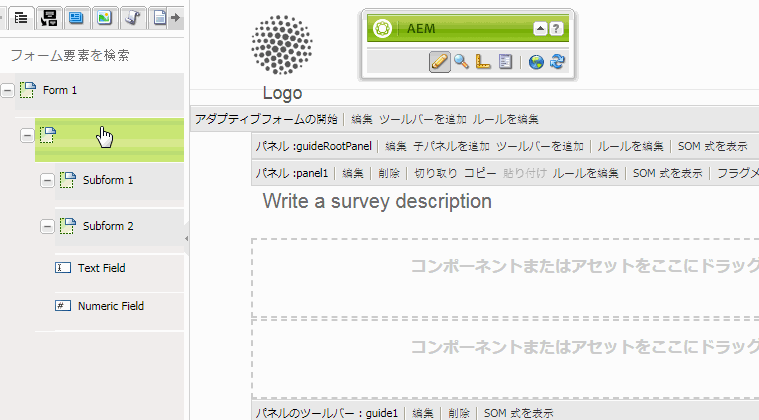
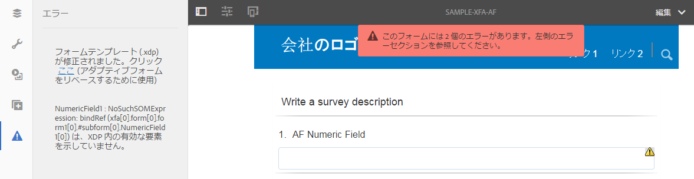
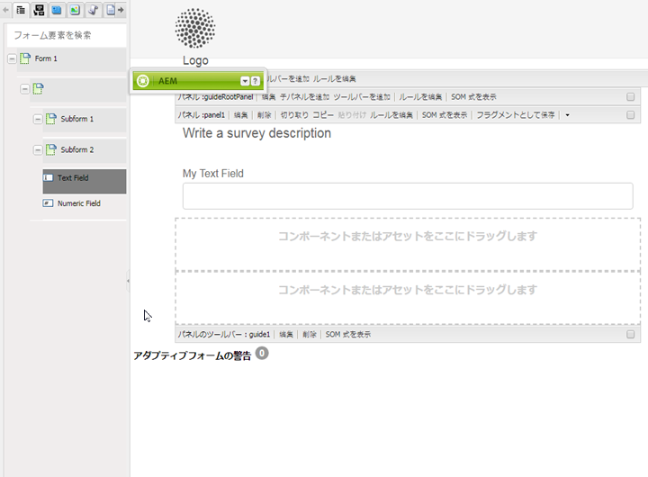
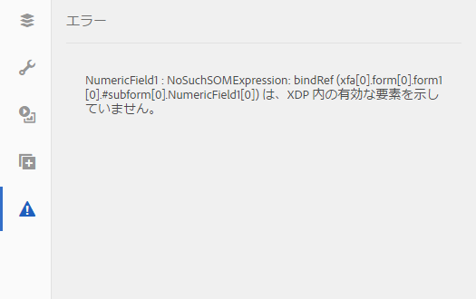

# アダプティブフォームと XFA フォームテンプレートとの同期{#synchronizing-adaptive-forms-with-xfa-form-templates}

## 概要 {#introduction}

You can create an adaptive form based on an XFA form template ( `*.XDP` file). この再利用により、既存の XFA フォームに費やした投資を保持することができます。For information on how to use an XFA form template for creating an adaptive form, [Create an Adaptive Form based on a template](../../forms/using/creating-adaptive-form.md#p-create-an-adaptive-form-based-on-an-xfa-form-template-p).

XDP ファイルのフィールドをアダプティブフォームで再利用することができます。これらのフィールドは、バインドされたフィールドと呼ばれます。バインドされたフィールドのプロパティ（スクリプト、ラベル、表示形式など）は、XDP ファイルからコピーされます。これらのプロパティには、値をオーバーライドできるものもあります。

AEM Forms では、XDP ファイル内の対応するフィールドに後で変更があった場合も、アダプティブフォームのフィールドが同期された状態を保つことができます。この記事では、この同期を有効にする方法を説明します。

AEM Forms のオーサリング環境では、XFA フォーム（左）からアダプティブフォーム（右）へとフィールドをドラッグすることができます

## 前提条件 {#prerequisites}

この記事の情報を使用するには、次の領域に関する知識が推奨されます。

* [アダプティブフォームの作成](../../forms/using/creating-adaptive-form.md)

* XFA（XML Forms Architecture）

To use the assets provides for the example in the article, download the sample package as explained in the next section, [Sample package](../../forms/using/synchronizing-adaptive-forms-xfa.md#p-sample-package-p).

## サンプルパッケージ {#sample-package}

この記事では、更新された XFA フォームテンプレートを使用したアダプティブフォームの同期方法を、例を使って示しています。例で使用されているアセットは、この記事の「[ダウンロード](../../forms/using/synchronizing-adaptive-forms-xfa.md#p-downloads-p)」セクションからダウンロードできるパッケージに含まれています。

パッケージをアップロードすると、これらのアセットが AEM Forms UI に表示されます。

Install the package using the package manager: `https://<server>:<port>/crx/packmgr/index.jsp`

パッケージには次のアセットが含まれています。

1. `sample-form.xdp`：例として使用されている XFA フォームテンプレート

1. `sample-xfa-af`：sample-form.xdp ファイルを基にしたアダプティブフォームただし、このアダプティブフォームにはフィールドは含まれていません。次の手順で、このアダプティブフォームにコンテンツを追加します。

### アダプティブフォームへのコンテンツの追加 {#add-content-to-adaptive-form-br}

1. https://&lt;server>:&lt;port>/aem/forms.htmlに移動します。 要求された場合は、資格情報を入力します。
1. 作成者モードで sample-af-xfa を開き、編集します。
1. サイドバーにあるコンテンツブラウザーで、「データモデルオブジェクト」タブを選択します。NumericField1 と TextField1 をアダプティブフォームにドラッグします。
1. Change the Title of the NumericField1 from **Numeric Field** to **AF Numeric Field.**

>[!NOTE]
>
>前述の手順では、XDP ファイル内のフィールドのプロパティを上書きしました。したがって、このプロパティは、XDP ファイル内の対応するプロパティが後に変更されても同期されません。

## XDP ファイル内の変更の検出 {#detecting-changes-in-xdp-file}

XDP ファイルまたはフラグメントに変更があった場合、AEM Forms UI により、その XDP ファイルまたはフラグメントに基づくすべてのアダプティブフォームにフラグが付けられます。

XDP ファイルを更新した後、変更がフラグ付けされるようにするには、その XDP ファイルを AEM Forms UI に再度アップロードする必要があります。

例として、次の手順を使って `sample-form.xdp` ファイルを更新します。

1. 指示に従って、「資格情報を `https://<server>:<port>/projects.html.` 入力」に移動します。
1. 左側にある「フォーム」タブをクリックします。
1. ローカルマシンに `sample-form.xdp` ファイルをダウンロードします。The XDP file is downloaded as a `.zip` file, which can be extracted using any file decompression utility.

1. `sample-form.xdp` ファイルを開き、TextField1 のタイトルを **Text Field** から **My Text Field** に変更します。

1. `sample-form.xdp` ファイルを AEM Forms UI にアップロードして戻します。

XDP ファイルが更新されると、XDP ファイルに基づいてアダプティブフォームを編集する際、エディターにアイコンが表示されます。このアイコンは、アダプティブフォームが XDP ファイルと同期されていないことを示すものです。次の画像では、サイドバーにアイコンが表示されています。

## アダプティブフォームと最新の XDP ファイルとの同期 {#synchronizing-adaptive-forms-with-the-latest-xdp-file}

XDP ファイルと同期されていないアダプティブフォームが次回作成用に開かれたときに、次のメッセージが表示されます：**このアダプティブフォームのスキーマ / フォームテンプレートは更新されました。`Click Here` を新しいバージョンにリベースします。**

メッセージをクリックすると、アダプティブフォーム内のフィールドが XDP ファイル内の対応するフィールドと同期されます。

この記事で使用される例では、`sample-xfa-af` を作成者モードで開きます。メッセージが、アダプティブフォームの下部に表示されます。

### プロパティの更新 {#updating-the-properties}

XDP ファイルからアダプティブフォームにコピーされたプロパティは、作成者によってアダプティブフォーム内で（コンポーネントダイアログから）明示的に上書きされたプロパティを除き、すべて更新されます。更新されたプロパティのリストは、サーバーログで見ることができます。

To update the properties in the example adaptive form, click the link (labeled `"Click Here"`) in the message. TextField1 のタイトルが、**Text Field** から **My Text Field** に変更されます。

>[!NOTE]
>
>The label AF Numeric Field did not get changed because you had overridden this property from the component properties dialog, as described in [Add content to adaptive forms](../../forms/using/synchronizing-adaptive-forms-xfa.md#p-add-content-to-adaptive-form-br-p).

### XDP ファイルからアダプティブフォームへの新しいフィールドの追加{#adding-new-fields-from-xdp-file-to-adaptive-form-nbsp}

「フォーム階層」タブから元の XDP ファイルに後から追加された新しいフィールドは、アダプティブフォームへとドラッグすることができます。

「フォーム階層」タブのフィールドを更新するために、エラーメッセージ内のリンクをクリックする必要はありません。

### XDP ファイルから削除されたフィールド {#deleted-fields-in-xdp-file}

アダプティブフォームに以前コピーされたフィールドが XDP ファイルから削除されている場合には、XDP ファイルにフィールドが存在しないというエラーメッセージが作成者モード内で表示されます。そのような場合には、アダプティブフォームから手動でそのフィールドを削除するか、またはコンポーネントダイアログで `bindRef` プロパティを消去します。

次の手順では、この記事で使われている例の中のアセットに対してこの方法を使用する流れを説明します。

1. `sample-form.xdp` ファイルを更新し、NumericField1 を削除します。
1. AEM Forms UI に `sample-form.xdp` ファイルをアップロードします。
1. `sample-xfa-af` アダプティブフォームを作成のために開きます。次のエラーメッセージが表示されます。アダプティブフォームのスキーマ/フォームテンプレートが更新されました。 `Click Here` を新しいバージョンにリベースします。

1. Click the link (labeled &quot; `Click Here`&quot;) in the message. XDP ファイルにフィールドが存在しないというエラーメッセージが表示されます。

削除されたフィールドも、フィールドにエラーが存在することを示すアイコンでマークされます。

>[!NOTE]
>
>アダプティブフォームのフィールドで誤ったバインド（編集ダイアログの無効な `bindRef` 値）を持つフィールドも、削除されたフィールドとみなされます。これらのエラーを修正しないでアダプティブフォームを発行すると、フィールドはバインドされていない通常のアダプティブフォームフィールドとして処理され、出力 XML ファイルのバインドされていないセクションに追加されます。

## ダウンロード {#downloads}

この記事の例に使用されているコンテンツパッケージ

[ファイルを入手](assets/sample-xfa-af-sync-1.0.zip)
