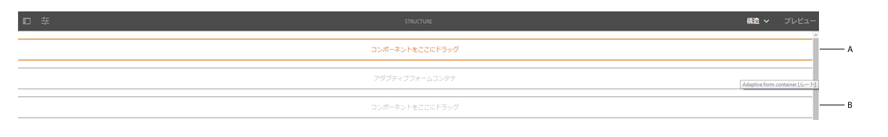
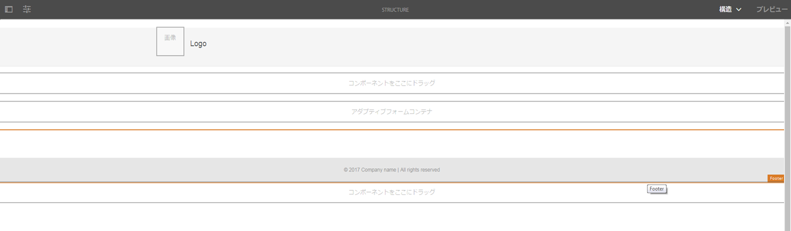
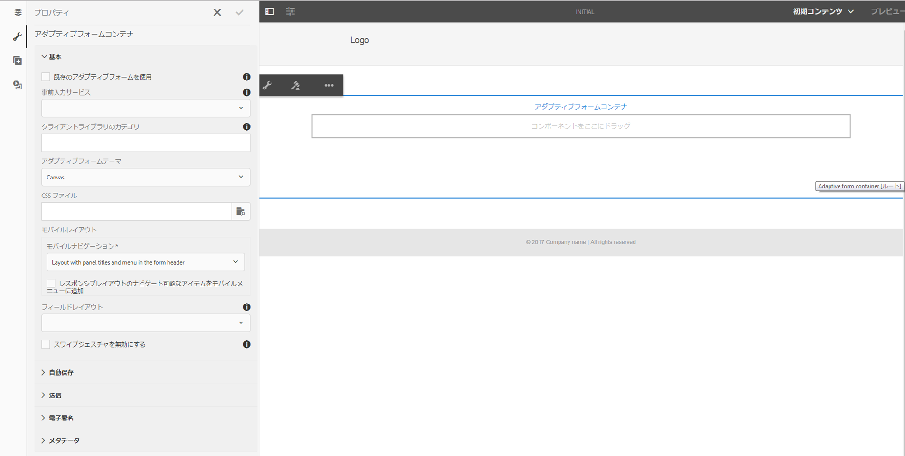
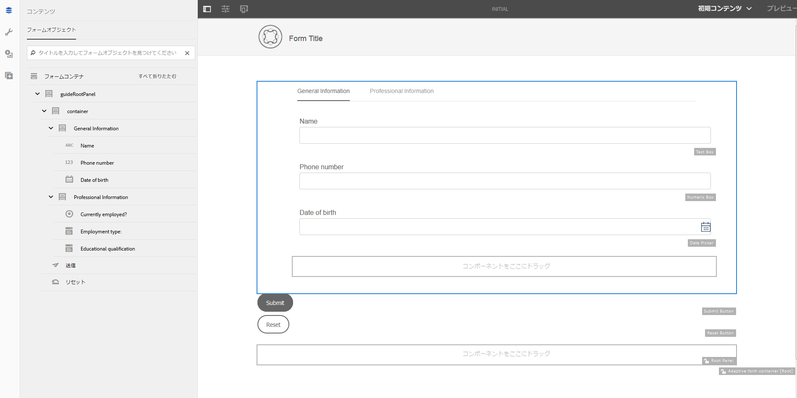

# アダプティブフォームテンプレート{#adaptive-form-templates}

フォームを作成するには、フィールドとコンポーネントを追加して、フォーム構造、コンテンツ、アクションをエディターで定義します。フィールドとコンポーネントは、フォームコンテナの `guideRootPanel` に追加します。基本構造と初期コンテンツが含まれているテンプレートをテンプレートエディターを使用して作成し、フォームの作成時に使用することができます。

例えば、登録フォームですべての作成者が特定のテキストボックス、ナビゲーションボタン、送信ボタンを使用できるようにします。他の登録フォームと統一のとれたフォームを作成者が作成できるようにコンポーネントを追加してテンプレートを作成できます。作成者がテンプレートを使用してアダプティブフォームを作成する場合、新しいフォームにはテンプレートに指定した構造とコンポーネントが継承されます。テンプレートエディターでは次のことが行えます。

* 構造レイヤーでフォームのヘッダーおよびフッターコンポーネントを追加できます。
* フォームの初期コンテンツを提供できます。
* テーマや送信アクションを指定できます。

## テンプレートの操作 {#working-with-templates}

ツールメニューからテンプレートエディターにアクセスするには、**Adobe Experience Manager／ツール／テンプレート**&#x200B;に移動します。編集可能テンプレート用のフォルダーごとにテンプレートが表示されます。AEM には、テンプレートを整理するためのグローバルフォルダーが用意されています。ただし、このフォルダーはデフォルトで編集不可の状態になっています。グローバルフォルダーを編集可能にするように管理者に依頼することも、テンプレート用の新しいフォルダーを作成することもできます。For more information on how to create folders, see [Template Folders](/help/sites-developing/page-templates-editable.md).

フォルダーをタップして開くと、「作成」ボタンが表示され、アダプティブフォームの新しいテンプレートを作成できます。

### テンプレートの作成 {#create-template}

フォルダーの作成後、フォルダーを開いて次の手順を実行し、テンプレートを作成します。

1. テンプレートコンソールで、作成したフォルダー内で&#x200B;**「作成」**&#x200B;をタップします。
1. 「テンプレートタイプを選択」セクションで、**「アダプティブフォームテンプレート」**&#x200B;を選択し、**「次へ」**&#x200B;をタップします。

1. 「テンプレート詳細」セクションで、テンプレートタイトルを指定し、**「作成」**&#x200B;をタップします。 作成したテンプレートがフォームの作成中に選択された場合に表示する説明とサムネールを指定できます。

1. **「完了」**&#x200B;をタップしてコンソールに戻るか、または&#x200B;**「開く」**&#x200B;をタップしてテンプレートをエディターで開きます。

### テンプレートエディター UI {#template-editor-ui}

編集対象のテンプレートを開くと、次の AEM エディターコンポーネントが表示されます。

* **ページのツールバー** 次のオプションが含まれています。

   * **サイドパネルを切り替え**：サイドバーの表示と非表示を切り替えます。
   * **ページ情報**:公開/非公開時間、サムネール、クライアント側ライブラリ、ページポリシー、ページデザインのクライアント側ライブラリなどの情報を指定できます。
   * **エミュレータ**:様々なデバイスの外観をシミュレートし、カスタマイズできます。
   * **レイヤーセレクター：** レイヤーを変更できます。
 **構造**&#x200B;レイヤーまたは&#x200B;**初期コンテンツ**&#x200B;レイヤーを選択できます。構造レイヤーを使用すると、ヘッダーとフッターを追加およびカスタマイズできます。 初期コンテンツレイヤーを使用すると、フォームのコンテンツをカスタマイズできます。

   * **プレビュー:** 公開時のプレビューの外観を選択できます。 レイヤーセレクターとプレビューを使用して、編集モードとプレビューモードを切り替えます。

* **サイドバー：** コンテンツブラウザー、プロパティブラウザー、アセットブラウザーおよびコンポーネントブラウザーを提供します。
* **コンポーネントツールバー：** コンポーネントを選択すると、コンポーネントをカスタマイズできるツールバーが表示されます。
* **ページ**:テンプレートを作成するコンテンツを追加する領域。

See [Introduction to authoring adaptive forms](../../forms/using/introduction-forms-authoring.md) to understand the Touch UI editor.

### テンプレートの編集 {#editing-a-template}

アダプティブフォームテンプレートは 2 つのレイヤーを使用して作成されます。

* 構造
* 初期コンテンツ

画面の右上隅の「プレビュー」オプションの横にある「レイヤーセレクター」を使用します。

### 構造 {#structure}

テンプレートエディターで構造レイヤーを選択すると、アダプティブフォームコンテナの上および下にレイアウトコンテナを表示できます。作成者はこれらのレイアウトコンテナをヘッダーとフッターに使用できます。ヘッダーとフッターは追加、編集、カスタマイズできます。テンプレートのヘッダーをカスタマイズするには、アダプティブフォームコンテナの上にあるレイアウトコンテナにアダプティブフォームのヘッダーコンポーネントをドラッグアンドドロップします。テンプレートのフッターをカスタマイズするには、アダプティブフォームコンテナの下にあるレイアウトコンテナにアダプティブフォームのフッターコンポーネントをドラッグアンドドロップします。

構造レイヤー内のレイアウトコンテナ

**A.** ヘッダーコンポーネント **Bのレイアウトコンテナ。** フッターコンテナコンポーネントのレイアウトコンポーネント

アダプティブフォームコンテナの上にあるレイアウトコンテナにアダプティブフォームのヘッダーコンポーネントをドラッグアンドドロップします。コンポーネントを追加した後にプロパティを指定し、ロゴを追加してそのタイトルを指定できます。

同様に、アダプティブフォームコンテナの下にあるレイアウトコンテナにフッターコンポーネントをドラッグアンドドロップすると、著作権情報や会社の詳細を指定できます。

構造レイヤーに追加されたヘッダーとフッター

#### 構造レイヤー内のコンポーネントのロック／ロック解除 {#locking-unlocking-components-in-the-structure-layer}

構造レイヤーを選択してテンプレートを編集する際は、テンプレートのヘッダーとフッターをロック解除できます。テンプレート内のコンポーネントがロック解除されると、フォーム作成者はそのテンプレートを使用するアダプティブフォーム内のコンポーネントを編集できます。コンポーネントをロックすると、フォーム作成者はアダプティブフォーム内でそのコンポーネントを編集できなくなります。ロックオプションはコンポーネントツールバーにあります。

例えば、ヘッダーコンポーネントをテンプレートに追加するとします。コンポーネントを選択すると、コンポーネントツールバーにロックオプションが表示されます。通常、ヘッダーには会社名とロゴが含まれており、フォーム作成者がテンプレート内のロゴとヘッダーを変更できないようにする必要があります。ヘッダーコンポーネントをロックしたテンプレートを使用して作成したアダプティブフォームでは、フォーム作成者はロゴと会社名を変更できません。

>[!NOTE]
>
>ヘッダーコンポーネント内の画像またはロゴを個々にロックまたはロック解除することはお勧めしません。ヘッダーコンポーネントはロック解除できます。

### 初期コンテンツ {#initial-content}

「初期コンテンツ」オプションを選択すると、テンプレートのアダプティブフォームコンテナがアダプティブフォームと同様に開いて編集可能になります。アダプティブフォームを作成する場合と同様、テーマや送信アクションの選択などの初期設定を指定できます。

フォーム作成者はこれをベースにしてフォームを作成します。コンテンツのフロー構造は、テンプレートの初期コンテンツレイヤーで指定されます。To switch to editing initial content of the form template, before Preview in the page toolbar, tap  **> Initial Content**.

プロパティを指定するために選択されたアダプティブフォームコンテナを表示しているテンプレートエディター内の初期コンテンツレイヤー。

初期コンテンツレイヤー内で、作成者がベースとして使用するアダプティブフォームテンプレートを作成します。テンプレートの作成はフォームの作成と同様です。サイドバーにあるオプションを使用します。サイドバーはコンテンツブラウザー、プロパティブラウザー、アセットブラウザー、コンポーネントブラウザーを提供します。

See [Sidebar](../../forms/using/introduction-forms-authoring.md#sidebar).

>[!NOTE]
>
>送信アクションとして「コンテンツを保存」または「PDFを保存」を選択すると、アクションパスを指定するストレージが得られます。 テンプレートでパスを指定した場合、このテンプレートから作成されたすべてのフォームには同じパスが指定されます。正しいストレージパスを指定するか、またはフォーム作成者がストレージパスを更新してすべてのフォームのデータが同じ場所に保存されないようにします。

#### タブとパネルを使用したアダプティブフォームテンプレートの作成 {#creating-an-adaptive-form-template-with-tabs-and-panels-nbsp}

例えば、次のタブを使用してテンプレートを作成するとします。

* 一般情報
* 職業情報

ロゴを追加し、タイトルを指定し、構造レイヤーにフッターを追加しています。ヘッダーとフッターをロックし、フォーム作成者がテンプレートを使用してフォームを作成する際にヘッダーとフッターが編集されないようにします。

レイヤーを構造から初期コンテンツに変更し、コンテンツをフォームに追加します。タブ付きの構造を作成するには、アダプティブフォームコンテナの guideRootPanel に子パネルを追加します。パネルを追加するには：

* You can add a panel by tapping the **+** button when you select the **Drag components here** option.

* パネルコンポーネントはコンポーネントブラウザーからサイドバーにドラッグアンドドロップできます。
* You can add child panel of the `guideRootPanel` from the component toolbar.

「一般情報」および「職業情報」タブを作成するには、2 つのパネルを `guideRootPanel` の子パネルに追加します。Select the panels and tap  to open the properties in the sidebar. 要素名を `general-info` および `professional-info` に変更し、タイトルを「一般情報」および「職業情報」にそれぞれ変更します。サイドバーでコンテンツをタップし、コンテンツブラウザーを開きます。「フォームオブジェクト」タブで、`guideRootPanel`「」を選択します。エディターで guideRootPanel が選択されます。Tap  in the component toolbar to open its properties. パネルレイアウトフィールドで、**「上部のタブ」**&#x200B;を選択し、**「完了」**&#x200B;をタップします。タブ付きのテンプレート構造が適用されます。

#### タブへのコンテンツの追加 {#adding-content-in-tabs}

[ 

テンプレートへのフィールドの追加

](assets/template-edit-initial-content-1.png)パネルを追加し、タブとして構造化した後、タブ内にフィールドを追加できます。 エディターでタブを選択すると、**「コンポーネントをここにドラッグ」**&#x200B;オプションが表示されます。テキストボックス、リスト項目、ボタンなどのコンポーネントをドラッグアンドドロップできます。コンポーネントはコンポーネントブラウザーからサイドバーにドラッグアンドドロップできます。

各コンポーネントにはデータの取得と操作を強化するプロパティが存在します。例えば、コンポーネントの&#x200B;**「必須フィールド」**&#x200B;プロパティを有効化することができます。作成者は、顧客が必須フィールドをスキップした場合に表示するメッセージを指定できます。Specify the message in **Required Field Message** property.

名前、電話番号、生年月日フィールドが例のテンプレートの「一般情報」タブに追加されます。現在の職業、雇用タイプ、学歴フィールドが「職業情報」タブに追加されます。

フィールドを追加した後、「送信」、「リセット」などのボタンを追加できます。

### テンプレートの有効化 {#enabling-the-template}

テンプレートは作成するとドラフトとして追加されます。テンプレートを有効化して、アダプティブフォームの作成に使用できるようにします。テンプレートを有効化するには：

1. **Adobe Experience Manager／ツール／テンプレート**&#x200B;に移動して、テンプレートの作成先のフォルダーを開きます。

1. 作成したテンプレートはドラフトとしてマークされます。
1. テンプレートを選択し、ツールバーで&#x200B;**「有効」**&#x200B;をタップします。 アダプティブフォームの作成時にテンプレートの選択を求められる際、このテンプレートがリストに表示されるようになります。

## テンプレートの読み込みまたは書き出し {#importing-or-exporting-a-template}

フォームはテンプレートと連携しています。カスタマイズしたテンプレートを使用して作成したアダプティブフォームをダウンロードする場合、テンプレートはダウンロードされません。別の AEM Forms インスタンス上のフォームを読み込む場合は、テンプレートなしで読み込まれます。フォームが読み込まれてもテンプレートを使用できない場合、フォームはレンダリングされません。You can package the custom template from `/conf` node in `https://<server>:<port>/crx/packmgr`, and port it in the AEM Forms instance where you want to upload the form.

## テンプレートを使用したアダプティブフォームの作成 {#creating-an-adaptive-form-using-the-template}

テンプレートを作成して有効にすると、Forms Manager でアダプティブフォームを作成するときにそのテンプレートを使用できます。テンプレートを使用したアダプティブフォームの作成方法について詳しくは、「[アダプティブフォームの作成](../../forms/using/creating-adaptive-form.md)」を参照してください。

## 初期設定済みテンプレートの表示オプションの変更  {#change-display-option-of-out-of-the-box-templates}

アダプティブフォームのカスタムテンプレートを作成して、基本構造と初期コンテンツを定義できます。AEM Forms には、アダプティブフォーム用の一連の初期設定済みテンプレートも用意されています。テンプレートの表示／非表示を選択できます。

テンプレートを表示または非表示にするには、以下の手順を実行します。

1. AEM Forms 作成者インスタンスにログインし、**ツール**／**操作**／**Web コンソール**&#x200B;に移動します。

   >[!NOTE]
   >
   >The URL of AEM web console is https://&#39;[server]:[port]&#39;/system/console/configMgr

1. **FormsManager 設定**&#x200B;を探して開きます。

   * アダプティブフォームの初期設定済みテンプレートを表示または非表示にするには、「**AF および AD の初期設定済みテンプレートを含める**」オプションをオンまたはオフにします。
   * AEM 6.0 Forms または AEM 6.1 Forms リリースで追加され、現在非推奨になっているアダプティブフォームの初期設定済みテンプレートを表示または非表示にするには、「**AEM 6.0 の AF テンプレートを含める**」オプションをオンまたはオフにします。このオプションをオンにした場合、これを有効にするには、「**AF および AD の初期設定済みテンプレートを含める**」の設定を有効にする必要があります。

1. 「**保存**」をクリックします。初期設定済みテンプレートの表示オプションが変更されます。

## 推奨事項 {#recommendations}

* テンプレートエディターでフォームのプロパティを変更する際は、BindReference プロパティを使用しないようにしてください。
* ブレークポイントを追加する場合は、アダプティブフォームテンプレートの作成時にブレークポイントを作成します。For more information on breakpoints, see [Responsive Layout](/help/sites-authoring/responsive-layout.md).

