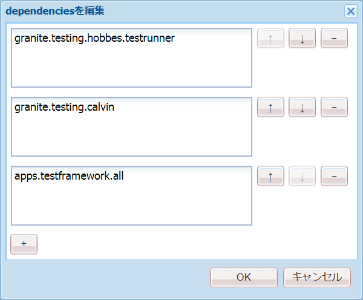
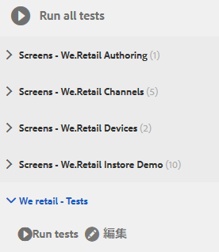
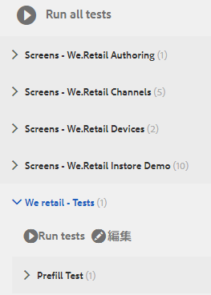
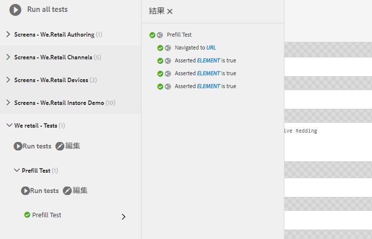

# チュートリアル：アダプティブフォームのテスト{#tutorial-testing-your-adaptive-form}


これは、「[最初のアダプティブフォームを作成する](https://helpx.adobe.com/experience-manager/6-3/forms/using/create-your-first-adaptive-form.html)」シリーズを構成するチュートリアルです。チュートリアル内のユースケースを理解して実際に操作できるように、このシリーズのチュートリアルを最初から順に学習することをお勧めします。

アダプティブフォームの準備が整ったら、エンドユーザーにアダプティブを展開する前に、そのアダプティブをテストすることが重要です。 すべてのフィールドを手動でテスト（機能テスト）したり、アダプティブフォームのテストを自動化したりできます。 複数のアダプティブフォームがある場合、すべてのアダプティブフォームのすべてのフィールドを手動でテストすると、非常に負担の大きいタスクです。

AEM Formsは、アダプティブフォームのテストを自動化するテストフレームワークCalvinを提供します。 このフレームワークを使用して、Web ブラウザーで直接 UI テストを記述して実行します。フレームワークは、テストを作成するためのJavaScript APIを提供します。 自動テストでは、アダプティブフォームの事前入力エクスペリエンス、アダプティブフォームの送信エクスペリエンス、式ルール、検証、遅延読み込み、UIインタラクションをテストできます。 このチュートリアルでは、アダプティブフォームで自動テストを作成し、実行する手順を説明します。 このチュートリアルを完了すると、次の操作を実行できるようになります。

* [アダプティブフォームのテストスイートの作成](../../forms/using/testing-your-adaptive-form.md#step-create-a-test-suite)
* [アダプティブフォームのテストの作成](../../forms/using/testing-your-adaptive-form.md#step-create-a-test-case-to-prefill-values-in-an-adaptive-form)
* [アダプティブフォーム用に作成されたテストスイートとテストの実行](#step-run-all-the-tests-in-a-suite-or-individual-tests-cases)

## Step 1: Create a test suite {#step-create-a-test-suite}

テストスイートには、テストケースの集まりがあります。 複数のテストスイートを使用できます。 フォームごとに個別のテストスイートを用意することをお勧めします。 テストスイートを作成するには：

1. 管理者としてAEM Forms作成者インスタンスにログインします。 CRXDE Lite を開きます。AEMロゴ/ツール **/一般** / **CRXDE** Lite **/https://localhost:4502/crx/de/index.jsp Liteをタップするか、ブラウザでCRXDE Liteを**[](https://localhost:4502/crx/de/index.jsp) 開くURLをタップします。

1. CRXDE Liteの/etc/clientlibsに移動します。 /etc/clientlibs サブフォルダーを右クリックして、**作成**／**ノードを作成をクリックします。** 「名前」フィールドにWeRetailFormTestCasesと入力 **します**。 タイプを **cq:ClientLibraryFolderとして選択し、** 「 **OK」をクリックします**。 ノードを作成します。 WeRetailFormTestCasesの代わりに任意の名前を使用できます。
1. Add the following properties to the WeRetailFormTestCases node and tap **Save ALL**.

<table>
 <tbody>
  <tr>
   <td><strong>プロパティ</strong></td>
   <td><strong>タイプ</strong></td>
   <td><strong>複数</strong></td>
   <td><strong>値</strong></td>
  </tr>
  <tr>
   <td>categories</td>
   <td>String</td>
   <td>Enabled</td>
   <td>
    <ul>
     <li>granite.testing.hobbes.tests<br /> </li>
     <li>granite.testing.calvin.tests</li>
    </ul> </td>
  </tr>
  <tr>
   <td>dependencies</td>
   <td>String</td>
   <td>Enabled</td>
   <td>
    <ul>
     <li>granite.testing.hobbes.testrunner <br /> </li>
     <li>granite.testing.calvin <br /> </li>
     <li>apps.testframework.all</li>
    </ul> </td>
  </tr>
 </tbody>
</table>

次のように、各プロパティが別々のボックスに追加されていることを確認します。



1. Right-click the **[!UICONTROL WeRetailFormTestCases]** node click **Create** > **Create File**. In the Name field, type `js.txt` and click **OK**.
1. js.txtファイルを開いて編集し、次のコードを追加し、ファイルを保存します。

   ```
   #base=.
    init.js
   ```

1. ノード内にinit.jsというファイルを作成し `WeRetailFormTestCases`ます。 次のコ追加ードをファイルに追加し、「すべて保存」をタ **[!UICONTROL ップします]**。

   ```
   (function(window, hobs) {
       'use strict';
       window.testsuites = window.testsuites || {};
     // Registering the test form suite to the sytem
     // If there are other forms, all registration should be done here
       window.testsuites.testForm3 = new hobs.TestSuite("We retail - Tests", {
           path: '/etc/clientlibs/WeRetailFormTestCases/init.js',
           register: true
       });
    // window.testsuites.testForm2 = new hobs.TestSuite("testForm2");
   }(window, window.hobs));
   ```

   上記のコードは、 **We retail - Testsという名前のテストスイートを作成します**。

1. AEMテストUI（AEM/ツール/操作/テスト）を開きます。 テストスイート( **市販用 — テスト** )がUIに表示されます。

   

## 手順2:アダプティブフォームの値を事前入力するためのテストケースの作成 {#step-create-a-test-case-to-prefill-values-in-an-adaptive-form}

テストケースとは、特定の機能をテストする一連のアクションです。 例えば、フォームのすべてのフィールドに事前入力し、数個のフィールドを検証して、正しい値が入力されていることを確認します。

アクションとは、ボタンのアクティビティなど、アダプティブフォーム上の特定のアクションです。 各アダプティブフォームフィールドのユーザー入力を検証するテストケースとアクションを作成するには：

1. CRXDE Liteで、フォルダーに移動し `/content/forms/af/create-first-adaptive-form` ます。 「 **[!UICONTROL create-first-adaptive-form]** 」フォルダノードを右クリックし、「作成 **[!UICONTROL /ファイルを作]**&#x200B;成 **[!UICONTROL 」をク]**&#x200B;リックします。 In the Name field, type `prefill.xml` and click **[!UICONTROL OK]**. 次のコードを ファイルに追加します。

   ```xml
   <?xml version="1.0" encoding="UTF-8"?><afData>
     <afUnboundData>
       <data>
         <customer_ID>371767</customer_ID>
         <customer_Name>John Jacobs</customer_Name>
         <customer_Shipping_Address>1657 1657 Riverside Drive Redding</customer_Shipping_Address>
         <customer_State>California</customer_State>
         <customer_ZIPCode>096001</customer_ZIPCode>
        </data>
     </afUnboundData>
     <afBoundData>
       <data xmlns:xfa="https://www.xfa.org/schema/xfa-data/1.0/"/>
     </afBoundData>
   </afData>
   ```

1. `/etc/clientlibs` に移動します。Right-click the `/etc/clientlibs` subfolder and click **[!UICONTROL Create]**> **[!UICONTROL Create Node]**.

   「 **[!UICONTROL Name]** 」フィールドに入力しま `WeRetailFormTests`す。 タイプをとして選択し、「 `cq:ClientLibraryFolder`**[!UICONTROL OK」をクリックしま]**&#x200B;す。

1. Add the following properties to the **[!UICONTROL WeRetailFormTests]** node.

<table>
 <tbody>
  <tr>
   <td><strong>プロパティ</strong></td>
   <td><strong>タイプ</strong></td>
   <td><strong>複数</strong></td>
   <td><strong>値</strong></td>
  </tr>
  <tr>
   <td>categories</td>
   <td>String</td>
   <td>Enabled</td>
   <td>
    <ul>
     <li>granite.testing.hobbes.tests<br /> </li>
     <li>granite.testing.hobbes.tests.testForm</li>
    </ul> </td>
  </tr>
  <tr>
   <td>dependencies</td>
   <td>String</td>
   <td>Enabled</td>
   <td>
    <ul>
     <li>granite.testing.calvin.tests</li>
    </ul> </td>
  </tr>
 </tbody>
</table>

1. WeRetailFormTestsノードにjs.txtというファイルを作成 **[!UICONTROL します]** 。 次の追加手順を実行します。

   ```shell
   #base=.
   prefillTest.js
   ```

   「**[!UICONTROL すべて保存]**」をクリックします。

1. WeRetailFormTestsノードでフ `prefillTest.js`ァイルを作 **[!UICONTROL 成します]** 。 次追加のコードをファイルに追加します。 コードはテストケースを作成します。 テストケースでは、フォームのすべてのフィールドに事前入力し、一部のフィールドを検証して、正しい値が入力されていることを確認します。

   ```
   (function (window, hobs) {
       'use strict';
   
       var ts = new hobs.TestSuite("Prefill Test", {
           path: '/etc/clientlibs/WeRetailFormTests/prefillTest.js',
           register: false
       })
   
       .addTestCase(new hobs.TestCase("Prefill Test")
           // navigate to the testForm which is to be test
           .navigateTo("/content/forms/af/create-first-adaptive-form/shipping-address-add-update-form.html?wcmmode=disabled&dataRef=crx:///content/forms/af/create-first-adaptive-form/prefill.xml")
           // check if adaptive form is loaded
           .asserts.isTrue(function () {
               return calvin.isFormLoaded()
           })
           .asserts.isTrue(function () {
               return calvin.model("customer_ID").value == 371767;
           })
           .asserts.isTrue(function () {
               return calvin.model("customer_ZIPCode").value == 96001;
           })
       );
   
       // register the test suite with testForm
       window.testsuites.testForm3.add(ts);
   
   }(window, window.hobs));
   ```

   テストケースが作成され、実行の準備が整います。 テストケースを作成して、計算スクリプトの実行の確認、パターンの検証、アダプティブフォームの送信エクスペリエンスの検証など、アダプティブフォームの様々な側面を検証できます。 アダプティブフォームのテストの様々な側面について詳しくは、「アダプティブフォームのテストの自動化」を参照してください。

## 手順3:スイート内または個々のテストケース内のすべてのテストを実行する {#step-run-all-the-tests-in-a-suite-or-individual-tests-cases}

1つのテストスイートに複数のテストケースを含めることができます。 テストスイート内のすべてのテストケースは、一度に、または個別に実行できます。 テストを実行すると、アイコンに結果が示されます。

* A checkmark icon indicates a passed test: 
* An &quot;X&quot; icon indicates a failed test: 

1. AEMアイコン/ツール/操 **[!UICONTROL 作]**/テ **[!UICONTROL スト]**&#x200B;に移動し **[!UICONTROL ます]**
1. テストスイートのすべてのテストを実行するには：

   1. Testsパネルで、「 **[!UICONTROL We retail - Tests (1)」をタップします]**。 スイートが展開し、テストのリストが表示されます。
   1. 「テストを実行 **[!UICONTROL 」ボタンをタップし]** ます。 画面の右側の空白領域は、テストの実行時にアダプティブフォームに置き換えられます。
   

1. テストスイートから単一のテストを実行するには：

   1. Testsパネルで、「 **[!UICONTROL We retail - Tests (1)」をタップします]**。 スイートが展開し、テストのリストが表示されます。
   1. 「事前入力テ **[!UICONTROL スト」をタップし]** 、「テストを実行 **[!UICONTROL 」ボタンをタップします]** 。 画面の右側の空白領域は、テストの実行時にアダプティブフォームに置き換えられます。

1. テスト名「事前入力テスト」をタップして、テストケースの結果を確認します。 結果パネルが開きます。 テストの詳細をすべて表示する結果パネル表示で、テストケースの名前をタップします。

   

これで、アダプティブフォームの発行準備が整いました。
