# インタラクティブ通信内のテキスト{#texts-in-interactive-communications}

## 概要 {#overview}

テキストドキュメントフラグメントは、1 つ以上のテキスト段落で構成されています。段落は静的または動的にすることができます。動的な段落には、フォームデータモデルのプロパティと変数を含めることができます。また、ルールを適用し、テキストドキュメントフラグメント内で繰り返します。 例えば、挨拶の顧客名は、フォームデータモデル(FDM)のプロパティで、実行時に値が使用可能になります。 これらの値を変更することで、エージェントUIを使用して、同じInteractive Communicationを使用して異なる顧客向けのInteractive Communicationを準備できます。

インタラクティブドキュメントのテキスト通信フラグメントは、次のタイプのダイナミックデータをサポートします。

* **データモデルオブジェクト**:データプロパティはバックエンドデータソースを使用します。
* **ルールベースのコンテンツ**：ルールに基づいて表示と非表示が切り替わる、テキスト内の特定のコンテンツ。ルールは、フォームデータモデルのプロパティと変数に基づくこともできます。
* **変数**：テキストドキュメントフラグメントでは、バックエンドのデータソースに変数が連結されることはありません。エージェントは、変数の値を入力/選択したり、データソースに変数をバインドしたりして、後処理に送信するためのインタラクティブ通信を準備します。
* **繰り返し**:クレジット・カード明細のトランザクションなど、生成された各インタラクティブ・コミュニケーションとのオカレンスの変化が続く可能性のある、インタラクティブ・コミュニケーションに動的な情報が含まれる場合があります。 繰り返し構造を使用すると、このような動的な情報の書式設定と構造化を行うことができます。For more information, see [Inline condition and repeat](https://helpx.adobe.com/experience-manager/6-3/forms/using/cm-inline-condition.html).

## テキストの作成 {#createtext}

1. 「**[!UICONTROL フォーム]**／**[!UICONTROL ドキュメントフラグメント]**」を選択します。
1. Select **[!UICONTROL Create]** > **[!UICONTROL Text]**.
1. 次の情報を指定します。

   * **[!UICONTROL タイトル]**:（オプション）テキストドキュメントフラグメントのタイトルを入力します。 タイトルは一意である必要はなく、特殊文字や英語以外の文字を含めることもできます。テキストは、そのタイトル（利用可能な場合）によって、サムネールやプロパティで参照されます。
   * **[!UICONTROL 名前]**:フォルダー内のテキストの一意の名前。 どのような状態であっても、1 つのフォルダー内に、同じ名前を持つ 2 つのドキュメントフラグメント（テキスト、条件、リスト）を保管することはできません。「名前」フィールドでは、英数字およびハイフンのみ使用できます。「名前」フィールドは、タイトルフィールドに基づいて自動的に入力されます。「タイトル」フィールドに入力した特殊文字、スペース、数字および英数字以外の文字は、ハイフンに置き換えられます。 「タイトル」フィールドの値は「名前」フィールドに自動的にコピーされますが、値を編集することもできます。

   * **[!UICONTROL 説明]**：テキストの説明を入力します。
   * **[!UICONTROL フォームデータモデル]**：（任意）フォームデータモデルに基づいてテキストを作成する場合は、「フォームデータモデル」ラジオボタンを選択します。When you select Form Data Model radio button, **[!UICONTROL Form Data Model]** field appears. フォームデータモデルを参照して選択します。インタラクティブ通信用のテキストを作成する場合は、そのインタラクティブ通信で使用するものと同じデータモデルを使用する必要があります。For more information on Form Data Model, see [Data Integration](/help/forms/using/data-integration.md).

   * **[!UICONTROL タグ]**：（オプション）テキストフィールドにカスタムタグの値を入力し、Enter キーを押します。このテキストを保存すると、新しく追加されたタグが作成されます。

1. 「**[!UICONTROL 次へ]**」をタップします。

   テキストの作成ページが表示されます。フォームデータモデルのベースのテキストを作成することを選択した場合は、左側のペインにフォームデータモデルのプロパティが表示されます。

1. テキストを入力し、以下のオプションを使用して、フォームデータモデルのプロパティと変数について書式設定と条件設定を行い、それらのプロパティと変数をテキストに挿入します。

   * [フォームデータモデル](#formdatamodel)
   * [変数](#variables)
   * [ルールエディター](#rules)
   * [書式設定オプション](#formatting)

      * [書式設定されたテキストを他のアプリケーションからコピーして貼り付け](#paste)

      * [テキストの一部をハイライト表示](#highlight)
   * [繰り返し](/help/forms/using/cm-inline-condition.md)
   * [特殊文字](#special)
   * [テキストの検索と置換](#searching)
   * [ショートカットキー](/help/forms/using/keyboard-shortcuts.md)
   >[!NOTE]
   >
   >テキストエディターで@記号を使用して、フォームデータモデルの要素、データディクショナリの要素および変数を追加できます。 テキストエディターで先頭に@が付いた文字列を入力すると、すべてのデータモデル要素、データディクショナリ要素および変数が検索され、検索された文字列を含む要素または変数が表示されます。 検索結果内を移動し、要素または変数を選択できます。 一致する結果がない場合は、「一致する結果が見つ *かりません* 」というメッセージが表示されます。

1. 「**[!UICONTROL 保存]**」をタップします。

   これで、テキストが作成されました。このテキストを使用して、インタラクティブ通信を作成することができます。

## テキストの編集 {#edittext}

以下の手順により、既存のテキストドキュメントフラグメントを編集することができます。また、インタラクティブコミュニケーションエディター内からテキストドキュメントフラグメントを編集するように選択することもできます。

1. 「**[!UICONTROL フォーム]**／**[!UICONTROL ドキュメントフラグメント]**」を選択します。
1. 目的のテキストドキュメントフラグメントに移動して選択します。
1. 「**[!UICONTROL 編集]**」をタップします。
1. 必要な変更を行います。For more information on options in text, see [Create text](#createtext).
1. Tap **[!UICONTROL Save]** and then tap **[!UICONTROL Close]**.

## フォームデータモデルのプロパティを使用してテキストドキュメントフラグメントをカスタマイズする {#formdatamodel}

フォームデータモデルのプロパティを挿入することにより、テキストドキュメントフラグメントをカスタマイズすることができます。フォームデータモデルのプロパティをテキストに挿入すると、Interactive Communicationをプレビューしながら、関連するデータソースから受信者固有のデータを取得し、入力できます。 For more information on form data model, see [AEM Forms Data Integration](/help/forms/using/data-integration.md).

テキストの作成時にフォームデータモデルを指定した場合は、フォームデータモデルのプロパティがテキストエディターの左ペインに表示されます。 指定するフォームデータモデルは、テキストドキュメントフラグメントと、それを含むインタラクティブ通信に対して同じである必要があります。

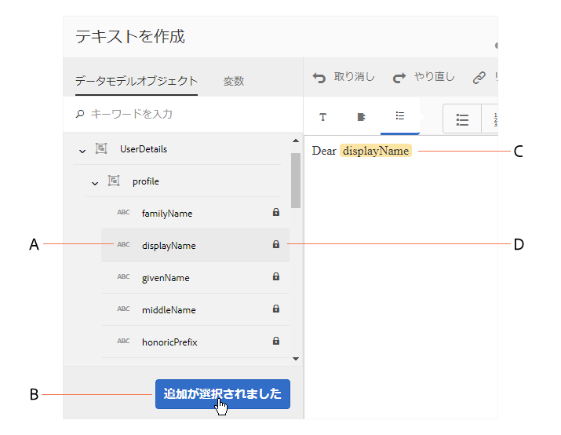

* To insert an form data model property into text, place the cursor where you want to insert the property, then select the **[A]** property in the left pane by tapping on it, and tap **[!UICONTROL [B]Add Selected]**. You can also just double-tap the property to insert it at the**[ C ]**cursor position. フォームデータモデルのプロパティは、茶色がかった背景色でハイライト表示されます。

また、テキストエディターで@記号を使用して、フォームデータモデルのプロパティを検索し、追加することもできます。 プロパティを挿入する位置にカーソルを置きます。 @の後に検索文字列を入力します。 検索操作は、フォームデータモデルのすべてのプロパティと、フォームフラグメントで使用可能なドキュメントに対して実行されます。 検索文字列を含むプロパティまたは変数が取得され、ドロップダウンリストとして表示されます。 検索結果内を移動し、カーソル位置に挿入するプロパティをクリックします。 検索結果を非表示にするには、Escキーを押します。

* To allow the agents to edit an form data model property&#39;s value in the agent UI while [Prepare and send Interactive Communication](/help/forms/using/prepare-send-interactive-communication.md) using the Agent UI, tap the **[D]** lock icon for that property and ensure it is in an unlocked state. プロパティのデフォルトの状態はロックされ、エージェントはエージェントUIでプロパティを編集できません。

フォームデータモデルのプロパティを使用して、特定のコンテンツの表示と非表示を切り替えるためのルールを作成することもできます。詳しくは、「[テキスト内でルールを作成する](#rules)」を参照してください。

## テキストドキュメントフラグメント内で変数を作成して使用する {#variables}

変数とは、インタラクティブ通信の作成時に連結できるプレースホルダーのことです。変数は、フォームデータモデルのプロパティに連結することも、テキストフラグメントに連結することもできます。エージェントを使用して、変数の値を設定することもできます。

以下の場合は、フォームデータモデルのプロパティの代わりに、変数を使用することができます。

* 複数のインタラクティブ通信で同じテキストドキュメントフラグメントを使用し、異なるインタラクティブ通信に変数を連結する必要がある場合。
* 作成したテキストドキュメントフラグメントに、フォームデータモデルが含まれていない場合。変数を挿入し、インタラクティブ通信を作成する際に、その変数をフォームデータモデルのプロパティに連結することができます。
* テキストドキュメントフラグメントからテキストを取得して連結する必要がある場合。既に変数が含まれているテキストドキュメントフラグメントを別の変数に連結することはできません。

テキストドキュメントフラグメントの作成時または編集時に、変数を作成して挿入することができます。作成した変数は、エージェント UI の「データ」タブに表示されます。The agent specifies the values for the variables while [Prepare and send Interactive Communication using the Agent UI](/help/forms/using/prepare-send-interactive-communication.md).

### 変数の作成 {#createvariables}

1. In the left pane, tap **[!UICONTROL Variables]**.

   変数ペインが表示されます。

   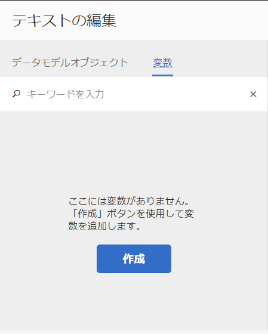

1. 「**[!UICONTROL 作成]**」をタップします。

   変数作成ペインが表示されます。

1. Enter the following information and tap **[!UICONTROL Create]**:

   * **[!UICONTROL 名前]** :変数の名前。
   * **[!UICONTROL 説明]** :必要に応じて、変数の説明を入力します。
   * **[!UICONTROL タイプ]** :変数のタイプを選択します。文字列、数値、ブール値または日付。
   * **[!UICONTROL 特定の値のみ許可]**：文字列タイプまたは数値タイプの変数の場合、このオプションを選択すると、エージェント UI のプレースホルダーの特定の値セットから、エージェントによって値が選択されます。To specify the set of values, select this option and then specify comma-separated values that are allowed in the **[!UICONTROL Values]** field.

1. 「**[!UICONTROL 作成]**」をタップします。

   作成された変数が変数ペインに表示されます。

1. To insert a variable in the text, place the cursor at the appropriate place, select the variable, and tap **[!UICONTROL Add Selected]**.

   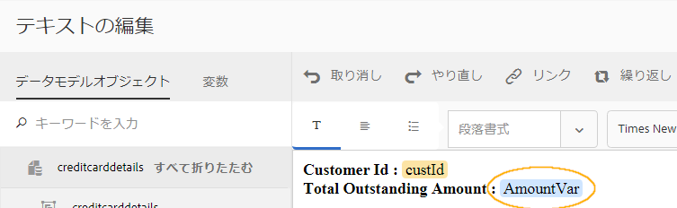

   変数が明るい青の背景色でハイライト表示され、フォームデータモデルのプロパティが茶色の背景色でハイライト表示されます。

   また、テキストエディターの@記号を使用して、変数を検索して追加することもできます。 変数を挿入する場所にカーソルを置きます。 @の後に検索文字列を入力します。 検索操作は、フォームデータモデルのすべてのプロパティと、フォームフラグメントで使用可能なドキュメントに対して実行されます。 検索文字列を含むプロパティと変数が取得され、ドロップダウンリストとして表示されます。 検索結果内を移動し、カーソル位置に挿入する変数をクリックします。 検索結果を非表示にするには、Escキーを押します。

1. 「**[!UICONTROL 保存]**」をタップします。

## テキスト内でルールを作成する {#rules}

テキスト内でルールエディターを使用して、**事前に定義された条件**&#x200B;に基づいてコンテンツやテキストの文字列の表示と非表示を切り替えるためのルールを作成することができます。事前に定義された条件は、以下のデータに基づいて設定することができます。

* 文字列
* 数値
* 数式
* 日付
* 関連するフォームデータモデルのプロパティ
* テキスト内に作成された任意の変数

### テキスト内でルールを作成する {#create-rules-in-text}

1. テキストの作成時または編集時に、ルールを使用して条件を設定するテキスト内の文字列、段落、またはコンテンツを選択します。

   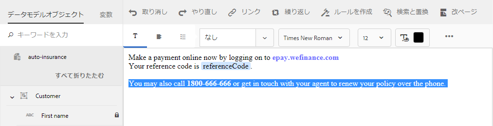

1. Tap **[!UICONTROL Create Rule]**.

   ルール作成ダイアログが表示されます。文字列、数値、数式、日付のほかに、以下のデータをルールエディターで使用して、ルールのステートメントを作成することができます。

   * 関連するフォームデータモデルのプロパティ
   * 作成済みの任意の変数
   評価するオプションを選択します。

   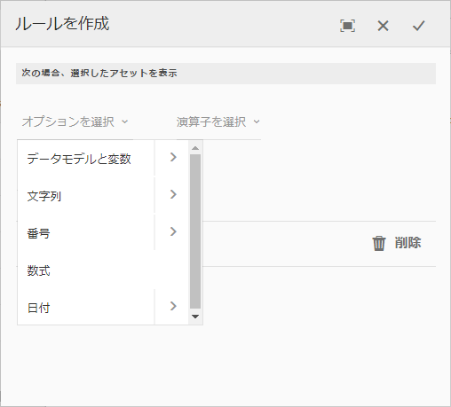 

   >[!NOTE]
   >
   >コレクションプロパティは、テキストを条件付きで表示するルールの作成に対してはサポートされていません。

1. 「次の値と等しい」、「次の値を含む」、「次の値で始まる」など、ルールを評価するための適切な演算子を選択します。

   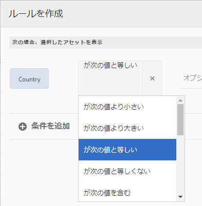

1. 評価式、値、データモデルプロパティ、または変数を挿入します。

   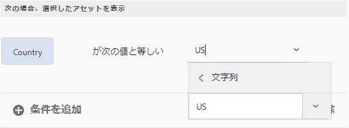

   フォームデータモデルのソースデータに基づき、受信者が米国に居住している場合に、選択されたテキストを表示するためのルール

   * While creating or editing a rule, you can also tap  (Resize) to expand the Create Rule/Edit Rule dialog. ダイアログを拡張して全画面表示にすると、フォームデータモデルのプロパティと変数をドラッグアンドドロップして、変数を作成できるようになります。「サイズ変更」を再度タップして、ルールの作成ダイアログに戻ります。
   * 1 つのルールで複数の条件を作成することもできます。
   * 既にルールが適用されているコンテンツの一部に対して、別のルールを作成して適用することもできます。

1. 「**[!UICONTROL Done]**」をタップします。

   これで、ルールが適用されました。ルールが適用されたテキストまたはコンテンツは、緑色でハイライト表示されます。ハイライト表示されているテキストやコンテンツの左側に表示されているハンドルにカーソルを置くと、適用されているルールが表示されます。

   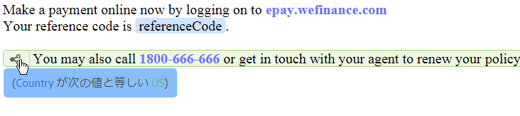

   適用されているルールの左側に表示されているハンドルをクリックすると、そのルールの編集や削除を行うためのオプションが表示されます。

## テキストの書式設定 {#formatting}

While creating or editing text, the toolbar changes depending on the type of edits you choose to make: Paragraph, Alignment, or Listing:
[ 

ツールバーのタイプの選択：段落、整列、またはリスト

](assets/toolbarselection.png)フォント編集 

フォント編集ツールバー

整列ツールバー

リストツールバー

### テキストの一部をハイライト表示または強調表示する {#highlight}

編集可能なドキュメントフラグメント内のテキストの一部をハイライト表示するには、目的のテキストを選択して「ハイライト表示の色」をタップします。

You can either directly tap a basic color `**[A]**` present in the Basic Colors palette or tap **Select** after using the slider `**[B]**` to choose the appropriate shade of the color.

Optionally, you can also go to the Advanced tab to select the appropriate Hue, Lightness, and Saturation `**[C]**` to create the precise color and then tap Select `**[D]**` to apply the color to highlight the text.

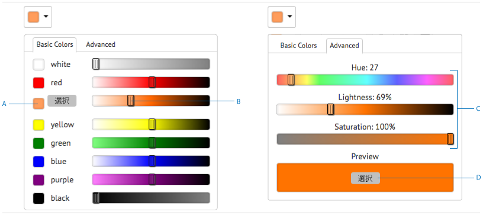

### 書式設定されたテキストの貼り付け {#paste}

別のアプリケーション（Microsoft® Word や HTML ページなど）で使用されているテキスト内の 1 つ以上の段落を再利用するには、目的のテキストをコピーしてテキストエディター内に貼り付けます。コピーされたテキストの書式設定は、テキストエディタでも保持されます。

編集可能なテキストドキュメントフラグメント内のテキストの 1 つ以上の段落をコピーして貼り付けることができます。例えば、次のような居住証明書の箇条書きリストが含まれている Microsoft® Word ドキュメントがあるとします。

この場合、Microsoft® Word ドキュメント内のテキストをコピーして、編集可能なテキストドキュメントフラグメントに直接貼り付けることができます。箇条書きリスト、フォント、テキストの色などの書式は、テキストドキュメントフラグメント内に保存されます。

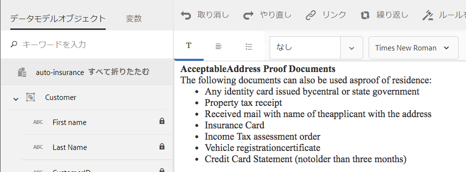

>[!NOTE]
>
>ただし、貼り付けられたテキストの書式設定にはいくつかの[制約](https://helpx.adobe.com/aem-forms/kb/cm-copy-paste-text-limitations.html)があります。

## テキスト内に特殊文字を挿入する {#special}

必要に応じて、ドキュメントフラグメントに特殊文字を挿入します。例えば、特殊文字パレットを使用して、以下の特殊文字を挿入することができます。

* 通貨記号（€、¥、£など）
* 数学記号（∑、√、∂、^など）
* やなどの句読‟記号

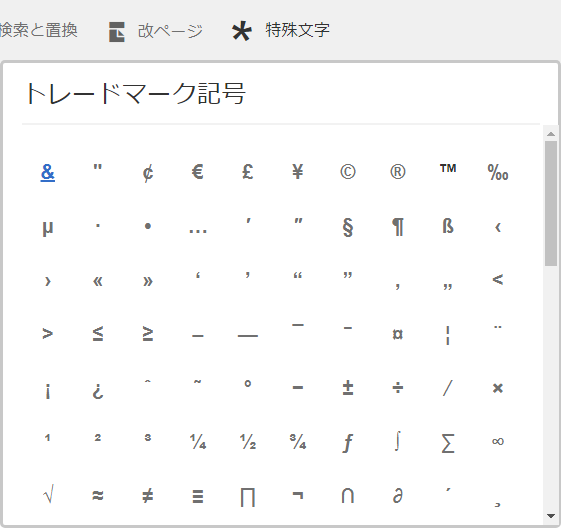

テキストエディターでは、210 個の特殊文字がサポートされます。The admin can [add support for more/custom special characters by customization](/help/forms/using/custom-special-characters.md).

## テキストの検索と置換 {#searching}

大量のテキストを含むテキストドキュメントフラグメントを使用する場合は、特定のテキスト文字列を検索する必要があります。 また、特定のテキスト文字列を別の文字列で置き換える必要がある場合もあります。

「検索と置換」機能により、テキストドキュメントフラグメント内の任意のテキスト文字列を検索して置き換えることができます。この機能には、強力な正規表現検索も含まれています。

1. Open a text document fragment for [editing](#edittext).
1. 「**[!UICONTROL 検索と置換]**」をタップします。

1. 検索するテキストを「**[!UICONTROL 検索]**」テキストボックスに入力し、そのテキストを置き換えるテキストを「**[!UICONTROL 置換]**」テキストボックスに入力して「**[!UICONTROL 置換]**」をタップします。

1. 検索テキストが見つかると、そのテキストが置換テキストに変更されます。

   * 複数の検索テキストが見つかった場合は、テキストドキュメントフラグメント内でそれらのテキストがハイライト表示されます。「**[!UICONTROL 置換]**」をもう一度タップすると、そのテキストが置換され、カーソルが次の検索テキストに移動します。
   * 検索テキストがそれ以上見つからない場合は、「モジュールの最後に達しました」というメッセージが検索と置換ダイアログに表示されます。
   「すべて置換」をタップして、見つかった検索テキストをすべてまとめて置換することもできます。

   「検索と置換」機能には、強力な正規表現検索機能が組み込まれています。To use regex in your search, select **[!UICONTROL Reg ex]** and then tap **[!UICONTROL Find]** or **[!UICONTROL Replace]**.

