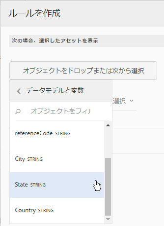

# インタラクティブ通信内のテキスト{#texts-in-interactive-communications}

## 概要 {#overview}

テキストドキュメントフラグメントは、1 つ以上のテキスト段落で構成されています。段落は静的または動的にすることができます。動的な段落には、フォームデータモデルのプロパティと変数を含めることができます。ルールを適用し、テキストドキュメントフラグメント内でそのルールを繰り返すこともできます。例えば、あいさつ文に記載する顧客の名前をフォームデータモデル（FDM）のプロパティとして指定し、実行時にその名前の値を動的に設定することができます。この値を変更すると、エージェント UI で同じインタラクティブ通信を使用して、異なる顧客に対してインタラクティブ通信を設定することができます。

インタラクティブ通信内のテキストドキュメントフラグメントでは、以下に示す動的データがサポートされています。

* **データモデルオブジェクト**：データプロパティでは、バックエンドのデータソースが使用されます。
* **ルールベースのコンテンツ**：ルールに基づいて表示と非表示が切り替わる、テキスト内の特定のコンテンツ。ルールは、フォームデータモデルのプロパティに基づいて適用することも、フォームデータモデルの変数に基づいて適用することもできます。
* **変数**：テキストドキュメントフラグメントでは、バックエンドのデータソースに変数が連結されることはありません。インタラクティブ通信を後処理用に送信する際に、エージェントが変数の値を設定または選択します（または、エージェントが変数をデータソースに連結します）。 
* **繰り返し構造**：クレジットカードの取引明細など、インタラクティブ通信を生成するたびに件数が変化する動的な情報を、インタラクティブ通信に含めることができます。繰り返し構造を使用すると、このような動的な情報の書式設定と構造化を行うことができます。詳しくは、「[インライン条件と繰り返し](https://helpx.adobe.com/jp/experience-manager/6-3/forms/using/cm-inline-condition.html)」を参照してください。

## テキストの作成 {#createtext}

1. 「**[!UICONTROL フォーム]**／**[!UICONTROL ドキュメントフラグメント]**」を選択します。
1. **[!UICONTROL 作成]**／**[!UICONTROL テキスト]**&#x200B;の順に選択します。
1. 次の情報を指定します。

   * **[!UICONTROL タイトル]**：（任意）テキストドキュメントフラグメントのタイトルを入力します。タイトルは一意である必要はなく、特殊文字や英字以外の文字を含めることもできます。タイトルを指定している場合、サムネイルやプロパティなどでは、タイトルによってテキストが参照されます。
   * **[!UICONTROL 名前]**：テキストの名前を入力します。フォルダー内の他のテキストと重複しない名前を入力する必要があります。どのような状態であっても、1 つのフォルダー内に、同じ名前を持つ 2 つのドキュメントフラグメント（テキスト、条件、リスト）を保管することはできません。「名前」フィールドでは、英数字およびハイフンのみ使用できます。「名前」フィールドは、タイトルフィールドに基づいて自動的に入力されます。「タイトル」フィールドに入力した特殊文字、スペース、および英数字以外の文字はハイフンに置き換えられます。「タイトル」フィールドの値は「名前」フィールドに自動的にコピーされますが、値を編集することもできます。

   * **[!UICONTROL 説明]**：テキストの説明を入力します。
   * **[!UICONTROL フォームデータモデル]**：（任意）フォームデータモデルに基づいてテキストを作成する場合は、「フォームデータモデル」ラジオボタンを選択します。「フォームデータモデル」ラジオボタンを選択すると、「**[!UICONTROL フォームデータモデル]**」フィールドが表示されます。フォームデータモデルを参照して選択します。インタラクティブ通信用のテキストを作成する場合は、そのインタラクティブ通信で使用するものと同じデータモデルを使用する必要があります。フォームデータモデルについて詳しくは、「[データ統合](/help/forms/using/data-integration.md)」を参照してください。

   * **[!UICONTROL タグ]**：（オプション）テキストフィールドにカスタムタグの値を入力し、Enter キーを押します。このテキストを保存すると、新しく追加されたタグが作成されます。

1. 「**[!UICONTROL 次へ]**」をタップします。

   テキストの作成ページが表示されます。フォームデータモデルのベースのテキストを作成することを選択した場合は、左側のペインにフォームデータモデルのプロパティが表示されます。

1. テキストを入力し、以下のオプションを使用して、フォームデータモデルのプロパティと変数について書式設定と条件設定を行い、それらのプロパティと変数をテキストに挿入します。

   * [フォームデータモデル](#formdatamodel)
   * [変数](#variables)
   * [ルールエディター](#rules)
   * [書式設定オプション](#formatting)

      * [書式設定されたテキストを他のアプリケーションからコピーして貼り付け](#paste)

      * [テキストの一部をハイライト表示](#highlight)
   * [繰り返し](/help/forms/using/cm-inline-condition.md)
   * [特殊文字](#special)
   * [テキストの検索と置換](#searching)
   * [ショートカットキー](/help/forms/using/keyboard-shortcuts.md)

   >[!NOTE]
   >
   >フォームデータモデル要素、データディクショナリ要素、変数は、テキストエディターで @ 記号を使って追加することができます。テキストエディターで @ を先頭にした文字列を入力すると、すべてのデータモデル要素、データディクショナリ要素、変数が検索され、検索された文字列を含む要素または変数が表示されます。検索結果をナビゲートして、要素や変数を選択することができます。一致する結果がない場合、 「*一致する結果が見つかりません*」のメッセージが表示されます。

1. 「**[!UICONTROL 保存]**」をタップします。

   これで、テキストが作成されました。このテキストを使用して、インタラクティブ通信を作成することができます。

## テキストの編集 {#edittext}

以下の手順により、既存のテキストドキュメントフラグメントを編集することができます。インタラクティブ通信エディターを使用して、テキストドキュメントフラグメントを編集することもできます。

1. **[!UICONTROL フォーム]**／**[!UICONTROL ドキュメントフラグメント]**&#x200B;を選択します。
1. テキストドキュメントフラグメントに移動して選択します。
1. 「**[!UICONTROL 編集]**」をタップします。
1. 必要な変更を行います。テキストのオプションについて詳しくは、[テキストの作成](#createtext)を参照してください。
1. 「**[!UICONTROL 保存]**」をタップしてから、「**[!UICONTROL 閉じる]**」をタップします。

## フォームデータモデルのプロパティを使用してテキストドキュメントフラグメントをカスタマイズする {#formdatamodel}

フォームデータモデルのプロパティを挿入することにより、テキストドキュメントフラグメントをカスタマイズすることができます。フォームデータモデルのプロパティをテキスト内に挿入すると、インタラクティブ通信のプレビューを表示する際に、関連するデータソースから受信者固有のデータを取得して設定できるようになります。フォームデータモデルについて詳しくは、[AEM Forms のデータ統合](/help/forms/using/data-integration.md)を参照してください。

テキストの作成時にフォームデータモデルを指定すると、そのフォームデータモデルのプロパティが、テキストエディターの左側のウィンドウに表示されます。指定されるフォームデータモデルは、テキストドキュメントフラグメントと、それが含まれているインタラクティブ通信とで、同じである必要があります。

* フォームデータモデルのプロパティをテキスト内に挿入するには、そのプロパティを挿入する位置にカーソルを置いてから、左側のウィンドウで上図の「**[A]**」プロパティをタップして選択し、「**[!UICONTROL [B] 選択項目を追加]**」をタップします。プロパティをダブルタップするだけでも、「**[C]**」のカーソルの位置に挿入できます。フォームデータモデルのプロパティが、茶色の背景色でハイライト表示されます。

また、テキストエディターで @ 記号を使用して、フォームデータモデルプロパティを検索して追加することもできます。プロパティを挿入する位置にカーソルを置きます。@ の後に検索文字列を入力します。検索操作は、ドキュメントフラグメントで使用可能なすべてのフォームデータモデルのプロパティと変数に対して実行されます。検索文字列を含むプロパティまたは変数が取得され、ドロップダウンリストとして表示されます。検索結果間を移動し、カーソル位置で挿入するプロパティをクリックします。検索結果を非表示にするには、Esc キーを押します。

* エージェント UI を使用して[インタラクティブ通信の準備と送信](/help/forms/using/prepare-send-interactive-communication.md)を行う際に、エージェントでフォームデータモデルのプロパティの値を編集できるようにするには、そのプロパティのロックアイコン（上図の「**[D]**」）をタップしてロックを解除します。デフォルト状態では、プロパティはロックされているので、エージェントはエージェント UI でプロパティを編集できません。

フォームデータモデルのプロパティを使用して、特定のコンテンツの表示と非表示を切り替えるためのルールを作成することもできます。詳しくは、「[テキスト内でルールを作成する](#rules)」を参照してください。

## テキストドキュメントフラグメント内での変数の作成と使用 {#variables}

変数とは、インタラクティブ通信の作成時に連結できるプレースホルダーのことです。変数は、フォームデータモデルのプロパティに連結することも、テキストフラグメントに連結することもできます。エージェントを使用して、変数の値を設定することもできます。

以下の場合は、フォームデータモデルのプロパティの代わりに、変数を使用することができます。

* 複数のインタラクティブ通信で同じテキストドキュメントフラグメントを使用し、異なるインタラクティブ通信に変数を連結する必要がある場合。
* 作成したテキストドキュメントフラグメントに、フォームデータモデルが含まれていない場合。変数を挿入し、インタラクティブ通信を作成する際に、その変数をフォームデータモデルのプロパティに連結することができます。
* テキストドキュメントフラグメントからテキストを取得して連結する必要がある場合。既に変数が含まれているテキストドキュメントフラグメントを別の変数に連結することはできません。

テキストドキュメントフラグメントの作成時または編集時に、変数を作成して挿入することができます。作成した変数は、エージェント UI の「データ」タブに表示されます。[エージェント UI を使用してインタラクティブ通信の準備と送信](/help/forms/using/prepare-send-interactive-communication.md)を行う際に、エージェントが変数の値を指定します。

### 変数の作成 {#createvariables}

1. 左側のウィンドウで、「**[!UICONTROL 変数]**」をタップします。

   変数ウィンドウが表示されます。

   

1. 「**[!UICONTROL 作成]**」をタップします。

   変数作成ペインが表示されます。

1. 以下の情報を入力して、「**[!UICONTROL 作成]**」をタップします。

   * **[!UICONTROL 名前]**：変数の名前。
   * **[!UICONTROL 説明]**：（オプション）変数の説明を入力します。
   * **[!UICONTROL タイプ]**：変数のタイプ（文字列、数値、ブール値、日付）を選択します。
   * **[!UICONTROL 特定の値のみ許可]**：文字列変数または数値変数の場合、エージェント UI のプレースホルダーの特定の値セットからエージェントが選択するようにできます。この値セットを指定するには、このオプションを選択してから、「**[!UICONTROL 値]**」フィールドで許可されているコンマ区切りの値を指定します。

1. 「**[!UICONTROL 作成]**」をタップします。

   変数が作成され、変数ウィンドウに表示されます。

1. テキスト内に変数を挿入するには、適切な位置にカーソルを置き、変数を選択して、「**[!UICONTROL 選択項目を追加]**」をタップします。

   

   変数が明るい青の背景色でハイライト表示され、フォームデータモデルのプロパティが茶色の背景色でハイライト表示されます。

   または、テキストエディターの @ 記号を使用して変数を検索および追加できます。変数を挿入する位置にカーソルを置きます。@ の後に検索文字列を入力します。検索操作は、ドキュメントフラグメントで使用可能なすべてのフォームデータモデルのプロパティと変数に対して実行されます。検索文字列を含むプロパティと変数が取得され、ドロップダウンリストとして表示されます。検索結果間を移動し、カーソル位置で挿入する変数をクリックします。検索結果を非表示にするには、Esc キーを押します。

1. 「**[!UICONTROL 保存]**」をタップします。

## テキスト内でルールを作成する {#rules}

テキスト内でルールエディターを使用して、**事前に定義された条件**&#x200B;に基づいてコンテンツやテキストの文字列の表示と非表示を切り替えるためのルールを作成することができます。事前に定義された条件は、以下のデータに基づいて設定することができます。

* 文字列
* 数値
* 数式
* 日付
* 関連するフォームデータモデルのプロパティ
* テキスト内に作成された任意の変数

### テキスト内でルールを作成する {#create-rules-in-text}

1. テキストの作成時または編集時に、ルールを使用して条件を設定するテキスト内の文字列、段落、またはコンテンツを選択します。

   

1. 「**[!UICONTROL ルールを作成]**」をタップします。

   ルール作成ダイアログが表示されます。文字列、数値、数式、日付のほかに、以下のデータをルールエディターで使用して、ルールのステートメントを作成することができます。

   * 関連するフォームデータモデルのプロパティ
   * 作成済みの任意の変数

   評価するオプションを選択します。

    

   >[!NOTE]
   >
   >テキストの条件設定と表示をおこなうためのルールを作成する場合、コレクションプロパティは使用できません。

1. 「次の値と等しい」、「次の値を含む」、「次の値で始まる」など、ルールを評価するための適切な演算子を選択します。

   

1. 評価式、値、データモデルプロパティ、または変数を挿入します。

   

   フォームデータモデルのソースデータに基づき、受信者が米国に居住している場合に、選択されたテキストを表示するためのルール

   * ルールの作成時または編集時に  （サイズ変更）をタップすると、ルールの作成またはルールの編集ダイアログを拡張できます。ダイアログを拡張して全画面表示にすると、フォームデータモデルのプロパティと変数をドラッグアンドドロップして、変数を作成できるようになります。サイズ変更アイコンをもう一度タップすると、通常のサイズのルール作成ダイアログに戻ります。
   * 1 つのルールで複数の条件を作成することもできます。
   * 既にルールが適用されているコンテンツの一部に対して、別のルールを作成して適用することもできます。

1. 「**[!UICONTROL 完了]**」をタップします。

   これで、ルールが適用されました。ルールが適用されたテキストまたはコンテンツは、緑色でハイライト表示されます。ハイライト表示されているテキストやコンテンツの左側に表示されているハンドルにカーソルを置くと、適用されているルールが表示されます。

   

   適用したルールの左側に表示されるハンドルをクリックすると、そのルールの編集や削除をおこなうためのオプションが表示されます。

## テキストの書式設定 {#formatting}

テキストの作成や編集を行う場合、選択する編集のタイプ（「段落」、「整列」、「リスト」）に応じて、表示されるツールバーが異なります。

ツールバーのタイプの選択：段落、整列、またはリスト

フォント編集ツールバー

整列ツールバー

リストツールバー

### テキストの一部をハイライト表示または強調表示する {#highlight}

編集可能なドキュメントフラグメント内のテキストの一部をハイライト表示するには、目的のテキストを選択して「ハイライト表示の色」をタップします。

基本色パレットに表示されている基本色 `**[A]**` を直接タップすることも、スライダー `**[B]**` を使用して「**選択**」をタップし、その色の適切な網掛けを選択することもできます。

オプションで、「詳細」タブに移動して、適切な色相、明るさ、彩度 `**[C]**` を選択して正確な色を作成し、次に「選択」`**[D]**` をタップして、テキストをハイライト表示するための色を適用することもできます。

### 書式設定されたテキストの貼り付け {#paste}

別のアプリケーション（Microsoft® Word や HTML ページなど）で使用されているテキスト内の 1 つ以上の段落を再利用するには、目的のテキストをコピーしてテキストエディター内に貼り付けます。コピーされたテキストの書式設定は、テキストエディタでも保持されます。

編集可能なテキストドキュメントフラグメント内のテキストの 1 つ以上の段落をコピーして貼り付けることができます。例えば、次のような居住証明書の箇条書きリストが含まれている Microsoft® Word ドキュメントがあるとします。

この場合、Microsoft® Word ドキュメント内のテキストをコピーして、編集可能なテキストドキュメントフラグメントに直接貼り付けることができます。箇条書きリスト、フォント、テキストの色などの書式は、テキストドキュメントフラグメント内に保存されます。

>[!NOTE]
>
>ただし、貼り付けたテキストの書式設定にはいくつかの[制約](https://helpx.adobe.com/jp/aem-forms/kb/cm-copy-paste-text-limitations.html)があります。

## テキスト内に特殊文字を挿入する {#special}

必要に応じて、ドキュメントフラグメントに特殊文字を挿入します。例えば、特殊文字パレットを使用して、以下の特殊文字を挿入することができます。

* 通貨記号（€、￥、£ など）
* 数学記号（∑、√、∂、^ など）
* 句読記号（‟、” など）

テキストエディターでは、210 個の特殊文字がサポートされます。管理者は、[カスタマイズすることで特殊文字を増やしたり、カスタムの特殊文字を追加したりする](/help/forms/using/custom-special-characters.md)ことができます。

## テキストの検索と置換 {#searching}

大量のテキストが含まれているテキストドキュメントフラグメントで作業を行う場合、特定のテキスト文字列を検索しなければならないことがあります。また、特定のテキスト文字列を別の文字列と置換する必要がある場合もあります。

「検索と置換」機能により、テキストドキュメントフラグメント内の任意のテキスト文字列を検索して置き換えることができます。この機能には、強力な正規表現検索も含まれています。

1. テキストドキュメントフラグメントを[編集](#edittext)用に開きます。
1. 「**[!UICONTROL 検索と置換]**」をタップします。

1. 検索するテキストを「**[!UICONTROL 検索]**」テキストボックスに入力し、置換後のテキストを「**[!UICONTROL 置換]**」テキストボックスに入力して「**[!UICONTROL 置換]**」をタップします。

1. 検索テキストが見つかると、そのテキストが置換テキストに変更されます。

   * 複数の検索テキストが見つかった場合は、テキストドキュメントフラグメント内でそれらのテキストがハイライト表示されます。「**[!UICONTROL 置換]**」をもう一度タップすると、そのテキストが置換され、カーソルが次の検索テキストに移動します。
   * 検索テキストがそれ以上見つからない場合は、「モジュールの最後に達しました」というメッセージが検索と置換ダイアログに表示されます。

   「すべて置換」をタップして、見つかった検索テキストをすべてまとめて置換することもできます。

   「検索と置換」機能には、強力な正規表現検索機能が組み込まれています。正規表現を使用して検索を実行するには、「**[!UICONTROL 正規表現]**」を選択して「**[!UICONTROL 検索]**」または「**[!UICONTROL 置換]**」をタップします。
