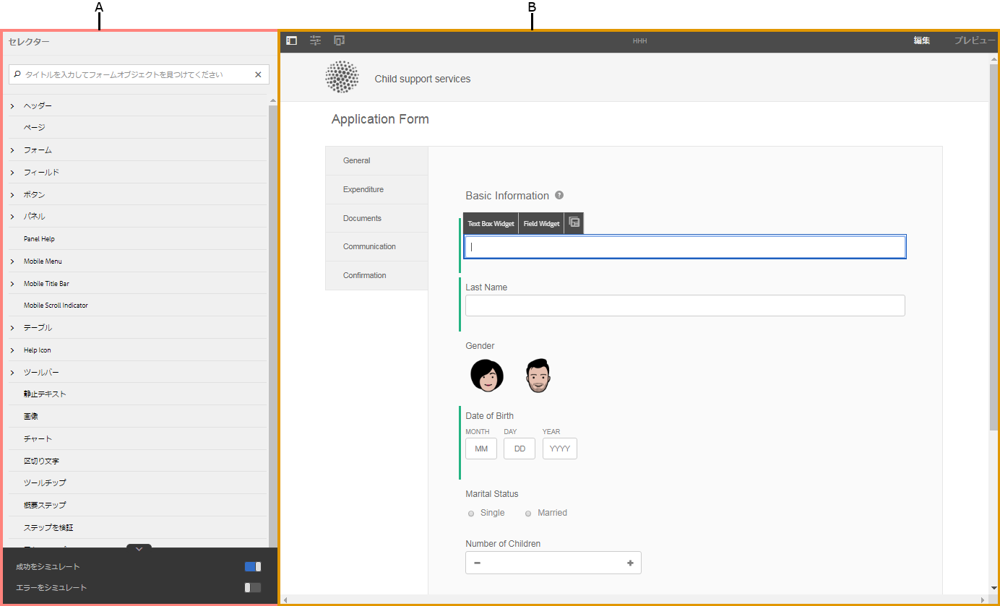
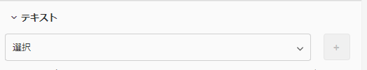
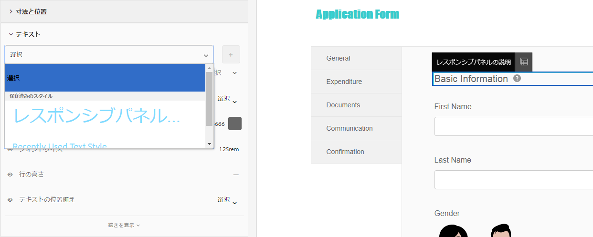
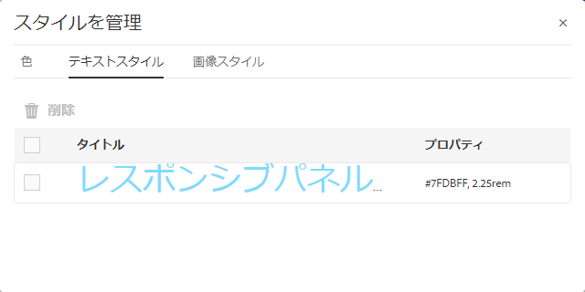
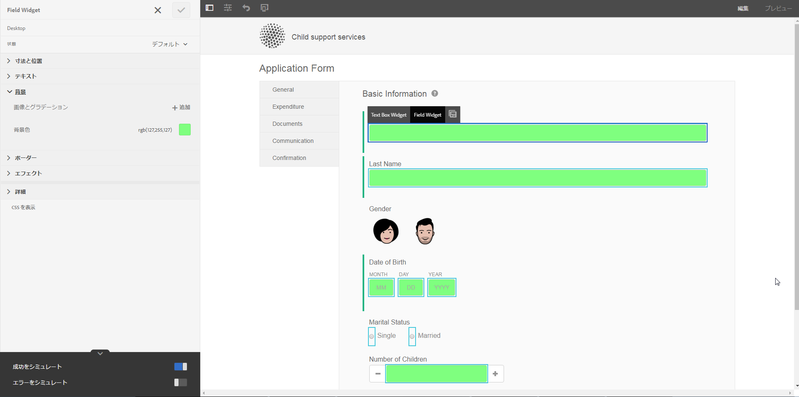
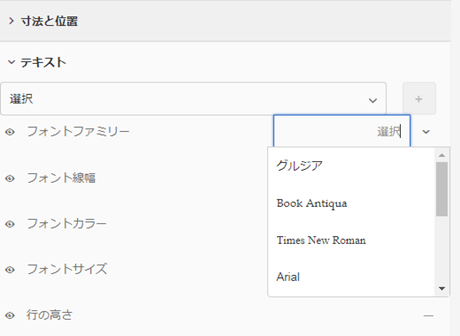
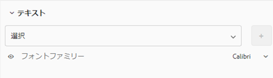
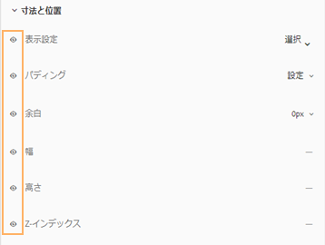
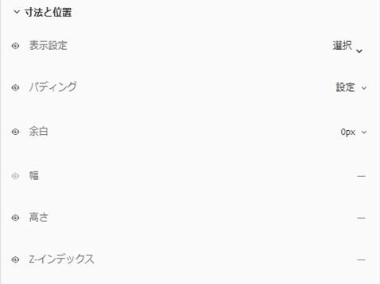

# テーマを作成して使用する {#creating-and-using-themes}

## 概要 {#introduction}

テーマを作成して適用することにより、アダプティブフォームやインタラクティブ通信のスタイルを設定して視覚的に表現することができます。テーマには、コンポーネントとパネルのスタイルを設定するための詳細情報が含まれています。スタイルには、背景色、状態色、透明度、配置、およびサイズなどのプロパティが含まれます。テーマを適用すると、指定したスタイルが対応するコンポーネントに反映されます。テーマは、独立して管理されます。アダプティブフォームやインタラクティブ通信が参照されることはありません。

以下の操作を実行できます。

* テーマを作成する
* 既存のテーマの編集とコピー
* 既存のテーマをダウンロードして AEM Forms サーバーにアップロードする
* テーマの依存関係を管理する

## テーマの作成、ダウンロード、アップロード {#creating-downloading-or-uploading-a-theme}

AEM Forms では、テーマを作成、ダウンロード、アップロードすることができます。テーマは、フォーム、ドキュメント、レターなど他のアセットと同様に作成することができます。テーマは、フォームのように独立したエンティティとして、メタプロパティとあわせて完結して保存することができます。テーマは独立したエンティティであるため、複数のアダプティブフォームとインタラクティブ通信で再利用することができます。テーマを別の AEM Forms インスタンスに移動して再利用することもできます。

### テーマの作成 {#creating-a-theme}

次の手順を実行して、テーマを作成します。

1. 「**Adobe Experience Manager**」、「**フォーム**」、「**テーマ**」の順にクリックします。

1. In the Themes page, click **Create > Theme**.
テーマを作成するためのウィザードが起動します。

1. テーマ作成ウィザードの「基本」タブで、テーマの「**タイトル**」フィールドと「**名前**」フィールドに値を指定します。これらは必須フィールドです。

1. 「詳細」タブには、次の2つのフィールドがあります。

   * **Clientlibの場所**:テーマのclientlibを格納するリポジトリ内の場所。

   * **Clientlibカテゴリ**:テーマのclientlibカテゴリ名を入力するテキストフィールド。

1. Click **Create** and then click **Edit** to open the theme in Theme Editor, or click **Done** to return to the themes page.

### テーマのダウンロード {#downloading-a-theme}

テーマを zip ファイルとして書き出し、別のプロジェクトや AEM インスタンスでそのテーマを使用することができます。テーマをダウンロードするには、次の手順を実行します。

1. 「**Adobe Experience Manager**」、「**フォーム**」、「**テーマ**」の順にクリックします。

1. テーマページでテーマを&#x200B;**選択**&#x200B;し、「**ダウンロード**」をクリックします。テーマの詳細を示すダイアログボックスが表示されます。

1. 「**ダウンロード**」をクリックします。テーマが zip ファイルとしてダウンロードされます。

>[!NOTE]
>
>カスタムテンプレートを使用して作成されたアダプティブフォームが関連付けられているテーマをダウンロードする場合は、そのカスタムテンプレートモダウンロードしてください。ダウンロードしたテーマとアダプティブフォームを AEM Forms サーバーにアップロードする場合は、関連するカスタムテンプレートもアップロードしてください。

### テーマのアップロード {#uploading-a-theme}

プロジェクトにスタイル設定がプリセットされた作成済みのテーマを使用することができます。他の人が作成したテーマのパッケージをプロジェクトにアップロードしてインポートすることができます。

テーマをアップロードするには、次の手順を行います。

1. 「**Adobe Experience Manager**」、「**フォーム**」、「**テーマ**」の順にクリックします。

1. テーマページで、**作成／ファイルのアップロード**&#x200B;をクリックします。
1. ファイルのアップロードプロンプトで、コンピュータ上のテーマパッケージを参照して選択し、「**アップロード**」をクリックします。アップロードされたテーマは、テーマページでテーマできます。

## テーマのメタデータ {#metadata-of-a-theme}

以下の表に、テーマのメタプロパティを示します。これらのプロパティは、テーマのプロパティページに表示されます。

<table>
 <tbody>
  <tr>
   <th>
<strong>ID</strong>
 
 
 </th>
   <th><strong>名前</strong></th>
   <th><strong>編集の可否</strong></th>
   <th><strong>プロパティの説明</strong></th>
  </tr>
  <tr>
   <td>1.</td>
   <td>タイトル</td>
   <td>可</td>
   <td>テーマの名前を表示します。</td>
  </tr>
  <tr>
   <td>2.</td>
   <td>説明</td>
   <td>可</td>
   <td>テーマについての説明です。</td>
  </tr>
  <tr>
   <td>3.</td>
   <td>タイプ</td>
   <td>不可</td>
   <td>
    <ul>
     <li>アセットのタイプ。</li>
     <li>この値はテーマである必要があります。</li>
    </ul> </td>
  </tr>
  <tr>
   <td>4.</td>
   <td>作成日</td>
   <td>不可</td>
   <td>テーマの作成日</td>
  </tr>
  <tr>
   <td>5.</td>
   <td>作成者名</td>
   <td>可</td>
   <td>テーマの作成者。テーマの作成時に計算されます。</td>
  </tr>
  <tr>
   <td>6.</td>
   <td>最終変更日</td>
   <td>不可</td>
   <td>テーマが最後に変更された日付。</td>
  </tr>
  <tr>
   <td>7.</td>
   <td>ステータス</td>
   <td>不可</td>
   <td>テーマの状態（変更済み／発行済み）。</td>
  </tr>
  <tr>
   <td>8.</td>
   <td>Publish On Time</td>
   <td>可</td>
   <td>テーマを自動で発行する時間。</td>
  </tr>
  <tr>
   <td>9.</td>
   <td>Publish Off Time</td>
   <td>可</td>
   <td>テーマを自動で非公開にする時間。</td>
  </tr>
  <tr>
   <td>10.</td>
   <td>タグ</td>
   <td>可</td>
   <td>検索の向上のため、識別用にテーマに付加されるラベル。</td>
  </tr>
  <tr>
   <td>11.</td>
   <td>参照</td>
   <td>リンク</td>
   <td>
    <ul>
     <li>「参照元」セクションが含まれます。 そのテーマを使用するフォームをリスト表示します。</li>
     <li>テーマが他のアセットを参照していない場合、「参照」セクションはありません。</li>
    </ul> </td>
  </tr>
  <tr>
   <td>12.</td>
   <td>Clientlib の場所</td>
   <td>可</td>
   <td>
    <ul>
     <li>このテーマに対応する clientlib が保存される、「/etc」内のユーザー定義のリポジトリのパスです。</li>
     <li>デフォルト値 - 「/etc/clientlibs/fd/themes」 + テーマのアセットの相対パス。</li>
     <li>場所が存在しない場合、フォルダー階層は自動生成されます。</li>
     <li>この値が変更されると、clientlib ノード構造は、入力された新しい場所に移動します。  注 <em><strong>意：</strong> デフォルトのclientlibの場所を変更した場合、CRXDEリポジトリ内で、新し <code>crx:replicate, rep:write, rep:glob:*, rep:itemNames:: js.txt, jcr:read </code>い場 <code>forms-users</code> 所に <code>crx:replicate</code>およ <code>jcr:read </code>びを <code>fd-service</code> 割り当て、にを割り当てます。 Also attach another ACL by adding <code>deny jcr:addChildNodes</code> for <code>forms-user</code></em></li>
    </ul> </td>
  </tr>
  <tr>
   <td>13.</td>
   <td>Clientlib カテゴリ名</td>
   <td>可</td>
   <td>
    <ul>
     <li>このテーマのユーザー定義の clientlib カテゴリ名です。</li>
     <li>名前が既に存在するテーマで使用されていると、エラーが表示されます。</li>
     <li>デフォルト値 - テーマの位置を使用して計算されます。</li>
     <li>この値が変更されると、clientlib ノードに対応してカテゴリ名が更新されます。clientlib カテゴリ名は参照で使用されるため、jsp ファイルの clientlib カテゴリ名の更新は不要です。</li>
    </ul> </td>
  </tr>
 </tbody>
</table>

## テーマエディタについて {#about-the-theme-editor}

AEM Forms にはテーマエディターが付属します。これは、ビジネスユーザーやWebデザイナー/開発者に使いやすいインターフェイスで、様々なアダプティブフォームやインタラクティブな通信要素のスタイル設定に必要な機能を簡単に提供します。 テーマを作成すると、フォーム、インタラクティブ通信、レター、ドキュメントフラグメント、データディクショナリなど、個別のエンティティとして保存されます。

テーマエディターでは、テーマでスタイル設定されたコンポーネントのスタイルをカスタマイズすることができます。デバイス上でのフォームやインタラクティブ通信の外観をカスタマイズすることができます。

テーマエディターは、2つのパネルに分かれています。

* **キャンバス** — 右側に表示されます。 キャンバスには、サンプルのアダプティブフォームまたはインタラクティブ通信が表示されます。スタイルを変更すると、その変更内容がキャンバス上で即時に反映されます。また、キャンバスから直接オブジェクトを選択して、関連するスタイルを検索し、そのスタイルを編集することができます。上部にあるデバイスの解像度のルーラーにより、キャンバスが制御されます。解像度のブレークポイントをルーラーで選択すると、各解像度について、サンプルのフォームまたはインタラクティブ通信のプレビューが表示されます。キャンバスについては、[下記](../../forms/using/themes.md#using-canvas)で説明されています。

* **サイドバー** - 左側に表示されます。以下のアイテムがあります。

   * **セレクター**：スタイル設定用に選択されたコンポーネントと、スタイルを設定するプロパティが表示されます。セレクターは、あるタイプのすべてのコンポーネントを表示します。テーマ内でテキストボックスコンポーネントを編集用に選択すると、フォームまたはインタラクティブ通信内のすべてのテキストボックスで、同じスタイルが継承されます。セレクターにより、汎用コンポーネントまたは特定コンポーネントのスタイル設定が可能になります。例えば、フィールドコンポーネントは汎用コンポーネント、テキストボックスは特定コンポーネントになります。

      **汎用コンポーネントのスタイル設定：**フィールドには、年齢などの数値ボックスフィールドや、住所などのテキストボックスフィールドを使用できます。
 1 つのフィールドのスタイルを設定すると、年齢、名前、住所などすべてのフィールドのスタイルが設定されます。

      **特定のコンポーネントのスタイル**&#x200B;設定：特定のコンポーネントは、特定のコンポーネントのオブジェクトにカテゴリします。 テーマで数値ボックスコンポーネントのスタイルを設定すると、の数値ボックスオブジェクトのみがスタイルを継承します。

        例えば、住所などのテキストボックスは長く、年齢などの数値ボックスは短くなります。数値ボックスフィールドを選択して、長さを短くし、フォームに適用します。フォームにあるすべての数値ボックスフィールドの幅が短くなります。

      すべてのフィールドコンポーネントを特定の背景色でカスタマイズすると、年齢、名前、住所などのすべてのフィールドが背景色を継承します。 年齢などの数値ボックスを選択し、幅を短くすると、年齢や家族の人数など、すべての数値ボックスの幅が短くなります。テキストボックスの幅は変更されません。

   * **州：** 特定の状態のオブジェクトのスタイルをカスタマイズできます。 例えば、デフォルト、フォーカス、無効、ホバー、エラーの状態におけるオブジェクトの見え方を指定することができます。
   * **プロパティカテゴリ**：スタイル設定プロパティには、様々なカテゴリがあります。例えば、寸法と位置、テキスト、背景、境界線、効果などです。 各カテゴリで、スタイル情報を指定します。 例えば、「背景」で、背景色と画像とグラデーションを指定できます。

   * **詳細：** カスタムCSSをオブジェクトに追加できます。このCSSは、重なりがある場合にビジュアルコントロールが定義するプロパティを上書きします。

   * **CSS を表示**：選択したコンポーネントの CSS が表示されます。
   また、サイドバーの下部に矢印が表示されます。矢印をクリックすると、「**成功をシミュレート**」と「**エラーをシミュレート」という 2 つのオプションがさらに表示されます。**&#x200B;これらのオプションは、上記のオプションとあわせて、詳細が[下記](../../forms/using/themes.md#using-rail)で説明されています。

 **A.** サイドバ **ーB.** キャンバス

### コンポーネントのスタイル設定 {#styling-components}

複数のアダプティブフォームとインタラクティブ通信で、同じテーマを使用することができます。その場合、そのテーマ内で指定したコンポーネントの書式設定がアダプティブフォームとインタラクティブ通信にインポートされます。タイトル、説明、パネル、フィールド、アイコン、テキストボックスなど、様々なコンポーネントのスタイルを設定できます。 テーマ内でウィジェットを使用して、コンポーネントのプロパティを設定することができます。CSS オーバーライドセクションでは、CSS コードを記述することができ、各種のカスタムセレクターも用意されているため、CSS や LESS に関する知識は必須ではありませんが、こうした知識があった方が望ましいです。CSS オーバーライドセクションは、サイドバーでコンポーネントを選択すると表示されます。

サイドバーの各種オプションを使用して、様々なコンポーネントを選択してスタイルを設定することができます。

サイドバーにあるコンポーネントの「編集」ボタンをクリックすることでキャンバスのコンポーネントが選択され、サイドバーのオプションを使用してコンポーネントのスタイルを設定することができます。

  テキストボックス、数値ボックス、ラジオボタン、チェックボックスのような特定のコンポーネントは、フィールドのような高レベルのコンポーネントで分類されます。例えば、ラジオボタンのスタイル設定をカスタマイズすることができます。スタイル設定のラジオボタンを設定するには、**フィールド／ウィジェット／ラジオボタン**&#x200B;を選択します。

サイドバーの「**すべてを展開**」をクリックして、前面に表示されていない分類化されたコンポーネントを表示、選択、ならびにスタイル設定をします。

### パネルレイアウトのスタイル設定 {#styling-panel-layouts-br}

AEM Forms のテーマでは、フォームと非インタラクティブ通信のパネルレイアウトで、各種要素のスタイルを設定することができます。そのまま使用できるレイアウトやカスタムのレイアウトの要素のスタイル設定がサポートされています。

そのまま使用できるパネルには以下が含まれています。

* 左側のタブ
* 上部のタブ
* アコーディオン
* レスポンシブ
* ウィザード
* モバイルレイアウト

   * ヘッダーのパネルタイトル
   * ヘッダーのパネルタイトルなし

セレクターは、レイアウトごとに異なります。テーマエディターからのカスタムのレイアウトのスタイル設定には、以下が含まれます。

* スタイル設定可能なレイアウトのコンポーネントの定義、およびこれらのコンポーネントを一意に認識する CSS セレクター
* これらのコンポーネントに適用可能な CSS プロパティの定義
* ユーザーインターフェイスからのインタラクティブなコンポーネントのスタイル設定の定義

### 画面サイズごとに異なるスタイル {#different-styles-for-different-screen-sizes-br}

デスクトップおよびモバイルのレイアウトは、わずかにまたは全面的に異なるスタイルになります。モバイルデバイスでは、タブレットと電話はコンポーネントのサイズを除き同様のレイアウトを共有します。

テーマエディターのブレークポイントを使用して、異なる画面サイズ別のスタイル設定を定義しましょう。テーマの構築を開始するベースデバイスまたは解像度を選択して、テーマの構築を開始し、その他の解像度のスタイリングが自動で生成されます。すべての解像度のスタイル設定を明示的に変更することができます。

>[!NOTE]
>
>最初に、フォームまたはインタラクティブ通信を使用してテーマが作成され、次に、各種のフォームやインタラクティブ通信にそのテーマが適用されます。テーマの作成に使用されるブレークポイントは、そのテーマが適用されるフォームやインタラクティブ通信とは異なる場合があります。CSSメディアクエリは、テーマを適用するフォームやインタラクティブな通信ではなく、テーマの作成に使用されるフォームやインタラクティブな通信に基づいています。

### プロパティのコンテキストのスタイル設定は、選択したオブジェクトのサイドバーで変更します。{#styling-properties-context-changes-in-sidebar-on-selecting-objects}

コンポーネントをキャンバスで選択すると、そのスタイル設定プロパティはサイドバーにリスト表示されます。オブジェクトタイプと状態を選択して、スタイルを設定します。

### テーマエディターで最近使用したスタイル {#recently-used-styles-in-theme-editor}

テーマエディターは、コンポーネントに適用した最大 10 個のスタイルをキャッシュします。キャッシュされたスタイルは、テーマの他のコンポーネントと共に使用できます。 最近使用したスタイルは、リストボックスとしてサイドバーで選択したコンポーネントのすぐ下にあります。最初は、最近使用したスタイル一覧は空になっています。

コンポーネントのスタイルを設定すると、そのスタイルはキャッシュされ、リストボックスに一覧表示されます。この例では、フォントサイズと色を変更するためにテキストボックスのラベルのスタイルを設定します。この手順は、コンポーネントのスタイルを設定する際に画像を選択したり色を変更したりする手順と同様です。フィールドラベルのスタイル設定が変更されると、スタイルがキャッシュされてリストボックスに一覧表示されます。

この例ではフィールドラベルのスタイルが変更されています。「レスポンシブパネル説明」でスタイルが選択されると、そのエントリがアセットライブラリ内に追加されます。アセットライブラリのエントリを使用すると、「レスポンシブパネル説明」のスタイルを変更できます。

アセットライブラリに追加されたスタイルは、別のテーマで使用することができます。また、[スタイルモード](../../forms/using/inline-style-adaptive-forms.md)になっているフォームエディターまたはインタラクティブ通信の UI で使用することもできます。同様に、フォームエディターまたはインタラクティブ通信エディターUIのスタイルモードを使用してコンポーネントのスタイルを設定する場合、スタイルはキャッシュされ、テーマで使用できます。

アセットライブラリでプラスボタン（+）を使用すれば、スタイルに名前を付けて永続的に保存できます。プラスボタン（+）を使用すれば、サイドバーにある「保存」ボタンをクリックしなくても、スタイルを保存してコンポーネントにスタイルを適用できます。スタイルモードでは、今後使用するためにプラスボタン（+）でスタイルを保存することはできません。

スタイルにカスタム名を付けると、スタイルはテーマに関連付けられて、他のテーマには使用できなくなります。保存したスタイルを削除するには、次の手順を実行します。

1. On the CANVAS toolbar, click **Theme Options**  > **Manage Styles**.
1. In the Manage Styles dialog, select a saved style, click **Delete**.

   

### ライブプレビュー、保存、変更の破棄 {#live-preview-save-and-discard-changes}

スタイル設定で行った変更内容は、キャンバス上にロードされたフォームまたはインタラクティブ通信で即時に反映されます。ライブプレビューにより、スタイル設定をインタラクティブに指定し、その影響を確認できます。コンポーネントのスタイル設定を変更すると、サイドバーの「**完了**」ボタンが有効になります。変更を保持するには、「**完了**」ボタンを使用します。

>[!NOTE]
>
>フィールドに無効な文字が入力されると、フィールドの境界線の色が赤に変わり、画面の左上隅にエラーメッセージが表示されます。例えば、数字が有効なテキストボックスにアルファベットを入力すると、入力ボックスの境界線の色が赤に変わります。このようなテーマは、上部に表示されるエラーを解決しないと保存できません。

### Theme with another adaptive form or interactive communication {#theme-with-another-adaptive-form-or-interactive-communication}

テーマを作成する場合、テーマエディターに付属するフォームが同時に作成されます。このフォームのコンポーネントにスタイルを設定します。テーマエディターに付属のフォームの代わりに、選択したフォームまたはインタラクティブな通信を選択し、スタイル設定と結果のプレビューを提供できます。

テーマエディターのキャンバス上で現在のフォームまたはインタラクティブ通信を置き換えるには、以下の手順を実行します。

1. In the THEME EDITOR panel, click **Theme Options**  > **Configure**.

1. In the General tab, browse and select a form or interactive communication for the **Adaptive Form/Document** field.

### 取り消し／やり直し {#redo-undo}

誤って発生した不要な変更を元に戻したり、やり直したりできます。 キャンバスの「やり直し/取り消し」ボタンを使用します。

キャンバスの「取り消し／やり直し」ボタン

「取り消し／やり直し」ボタンは、テーマエディターでコンポーネントのスタイルを設定すると表示されます。

## テーマエディターの使用 {#using-the-theme-editor}

テーマエディターでは、作成またはアップロードしたテーマを編集することができます。Navigate to **Forms &amp; Documents > Themes**, and select a theme and open it. テーマエディターでテーマが開きます。

上記で説明されているように、テーマエディターにはサイドバーとキャンバスの 2 つのパネルがあります。

テーマエディターのテキストボックスウィジェットの成功状態をカスタマイズします。キャンバスでコンポーネントを選択し、サイドバーで状態を選択します。サイドバーのスタイル設定を使用して、コンポーネントの外観をカスタマイズします。

### キャンバスの使用 {#using-canvas}

すぐに使用できる付属のフォームを使用してテーマを作成することも、任意のフォームやインタラクティブ通信を使用してテーマを作成することもできます。キャンバスには、テーマのカスタマイズ内容とともに、テーマの作成時に使用したフォームまたはインタラクティブ通信のプレビューが表示されます。フォームの上部にあるルーラーは、デバイスのディスプレイのサイズに合わせてレイアウトを決定するために使用されます。

キャンバスツールバーには、以下が表示されます。

* **Toggle Side Panel** :サイドバーの表示/非表示を切り替えます。
* **Theme Options** :3つのオプションを提供

   * 設定：プレビューフォームまたはインタラクティブ通信、基本のclientlib、およびtypekitの設定を選択するオプションを提供します。
   * テーマ CSS を表示：選択したテーマの CSS が生成されます。
   * スタイルを管理：テキストと画像のスタイルを管理するためのオプションが用意されています。
   * ヘルプ：テーマエディターの画像によるガイドツアーを実行します。

* **エミュレータ**:テーマの外観を様々な表示サイズでエミュレートします。 表示サイズはエミュレーターでブレークポイントとして処理されます。ブレークポイントを選択してスタイル設定することができます。例えば、デスクトップとタブレットは 2 つのブレークポイントです。ブレークポイントごとに異なるスタイルを指定できます。

コンポーネントをキャンバスで選択すると、その上部にコンポーネントツールバーが表示されます。コンポーネントツールバーにより、コンポーネントの選択や汎用コンポーネントへの切り替えを行うことができます。例えば、パネルの数値テキストボックスを選択するとします。コンポーネントツールバーに以下のオプションが表示されます。

* **数値ボックスウィジェット**：サイドバーで外観をカスタマイズするコンポーネントを選択できます。
* **フィールドウィジェット**：スタイル設定の一般的なコンポーネントを選択できます。この例では、すべてのテキスト入力コンポーネント（テキストボックス/数値ボックス/数値ステッパー/日付入力）がスタイル設定用に選択されています。

* :スタイル設定の汎用コンポーネントに切り替えることができます。 数値ボックスを選択してこのアイコンをタップすると、フィールドコンポーネントが選択されます。フィールドコンポーネントを選択してこのアイコンをタップすると、パネルが選択されます。このアイコンをタップし続けて選択すると、最終的にスタイル設定のレイアウトが選択されます。

>[!NOTE]
>
>コンポーネントのツールバーで使用できるオプションは、選択したコンポーネントにより異なります。

キャンバスの数値ボックスのコンポーネントツールバー

### サイドバーの使用 {#using-rail}

テーマエディターのサイドバーには、セレクターを使用してコンポーネントのスタイルをカスタマイズするオプションがあります。セレクターにより、コンポーネントのグループまたは個別のコンポーネントを選択し、サイドバーのセレクターを検索することができます。カスタムコンポーネントではセレクターを書き込むことができます。

キャンバスまたはサイドバーのセレクターでコンポーネントを選択する場合、サイドバーにはスタイルをカスタマイズするためのすべてのオプションが表示されます。コンポーネントを選択するとサイドバーに表示されるオプションを以下に示します。

* 都道府県
* プロパティシート
* 成功／エラーをシミュレート

#### 都道府県 {#state}

状態は、コンポーネントに対するユーザーインタラクションの指標です。例えば、ユーザーがテキストボックスに誤ったデータを入力した場合、テキストボックスの状態はエラー状態に変わります。テーマエディターにより、特定の状態に対するスタイル設定を指定できます。

状態のスタイルのカスタマイズのオプションは、コンポーネントごとに異なります。

#### プロパティシート {#property-sheet}

<table>
 <tbody>
  <tr>
   <td><strong>プロパティ</strong></td>
   <td><strong>使用方法</strong></td>
  </tr>
  <tr>
   <td>
寸法と位置
 </td>
   <td>
テーマのコンポーネントの整列、サイズ、位置、および場所のスタイルを設定します。 
 
オプションは、ディスプレイ設定、余白、マージン、幅、高さおよび Z インデックスです。
 
レイアウトモードを使用して、ドラッグ&amp;ドロップが簡単なインターフェイスを使用してコンポーネントの幅を定義することもできます。 詳しくは、レイアウトモードを使用してコ <a href="../../forms/using/resize-using-layout-mode.md">ンポーネントのサイズを変更するを参照してくださ</a>い。
 </td>
  </tr>
  <tr>
   <td>
テキスト
 </td>
   <td>
テーマのコンポーネントでテキストのスタイルをカスタマイズします。
 
たとえば、テキストボックスに入力したテキストの見え方を変更するとします。
 
オプションには、フォントファミリー、太さ、色、サイズ、行の高さ、テキストの整列、文字間隔、テキストのインデント、下線、イタリック、テキストの変形、垂直方向の整列、ベースライン、方向があります。 
 </td>
  </tr>
  <tr>
   <td>
背景 
 </td>
   <td>
コンポーネントの背景を画像または色で塗りつぶします。 
 </td>
  </tr>
  <tr>
   <td>
ボーダー
 </td>
   <td>
コンポーネントの境界線の外観を選択します。例えば、テキストボックスに深い赤色で太い境界線を点線で入れるとします。 
 
オプションは、幅、スタイル、半径、および境界線の色になります。
 </td>
  </tr>
  <tr>
   <td>
効果
 </td>
   <td>
コンポーネントに、不透明度、ブレンドモード、シャドウなど特殊効果を追加できます。 
 </td>
  </tr>
  <tr>
   <td>
アドバンス
 </td>
   <td>
以下を追加できます。

    <ul>
     <li>Properties for <code>::before</code> and <code>::after</code> pseudo elements to add content after or before default content in the selector, and style it.  <a href="https://www.w3schools.com/css/css_pseudo_elements.asp" target="_blank">CSS 疑似要素</a>を参照してください。</li>
     <li>コンポーネントにインラインで追加されており、カスタムのセレクターを書き込むカスタムの CSS コード </li>
    </ul> 
カスタムの CSS コードを追加すると、サイドバーのオプションを使用して追加したカスタマイズがオーバーライドされます。 
 </td>
  </tr>
 </tbody>
</table>

#### 成功／エラーをシミュレート {#simulate-error-success}

「成功をシミュレート」／「エラーをシミュレート」オプションはサイドバーの下部にあります。サイドバーの下部にある表示／非表示の矢印を使用すると表示されます。テーマエディターを使用して、さまざまな状態のコンポーネントのスタイルを設定できます。

例えば、フォームに数値フィールドを追加して、テーマエディターでそのスタイル設定を指定できます。ユーザーがフィールドで英数字を入力するときに、テキストボックスの背景色を変更するとします。テーマで数値フィールドを選択して、サイドバーにある状態オプションを使用します。サイドバーでエラー状態を選択し、背景色を赤に変更します。サイドバーにある「エラーをシミュレート」オプションを使用して、動作をプレビューできます。「エラーをシミュレート」／「成功をシミュレート」オプションについて、以下で詳しく説明します。

* **成功をシミュレート**： 成功状態のスタイル設定を指定した場合のコンポーネントの見え方を確認できます。たとえば、フォームで顧客がパスワードを設定します。ユーザーは、指定されたガイドラインに従いパスワードを設定します。指定されたすべてのガイドラインに従ってユーザーがパスワードを入力した場合、テキストボックスは緑色に変わります。テキストボックスが緑色に変わると、成功状態になります。成功状態のコンポーネントのスタイルを設定し、その外観を「成功をシミュレート」オプションでシミュレートすることができます。

* **エラーをシミュレート**： エラー状態のスタイル設定を指定した場合のコンポーネントの見え方を確認できます。たとえば、フォームで顧客がパスワードを設定します。ユーザーは、指定されたガイドラインに従いパスワードを設定します。指定されたガイドラインに従わずにユーザーがパスワードを入力した場合、テキストボックスは赤色に変わります。テキストボックスが赤色に変わると、エラー状態になります。エラー状態のコンポーネントのスタイルを設定し、その外観を「エラーをシミュレート」オプションでシミュレートすることができます。

### コンポーネントのスタイル設定 {#styling-a-component}

たとえば、フォームに 2 つのタイプのテキストボックスがあるとします。一方は数値のみ、もう一方は英数字の値を入力できます。数値のみを入力できるテキストボックスのスタイル設定をカスタマイズできます（数値ボックス）。

以下の手順を実行して特定コンポーネントのスタイル設定をカスタマイズできます（この例の数値ボックス）。

1. テーマエディターで、キャンバスの数値ボックスを選択します。
1. 数値ボックスを選択すると、次の3つのオプションを持つコンポーネントツールバーが表示されます。

   * **数値ボックスウィジェット**
   * **フィールドウィジェット**

1. Select **Numeric Box Widget**.
1. サイドバーのタイトルが「数値ボックスウィジェット」に変わり、外観をカスタマイズするオプションが表示されます。Use **Dimension &amp; Position** option in the sidebar to customize size of the component. Ensure that the State is **Default**.

Instead of selecting **Numeric Box Widget**, select **Field Widget** in the component toolbar, and perform the steps above. When you select dimensions for **Field Widget** option, all the text boxes except the numeric box have the same size.

### 特定の状態のフィールドのスタイル設定 {#styling-fields-given-state}

コンポーネントツールバーでは、異なる状態のコンポーネントのスタイルを設定することもできます。たとえば、コンポーネントが無効になっている場合、無効状態になります。テーマエディタでスタイルを設定できるコンポーネントの状態としてよく使用されるのは、デフォルト、フォーカス、無効、エラー、成功およびホバーです。キャンバスでコンポーネントを選択して、サイドバーの状態オプションを使用し、外観をカスタマイズすることができます。

次の手順を実行して特定の状態のコンポーネントのスタイル設定をカスタマイズします。

1. キャンバスでコンポーネントを選択し、コンポーネントツールバーから適切なオプションを選択します。サイドバーに、コンポーネントのスタイルをカスタマイズするオプションが表示されます。
1. サイドバーで、状態を選択します。例えば、エラー状態です。
1. Use options such as **Border, Background** in the sidebar to customize how the component looks.
1. Use the **Simulate Error** option at the bottom of the sidebar to see how the styling looks in editing.

状態を指定した後にコンポーネントのスタイル設定をカスタマイズする場合、カスタマイズは特定のコンポーネントにのみ現れます。たとえば、ホバー状態が選択されているときにコンポーネントのスタイル設定をカスタマイズするとします。この場合、テーマの適用先となるレンダリング後のフォームやインタラクティブ通信にポインターを置くと、コンポーネントのカスタマイズ内容が表示されます。

エラーと成功以外の状態の動作をシミュレートするには、プレビューモードを使用します。To use Preview mode, click **Preview** in the page toolbar.

### 小型画面向けレイアウトのスタイル設定 {#styling-layouts-for-smaller-displays}

キャンバスのルーラーを使用して、画面が小さいデバイスのブレークポイントを選択します。Click emulator  in Canvas to view ruler and breakpoints. ブレークポイントを使用すると、フォームやインタラクティブな通信をプレビューし、スマートフォンやタブレットなどの異なるデバイスに関する表示サイズに対応できます。 テーマエディターでは、複数の表示サイズがサポートされています。

異なるブレークポイントにスタイルを設定するには、次の手順を実行します。

1. キャンバスで、ルーラーの上にあるブレークポイントを選択します。ブレークポイントは、モバイルデバイスとその表示サイズを表します。
1. サイドバーを使用して、選択した表示サイズに合わせて、テーマ内で使用されるフォームまたはインタラクティブ通信のコンポーネントのスタイルをカスタマイズします。
1. カスタマイズ内容を保存します。

複数のデバイスで、フォームまたはインタラクティブ通信のコンポーネントのスタイルを設定することができます。デスクトップデバイスとモバイルデバイスでは、フォームコンポーネントとインタラクティブ通信コンポーネントのスタイルがまったく異なる場合があります。

### テーマ内で Web フォントを使用する {#using-web-fonts-in-a-theme}

これまでに行った手順により、Web サービスで使用できるフォントを、アダプティブフォームとインタラクティブ通信でも使用できるようになりました。Adobe の Web フォントサービスである [Typekit](https://typekit.com/) は、設定サービスとしてすぐに使用することができます。To use Typekit, create a kit, and fonts in it, and obtain the Kit ID from [Typekit website](https://typekit.com/).

次の手順を実行して、AEM で Typekit を設定します。

1. In the author instance, click Adobe Experience Manager > Tools  > Deployment > Cloud Services.
1. On the **Cloud Services** page, navigate to **Third Party Services** > **Typekit** , and click **Configure Now** under Typekit. If a configuration is already available, click the **+** button to create a new instance.
1. **設定を作成**&#x200B;ダイアログで、新しい設定のタイトルと名前を指定し、「**作成**」をクリックします。

   設定ページにリダイレクトされます、

1. コンポーネントを編集ダイアログが表示されるので、キット ID を入力して「**OK**」をクリックします。

TypeKit 設定を使用するようにテーマを設定するには、次の手順を実行します。

1. オーサーインスタンスで、テーマエディターにあるテーマを開きます。
1. In the theme editor, navigate to **Theme Options**  > **Configure**.
1. 「**Typekit 設定**」フィールドで、キットを選択して「**保存**」をクリックします。

   これで、テーマのフォントファミリーのプロパティにフォントが追加されたことが分かります。

### テーマエディターでのフォントの一覧表示と選択 {#listing-and-selecting-fonts-in-theme-editor}

テーマ設定サービスを使用して、テーマエディターにフォントを追加できます。次の手順を実行して、フォントを追加します。

1. 管理者権限を使用して AEM Web コンソールにログインします。URL for the AEM Web Console is `https://'[server]:[port]'/system/console/configMgr`.
1. Open **Adaptive Form Theme Configuration Service**.

   

1. 「+」をクリックし、フォントの名前を指定して「**保存**」をクリックします。フォントが追加され、テーマエディターで使用可能になります。

#### テーマエディターでのフォントの選択 {#selecting-fonts-in-theme-editor}

「+」ボタンを使用して、フォントを追加できます。フォントを追加すると、サイドバーに一覧表示されます。

テーマ設定オプション以外に、テーマエディター自体からもフォントを追加できます。サイドバーの下にある「フォントファミリー」フィールドに使用するフォントを入力し、キーボードの Return キーを押します。

フォントを選択すると、フォントファミリーリストに追加されます。テーマエディターの「マスク」オプションを使用して、一覧表示されたフォントを無効または有効にすることができます。

コンポーネントのフォントが変更されたことを確認できます。

「フォントファミリー」フィールドは複数のフォントをサポートしています。フォントを入力したら、ブラウザーでこれを見つけ、選択したコンポーネントに適用します。ブラウザーでフォントが見つからない場合、フォントファミリーで隣にあるフォントを探します。探している特定のフォントを入力して開始できます。使用するフォントが見つからない場合は、フォントファミリーに一般的なフォントを入力して使用することができます。

#### テーマエディター内で適用されているスタイルをマスクする {#mask-styles-applied-in-theme-editor}

テーマ内で適用されているスタイルをマスクできるようになりました。In the theme editor sidebar, you can use the icon to disable an applied style. 例えば、フォームまたはインタラクティブ通信内のコンポーネントのサイズを変更した場合、プロパティの左側に表示されているマスクボタンを使用して、そのプロパティを無効にすることができます。テーマを保存すると、選択した「マスク」オプションが保持されます。

以下の例では、テーマ内でマスクされたスタイルとマスクされていないスタイルを示しています。

## Applying a theme to a form or interactive communication {#applying-a-theme-to-a-form-or-interactive-communication-br}

テーマをアダプティブフォームに適用するには、次の手順を実行します。

1. フォームを編集モードで開きます。フォームを編集モードで開くには、目的のフォームを選択して「**開く**」をクリックします。
1. In the edit mode, select a component, then click  > **Adaptive Form Container**, and then click .

   サイドバーのフォームのプロパティを編集することができます。

1. サイドバーで、「**スタイル設定**」をクリックします。
1. Select your theme from the **Adaptive Form Theme** drop-down and click **Done** .

インタラクティブな通信にテーマを適用するには：

1. インタラクティブ通信を編集モードで開きます。インタラクティブ通信を編集モードで開くには、目的のインタラクティブ通信を選択して「**開く**」をクリックします。
1. In the edit mode, select a component, then click  >**Document Container**, and then click .

   サイドバーのフォームのプロパティを編集することができます。

1. In the sidebar, under **Basic**, select your theme from the **Theme** drop-down and click **Done** 

### 実行時にフォームのテーマを変更する {#change-theme-of-a-form-at-runtime}

テーマにより、フォーム内の異なるコンポーネントのスタイルが設定されます。`themeOverride` プロパティを使用して、フォームのテーマを動的に変更することができます。フォームの一般的なURLは次のとおりです。

`https://<server>:<port>/content/forms/af/test.html`

themeOverride パラメーターを使用して、実行時にテーマを適用できます。

`https://<server>:<port>/content/forms/af/test.html?themeOverride=/content/dam/formsanddocuments-themes/simpleEnrollmentTheme`

「`themeOverride`」オプションを使用して、テーマにパスを提供できます。フォームのテーマを変更し、更新されたスタイルでフォームを更新します。

## Getting specific appearance using Themes {#specific-af-appearance}

AEM Forms には、すぐに使用できるデフォルトのキャンバステーマのほかに、様々なテーマが用意されています。別のテーマを使用してフォームやインタラクティブ通信を設計し、その設計内容を変更する場合は、テーマライブラリフォルダーからテーマをコピーします。コピーしたテーマを Theme Library フォルダーの外部に貼り付け、コピーしたテーマを必要な変更に応じて編集します。

テーマをコピーするには、以下の手順を実行します。

1. In authoring instance, navigate to **Adobe Experience Manager > Forms > Themes**.
1. Theme Library フォルダーを開きます。
1. Theme Library フォルダーで、対応するすぐに使用可能なテーマにポインターを置いて、「**コピー**」をタップします。
1. コピーしたテーマを Theme Library フォルダーの外部に貼り付けます。
1. コピーしたテーマをカスタマイズします。

テーマのカスタマイズが完了したら、そのカスタマイズ内容をフォームまたはインタラクティブ通信に適用します。

>[!NOTE]
>
>Theme Library フォルダーにあるテーマに変更を加えないでください。このフォルダーにはシステムテーマが含まれています。これらのテーマに加えた変更は、AEM Forms の新しいバージョンまたはホットフィックスのインストール時にすべて上書きされます。

## 他のアダプティブフォームの使用例への影響 {#impact-on-other-adaptive-form-use-cases}

* **フォームの発行/非公開：** フォームの発行時に、適用されたテーマも発行されます（まだ発行されていない場合）
* **フォームの読み込み/書き出し：** フォームの読み込みまたは書き出し時に、関連するテーマも自動的に読み込まれるか、書き出されます。
* **フォームの参照：** フォーム参照の「参照」セクションには、テーマの追加のエントリが含まれています。
* **フォームの最終変更時刻：** 関連するテーマが変更されると更新されます。
* **A/Bテスト：** A/Bテストでは、2つのバージョンのフォームに異なるテーマを適用できます。 2つのガイドテーマの情報は、2つのガイドコンテナに個別に格納される。

## CSS 生成シーケンス {#css-generation-sequence}

「CSS を表示」を選択すると、テーマエディターがすべてのスタイル設定情報を収集して CSS を構築します。情報は次の順序で収集されます。

1. テーマの基本クライアントライブラリで定義したスタイル設定。
1. サイドバーのプロパティを使用して指定したユーザー定義のスタイル設定。
1. 「CSS 上書き」オプションを使用して指定された CSS スタイル。

例えば、基本クライアントライブラリのテキストボックスの背景色は青になります。サイドバーのプロパティを使用すると、ピンクに変更することができます。CSS を生成する際、テキストボックスの背景色はピンクになります。プロパティを使用して背景色を変更した後、別のユーザーは「CSS 上書き」オプションを使用してテキストボックスの背景色を白に変更できます。CSS を生成すると、生成された CSS の背景色が白になります。

## スタイルのデバッグ {#debugging-styles}

テーマエディターでコンポーネントのスタイルを指定する場合、CSS が生成されます。汎用コンポーネントをスタイル設定する場合、これに含まれる複数のコンポーネントもスタイル設定されます。例えば、1 つのフィールドにスタイルを設定すると、そこに含まれるテキストボックスとラベルのスタイルも設定されます。フィールド内のテキストボックスのスタイルを設定すると、それの CSS が設定されます。フィールドとコンポーネント用に生成された CSS をデバッグする場合は、テーマエディターに CSS を表示するオプションがあります。

生成された CSS は次のオプションを使用して表示できます。

* サイドバーの「**CSS を表示**」オプション：テーマでコンポーネントを選択すると、サイドバーに「CSS を表示」オプションが表示されます。It shows the generated CSS, including CSS for `::before` and `::after` pseudo elements.
* **表示ツールバーの** 「キャンバステーマCSS」オプション：キャンバスツールバーで、  / **表示テーマCSSをクリックします**。 テーマエディターで定義したプロパティから生成されたテーマCSS全体を表示できます。

## トラブルシューティング、推奨事項、ベストプラクティス {#troubleshooting-recommendations-and-best-practices}

* **別のテーマのアセットの回避**

   テーマを編集する際、他のテーマからアセット（画像など）を参照して追加できます。テーマ 例えば、ページの背景を編集しているとします。For example, when you select **Page** > **Background** > **Add** > **Image**, you see a dialog that lets you browse and add images in other theme.

* アセットを別のテーマから追加し、そのテーマが移動または削除されると、現在のテーマに問題が生じる場合があります。他のテーマからアセットを参照して追加しないようにすることをお勧めします。
* **基本クライアントライブラリ、テーマエディター、インラインスタイル設定の使用**

   * **基本clientlib**:

      基本クライアントライブラリにスタイル情報が含まれています。 テーマ内のクライアント側ライブラリでスタイル設定情報を使用するには、次の手順を実行します。

      1. **Experience Manager/フォーム/テーマ**。
      1. テーマページで、テーマを選択し、「**プロパティの表示**」をクリックします。
      1. プロパティページが開くので、「**詳細**」をクリックします。
      1. 「詳細」タブの「Clientlib の場所」フィールドで、使用するクライアントライブラリを参照して選択します。
      1. 「**保存**」をクリックします。
      クライアントライブラリで指定したスタイル設定が、それを使用するテーマにインポートされます。例えば、クライアントライブラリでテキストボックス、数値ボックス、切り替えのスタイル設定を指定するとします。クライアントライブラリをテーマにインポートすると、テキストボックス、数値ボックス、切り替えのスタイル設定がインポートされます。その後で、テーマエディターを使用して他のコンポーネントのスタイルを設定できます。また、テーマを作成し、そのコピーを作成し、コピーしたテーマで提供されるスタイル設定を変更して、類似の用途に使用することもできます。
詳しくは、「[テーマを使用して外観を設定する](#specific-af-appearance)」を参照してください。

   * **テーマエディター:**

      テーマエディターを使用すると、フォームやインタラクティブテーマのスタイルを設定するためのテーマを作成できます。 1 つのテーマ内で各コンポーネントのスタイルを設定すると、作成する複数のフォームやインタラクティブ通信で、外観と操作性を統一することができます。テーマでスタイル情報を指定し、フォームにテーマを適用することをお勧めします。

   * **インラインスタイル：**

      フォームを使用する場合は、フォームまたはインタラクティブ通信マルチチャネルエディターでスタイルモードを使用して、コンポーネントのスタイルを設定できます。 スタイルモードを使用してフォームコンポーネントのスタイル設定を変更すると、テーマで指定したスタイル設定は上書きされます。特定のフォームの特定のコンポーネントのスタイル設定を変更する方法については、「[コンポーネントのインラインスタイル設定](../../forms/using/inline-style-adaptive-forms.md)」を参照してください。

* **クライアント側ライブラリの使用**

   If you want to create client libraries to import styling information, see [Using Client Side Libraries](/help/sites-developing/clientlibs.md). クライアントライブラリを作成した後、上記の手順を使用して、テーマに読み込むことができます。

* **コンテナパネルレイアウトの幅の変更**

   コンテナパネルのレイアウト幅の変更はお勧めしません。 コンテナパネルの幅を指定すると、幅が静的になり、さまざまなディスプレイに合わせて調整されません。

* **ヘッダーとフッターの操作にフォームエディターまたはテーマエディターを使用する場合**

   フォントスタイル、背景、透明度などのスタイル設定オプションを使用してヘッダーとフッターのスタイルを設定する場合は、テーマエディターを使用します。
ロゴ会社、ヘッダーの画像名、フッターの著作権情報などの情報を指定する場合は、フォームエディターのオプションを使用します。
