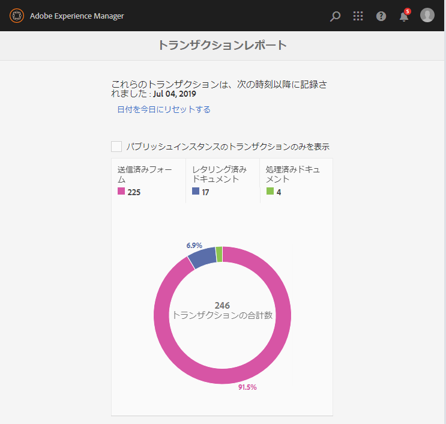
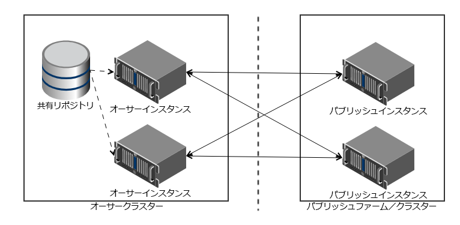

# トランザクションレポートの概要{#transaction-reports-overview}

## 概要 {#introduction}

AEM Formsのトランザクションレポートを使用すると、AEM Forms導入の指定日以降に行われたすべてのトランザクションをカウントできます。 目的は、製品の使用に関する情報を提供し、ビジネスの関係者がデジタル処理量を把握できるよう支援することです。 トランザクションの例を次に示します。

* アダプティブフォーム、HTML5フォーム、またはフォームセットの送信
* インタラクティブな通信の印刷またはWeb版のレンディション
* あるファイル形式から別のファイル形式へのドキュメントの変換

トランザクションと見なされる情報について詳しくは、 [請求可能なAPIを参照してください](../../forms/using/transaction-reports-billable-apis.md)。

トランザクションの記録は、デフォルトで無効になっています。 AEM Webコンソールからトランザクションの記録を [有効にすることができます](../../forms/using/viewing-and-understanding-transaction-reports.md#setting-up-transaction-reports) 。 作成者、処理または発行インスタンスに関する表示トランザクションレポートを作成できます。 すべてのトランザクションの集計合計に対する作成者または処理インスタンスに関する表示トランザクションレポート。 表示トランザクションは、レポートの実行元の発行インスタンスでのみ発生したすべてのトランザクションの数を、発行インスタンスに関するレポートとして表示します。

同じAEMインスタンスでコンテンツ(アダプティブフォームの作成、インタラクティブ通信、テーマ、その他のオーサリングアクティビティ)やプロセスドキュメント(ワークフロー、ドキュメントサービス、その他の処理アクティビティの使用)を作成しない。 コンテンツの作成に使用するAEM Formsサーバーで、トランザクションの記録を無効にしておく。 ドキュメントの処理に使用するAEM Formsサーバーで、トランザクションの記録を有効にしたままにします。

トランザクションは、指定された期間（フラッシュ・バッファ時間+逆複製時間）、バッファに残ります。 デフォルトでは、トランザクション数がトランザクションレポートに反映されるまでに約90秒かかります。

PDFフォームの送信、エージェントUIを使用した対話型通信のプレビュー、または非標準のフォーム送信方法を使用したアクションは、トランザクションとして考慮されません。 AEM Formsは、このようなトランザクションを記録するAPIを提供しています。 カスタム実装からAPIを呼び出して、トランザクションを記録します。

## サポートされるトポロジ {#supported-topology}

トランザクションレポートは、OSGi環境のAEM Formsでのみ使用できます。 オーサリングパブリッシュ、オーサリング処理パブリッシュ、および処理トポロジーのみをサポートします。 For example topologies, see [Architecture and deployment topologies for AEM Forms](../../forms/using/transaction-reports-overview.md).

トランザクション数は、発行インスタンスからオーサーインスタンスまたは処理インスタンスに逆複製されます。 参考となる作成者発行トポロジは次のとおりです。

>[!NOTE]
>
>AEM Formsトランザクションレポートは、パブリッシュインスタンスのみを含むトポロジをサポートしていません。

### トランザクションレポートの使用に関するガイドライン {#guidelines-for-using-transaction-reports}

* 作成者インスタンスのレポートに作成者アクティビティ中に登録されたトランザクションが含まれるので、すべての作成者インスタンスのトランザクションレポートを無効にします。
* 作成者インスタンスの「発行からのトランザクションのみを **表示** 」オプションを有効にして、すべての発行インスタンスの累積トランザクションを表示します。 また、特定の発行インスタンスに対してのみ、実際のトランザクションに関する各発行インスタンスの表示トランザクションレポートを作成することもできます。
* ワークフローおよびプロセスドキュメントの実行には、作成者インスタンスを使用しないでください。
* トランザクションレポートを使用する前に、パブリッシュサーバーとトポロジーがある場合は、すべてのパブリッシュインスタンスで逆複製が有効になっていることを確認してください。
* トランザクションデータは、発行インスタンスから対応する作成者または処理インスタンスにのみ逆複製されます。 作成者インスタンスまたは処理インスタンスは、他のインスタンスにデータをそれ以上複製できません。 例えば、作成者処理 — 発行トポロジーがある場合、集計されたトランザクションデータは処理インスタンスにのみ複製されます。

## 関連記事 {#related-articles}

* [取引レポートの表示と理解](../../forms/using/viewing-and-understanding-transaction-reports.md)
* [トランザクションレポート請求可能API](../../forms/using/transaction-reports-billable-apis.md)
* [カスタム実装用のトランザクションの記録](/help/forms/using/record-transaction-custom-implementation.md)

