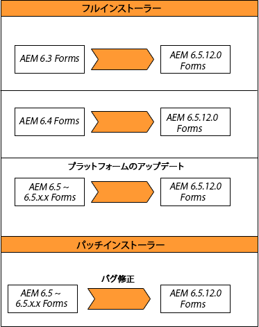

# JEE 上の AEM 6.5 Forms へのアップグレード {#upgrade-to-aem-forms-jee}

AEM 6.5.18.0 Forms on JEE には、完全なインストーラーとパッチインストーラーの 2 種類のインストーラーが用意されています。

**完全インストーラー**: [JEE 上のAEM 6.5.18.0フルインストーラー](https://experienceleague.adobe.com/docs/experience-manager-release-information/aem-release-updates/forms-updates/aem-forms-releases.html?lang=ja) 新しいAEM Formsインスタンスを設定するか、JEE 上のAEM 6.5.x.x Formsから JEE 上のAEM 6.5.18.0 Formsへのアップグレードを実行する場合。

**パッチインストーラー**：[JEE 上の AEM 6.5.18.0 パッチインストーラー](https://experienceleague.adobe.com/docs/experience-manager-release-information/aem-release-updates/forms-updates/aem-forms-releases.html?lang=ja)は、既に AEM 6.5.x.x バージョンを使用しているユーザ―向けです。パッチインストーラーを使用して、AEM Forms の最新バージョンにアップグレードできます。

次の表は、フルインストーラーとパッチインストーラーを使用する際のシナリオを示しています。

JEE 上の既存のAEM Forms 6.5.x.x をAEM 6.5.18.0 JEE 上のFormsにアップグレードするには、次の手順を実行します。

1. [ソフトウェア配布](https://experience.adobe.com/#/downloads/content/software-distribution/en/aem.html)から JEE 上の AEM 6.5 Forms インストーラーをダウンロードします。インストーラーを使用するには、有効なメンテナンス＆サポート契約が必要です。
1. [アップグレードのチェックリストと計画](https://www.adobe.com/go/learn_aemforms_upgrade_checklist_65_jp)で、アップグレードを正しく実行するためのチェック項目を確認します。
1. [AEM Forms へのアップグレードの準備](https://www.adobe.com/go/learn_aemforms_prepareupgrade_65_jp)で、サーバーのダウンタイムを最小限に抑えながらアップグレードを正しく行うためのタスクを確認し、これらのタスクを実行します。
1. 現在の環境とアプリケーションサーバーに応じて、以下に示すいずれかのドキュメントに記載されている手順を実行します。

   * [AEM 6.3 Forms または AEM 6.4 Forms から AEM 6.5 Forms へのアップグレード（JBoss 版）](https://www.adobe.com/go/learn_aemforms_upgradeJBoss_65_jp)
   * [AEM 6.3 Forms または AEM 6.4 Forms から AEM 6.5 Forms へのアップグレード（WebSphere 版）](https://www.adobe.com/go/learn_aemforms_upgradeWebSphere_65_jp)
   * [AEM 6.3 Forms または AEM 6.4 Forms から AEM 6.5 Forms へのアップグレード（JBoss Turnkey 版）](https://www.adobe.com/go/learn_aemforms_upgradeTurnkey_65_jp)

LiveCycle ES2、LiveCycle ES3、AEM 6.0 Forms、AEM 6.1 Forms、AEM 6.2 Forms を AEM 6.5 Forms に直接アップグレードすることはできません。LiveCycle または AEM Forms のバージョンを 1 つ以上中間アップグレードした後に、AEM 6.5 Forms にアップグレードできます。中間バージョンのリストと対応するアップグレード手順について詳しくは、「[アップグレードパスを選択する](upgrade.md)」を参照してください。
