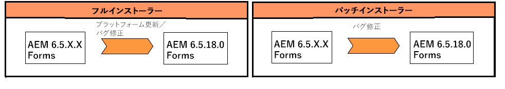

# JEE 上の AEM 6.5 Forms へのアップグレード {#upgrade-to-aem-forms-jee}

AEM 6.5.12.0 Forms on JEE には、次の 2 種類のインストーラーが用意されています。完全なインストーラーとパッチインストーラー。

**完全インストーラ**:以下を使用して、 [JEE 上のAEM 6.5.12.0フルインストーラー](https://experienceleague.adobe.com/docs/experience-manager-release-information/aem-release-updates/forms-updates/aem-forms-releases.html?lang=ja) 新しいAEM Formsインスタンスを設定したり、JEE 上のAEM 6.3 Forms、JEE 上のAEM 6.4、および JEE 上のAEM 6.5.x.x Formsから JEE 上のAEM 6.5.12.0 Formsへのアウトオブプレースアップグレードを実行したりする場合。

**パッチインストーラー**: [JEE 上のAEM 6.5.12.0パッチインストーラー](https://experienceleague.adobe.com/docs/experience-manager-release-information/aem-release-updates/forms-updates/aem-forms-releases.html) は、既にAEM 6.5.x.x バージョンを使用しているお客様向けです。 パッチインストーラーを使用して、AEM Formsの最新バージョンにアップグレードできます。

次の表は、フルインストーラーとパッチインストーラーを使用する際のシナリオを示しています。

既存の JEE 上のAEM 6.3 Formsまたは JEE 上のAEM 6.4 Formsを JEE 上のAEM 6.5.12.0 Formsにアップグレードするには、次の手順を実行します。

1. JEE 上のAEM 6.5 Formsインストーラーをからダウンロードします。 [ソフトウェア配布](https://experience.adobe.com/#/downloads/content/software-distribution/en/aem.html). インストーラーを使用するには、有効なメンテナンス&amp;サポート契約が必要です。
1. [アップグレードのチェックリストと計画](https://www.adobe.com/go/learn_aemforms_upgrade_checklist_65_jp)で、アップグレードを正しく実行するためのチェック項目を確認します。
1. [AEM Forms へのアップグレードの準備](https://www.adobe.com/go/learn_aemforms_prepareupgrade_65_jp)で、サーバーのダウンタイムを最小限に抑えながらアップグレードを正しく行うためのタスクを確認し、これらのタスクを実行します。
1. 現在の環境とアプリケーションサーバーに応じて、以下に示すいずれかのドキュメントに記載されている手順を実行します。

   * [AEM 6.3 Forms または AEM 6.4 Forms から AEM 6.5 Forms へのアップグレード（JBoss 版）](http://www.adobe.com/go/learn_aemforms_upgradeJBoss_65_jp)
   * [AEM 6.3 Forms または AEM 6.4 Forms から AEM 6.5 Forms へのアップグレード（WebSphere 版）](http://www.adobe.com/go/learn_aemforms_upgradeWebSphere_65_jp)
   * [AEM 6.3 Forms または AEM 6.4 Forms から AEM 6.5 Forms へのアップグレード（JBoss Turnkey 版）](http://www.adobe.com/go/learn_aemforms_upgradeTurnkey_65_jp)

LiveCycle ES2、LiveCycle ES3、AEM 6.0 Forms、AEM 6.1 Forms、AEM 6.2 Forms を AEM 6.5 Forms に直接アップグレードすることはできません。1 つ以上のバージョンのLiveCycleまたはAEM Formsに対して中間アップグレードを実行し、AEM 6.5 Formsにアップグレードできます。 中間バージョンのリストと対応するアップグレード手順について詳しくは、「[アップグレードパスを選択する](upgrade.md)」を参照してください。
