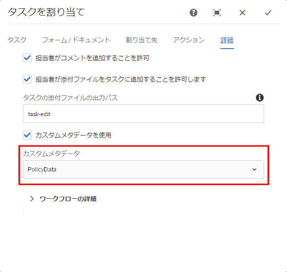

# 電子メール通知におけるメタデータの使用 {#use-metadata-in-an-email-notification}

ユーザーまたはグループにタスクを作成して割り当てるには、タスクの割り当て手順を使用します。ユーザーまたはグループにタスクが割り当てられると、電子メール通知が指定されたユーザーまたは指定されたグループのメンバーに送信されます。一般的な[電子メール通知](../../forms/using/use-custom-email-template-assign-task-step.md)には、割り当てられたタスクのリンクと、タスクに関連する情報が含まれています。

電子メールテンプレートのメタデータを使用して、電子メール通知の情報を動的に入力できます。例えば、以下の電子メール通知のタイトル、説明、期限、優先度、最終日の値は、実行時（電子メール通知が生成されるとき）に動的に選択されます。


メタデータは、キーと値のペアで保存されます。電子メールテンプレートでキーを指定すると、そのキーが実行される際（電子メール通知が生成されるとき）、値に置き換えられます。たとえば、下記のコードサンプルでは、「$ {workitem_title}」がキーになります。これは、実行時には「Loan-Request」の値で置き換えられます。

```xml
subject=Task Assigned - ${workitem_title}

message=<html><body>\n\
 <table style="width: 480px; font-family: Helvetica, Arial, sans-serif; border: 0; padding: 0; vertical-align: top; text-align: left; word-wrap: break-word; margin: 16px auto; color:#323232; background-color:#FFFCF9; border-collapse: collapse;">\n\
  <tbody>\n\
   <tr>\n\
    <td style="height: 100px; width: 480px; background-color: #FFE0CB; border-top: 5pt solid black; font-family: Helvetica, Arial, sans-serif; font-weight: bold; font-size: 15px; line-height: 20px; padding: 12px; color: #707070;">\n\
      Sample Company\n\
    </td>\n\
   </tr>\n\
   <tr>\n\
    <td style="font-family: Helvetica, Arial, sans-serif; height: auto; background-color: #FFFCF9; padding: 32px 16px 20px 16px; ">\n\
     <pre style="font-size: 13px; font-family: Helvetica, Arial, sans-serif;  font-weight: normal; color: #323232;"> Hello ${workitem_assignee},\n\
 The following task has been assigned to you:</pre>\n\
    </td>\n\
   </tr>\n\
   <tr>\n\
    <td style="width: 480px;">\n\
     <table style="height: auto; width: 480px; background-color:#FFFBF9; font-family: Helvetica, Arial, sans-serif; border-collapse: collapse;">\n\
      <tbody>\n\
       <tr style="border-bottom: solid 2px #FFFCF9;">\n\
        <td style="font-family: Helvetica, Arial, sans-serif; width: auto; height: auto; background-color:#FFF5EF; font-weight: bold; font-size: 11px; line-height: 20px; padding: 12px; color: #707070;"> TITLE</td>\n\
        <td style="font-family: Helvetica, Arial, sans-serif; background-color:#FFF5EF; text-align: left; vertical-align: middle; height: auto; font-weight: normal; font-size: 13px; line-height: 20px; padding: 10px 16px 10px 32px; color: #323232;">\n\
         <p>${workitem_title}</p>\n\
        </td>\n\
       </tr>\n\
                            <tr style="border-bottom: solid 2px #FFFCF9;">\n\
        <td style="font-family: Helvetica, Arial, sans-serif; width: auto; height: auto; background-color:#FFF5EF; font-weight: bold; font-size: 11px; line-height: 20px; padding: 12px; color: #707070;"> DESCRIPTION</td>\n\
        <td style="font-family: Helvetica, Arial, sans-serif; background-color:#FFF5EF; text-align: left; vertical-align: middle; height: auto; font-weight: normal; font-size: 13px; line-height: 20px; padding: 10px 16px 10px 32px; color: #323232;">\n\
         <p>${workitem_description}</p>\n\
        </td>\n\
       </tr>\n\
       <tr style="border-bottom: solid 2px #FFFCF9;">\n\
        <td style="font-family: Helvetica, Arial, sans-serif; width: auto; height: auto; background-color:#FFF5EF; font-weight: bold; font-size: 11px; line-height: 20px; padding: 12px; color: #707070;"> DUE DATE</td>\n\
        <td style="font-family: Helvetica, Arial, sans-serif; background-color:#FFF5EF; text-align: left; vertical-align: middle; height: auto; font-weight: normal; font-size: 13px; line-height: 20px; padding: 10px 16px 10px 32px; color: #323232;">\n\
         <p>${workitem_due_date}</p>\n\
        </td>\n\
       </tr>\n\
       <tr style="border-bottom: solid 2px #FFFCF9;">\n\
        <td style="font-family: Helvetica, Arial, sans-serif; width: auto; height: auto; background-color:#FFF5EF; font-weight: bold; font-size: 11px; line-height: 20px; padding: 12px; color: #707070;"> PRIORITY</td>\n\
        <td style="font-family: Helvetica, Arial, sans-serif; background-color:#FFF5EF; text-align: left; vertical-align: middle; height: auto; font-weight: normal; font-size: 13px; line-height: 20px; padding: 10px 16px 10px 32px; color: #323232;">\n\
         <p>${workitem_priority}</p>\n\
        </td>\n\
       </tr>\n\
       <tr>\n\
        <td style="font-family: Helvetica, Arial, sans-serif; width: auto; height: auto; background-color:#FFF5EF; font-weight: bold; font-size: 11px; line-height: 20px; padding: 12px; color: #707070;"> WORKFLOW</td>\n\
        <td style="font-family: Helvetica, Arial, sans-serif; background-color:#FFF5EF; text-align: left; vertical-align: middle; height: auto; font-weight: normal; font-size: 13px; line-height: 20px; padding: 10px 16px 10px 32px; color: #323232;">\n\
         <p>${workitem_workflow}</p>\n\
        </td>\n\
       </tr>\n\
      </tbody>\n\
     </table>\n\
    </td>\n\
   </tr>\n\
   <tr style = "text-align: center; vertical-align: middle;">\n\
    <td style="padding:48px 0 72px 0;"> \n\
     <a href="${workitem_url}" target="_blank" style="background-color: #1EBBBB; font-size: 18px; line-height: 25px; font-weight: bold; color: #FFFFFF; text-decoration: none; padding: 15px 15px 15px 15px;">Open Task</a>\n\
    </td>\n\
   </tr>\n\
   <tr>\n\
    <td style="border-top: solid 1px #EDEAE7; padding: 16px;">\n\
     <p><span style="font-size: 12px; font-weight: normal; font-style: italic; color: #919191;">This is an automatically generated email. Please do not reply to this email.</code></p>\n\
    </td>\n\
   </tr>\n\
  </tbody>\n\
 </table>\n\
</body>\n\
</html>\n\
```

## 電子メール通知におけるシステム生成メタデータの使用 {#using-system-generated-metadata-in-an-email-notification}

AEM Forms アプリケーションには、すぐに使えるメタデータ変数（キーと値のペア）がいくつか用意されています。これらの変数を電子メールテンプレートに使用することができます。変数の値は、関連する Forms アプリケーションに基づいています。次の表では、すぐに使える全メタデータ変数のリストを示します。

<table>
 <tbody> 
  <tr> 
   <td>キー</td> 
   <td>説明</td> 
  </tr> 
  <tr> 
   <td>workitem_title</td> 
   <td>関連する Forms アプリケーションのタイトル。</td> 
  </tr> 
  <tr> 
   <td>workitem_url</td> 
   <td>関連する Forms アプリケーションにアクセスする URL。</td> 
  </tr> 
  <tr> 
   <td>workitem_description</td> 
   <td>関連する Forms アプリケーションの説明。</td> 
  </tr> 
  <tr> 
   <td>workitem_priority</td> 
   <td>関連する Forms アプリケーションに指定されている優先度。</td> 
  </tr> 
  <tr> 
   <td>workitem_due_date</td> 
   <td>関連する Forms アプリケーションで作業した最終日。</td> 
  </tr> 
  <tr> 
   <td>workitem_workflow</td> 
   <td>Forms アプリケーションに関連するワークフローの名前。</td> 
  </tr> 
  <tr> 
   <td>workitem_assign_timestamp</td> 
   <td>ワークフローアイテムが現在の担当者に割り当てられた日時。</td> 
  </tr> 
  <tr> 
   <td>workitem_assignee</td> 
   <td>現在の担当者の名前。</td> 
  </tr> 
  <tr> 
   <td>host_prefix</td> 
   <td>オーサーサーバーの URL。例：https://10.41.42.66:4502<br /> </td> 
  </tr> 
  <tr> 
   <td>publish_prefix</td> 
   <td>パブリッシュサーバーの URL。例：https://10.41.42.66:4503</td> 
  </tr> 
 </tbody> 
</table>

## 電子メール通知におけるカスタムメタデータの使用 {#using-custom-metadata-in-an-email-notification}

電子メール通知ではカスタムメタデータを使用することもできます。カスタムメタデータには、システム生成メタデータに加えて追加情報が含まれています。例えば、データベースから取得したポリシーの詳細などです。ECMAScriptまたはOSGiバンドルを使用して、crx-repositoryにカスタムメタデータを追加できます。

### ECMAScript を使用したカスタムメタデータの追加  {#use-ecmascript-to-add-custom-metadata}

[ECMAScript](https://en.wikipedia.org/wiki/ECMAScript) はスクリプト言語です。この言語は、クライアント側のスクリプト作成とサーバーアプリケーションに使用されます。次の手順を実行して、ECMAScrip を使用して電子メールテンプレートにカスタムメタデータを追加します。

1. 管理者アカウントを使用して CRX DE にログインします。The URL is https://&#39;[server]:[port]&#39;/crx/de/index.jsp

1. /apps/fd/dashboard/scripts/metadataScripts に移動します。拡張子が .ecma のファイルを作成します。例えば、usermetadata.ecma です。

   上記のパスが存在しない場合は作成します。

1. キーと値のペアにカスタムメタデータを生成するロジックを持つコードを .ecma ファイルに追加します。例えば、次の ECMAScript コードは、保険ポリシーにカスタムメタデータを生成します。

   ```
   function getUserMetaData()  {
       //Commented lines below provide an overview on how to set user metadata in map and return it.
       var HashMap = Packages.java.util.HashMap;
       var valuesMap = new HashMap();
       valuesMap.put("policyNumber", "2017568972695");
       valuesMap.put("policyHolder", "Adobe Systems");
   
       return valuesMap;
   }
   ```

1. 「すべて保存」をクリックします。これで、スクリプトを AEM ワークフローモデルの選択に使用できるようになりました。

   

1. （オプション）スクリプトのタイトルの指定：

   タイトルを自分で指定しない場合、カスタムメタデータフィールドには、ECMAScript ファイルの完全なパスが表示されます。次の手順を実行して、スクリプトに意味のあるタイトルを指定します。

   1. スクリプトノードを拡張します。**[!UICONTROL jcr:content]**&#x200B;ノードを右クリックしてから、「**[!UICONTROL Mixins]**」をクリックします。
   1. Mixin を編集ダイアログに mix:title と入力して、「**+**」をクリックします。
   1. プロパティに次の値を入力します。

      | 名前 | jcr:title |
      |---|---|
      | タイプ | 文字列 |
      | 値 | スクリプトのタイトルを指定します。例えば、ポリシーホルダーのカスタムメタデータとします。指定した値がタスクの割り当て手順に表示されます。 |

### OSGi バンドルと Java インターフェースを使用したカスタムメタデータの追加 {#use-an-osgi-bundle-and-java-interface-to-add-custom-metadata}

WorkitemUserMetadataService Java インターフェースを使用して電子メールテンプレートにカスタムメタデータを追加することができます。WorkitemUserMetadataService Java インターフェースを使用する OSGi バンドルを作成して、AEM Forms サーバーにデプロイすることができます。これにより、タスクの割り当て手順でメタデータを選択できるようになります。

Java インターフェイスを使用して OSGi バンドルを作成するには、[AEM Forms Client SDK](https://helpx.adobe.com/aem-forms/kb/aem-forms-releases.html) jar ファイルと [granite jar](https://repo.adobe.com/nexus/content/groups/public/com/adobe/granite/com.adobe.granite.workflow.api/1.0.2/) ファイルを、外部の依存関係として OSGi バンドルプロジェクトに追加します。OSGi バンドルの作成には、任意の Java IDE を使用できます。以下の手順では、Eclipse を使用して OSGi バンドルを作成します。

1. Eclipse IDE を開きます。ファイル／新規プロジェクトに移動します。

1. ウィザードを選択画面で、Maven プロジェクトを選択し、「次へ」をクリックします。

1. 新しい Maven プロジェクトではデフォルトを保持し、「次へ」をクリックします。archetype を選択して「次へ」をクリックします。例えば、maven-archetype-quickstart などです。プロジェクトにグループ ID、アーティファクト ID、バージョン、パッケージを指定して、「完了」をクリックします。プロジェクトが作成されます。

1. 編集のために pom.xml ファイルを開き、ファイルのすべての中身を次で置き換えます。

   ```
   
   ```

1. WorkitemUserMetadataService Java インターフェースを使用するソースコードを追加して、電子メールテンプレートにカスタムメタデータを追加します。以下にサンプルコードを示します。

   ```java
   package com.aem.impl;
   
   import com.adobe.fd.workspace.service.external.WorkitemUserMetadataService;
   import org.apache.felix.scr.annotations.Component;
   import org.apache.felix.scr.annotations.Properties;
   import org.apache.felix.scr.annotations.Property;
   import org.apache.felix.scr.annotations.Service;
   import org.osgi.framework.Constants;
   
   import java.util.HashMap;
   import java.util.Map;
   
   @Component
   @Service
   @Properties({
           @Property(name = Constants.SERVICE_DESCRIPTION, value = "A sample implementation of a user metadata service."),
           @Property(name = WorkitemUserMetadataService.SERVICE_PROPERTY_LABEL, value = "Default User Metadata Service")})
   
   public class WorkitemUserMetadataServiceImpl
     implements WorkitemUserMetadataService
   {
     public WorkitemUserMetadataServiceImpl() {}
   
     public Map<String, String> getUserMetadataMap()
     {
       HashMap<String, String> metadataMap = null;
       metadataMap = new HashMap();
       metadataMap.put("test_metadata", "tested-interface implementation");
       return metadataMap;
     }
   }
   ```

1. コマンドプロンプトを開き、OSGi バンドルプロジェクトを含むディレクトリに移動します。次のコマンドを使用して OSGi バンドルを作成します。

   `mvn clean install`

1. バンドルを AEM Forms サーバーにアップロードします。AEM Package Manager を使用して、バンドルを AEM Forms サーバーに読み込むことができます。

バンドルをインポートすると、タスクの割り当て手順でメタデータを選択して、電子メールテンプレートで使用できるようになります。
