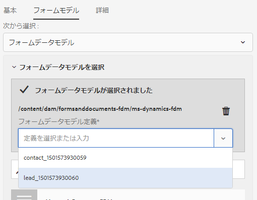
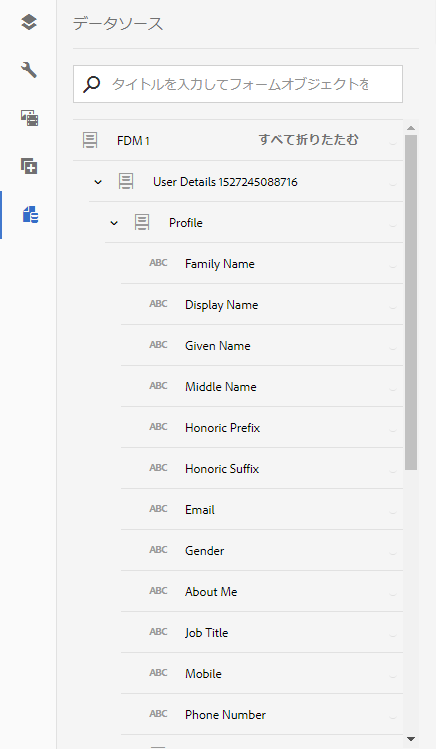
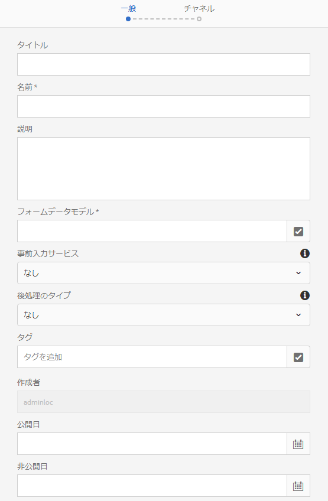
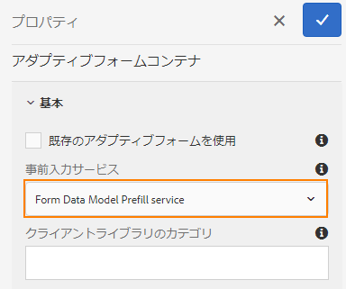
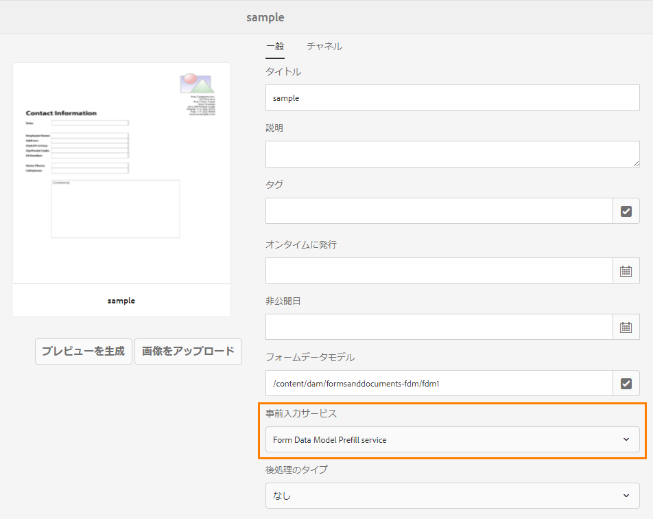
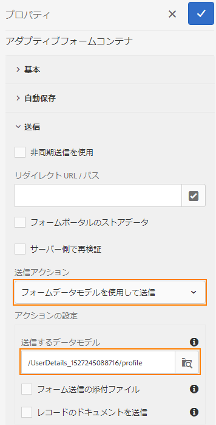
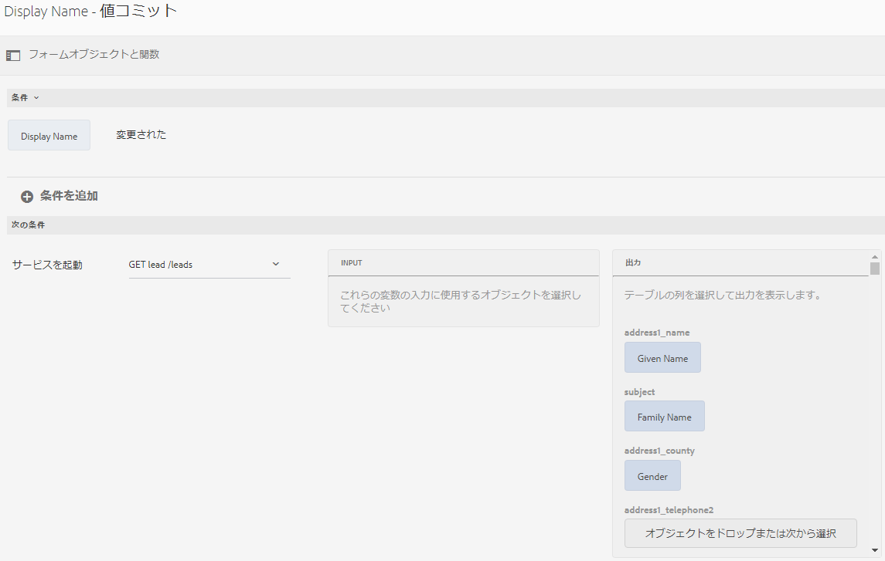

# フォームデータモデルの使用{#use-form-data-model}

AEM Forms のデータ統合機能により、各種のバックエンドデータソースを使用してフォームデータモデルを作成することができます。作成したデータフォームは、様々なアダプティブフォームとインタラクティブ通信のワークフローで、スキーマとして使用することができます。そのためには、データソースの設定を行い、そのデータソース内の有効なデータモデルオブジェクトとデータモデルサービスに基づいて、フォームデータモデルを作成する必要があります。詳しくは、次のトピックを参照してください。

* [AEM Forms のデータ統合機能](../../forms/using/data-integration.md)
* [データソースの設定](../../forms/using/configure-data-sources.md)
* [フォームデータモデルを作成する](../../forms/using/create-form-data-models.md)
* [フォームデータモデルの操作](../../forms/using/work-with-form-data-model.md)

JSON スキーマの拡張機能であるフォームデータモデルを使用して、以下の処理を行うことができます。

* [アダプティブフォームとアダプティブフォームフラグメントを作成する](#create-af)
* [インタラクティブ通信と、構築ブロック（テキストフラグメント、リストフラグメント、条件フラグメントなど）を作成する](#create-ic)
* [サンプルデータを使用してインタラクティブ通信のプレビューを表示する](#preview-ic)
* [アダプティブフォームとインタラクティブ通信に事前にデータを取り込む](#prefill)
* [送信されたアダプティブフォームのデータをデータソースに書き込む](#write-af)
* [アダプティブフォームのルールを使用してサービスを呼び出す](#invoke-services)

## アダプティブフォームとアダプティブフォームフラグメントを作成する {#create-af}

フォームデータモデルに基づいて、[アダプティブフォーム](../../forms/using/creating-adaptive-form.md)と[アダプティブフォームフラグメント](../../forms/using/adaptive-form-fragments.md)を作成することができます。フォームデータモデルを使用してアダプティブフォームまたはアダプティブフォームフラグメントを作成するには、以下の手順を実行します。

1. プロパティを追加画面の「フォームモデル」タブで、「**[!UICONTROL 次から選択]**」ドロップダウンリストから「**[!UICONTROL フォームデータモデル]**」を選択します。

   

1. 「**[!UICONTROL フォームデータモデルを選択]**」をタップして展開します。すべての有効なフォームデータモデルが一覧表示されます。

   任意のフォームデータモデルを選択します。

   

1. （**アダプティブフォームフラグメントのみ**）フォームデータモデル内の 1 つのデータモデルオブジェクトだけに基づいて、アダプティブフォームフラグメントを作成することができます。「**[!UICONTROL フォームデータモデル定義]**」ドロップダウンを展開します。指定したフォームデータモデル内のすべてのデータモデルオブジェクトがリスト表示されます。リストから、任意のデータモデルオブジェクトを選択します。

   

フォームデータモデルに基づいてアダプティブフォームまたはアダプティブフォームフラグメントを作成すると、アダプティブフォームエディターのコンテンツブラウザーの「**[!UICONTROL データモデルオブジェクト]**」タブにフォームデータモデルオブジェクトが表示されます。

>[!NOTE]
>
>アダプティブフォームフラグメントの場合、オーサリング時に選択されたデータモデルオブジェクトと、関連するデータモデルオブジェクトのみが「データモデルオブジェクト」タブに表示されます。

データモデルオブジェクトをアダプティブフォームまたはアダプティブフォームフラグメントにドラッグアンドドロップすると、フォームフィールドを追加することができます。追加されたフォームフィールドには、メタデータのプロパティが保存されます。また、データモデルオブジェクトプロパティとのバインドに関する情報も保存されます。このバインド情報により、フォームの送信時に、対応するデータソース内のフィールド値が更新され、フォームのレンダリング時に、対応するデータソース内のフィールドに値が取り込まれます。

## インタラクティブ通信の作成 {#create-ic}

フォームデータモデルに基づいて、インタラクティブ通信を作成することができます。フォームデータモデルを使用して、設定済みデータソースのデータをインタラクティブ通信に事前に取り込むことができます。また、フォームデータモデルに基づいて、インタラクティブ通信の構築ブロック（テキスト、リストおよび条件のドキュメントフラグメントなど）を作成することができます。

インタラクティブ通信またはドキュメントフラグメントの作成時に、フォームデータモデルを選択することができます。以下の図は、インタラクティブ通信作成ダイアログの「一般」タブを示しています。

インタラクティブ通信作成ダイアログの「一般」タブ

詳しくは、次を参照してください。

[インタラクティブ通信の作成](../../forms/using/create-interactive-communication.md)

[インタラクティブ通信内のテキスト](/help/forms/using/texts-interactive-communications.md)

[インタラクティブ通信内の条件](/help/forms/using/conditions-interactive-communications.md)

[リストフラグメント](/help/forms/using/lists.md)

## サンプルデータを使用したプレビュー表示 {#preview-ic}

フォームデータモデルエディターでは、フォームデータモデル内のデータモデルオブジェクト用のサンプルデータを生成して編集することができます。このサンプルデータを使用して、インタラクティブ通信とアダプティブフォームのプレビュー表示とテストを実行することができます。プレビュー表示を行う前に、「[フォームデータモデルの操作](../../forms/using/work-with-form-data-model.md#sample)」の説明に従い、サンプルデータを生成する必要があります。

フォームデータモデルのサンプルデータを使用してインタラクティブ通信のプレビューを表示するには、以下の手順を実行します。

1. On AEM author instance, navigate to **[!UICONTROL Forms > Forms &amp; Documents]**.
1. 任意のインタラクティブ通信を選択し、ツールバーで「**[!UICONTROL プレビュー]**」をタップして、「**[!UICONTROL Web チャネル]**」、「**[!UICONTROL 印刷チャネル]**」、または「**[!UICONTROL 両方のチャネル]**」を選択します。これにより、選択したインタラクティブ通信のプレビューが表示されます。
1. In the Preview [*channel*] dialog, ensure that **[!UICONTROL Test Data of Form Data Model]** is selected and tap **[!UICONTROL Preview]**.

サンプルデータが取り込まれた状態のインタラクティブ通信が表示されます。

Similarly, to preview an adaptive form with sample data, open the adaptive adaptive form in author mode and tap **[!UICONTROL Preview]**.

## フォームデータモデルサービスを使用して事前にデータを取り込む {#prefill}

AEM Forms には、すぐに使用できるフォームデータモデル事前入力サービスが付属しています。フォームデータモデルに基づいて、このサービスをアダプティブフォームとインタラクティブ通信で使用することができます。この事前入力サービスは、アダプティブフォームとインタラクティブ通信内のデータモデルオブジェクトに対してデータソースのクエリーを実行し、フォームまたは通信のレンダリング時にデータを取り込みます。

アダプティブフォームに対してフォームデータモデル事前入力サービスを有効にするには、アダプティブフォームコンテナのプロパティを開き、基本アコーディオンの「**[!UICONTROL 事前入力サービス]**」ドロップダウンで「**[!UICONTROL フォームデータモデル事前入力サービス]**」を選択します。次に、各プロパティを保存します。

インタラクティブ通信でフォームデータモデル事前入力サービスを設定するには、インタラクティブ通信の作成時に「事前入力サービス」ドロップダウンで「フォームデータモデル事前入力サービス」を選択します。後でプロパティを編集することもできます。

インタラクティブ通信のプロパティ編集ダイアログ

## 送信されたアダプティブフォームのデータをデータソースに書き込む {#write-af}

フォームデータモデルに基づくフォームを送信した場合、そのフォームを設定して、特定のデータモデルオブジェクトに対して送信されたデータをそのデータモデルオブジェクトのデータソースに書き込むことができます。この設定を行うために、AEM Forms には、すぐに使用できる[フォームデータモデル送信アクション](../../forms/using/configuring-submit-actions.md)が用意されています。これは、フォームデータモデルをベースとするアダプティブフォーム専用のアクションです。このアクションを実行すると、特定のデータモデルオブジェクトに対して送信されたデータが、そのデータモデルオブジェクトのデータソースに書き込まれます。

To configure the Form Data Model submit action, open Adaptive Form Container properties and select **[!UICONTROL Submit using Form Data Model]** from the Submit Action drop-down under the Submission accordion. 次に、「**[!UICONTROL 送信するデータモデルオブジェクトの名前]**」ドロップダウンで、目的のデータモデルオブジェクトを探して選択します。その後、各プロパティを保存します。

フォームを送信すると、設定されているデータモデルオブジェクトのデータが、各データソースに書き込まれます。

バイナリデータモデルオブジェクトのプロパティを使用して、フォームの添付ファイルをデータソースに送信することもできます。添付ファイルを JDBC データソースに送信するには、以下の手順を実行します。

1. バイナリプロパティが含まれているデータモデルオブジェクトをフォームデータモデルに追加します。
1. In the adaptive form, drag-drop the **[!UICONTROL File Attachment]** component from the Components browser onto the adaptive form.
1. Tap to select the added component and tap  to open the Properties browser for the component.
1. In the Bind Reference field, tap  and navigate to select the binary property you added in the form data model. 必要に応じて、他のプロパティを設定します。

   Tap  to save the properties. この操作により、添付ファイルフィールドが、フォームデータモデルのバイナリプロパティにバインドされます。

1. アダプティブフォームコンテナプロパティの「送信」セクションで、「**[!UICONTROL フォームの添付ファイルを送信]**」を有効にします。これにより、フォームの送信時に、バイナリプロパティフィールド内の添付ファイルがデータソースに送信されるようになります。

## ルールを使用してアダプティブフォーム内のサービスを呼び出す {#invoke-services}

フォームデータモデルに基づくアダプティブフォームの場合、[ルールを作成](../../forms/using/rule-editor.md)して、フォームデータモデル内で設定されているサービスを呼び出すことができます。The **[!UICONTROL Invoke Services]** operation in a rule lists all available services in the form data model and allows you to select input and output fields for the service. 「**指定値**」というルールタイプを使用してフォームデータモデルサービスを呼び出し、そのサービスから返された出力に対するフィールドの値を設定することもできます。

例えば以下のルールの場合、従業員 ID を入力として使用する Get サービスが呼び出され、このサービスから返された値が、フォーム内の対応する扶養家族 ID フィールド、姓フィールド、名フィールド、性別フィールドに設定されます。

In addition, you can use the `guidelib.dataIntegrationUtils.executeOperation` API to write a JavaScript in the code editor for the rule editor. For API details, see [API to invoke form data model service](/help/forms/using/invoke-form-data-model-services.md).
