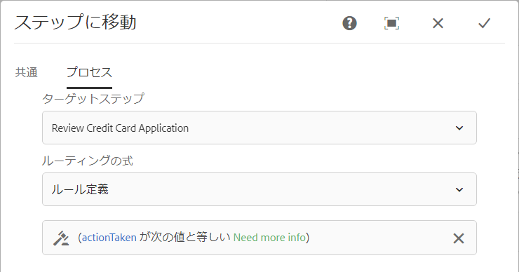

# AEM Formsワークフローの変数{#variables-in-aem-forms-workflows}

ワークフローモデル内の変数は、そのデータ型に基づいて値を格納する方法です。 その後、任意のワークフロー手順で変数の名前を使用して、変数に保存されている値を取得できます。 変数名を使用して、ルーティング上の意思決定を行う式を定義することもできます。

AEMワークフローモデルでは、次のことができます。

* [データ型に格納する情報型に基づいて](../../forms/using/variable-in-aem-workflows.md#create-a-variable) 、データ型の変数を作成します。
* [変数の値を設定するには](../../forms/using/variable-in-aem-workflows.md#set-a-variable) 、「変数を設定」ワークフローの手順を使用します。
* [すべてのAEM Formsワークフロー手順で変数を使用して](../../forms/using/variable-in-aem-workflows.md#use-a-variable) 、保存された値を取得し、OR分割とGOTOの手順でルーティング式を定義します。

次のビデオでは、AEMワークフローモデルで変数を作成、設定、使用する方法を示します。

>[!VIDEO](https://helpx.adobe.com/content/dam/help/en/experience-manager/6-5/forms/using/variables_introduction_1_1.mp4)

変数は、既存のMetaDataMap [](https://helpx.adobe.com/experience-manager/6-5/sites/developing/using/reference-materials/javadoc/com/adobe/granite/workflow/metadata/MetaDataMap.html) インターフェイスの拡張です。 ECMAScriptのMetaDataMap [](https://helpx.adobe.com/experience-manager/6-5/sites/developing/using/reference-materials/javadoc/com/adobe/granite/workflow/metadata/MetaDataMap.html) を使用して、変数を使用して保存されたメタデータにアクセスできます。

## 変数の作成 {#create-a-variable}

変数は、ワークフローモデルのサイドキックにある「変数」セクションを使用して作成します。 AEMワークフロー変数は次のデータ型をサポートしています。

* **プリミティブデータ型**: 長い、重複、ブール、日付、文字列
* **複雑なデータ型**: [ドキュメント](https://helpx.adobe.com/experience-manager/6-5/forms/javadocs/com/adobe/aemfd/docmanager/Document.html)、 [XML](https://docs.oracle.com/javase/8/docs/api/org/w3c/dom/Document.html)、 [JSON](https://static.javadoc.io/com.google.code.gson/gson/2.3/com/google/gson/JsonObject.html)、フォームデータモデルの各インスタンス。

>[!NOTE]
>
>ワークフローでは、日付型変数に対してISO8601形式のみがサポートされています。

ドキュメントデータ型とフォームデータモデルデータ型には [AEM Formsアドオンパッケージが必要です](https://helpx.adobe.com/jp/aem-forms/kb/aem-forms-releases.html) 。  ArrayListデータ型を使用して、変数コレクションを作成します。 すべてのプリミティブデータ型と複合データ型に対してArrayList変数を作成できます。 例えば、ArrayList変数を作成し、その変数を使用して複数の文字列値を格納する場合は、「String」をサブタイプとして選択します。

次の手順を実行して、変数を作成します。

1. AEMインスタンスで、ツール/ワークフロー/モデルに移動  します。
1. 「 **[!UICONTROL 作成]** 」をタップし、ワークフローモデルのタイトルと名前（オプション）を指定します。 モデルを選択し、「 **[!UICONTROL 編集]**」をタップします。
1. ワークフローモデルのサイドキックにある変数アイコンをタップし、「 **[!UICONTROL 追加変数]**」をタップします。

   

1. Variable追加ダイアログで、名前を指定し、変数のタイプを選択します。
1. 「 **[!UICONTROL タイプ]** 」ドロップダウンリストからデータタイプを選択し、次の値を指定します。

   * プリミティブデータ型 — 変数のオプションのデフォルト値を指定します。
   * JSONまたはXML — オプションのJSONまたはXMLスキーマパスを指定します。 このスキーマで使用可能なプロパティを別の変数にマッピングして保存する際に、スキーマパスが検証されます。
   * Form Data Model - Form Data Modelのパスを指定します。
   * ArrayList — コレクションのサブタイプを指定します。

1. 変数の説明（オプション）を指定し、をタップして変更  を保存します。 変数は、左側のペインで使用可能なリストに表示されます。

変数を作成する場合、次のプラクティスをお勧めします。

* ワークフローで必要な数の変数を作成します。 ただし、データベースのリソースを確保するため、必要最低限の変数を使用し、必要に応じて変数を再利用してください。
* 変数では大文字と小文字が区別されます。ワークフローで変数を参照する場合は、大文字と小文字を同じにします。
* 変数名に特殊文字を使用しない

## 変数の設定 {#set-a-variable}

変数の値を設定し、値が設定される順序を定義するには、変数の設定手順を使用します。 変数は、変数の設定手順で変数のマッピングが示される順序で設定されます。

変数値を変更すると、変更が発生したプロセスのインスタンスのみに影響します。例えば、ワークフローが開始され、変数データが変更されると、その変更はワークフローのそのインスタンスにのみ影響します。 この変更は、以前に開始された、または以降に開始されたワークフローの他のインスタンスには影響しません。

変数のデータタイプに応じて、次のオプションを使用して変数の値を設定できます。

* **リテラル：**&#x200B;指定する値が正確に分かっている場合は、このオプションを使用します。

* **式:** このオプションは、式に基づいて使用する値が計算される場合に使用します。 式は、提供された式エディタで作成されます。

* **JSONドット表記：** このオプションを使用して、JSONまたはFDM型の変数から値を取得します。
* **XPATH:** XML型の変数から値を取得するには、このオプションを使用します。

* **ペイロードとの相対：** 変数に保存する値がペイロードに対する相対パスで使用できる場合に、このオプションを使用します。

* **絶対パス：** 変数に保存する値が絶対パスで使用できる場合にこのオプションを使用します。

また、JSON DOT NotationまたはXPATH表記を使用して、JSONまたはXML型の変数の特定の要素を更新することもできます。

### 変数追加間のマッピング {#add-mapping-between-variables}

次の手順を実行して、変数間のマッピングを追加します。

1. ワークフローの編集ページで、ワークフローモデルのサイドキックにあるステップアイコンをタップします。
1. 「 **変数を設定** 」の手順をワークフローエディターにドラッグ&amp;ドロップし、手順をタップして「  （設定）」を選択します。
1. Set Variableダイアログで、 **[!UICONTROL Mapping]** / **[!UICONTROL Mapping]**&#x200B;を選択します。
1. 「 **Map Variable** 」セクションで、データを格納する変数を選択し、マッピングモードを選択して、変数に格納する値を指定します。 マッピングモードは、変数のタイプに応じて異なります。
1. 意味のある式を行うために、より多くの変数をマッピングします。 Tap  to save the changes.

### 例1: XML変数をクエリして文字列変数の値を設定する {#example-query-an-xml-variable-to-set-value-for-a-string-variable}

XMLファイルを保存するXML型の変数を選択します。 XML変数をクエリして、XMLファイルで使用可能なプロパティの文字列変数の値を設定します。 XML変数 **フィールドに対してXPATHを** 指定を使用して、string変数に格納するプロパティを定義します。

この例では、 **cc-app.xmlファイルを保存する** formdata **** XML変数を選択します。 **formdata** 変数をクエリして、emailaddress **string変数の値を設定し、** cc-app.xmlファイルで使用できる **emailAddress****** プロパティの値を格納します。

>[!VIDEO](https://helpx.adobe.com/content/dam/help/en/experience-manager/6-5/forms/using/set_variable_example1.mp4 "変数の値の設定")

### 例2: 式を使用して他の変数に基づいた値を格納する {#example2}

式を使用して変数の合計を計算し、結果を変数に格納します。

この例では、式エディターを使用して、 **assetscost** 変数と **balanceamount** 変数の合計を計算し、その結果を **totalvalue** 変数に格納する式を定義します。

>[!VIDEO](https://helpx.adobe.com/content/dam/help/en/experience-manager/6-5/forms/using/variables_expression.mp4)

## 式エディターを使用 {#use-expression-editor}

また、式を使用して、実行時に変数の値を計算します。 変数は、式を定義する式エディターを提供します。

式エディターを使用して、次の操作を行います。

* 他のワークフロー変数、数値または数学式を使用して、変数の値を設定します。
* ワークフロー変数、文字列、数値、または式を数学式内で使用する
* 条件を使用して、変数の値を追加設定します。
* 演算子を追加使用します。


これは、次の変更を加えたアダプティブフォームのルールエディターに基づいています。 変数のルールエディター：

* 関数はサポートされません。
* ルールの表示サマリにUIを提供しない
* コードエディターがありません。
* オブジェクトの値の有効化と無効化をサポートしません。
* オブジェクトのプロパティの設定はサポートされません。
* Webサービスの呼び出しをサポートしません。

For more information, see [adaptive forms rule editor](../../forms/using/rule-editor.md).

## Use a variable {#use-a-variable}

変数を使用して、入力と出力を取得したり、ステップの結果を保存したりできます。 ワークフローエディターには、次の2種類のワークフロー手順が用意されています。

* 変数のサポートを含むワークフロー手順
* 変数をサポートしないワークフロー手順

### 変数のサポートを含むワークフロー手順 {#workflow-steps-with-support-for-variables}

「ステップへ移動」(OR Split)ステップと、すべてのAEM Formsワークフローステップで変数がサポートされています。

#### OR分割ステップ {#or-split-step}

OR 分割は、ワークフロー内に分割を作成し、以降は 1 つのブランチだけがアクティブになります。これを使用すると、ワークフローに条件付き処理パスを導入できます。必要に応じて、各ブランチにワークフローステップを追加できます。

ブランチのルーティング式は、ルール定義、ECMAスクリプトまたは外部スクリプトを使用して定義できます。

変数を使用して、式エディターを使用してルーティング式を定義できます。 OR分割ステップでのルーティング式の使用について詳しくは、 [OR分割ステップを参照してください](/help/sites-developing/workflows-step-ref.md#or-split)。

この例では、ルーティング式を定義する前に、 [例2](../../forms/using/variable-in-aem-workflows.md#example2) を使用して **totalvalue** 変数の値を設定します。 ブランチ1は、 **totalvalue** 変数の値が50000より大きい場合はアクティブです。 同様に、 **totalvalue** 変数の値が50000未満の場合に、Branch 2をアクティブにするルールを定義できます。

>[!VIDEO](https://helpx.adobe.com/content/dam/help/en/experience-manager/6-5/forms/using/variables_orsplit_example.mp4)

同様に、アクティブなブランチを評価するルーティング式に対して、外部スクリプトパスを選択するか、ECMAスクリプトを指定します。 「ブランチ名 **[!UICONTROL の変更]** 」をタップして、ブランチの別の名前を指定します。

その他の例については、「ワークフローモデルの [作成](../../forms/using/aem-forms-workflow.md#create-a-workflow-model)」を参照してください。

#### ステップへジャンプ {#go-to-step}

The **Goto Step** allows you to specify the next step in the workflow model to execute, dependent on the result of a routing expression.

OR分割の手順と同様に、ルール定義、ECMAスクリプトまたは外部スクリプトを使用して、Goto手順のルーティング式を定義できます。

変数を使用して、式エディターを使用してルーティング式を定義できます。 Gotoステップでのルーティング式の使用について詳しくは、「Gotoステップ [](/help/sites-developing/workflows-step-ref.md#goto-step)」を参照してください。



この例では、Gotoステップで、actiontaked **変数の値が「** Need more info **」と等しい場合、「Review Credit Card Application」を次のステップとして指定します**。

Goto手順でのルール定義の使用例については、Forループの [シミュレートを参照してください](/help/sites-developing/workflows-step-ref.md#simulateforloop)。

#### フォームワークフロー中心のワークフローステップ {#forms-workflow-centric-workflow-steps}

すべてのAEM Formsワークフロー手順で、変数がサポートされています。 For more information, see [Forms-centric workflow on OSGi](../../forms/using/aem-forms-workflow-step-reference.md).

### 変数をサポートしないワークフロー手順 {#workflow-steps-without-support-for-variables}

MetaDataMap [](https://helpx.adobe.com/experience-manager/6-5/sites/developing/using/reference-materials/javadoc/com/adobe/granite/workflow/metadata/MetaDataMap.html) インターフェイスを使用して、変数をサポートしないワークフロー手順の変数にアクセスできます。

#### 変数値を取得する {#retrieve-the-variable-value}

ECMAスクリプトで次のAPIを使用して、データ型に基づいて既存の変数の値を取得します。

| 変数データ型 | API |
|---|---|
| プリミティブ(長整数型、重複型、ブール型、日付型、文字列型) | workItem.getWorkflowData().getMetaDataMap().get(variableName, type) |
| ドキュメント | Packages.com.adobe.aemfd.docmanager.ドキュメントdoc = workItem.getWorkflowData().getMetaDataMap().get(&quot;docVar&quot;, Packages.com.adobe.aemfd.docmanager.ドキュメント.class); |
| XML | Packages.org.w3c.dom.ドキュメントxmlObject = workItem.getWorkflowData().getMetaDataMap().get(variableName, Packages.org.w3c.dom.ドキュメント.class); |
| フォームデータモデル | Packages.com.adobe.aem.aderame.api.FormDataModelInstance fdmObject = workItem.getWorkflowData().get(variableName, Packages.com.adobe.aem.api.FormDataModelInstance.class); |
| JSON | Packages.com.gogoogle.gson.JsonObject jsonObject = workItem.getWorkflowData().getMetaDataMap().get(variableName, Packages.com.google.gson.JsonObject.class); |

ドキュメントおよびフォームデータモデルの変数データ型に [](https://helpx.adobe.com/jp/aem-forms/kb/aem-forms-releases.html) AEM Formsアドオンパッケージが必要です。

**例**

次のAPIを使用して、stringデータ型の値を取得します。

```javascript
workItem.getWorkflowData().getMetaDataMap().get(accname, Packages.java.lang.String)
```

#### 変数値の更新 {#update-the-variable-value}

ECMAスクリプトで次のAPIを使用して、変数の値を更新します。

```javascript
workItem.getWorkflowData().getMetaDataMap().put(variableName, value)
```

**例**

```javascript
workItem.getWorkflowData().getMetaDataMap().put(salary, 50000)
```

salary **変数の値を50000に更新します** 。

### ワークフローを呼び出すための変数を設定する {#apiinvokeworkflow}

APIを使用して変数を設定し、それらを渡してワークフローインスタンスを呼び出すことができます。

[workflowSession.startWorkflow](https://helpx.adobe.com/experience-manager/6-5/sites/developing/using/reference-materials/javadoc/com/adobe/granite/workflow/WorkflowSession.html#startWorkflow-com.adobe.granite.workflow.model.WorkflowModel-com.adobe.granite.workflow.exec.WorkflowData-java.util.Map-) は、モデル、wfData、metaDataを引数として使用します。 MetaDataMapを使用して変数の値を設定します。

このAPIでは、 **variableName** 変数は、metaData.put(variableName, value) **；を使用して** 値に設定されます。

```javascript
import com.adobe.granite.workflow.model.WorkflowModel;
import com.adobe.granite.workflow.metadata.MetaDataMap;
import com.adobe.aemfd.docmanager.Document;

/*Assume that you already have a workflowSession and modelId along with the payloadType and payload*/
WorkflowData wfData = workflowSession.newWorkflowData(payloadType, payload);
MetaDataMap metaData = wfData.getMetaDataMap();
metaData.put(variableName, value); //Create a variable "variableName" in your workflow model
WorkflowModel model = workflowSession.getModel(modelId);
workflowSession.startWorkflow(model, wfData, metaData);
```

**例**

**doc** ドキュメントオブジェクトをパス(「a/b/c」)に初期化し、docVar **** 変数の値をドキュメントオブジェクトに保存されているパスに設定します。

```javascript
import com.adobe.granite.workflow.WorkflowSession;
import com.adobe.granite.workflow.exec.WorkflowData;
import com.adobe.granite.workflow.model.WorkflowModel;
import com.adobe.granite.workflow.metadata.MetaDataMap;
import com.adobe.aemfd.docmanager.Document;

/*This example assumes that you already have a workflowSession and modelId along with the payloadType and payload */
WorkflowData wfData = workflowSession.newWorkflowData(payloadType, payload);
MetaDataMap metaData = wfData.getMetaDataMap();
Document doc = new Document("/a/b/c");// initialize a document object
metaData.put("docVar",doc); //Assuming that you have created a variable "docVar" of type Document in your workflow model
WorkflowModel model = workflowSession.getModel(modelId);
workflowSession.startWorkflow(model, wfData, metaData);
```

## 変数の編集 {#edit-a-variable}

1. ワークフローを編集ページで、ワークフローモデルのサイドキックにある変数アイコンをタップします。 左側のペインの「変数」セクションには、既存の変数がすべて表示されます。
1. 編集する変数名の横にある  （編集）アイコンをタップします。
1. 変数情報を編集し、をタップして変更  を保存します。 変数の「 **[!UICONTROL 名前]** 」フィールドと「 **[!UICONTROL タイプ]** 」フィールドは編集できません。

## 変数の削除 {#delete-a-variable}

変数を削除する前に、ワークフローから変数の参照をすべて削除します。 この変数がワークフローで使用されていないことを確認します。

次の手順を実行して、変数を削除します。

1. ワークフローを編集ページで、ワークフローモデルのサイドキックにある変数アイコンをタップします。 左側のペインの「変数」セクションには、既存の変数がすべて表示されます。
1. 削除する変数名の横にある削除アイコンをタップします。
1. をタップ  して、変数の確認と削除を行います。

## 参照 {#references}

AEM Formsワークフロー手順での変数の使用例について詳しくは、「AEMワークフローでの [変数](https://helpx.adobe.com/experience-manager/kt/forms/using/authoring_variables_in_aem_forms-workflow1.html)」を参照してください。
