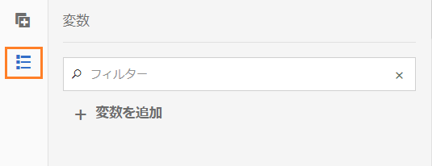

# AEM Formsワークフローの変数{#variables-in-aem-forms-workflows}

ワークフローモデルの変数は、そのデータタイプに基づいて値を格納する方法です。 その後、任意のワークフロー手順で変数の名前を使用して、変数に保存されている値を取得できます。 また、変数名を使用して、ルーティングの決定に使用する式を定義することもできます。

AEMワークフローモデルでは、次のことができます。

* [データ型の変数](../../forms/using/variable-in-aem-workflows.md#create-a-variable) は、格納する情報型に基づいて作成します。
* [変数の値を設定するには](../../forms/using/variable-in-aem-workflows.md#set-a-variable) 、Set Variableワークフロー手順を使用します。
* [この変数は、すべての](../../forms/using/variable-in-aem-workflows.md#use-a-variable) AEM Formsワークフローの手順で使用して、保存された値を取得し、OR分割とGOTOの手順でルーティング式を定義します。

次のビデオでは、AEMワークフローモデルで変数を作成、設定および使用する方法を示します。

>[!VIDEO](https://helpx.adobe.com/content/dam/help/en/experience-manager/6-5/forms/using/variables_introduction_1_1.mp4)

変数は、既存のMetaDataMapインターフェイスの拡 [張です](https://helpx.adobe.com/experience-manager/6-5/sites/developing/using/reference-materials/javadoc/com/adobe/granite/workflow/metadata/MetaDataMap.html) 。 ECMAScriptのMetaDataMapを使用して [](https://helpx.adobe.com/experience-manager/6-5/sites/developing/using/reference-materials/javadoc/com/adobe/granite/workflow/metadata/MetaDataMap.html) 、変数を使用して保存されたメタデータにアクセスできます。

## 変数の作成 {#create-a-variable}

変数は、ワークフローモデルのサイドキックにある「変数」セクションを使用して作成します。 AEMワークフロー変数は、次のデータ型をサポートしています。

* **プリミティブデータ型**:Long、Double、Boolean、DateおよびString
* **複雑なデータ型**: [Document](https://helpx.adobe.com/experience-manager/6-5/forms/javadocs/com/adobe/aemfd/docmanager/Document.html)、 [XML](https://docs.oracle.com/javase/8/docs/api/org/w3c/dom/Document.html)、 [JSON](https://static.javadoc.io/com.google.code.gson/gson/2.3/com/google/gson/JsonObject.html)、Form Data modelの各インスタンス。

>[!NOTE]
>
>ワークフローは、日付型変数に対してISO8601形式のみをサポートしています。

Documentデータ型と [Form Data modelデータ型には](https://helpx.adobe.com/aem-forms/kb/aem-forms-releases.html) 、AEM Formsアドオンパッケージが必要です。  ArrayListデータ型を使用して、変数コレクションを作成します。 ArrayList変数は、すべてのプリミティブデータ型と複雑なデータ型に対して作成できます。 例えば、ArrayList変数を作成し、その変数を使用して複数の文字列値を格納する場合は、「String」をサブタイプとして選択します。

次の手順を実行して、変数を作成します。

1. AEMインスタンスで、ツール/ワークフロー/  モデルに移動します。
1. 「作成 **[!UICONTROL 」をタップし]** 、ワークフローモデルのタイトルとオプションの名前を指定します。 モデルを選択し、「編集」をタッ **[!UICONTROL プします]**。
1. ワークフローモデルのサイドキックで使用可能な変数アイコンをタップし、「変数を追加」を **[!UICONTROL タップしま]**&#x200B;す。

   

1. 変数を追加ダイアログで、名前を指定し、変数のタイプを選択します。
1. 「タイプ」ドロップダウンリストから **[!UICONTROL データタイプ]** を選択し、次の値を指定します。

   * プリミティブデータ型 — 変数のオプションのデフォルト値を指定します。
   * JSONまたはXML — オプションのJSONまたはXMLスキーマパスを指定します。 このスキーマで使用可能なプロパティを別の変数にマッピングして保存する際に、スキーマパスが検証されます。
   * Form Data Model - Form Data modelのパスを指定します。
   * ArrayList — コレクションのサブタイプを指定します。

1. 変数の説明（オプション）を指定し、をタップして  変更を保存します。 変数が左側のペインのリストに表示されます。

変数を作成する場合、次のプラクティスをお勧めします。

* ワークフローで必要な数の変数を作成します。 ただし、データベースのリソースを確保するため、必要最低限の変数を使用し、必要に応じて変数を再利用してください。
* 変数では大文字と小文字が区別されます。ワークフローでは、変数を必ず同じ大文字と小文字を使用して参照してください。
* 変数名に特殊文字を使用しない

## 変数の設定 {#set-a-variable}

「変数を設定」ステップを使用して、変数の値を設定し、値が設定される順序を定義できます。 変数は、変数のマッピングが変数の設定手順で示される順序で設定されます。

変数値を変更すると、変更が発生したプロセスのインスタンスのみに影響します。例えば、ワークフローが開始され、変数データが変更されると、その変更はワークフローのそのインスタンスにのみ影響します。 この変更は、以前に開始された、またはその後開始されたワークフローの他のインスタンスには影響しません。

変数のデータタイプに応じて、次のオプションを使用して変数の値を設定できます。

* **リテラル：**&#x200B;指定する値が正確に分かっている場合は、このオプションを使用します。

* **** 式：このオプションは、式に基づいて使用する値が計算される場合に使用します。 式は、提供された式エディターで作成されます。

* **** JSONドット表記：このオプションを使用して、JSON型またはFDM型の変数から値を取得します。
* **** XPATH:XML型の変数から値を取得するには、このオプションを使用します。

* **** ペイロードに対する相対：変数に保存する値がペイロードに対する相対パスで使用可能な場合は、このオプションを使用します。

* **** 絶対パス：変数に保存する値が絶対パスで使用可能な場合は、このオプションを使用します。

また、JSON DOT NotationまたはXPATH表記を使用して、JSON型またはXML型の変数の特定の要素を更新することもできます。

### 変数間のマッピングの追加 {#add-mapping-between-variables}

次の手順を実行して、変数間のマッピングを追加します。

1. ワークフローの編集ページで、ワークフローモデルのサイドキックにある「ステップ」アイコンをタップします。
1. 「変数を設定」ステップをワークフ **ローエディターに** ドラッグ&amp;ドロップし、ステップをタップして「  （設定）」を選択します。
1. 変数を設定ダイアログで、マッピング/マッピ **[!UICONTROL ングを]** 追加を選択します ****。
1. 「 **Map Variable** 」セクションで、データを保存する変数を選択し、マッピングモードを選択して、変数に保存する値を指定します。 マッピングモードは、変数のタイプによって異なります。
1. 意味のある式を作成するために、変数をさらにマッピングします。 Tap  to save the changes.

### 例1:XML変数をクエリして文字列変数の値を設定する {#example-query-an-xml-variable-to-set-value-for-a-string-variable}

XMLファイルを保存するXML型の変数を選択します。 XML変数をクエリーして、XMLファイルで使用可能なプロパティの文字列変数の値を設定します。 XML変数 **フィールドに対して「XPATHを指定」を使用して** 、文字列変数に格納するプロパティを定義します。

この例では、 **cc-app.xmlファイルを保存するformdata** XML変数を選択します **** 。 **formdata** 変数をクエリして、電子メールアドレス文字列変数の値を設定し、 **cc-app.xml** **Fileで使用できる** emailAddress **** プロパティの値を格納します。

>[!VIDEO](https://helpx.adobe.com/content/dam/help/en/experience-manager/6-5/forms/using/set_variable_example1.mp4 "変数の値の設定")

### 例2:式を使用して他の変数に基づいて値を格納する {#example2}

式を使用して変数の合計を計算し、結果を変数に格納します。

この例では、式エディターを使用して式を定義し、 **assetscost** 変数と **balanceamount変数の合計を計算し** 、結果をtotalvalue変数に **格納します** 。

>[!VIDEO](https://helpx.adobe.com/content/dam/help/en/experience-manager/6-5/forms/using/variables_expression.mp4)

## 式エディターを使用 {#use-expression-editor}

また、式を使用して、実行時に変数の値を計算します。 変数は、式を定義する式エディターを提供します。

式エディターを使用して、次の操作を行います。

* 他のワークフロー変数、数値または数式を使用して変数の値を設定します。
* ワークフロー変数、文字列、数値または数式内での式の使用
* 変数の値を設定する条件を追加します。
* 条件間に演算子を追加します。


これは、次の変更を加えたアダプティブフォームのルールエディターに基づいています。 変数のルールエディター：

* 関数をサポートしません。
* ルールの概要を表示するUIを提供しません。
* コードエディターがありません。
* オブジェクトの値の有効化と無効化をサポートしません。
* オブジェクトのプロパティの設定はサポートされません。
* Webサービスの呼び出しをサポートしません。

For more information, see [adaptive forms rule editor](../../forms/using/rule-editor.md).

## Use a variable {#use-a-variable}

変数を使用して、入力および出力を取得したり、ステップの結果を保存したりできます。 ワークフローエディターには、次の2種類のワークフロー手順が用意されています。

* 変数のサポートを含むワークフロー手順
* 変数をサポートしないワークフロー手順

### 変数のサポートを含むワークフロー手順 {#workflow-steps-with-support-for-variables}

「移動先」、「分割」の各ステップ、およびすべてのAEM Formsワークフローステップで変数がサポートされます。

#### OR分割ステップ {#or-split-step}

OR 分割は、ワークフロー内に分割を作成し、以降は 1 つのブランチだけがアクティブになります。これを使用すると、ワークフローに条件付き処理パスを導入できます。必要に応じて、各ブランチにワークフローステップを追加できます。

ルール定義、ECMAスクリプトまたは外部スクリプトを使用して、ブランチのルーティング式を定義できます。

変数を使用して、式エディターを使用してルーティング式を定義できます。 OR splitステップでのルーティング式の使用の詳細については、 [OR splitステップを参照してください](/help/sites-developing/workflows-step-ref.md#or-split)。

この例では、ルーティング式を定義する前に、例2 [を使用し](../../forms/using/variable-in-aem-workflows.md#example2) 、totalvalue変数の値を設定 **します** 。 ブランチ1は、totalvalue変数の値が50000を超え **る場合** 、アクティブです。 同様に、totalvalue変数の値が50000未満の場合に分岐2をアクティブにす **るルール** を定義できます。

>[!VIDEO](https://helpx.adobe.com/content/dam/help/en/experience-manager/6-5/forms/using/variables_orsplit_example.mp4)

同様に、アクティブなブランチを評価するルーティング式の外部スクリプトパスを選択するか、ECMAスクリプトを指定します。 「ブラ **[!UICONTROL ンチ名の変更]** 」をタップして、ブランチの代替名を指定します。

その他の例については、「ワークフ [ローモデルの作成」を参照してくださ](../../forms/using/aem-forms-workflow.md#create-a-workflow-model)い。

#### ステップへ移動 {#go-to-step}

The **Goto Step** allows you to specify the next step in the workflow model to execute, dependent on the result of a routing expression.

OR分割ステップと同様に、ルール定義、ECMAスクリプトまたは外部スクリプトを使用して、Gotoステップのルーティング式を定義できます。

変数を使用して、式エディターを使用してルーティング式を定義できます。 Gotoステップでのルーティング式の使用について詳しくは、 [Gotoステップを参照してください](/help/sites-developing/workflows-step-ref.md#goto-step)。


この例では、Gotoステップで、actiontaken変数の値が「Need more info **」と等しい場合に、「Review Credit Card Application」を次のステップと** して指定します ****。

Gotoステップでのルール定義の使用例については、 [Forループのシミュレーションを参照してください](/help/sites-developing/workflows-step-ref.md#simulateforloop)。

#### フォームワークフロー中心のワークフローステップ {#forms-workflow-centric-workflow-steps}

すべてのAEM Formsワークフロー手順で、変数がサポートされます。 For more information, see [Forms-centric workflow on OSGi](../../forms/using/aem-forms-workflow-step-reference.md).

### 変数をサポートしないワークフロー手順 {#workflow-steps-without-support-for-variables}

MetaDataMapインターフェ [イスを使用して](https://helpx.adobe.com/experience-manager/6-5/sites/developing/using/reference-materials/javadoc/com/adobe/granite/workflow/metadata/MetaDataMap.html) 、変数をサポートしないワークフロー手順の変数にアクセスできます。

#### 変数値の取得 {#retrieve-the-variable-value}

ECMAスクリプトで次のAPIを使用して、データ型に基づいて既存の変数の値を取得します。

| 変数データ型 | API |
|---|---|
| プリミティブ（長整数型、倍精度浮動小数点型、ブール型、日付型、文字列型） | workItem.getWorkflowData().getMetaDataMap().get(variableName, type) |
| ドキュメント | Packages.com.adobe.aemfd.docmanager.Document doc = workItem.getWorkflowData().getMetaDataMap().get(&quot;docVar&quot;, Packages.com.adobe.aemfd.docmanager.Document.class); |
| XML | Packages.org.w3c.dom.Document xmlObject = workItem.getWorkflowData().getMetaDataMap().get(variableName, Packages.org.w3c.dom.Document.class); |
| フォームデータモデル | Packages.com.adobe.aem.detarie.api.FormDataModelInstance fdmObject = workItem.getWorkflowData().get(variableName, Packages.com.adobe.aem.api.FormDataModelInstance.class); |
| JSON | Packages.com.google.gson.JsonObject jsonObject = workItem.getWorkflowData().getMetaDataMap().get(variableName, Packages.com.google.gson.JsonObject.class); |

DocumentおよびForm Data [model変数データ型には](https://helpx.adobe.com/aem-forms/kb/aem-forms-releases.html) AEM Formsアドオンパッケージが必要です。

**例**

次のAPIを使用して、文字列データ型の値を取得します。

```
workItem.getWorkflowData().getMetaDataMap().get(accname, Packages.java.lang.String)
```

#### 変数値の更新 {#update-the-variable-value}

ECMAスクリプトで次のAPIを使用して、変数の値を更新します。

```
workItem.getWorkflowData().getMetaDataMap().put(variableName, value)
```

**例**

```
workItem.getWorkflowData().getMetaDataMap().put(salary, 50000)
```

salary変数の値を50000 **に更新します** 。

### ワークフローを呼び出すための変数の設定 {#apiinvokeworkflow}

APIを使用して変数を設定し、それらを渡してワークフローインスタンスを呼び出すことができます。

[workflowSession.startWorkflowは](https://helpx.adobe.com/experience-manager/6-5/sites/developing/using/reference-materials/javadoc/com/adobe/granite/workflow/WorkflowSession.html#startWorkflow-com.adobe.granite.workflow.model.WorkflowModel-com.adobe.granite.workflow.exec.WorkflowData-java.util.Map-) 、モデル、wfDataおよびmetaDataを引数として使用します。 MetaDataMapを使用して変数の値を設定します。

このAPIでは、 **variableName** 変数は、metaData.put(variableName, value) **** ；を使用して値に設定されます。

```java
import com.adobe.granite.workflow.model.WorkflowModel;
import com.adobe.granite.workflow.metadata.MetaDataMap;
import com.adobe.aemfd.docmanager.Document;

/*Assume that you already have a workflowSession and modelId along with the payloadType and payload*/
WorkflowData wfData = workflowSession.newWorkflowData(payloadType, payload);
MetaDataMap metaData = wfData.getMetaDataMap();
metaData.put(variableName, value); //Create a variable "variableName" in your workflow model
WorkflowModel model = workflowSession.getModel(modelId);
workflowSession.startWorkflow(model, wfData, metaData);
```

**例**

**doc** documentオブジェクトをパス(「a/b/c」)に初期化し、 **docVar** 変数の値をドキュメントオブジェクトに保存されているパスに設定します。

```java
import com.adobe.granite.workflow.WorkflowSession;
import com.adobe.granite.workflow.exec.WorkflowData;
import com.adobe.granite.workflow.model.WorkflowModel;
import com.adobe.granite.workflow.metadata.MetaDataMap;
import com.adobe.aemfd.docmanager.Document;

/*This example assumes that you already have a workflowSession and modelId along with the payloadType and payload */
WorkflowData wfData = workflowSession.newWorkflowData(payloadType, payload);
MetaDataMap metaData = wfData.getMetaDataMap();
Document doc = new Document("/a/b/c");// initialize a document object
metaData.put("docVar",doc); //Assuming that you have created a variable "docVar" of type Document in your workflow model
WorkflowModel model = workflowSession.getModel(modelId);
workflowSession.startWorkflow(model, wfData, metaData);
```

## 変数の編集 {#edit-a-variable}

1. ワークフローを編集ページで、ワークフローモデルのサイドキックにある変数アイコンをタップします。 左側のウィンドウの「変数」セクションには、既存の変数がすべて表示されます。
1. 編集する  変数名の横にある（編集）アイコンをタップします。
1. 変数情報を編集し、をタップし  て変更を保存します。 変数の「名前」フィール **[!UICONTROL ドと]** 「タ **[!UICONTROL イプ]** 」フィールドは編集できません。

## 変数の削除 {#delete-a-variable}

変数を削除する前に、ワークフローから変数の参照をすべて削除します。 この変数がワークフローで使用されていないことを確認します。

次の手順を実行して、変数を削除します。

1. ワークフローを編集ページで、ワークフローモデルのサイドキックにある変数アイコンをタップします。 左側のウィンドウの「変数」セクションには、既存の変数がすべて表示されます。
1. 削除する変数名の横にある削除アイコンをタップします。
1. をタップ  して、変数を確認および削除します。

## 参照 {#references}

AEM Formsワークフロー手順での変数の使用例について詳しくは、「AEM workflowsでの変数」 [を参照してください](https://helpx.adobe.com/experience-manager/kt/forms/using/authoring_variables_in_aem_forms-workflow1.html)。
