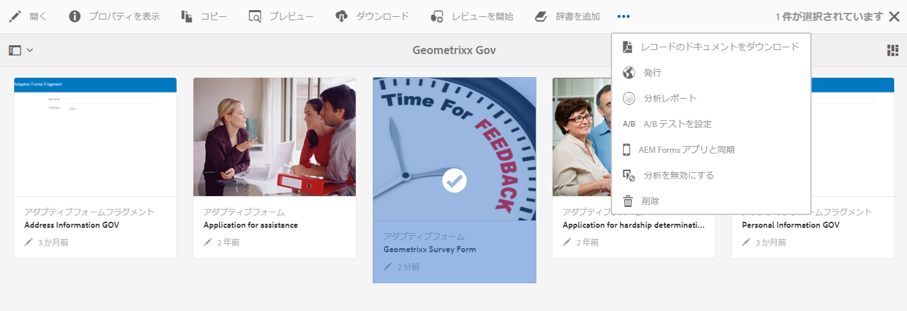
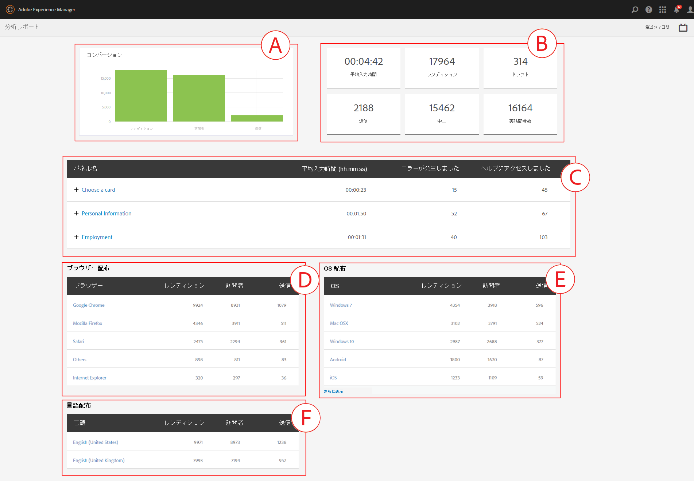
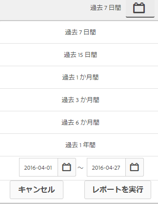
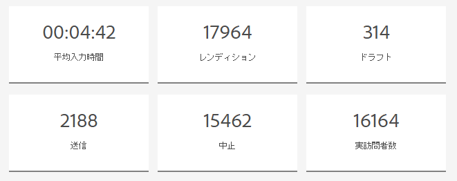
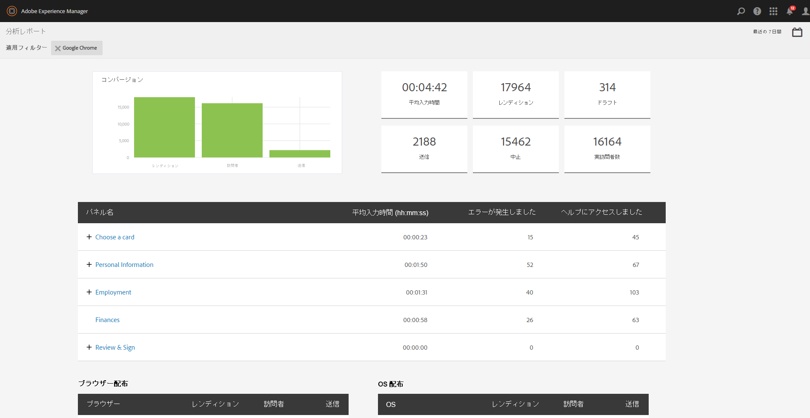
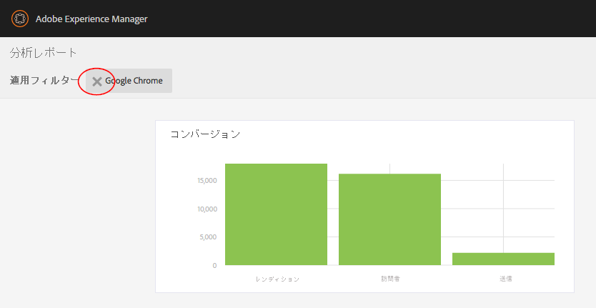

# AEM Forms の分析レポートの確認方法と詳細 {#view-and-understand-aem-forms-analytics-reports}

Adobe Experience Manager Forms は、Adobe Analytics と統合されているため、発行済みのフォームとドキュメントのパフォーマンス指標を取得および追跡できます。これらの指標分析の意図は、フォームやドキュメントをさらに有効利用するために必要な変更に関して十分な情報に基づいた決定を行えるよう支援することです。

## 分析の設定 {#setting-up-analytics}

AEM Forms のアドオンパッケージの一部として、AEM Forms の分析の機能を使用できます。アドオンパッケージのインストールについて詳しくは、「[AEM Forms のインストールと設定](../../forms/using/installing-configuring-aem-forms-osgi.md)」を参照してください。

アドオンパッケージの他に Adobe Analytics のアカウントが必要になります。解決方法について詳しくは、「[Adobe Analytics](https://www.adobe.com/solutions/digital-analytics.html)」を参照してください。

AEM Forms のアドオンパッケージと Adobe Analytics のアカウントを入手したら、「[分析とレポートの設定](../../forms/using/configure-analytics-forms-documents.md)」の記事を参考に、Adobe Analytics のアカウントを AEM Forms に統合し、ご使用のフォームやドキュメントの追跡を有効にします。

### ユーザーインタラクション情報の記録方法 {#how-user-interaction-information-is-recorded}

ユーザーがフォームと対話するとき、インタラクションが記録されて Analytics サーバーに送信されます。次のリストは、各種のユーザーアクティビティのためのサーバー呼び出しを示します。

* 1 フィールド、1 訪問あたり 2 回の呼び出し
* パネル訪問のために 1 回
* 保存のために 1 回
* 送信のために 2 回
* 保存のために 2 回
* ヘルプのために 1 回
* 検証エラーのたびに 1 回
* フォームレンディションのために 1 回 + デフォルトのパネル訪問のために 1 回 + デフォルトの初回フィールド訪問のために 1 回
* フォーム放棄のために 2 回

>[!NOTE]
>
>このリストがすべてではありません。

### 分析レポートの表示 {#summary-report}

分析レポートを表示するには、次の手順を実行します。

1. Log in to the AEM portal at `https://[hostname]:'port'`
1. **フォーム／フォームとドキュメント**&#x200B;をクリックします。
1. 分析レポートを表示するためのフォームを選択します。
1. **詳細／分析レポート**&#x200B;を選択します。

**A.** Analyticsレポートコマンド

以下のように、フォームおよびフォームに含まれる各パネルの分析レポートが AEM Forms によって表示されます。

**A.** コンバー **ジョンB.** フォームレベルの概 **要** C.パネルレベルの概 **要D.** ブラウザーの訪問者 — フィル **ターE。** 訪問者のOS — フィル **ターF。** 言語 —訪問者 — フィルタ

デフォルトで、直近 7 日間の分析レポートが表示されます。ここでは、直近の 15 日間や 1 か月間のレポートなどを表示したり、レポートの日付範囲を指定したりすることができます。

>[!NOTE]
>
>直近 7 日間や 15 日間などのオプションでは、分析レポートを生成した日付のデータは含まれません。現在の日付のデータを含めるには、現在の日付を含む日付範囲を指定してレポートを実行します。

### アダプティブフォームおよび HTML5 フォームのコンバージョングラフ {#conversions-graph-for-adaptive-and-html-forms}

フォームレベルのコンバージョングラフでは、次の KPI（キーパフォーマンスインジケーター）項目別に、ご使用のフォームの評価情報を確認できます。

* **レンディション**：フォームが開かれた回数
* **訪問者**：フォームへの訪問者数
* **送信**：フォームが送信された回数

### アダプティブフォームおよび HTML5 フォームの分析レポート {#analytics-report-for-adaptive-and-html-forms}

フォームレベルの概要セクションでは、次の KPI（キーパフォーマンスインジケーター）項目別に、ご使用のフォームの評価情報を確認できます。

* **平均記入時間**：フォームの記入にかかった平均時間。 ユーザーがフォームに滞在したが送信しなかった場合、その時間はこの計算に含まれません。
* **レンディション**：フォームがレンダリングされた、または開かれた回数
* **ドラフト**：フォームがドラフトとして保存された回数
* **送信**：フォームが送信された回数
* **中止**：フォームの記入が開始されたが完了されずに中止された回数
* **個別訪問者**:フォームが一意のレンダリングでレンダリングされた回数訪問者。 個別訪問者について詳しくは、「[個別訪問者、表示ページ、顧客の行動](https://helpx.adobe.com/analytics/kb/unique-visitors-visitor-behavior.html)」を参照してください。

### パネルのレポート {#bottom-summary-report}

パネルレベルの概要セクションでは、フォーム内の各パネルに関して次の情報が提供されます。

* **平均記入時間**：フォームが送信されたかどうかを問わず、ユーザーがパネルに滞在した平均時間
* **エラーの発生回数**：ユーザーがパネルのフィールド上で直面したエラーの平均回数発生したエラーは、フィールド内のエラーの合計をフォームのレンディション数で割って算出されます。
* **ヘルプのアクセス回数**：パネル内のフィールドでユーザーが文脈依存ヘルプにアクセスした平均回数。ヘルプアクセス回数は、フィールドのヘルプにアクセスした合計回数をフォームのレンディション数で割って算出します。

#### パネルの詳細レポート {#detailed-panel-report}

各パネルの詳細は、パネルレポートのパネルの名前をクリックして確認することもできます。

詳細レポートは、パネル内のすべてのフィールドの値を表示します。

パネルレポートには 3 つのタブがあります。

* **時間レポート**（デフォルト）:パネル内の各フィールドの記入に費やした時間（秒）を表示します。
* **エラーレポート**:フィールドの入力中にユーザーが発生したエラーの数を表示します。
* **ヘルプレポート**：特定のフィールドのヘルプがアクセスされた回数

複数のパネルを使用できる場合は、パネル間を移動できます。

### フィルター：ブラウザー、OS、言語 {#filters-browser-os-and-language}

「ブラウザー配布」、「OS 配布」、「言語配布」の各テーブルには、それぞれブラウザー、OS、フォームユーザーの言語ごとに、レンディション、訪問者、送信数が表示されます。これらのテーブルにはデフォルトで最大 5 つのエントリが表示されます。さらにエントリを表示するには、「表示を増やす」をクリックします。通常どおりに表示を 5 つのエントリに戻す、または 5 つ未満のエントリを表示するには、「表示を減らす」をクリックします。

分析データをさらにフィルターするには、任意のテーブル内のエントリをクリックします。例えば、「ブラウザー配布」テーブルで Google Chrome をクリックすると、Google Chrome ブラウザーに関連するデータを使用して、レポートが次のように再レンダリングされます。

フィルターを適用した後にパネルレポートを表示すると、パネルレポートのデータも適用したフィルターに従って表示されます。

  フィルターを適用した場合の動作は次のとおりです。

* 配布テーブルは読み取り専用になります。一度に適用できるフィルターは 1 つのみであるためです。
* 適用したフィルターのテーブルは非表示になります。
* 適用したフィルターを削除するには、「閉じる」ボタン（以下でハイライト表示）をクリックします。

### A/B テスト {#a-b-testing}

A/B テストを有効にしてフォームに設定した場合、レポートページのドロップダウンを使用して A/B テストレポートを表示できます。A/Bテストレポートには、設定した2つのバージョンのフォームの比較パフォーマンスが表示されます。

For more information on A/B testing, see [Create and manage A/B test for adaptive forms](../../forms/using/ab-testing-adaptive-forms.md).
