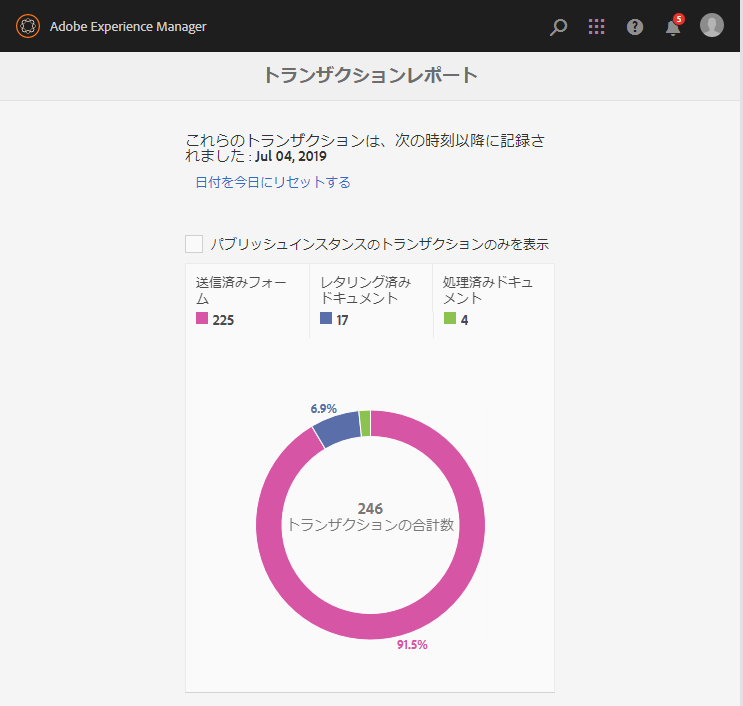

# 取引レポートの表示と理解{#viewing-and-understanding-transaction-reports}

トランザクションレポートでは、送信されたフォーム、処理されたドキュメント、およびレンダリングされたドキュメントの数を取得し、追跡できます。 これらのトランザクションをトラッキングする目的は、製品の使用状況に関する十分な情報を得た上で判断し、ハードウェアとソフトウェアに対する投資の再バランシングを行うことです。 詳しくは、 [AEM Formsトランザクションレポートの概要を参照してください](../../forms/using/transaction-reports-overview.md)。

## トランザクションレポートの設定 {#setting-up-transaction-reports}

トランザクションレポート機能は、AEM formsアドオンパッケージの一部として使用できます。 すべてのオーサーインスタンスとパブリッシュインスタンスにアドオンパッケージをインストールする方法について詳しくは、「AEM formsのインス [トールと設定」を参照してくださ](/help/forms/using/installing-configuring-aem-forms-osgi.md)い。 AEM Formsアドオンパッケージをインストールしたら、次の手順を実行します。

* すべての発行インスタンスで逆複製を有効にする
* トランザクションレポートの有効化
* トランザクションレポートを表示する権限の指定
* （オプション）トランザクションのフラッシュ期間とアウトボックスの設定 

>[!NOTE]
>
>* AEM Formsトランザクションレポートは、発行インスタンスのみを含むトポロジーをサポートしません。
>* トランザクションレポートを使用する前に、すべての発行インスタンスで逆複製が有効になっていることを確認します。
>* トランザクションデータは、パブリッシュインスタンスから対応するオーサーインスタンスまたは処理インスタンスにのみ逆複製されます。 作成者インスタンスまたは処理インスタンスは、他のインスタンスにデータを複製できません。
>

### すべての発行インスタンスで逆複製を有効にする {#enable-reverse-replication-on-all-the-publish-instances}

トランザクションレポートでは、逆複製を使用して、発行インスタンスから作成者インスタンスにトランザクションの数を統合します。 すべての発行インスタンスで逆複製を設定します。 逆複製を設定する手順について詳しくは、複製を参照し [てください](/help/sites-deploying/replication.md)。

### トランザクションレポートの有効化 {#enable-transaction-reports}

トランザクションレポートはデフォルトで無効になっています。 AEM webコンソールからレポートを有効にすることができます。 aem Forms環境でトランザクションレポートを有効にするには、すべての作成者インスタンスと発行インスタンスで次の手順を実行します。

1. AEMインスタンスに管理者としてログインします。 ツール/操 **作** / **Webコンソール** に移動します ****。
1. Forms Transaction Reportingサービスを探 **して開きます** 。
1. 「取引の記録」チェック・ボックスを選択します。 「**保存**」をクリックします。

   すべての作成者インスタンスとパブリッシュインスタンスで手順1 ～ 3を繰り返します。

### トランザクションレポートを表示する権限の指定 {#provide-rights-to-view-a-transaction-report}

fd-administratorグループのメンバーのみがトランザクションレポートを表示できます。 ユーザーがトランザクションレポートを表示できるようにするには、ユーザーをfd-administratorグループのメンバーにします。 ユーザーをAEMグループのメンバーにする手順については、ユーザー、グループお [よびアクセス権の管理を参照してください](/help/sites-administering/user-group-ac-admin.md)。

### （オプション）トランザクションのフラッシュ期間とアウトボックスの設定 {#optional-configure-transaction-flush-period-and-outboxes}

トランザクションは、リポジトリに保存される前にメモリ内にキャッシュされます。 デフォルトでは、キャッシュ期間（トランザクションフラッシュ期間）は60秒に設定されています。 デフォルトのキャッシュ期間を変更するには、次の手順を実行します。

1. 作成者インスタンスに管理者としてログインします。 ツール/操 **作** / **Webコンソール** に移動します ****。
1. Forms Transaction Repository Storage Provider **サービスを探して開きます** 。
1. 「トランザクション・フラッシュ期間 **」フィールドに秒数を指定** 。 「**保存**」をクリックします。

逆複製は、トランザクションデータを作成者インスタンスのデフォルトの送信トレイにコピーします。 トランザクションデータは、カスタム送信トレイに配置できます。 次の手順を実行して、カスタムのOutboxを指定します。

1. 作成者インスタンスに管理者としてログインします。 ツール/操 **作** / **Webコンソール** に移動します ****。
1. Forms Transaction Repository Storage Provider **サービスを探して開きます** 。
1. 「アウトボックス」フィールドにカスタムアウトボックスの **名前を指定** します。 「**保存**」をクリックします。指定した名前のアウトボックスがすべての作成者インスタンスに作成されます。

## トランザクションレポートの表示 {#viewing-the-transaction-report}

作成者インスタンスまたは発行インスタンスに関するトランザクションレポートを表示できます。 作成者インスタンスのトランザクションレポートは、設定済みの作成者インスタンスと発行インスタンスで発生するすべてのトランザクションの集計を提供します。 発行インスタンスのトランザクションレポートは、基になる発行インスタンスでのみ発生するトランザクションの数を提供します。 レポートを表示するには、次の手順を実行します。

1. Log in to the AEM Forms server at `https://[hostname]:[port]`.
1. ツール/フォ **ーム** /取引レ **ポート**&#x200B;の表示に移動します&#x200B;****。

## レポートについて {#understanding-the-report}

AEM Formsでは、次の概要レポートに示すように、設定日以降のトランザクションレポートが表示されます。

* トランザクショ **ンレコードをリセットするには** 、[日付を今日にリセット]オプションを使用します。 日付を今日にリセットすると、以前のトランザクションレコードはすべて失われます。 作成者インスタンスの日付をリセットしても、その変更は発行インスタンスのトランザクションレポートには影響しません。逆に、影響を与えるのは、発行インスタンスのトランザクションレポートの日付です。
* 設定済みの発行 **インスタンスまたは発行ファームでのみ発生したすべてのトランザクションを表示するには** 、「発行インスタンスのみのトランザクションを表示」を使用します。
* カテゴリを使用します。「Document Processed **」、「** Documents Rendered **」、「** Forms Submitted **** 」をクリックして、対応するトランザクションを表示します。 これらのカテゴリに計上される取引のタイプは、請求可能取引レポ [ートAPIを参照してください](../../forms/using/transaction-reports-billable-apis.md)。

## トランザクションレポートログの表示 {#view-transaction-reporting-logs}

トランザクションレポートでは、レポートに表示されるすべての情報と、一部の追加情報がログに配置されます。 ログに記載された情報は、上級ユーザーにとって役立ちます。 例えば、ログは、トランザクションを複数の詳細なカテゴリに分割し、レポートに表示される3つの統合カテゴリに比べています。 ログは/crx-quickstart/logs/aem-forms-transaction.logにあります。

## 関連記事 {#related-articles}

* [トランザクションレポートの概要](../../forms/using/transaction-reports-overview.md)
* [トランザクションレポート請求可能API](../../forms/using/transaction-reports-billable-apis.md)
* [カスタム実装用のトランザクションの記録](/help/forms/using/record-transaction-custom-implementation.md)

